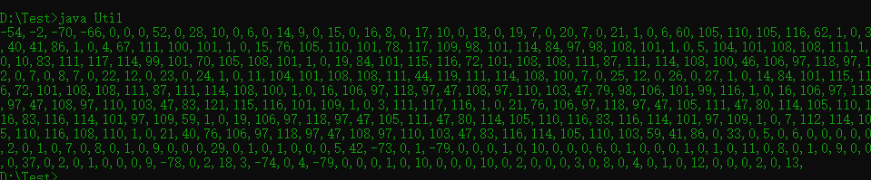

## 类加载机制

一切的Java类都必须经过JVM加载后才能运行，而ClassLoader的主要作用就是Java类的加载。在JVM类加载器中最顶层的是Bootstrap ClassLoader(类引导加载器)、Extension ClassLoader(扩展类加载器)、App ClassLoader(系统类加载器)。其中AppClassLoader是默认的类加载器，也就是在不指定加载器的情况下，会自动调用AppClassLoader加载类。同时ClassLoader.getSysytemClassLoader()返回的系统类加载器也是AppClassLoader<br />ClassLoader类的核心方法

| getParent() | 返回该类加载器的父类加载器 |
| --- | :-: |
| loadClass(String name) | 加载指定的Java类，返回的是加载的类的实例 |
| findClass(String name) | 查找指定的Java类，返回的是加载的类的实例 |
| findLoadedClass(String name) | 查找JVM已经加载过的类， |
| defineClass(String name, byte[] b, int off, int len) | 把字节数组b中的内容转换为Java类，返回的结果是java.lang.Class类的实例，该方法被声明为final |
| resolveClass(Class<?> e) | 链接制定的Java类 |

## loadClass()方法的流程

看源代码解析
```java
protected Class<?> loadClass(String name, boolean resolve)
    throws ClassNotFoundException
    {
    synchronized (getClassLoadingLock(name)) {
        //先检查这个类是否是已经加载过的
        Class<?> c = findLoadedClass(name);
        //如果未被加载
        if (c == null) {
            long t0 = System.nanoTime();
            try {
                //如果未被加载，则优先使用加载器的父类加载器进行加载。
                if (parent != null) {
                    c = parent.loadClass(name, false);
                } else {
                    c = findBootstrapClassOrNull(name);
                }
            } catch (ClassNotFoundException e) {
                // ClassNotFoundException thrown if class not found
                // from the non-null parent class loader
            }

            if (c == null) {
                //当不存在父类加载器，无法对该类进行加载时，
                //则会调用自身的 findClass()方法，
                long t1 = System.nanoTime();
                //因此可以重写findClass()方法来完成一些类加载的特殊要求。
                c = findClass(name);

                // this is the defining class loader; record the stats
                sun.misc.PerfCounter.getParentDelegationTime().addTime(t1 - t0);
                sun.misc.PerfCounter.getFindClassTime().addElapsedTimeFrom(t1);
                sun.misc.PerfCounter.getFindClasses().increment();
            }
        }
        if (resolve) {
            resolveClass(c);
        }
        return c;
    }
}
```
简单理解并记忆：先看看自己有没有，如果没有就问问老爹有没有，有的话直接拿来用，老爹也没有那就只能自己做了。至于自己做个啥样的就没有保证了，也可能是危险的加载器。

## 自定义类加载器

从上面loadClass()方法的流程来看，实现自定义类加载器需要重写findClass()方法，利用defineClass()方法将字节码转换成类对象。
```java
package com.classloaderpro;

import java.lang.reflect.Method;

public class ClassLoaderDemo extends ClassLoader{
    private static String testClassName = "com.classloaderpro.TestHelloWorld";
    private static byte[] testBytes = new byte[]{
            //TestHelloWorld 类字节码
            -54,-2,-70,-66,0,0,0,52,0,28,10,0,6,0,14,9,0,15,0,16,8,0,17,10,0,18,0,19,7,0,20,7,0,21,1,0,6,60,105,110,105,116,62,1,0,3,40,41,86,1,0,4,67,111,100,101,1,0,15,76,105,110,101,78,117,109,98,101,114,84,97,98,108,101,1,0,5,104,101,108,108,111,1,0,10,83,111,117,114,99,101,70,105,108,101,1,0,19,84,101,115,116,72,101,108,108,111,87,111,114,108,100,46,106,97,118,97,12,0,7,0,8,7,0,22,12,0,23,0,24,1,0,11,104,101,108,108,111,44,119,111,114,108,100,7,0,25,12,0,26,0,27,1,0,14,84,101,115,116,72,101,108,108,111,87,111,114,108,100,1,0,16,106,97,118,97,47,108,97,110,103,47,79,98,106,101,99,116,1,0,16,106,97,118,97,47,108,97,110,103,47,83,121,115,116,101,109,1,0,3,111,117,116,1,0,21,76,106,97,118,97,47,105,111,47,80,114,105,110,116,83,116,114,101,97,109,59,1,0,19,106,97,118,97,47,105,111,47,80,114,105,110,116,83,116,114,101,97,109,1,0,7,112,114,105,110,116,108,110,1,0,21,40,76,106,97,118,97,47,108,97,110,103,47,83,116,114,105,110,103,59,41,86,0,33,0,5,0,6,0,0,0,0,0,2,0,1,0,7,0,8,0,1,0,9,0,0,0,29,0,1,0,1,0,0,0,5,42,-73,0,1,-79,0,0,0,1,0,10,0,0,0,6,0,1,0,0,0,1,0,1,0,11,0,8,0,1,0,9,0,0,0,37,0,2,0,1,0,0,0,9,-78,0,2,18,3,-74,0,4,-79,0,0,0,1,0,10,0,0,0,10,0,2,0,0,0,3,0,8,0,4,0,1,0,12,0,0,0,2,0,13
    };
    @Override
    public Class<?> findClass(String name) throws ClassNotFoundException {
        // 只处理TestHelloWorld类
        if (name.equals(testClassName)) {
            // 调用JVM的native方法定义TestHelloWorld类
            return defineClass(testClassName, testBytes, 0, testBytes.length);
        }
        return super.findClass(name);
    }
    public static void main(String[] args) {
        // 创建自定义的类加载器
        ClassLoaderDemo loader = new ClassLoaderDemo();
        try {
            // 使用自定义的类加载器加载TestHelloWorld类
            Class testClass = loader.loadClass(testClassName);
            // 反射创建TestHelloWorld类，等价于 TestHelloWorld t = new TestHelloWorld();
            Object testInstance = testClass.newInstance();
            // 反射获取hello方法
            Method method = testInstance.getClass().getMethod("hello");

            // 反射调用hello方法,等价于 String str = t.hello();
            String str = (String) method.invoke(testInstance);
            System.out.println(str);
        } catch (Exception e) {
            e.printStackTrace();
        }
    }
}
```
顺便记录一下进行此代码的运行时遇到的问题

1. 字节码问题，我想换个其他的类的字节码，也就是修改字节数组testBytes的值。

F：怎么将类转换成字节数组？

Q：（默认不使用idea）创建一个TestHelloWorld.java文件（当然可以任意命名），然后在里面随意写一个构造方法hello()。

```java
public class TestHelloWorld {
    public void hello(){
        System.out.println("hello,world");
    }
}
```
使用javac将其编译成class文件，然后使用下面的代码即可将TestHelloWorld转换成字节数组输出。
```java
import java.net.URI;
import java.nio.file.Files;
import java.nio.file.Paths;
import java.util.Base64;

public class Util {
    public static void main(String[] args) throws Exception {
        URI uri = Util.class.getClassLoader().getResource("TestHelloWorld.class").toURI();
        byte[] codeBytes = Files.readAllBytes(Paths.get(uri));
        //String base = Base64.getEncoder().encodeToString(codeBytes);
		for(int i=0;i<codeBytes.length;i++){
			System.out.print(codeBytes[i] + ",");
		}
    }
}
```
结果证明<br /><br />同时这也是一种内存马免杀的方式，后续学到内存马再做分析。

