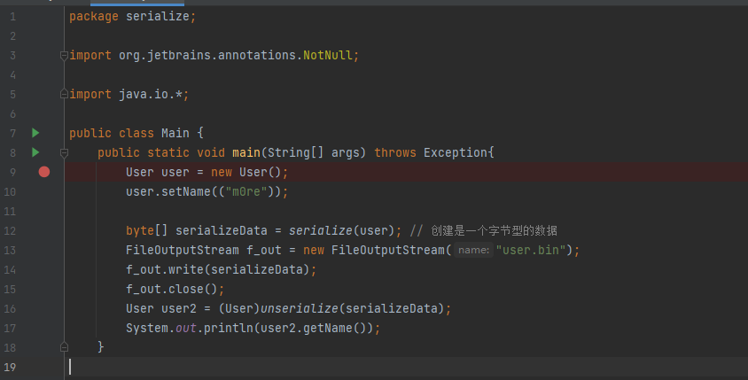
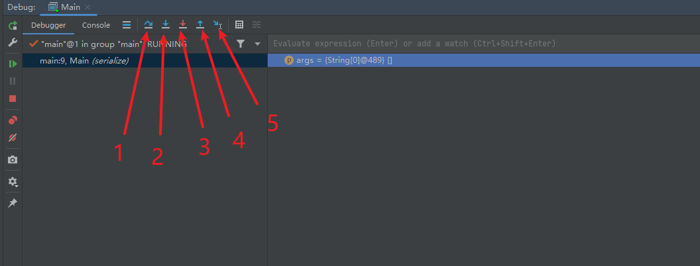
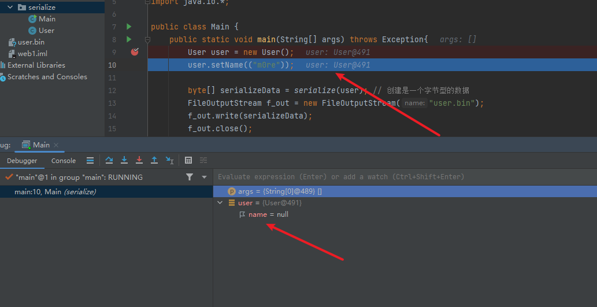
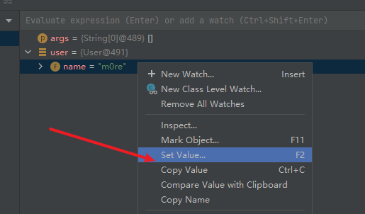
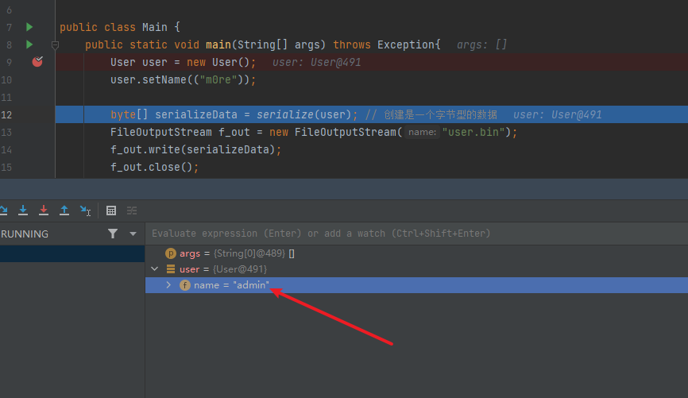
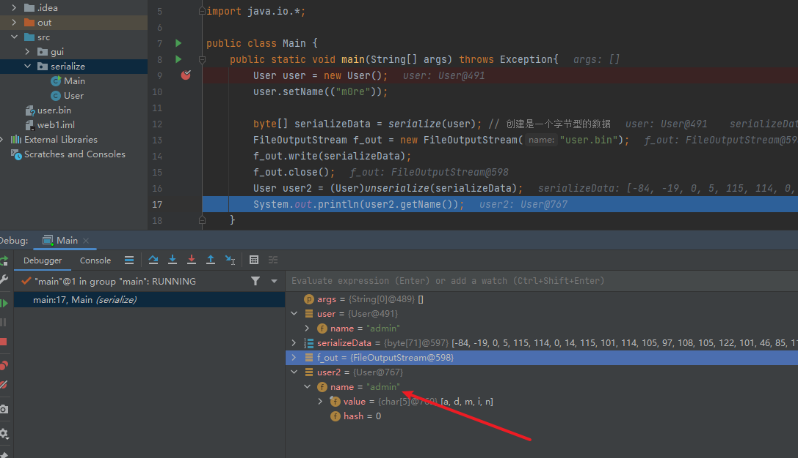

## 简单的调试功能

简单的代码做例子

```java
package serialize;

import java.io.Serializable;

public class User implements Serializable{
    private String name;
    public void setName(String name) {
        this.name = name;
    }
    public String getName() {
        return name;
    }
}
package serialize;

import org.jetbrains.annotations.NotNull;

import java.io.*;

public class Main {
    public static void main(String[] args) throws Exception{
        User user = new User();
        user.setName(("m0re"));

        byte[] serializeData = serialize(user); // 创建是一个字节型的数据
        FileOutputStream f_out = new FileOutputStream("user.bin");
        f_out.write(serializeData);
        f_out.close();
        User user2 = (User)unserialize(serializeData);
        System.out.println(user2.getName());
    }

    public static byte @NotNull [] serialize(final Object obj) throws Exception {
        ByteArrayOutputStream byte_out = new ByteArrayOutputStream(); // 创建一个32字节（默认大小）的缓冲区
        ObjectOutputStream objOut = new ObjectOutputStream(byte_out); // 通过传入byte字节流来存储写入的对象
        objOut.writeObject(obj); // 将对象写入流中
        return byte_out.toByteArray(); // 创建一个新分配的字节数组。数组的大小和当前输出流的大小，内容是当前输出流的拷贝。
    }

    public static Object unserialize(final byte[] serialized) throws Exception {
        ByteArrayInputStream bytein = new ByteArrayInputStream(serialized); // 接收字节数组作为参数创建
        ObjectInputStream objIn = new ObjectInputStream(bytein); // 从输入流中读取Java对象
        return objIn.readObject();
    }
}
```

设置断点，为了看清楚整个执行过程，故断点设置在第一句代码处

然后开启Debug

 1. 表示一步步的向下运行代码，不会走到任何方法中。

1. 表示一步步的向下运行代码，不会走到任何系统类库的方法中，但是会走入自定义的方法中。

1. 表示一步步的向下运行代码，会走入系统类库的方法中，也会走入自定义的方法中。

1. 表示跳出方法。

1.  运行到光标处，你可以将光标定位到你需要查看的那一行，然后使用这个功能，代码会运行至光标行，而不需要打断点。  

然后再看这边的调试过程

可以看到走到了第二步，user的值是空的，说明这里还没开始执行下一行，user还没完成赋值。此时如果需要测试其他的值，可以手动赋值，同时不会影响代码。但是实际执行是根据调试时提交的值继续进行下一步的。



修改值

上面的值是不影响的。继续走

到最后一步，仍然是admin当参数来执行的。

.....
