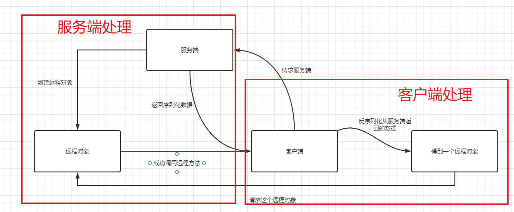

# RMI原理和实现流程

> 学习资料：Java安全漫谈—RMI篇

## RMI的工作原理

RMI的全称：`Remote Method Invocation`，远程方法台调用，目的是实现某个Java虚拟机上的对象调用另一个Java虚拟机中对象的方法。

```java
package RMI;

import java.rmi.Naming;
import java.rmi.Remote;
import java.rmi.RemoteException;
import java.rmi.registry.LocateRegistry;
import java.rmi.server.UnicastRemoteObject;

public class RMIServer {
    public interface IRemoteHelloWorld extends Remote{
        public String hello() throws RemoteException;
    }

    public class RemoteHelloWorld extends UnicastRemoteObject implements IRemoteHelloWorld {
        protected RemoteHelloWorld() throws RemoteException{
            super();//调用父类的hello()方法
        }

        @Override//重写父类的方法
        public String hello() throws RemoteException {
            System.out.println("call from");
            return "Hello world";
        }
    }

    private void start() throws Exception{
        RemoteHelloWorld h = new RemoteHelloWorld();
        LocateRegistry.createRegistry(1099);
        Naming.rebind("rmi://127.0.0.1:1099/Hello", h);
    }

    public static void main(String[] args) throws Exception {
        new RMIServer().start();
    }
}
```

前面是定义一个父类，定义一个子类，父类中的构造方法不写任何内容，而是选择在子类重写父类的构造方法。方法写完后，开始创建一个RMI实例，将这个实例绑定到一个地址上，也就是`127.0.0.1:1099/Hello`上，此时Server已经准备好了。

然后是客户端代码

```java
package RMI;

import java.rmi.Naming;

public class TrainMain {
    public static void main(String[] args) throws Exception{
        RMIServer.IRemoteHelloWorld hello = (RMIServer.IRemoteHelloWorld) Naming.lookup("rmi://192.168.136.1:1099/Hello");
        String ret = hello.hello();
        System.out.println(ret);
    }
}
```

代码很明确，使用`Naming.lookup`在`Register`中查找名字为`Hello`的对象，然后调用远程方法，就像是调用本地的一样。

wireshark抓包的操作就不做了，大概看了之后理解了（实际上是自己抓了之后数据混乱不方便看）有兴趣的还是看P牛的Java安全漫谈。

主要流程是：服务端在`127.0.0.1:1099`这里注册了一个名为`Hello`的对象，当客户端请求`Register`去查找`Hello`这个`Name`时，服务端给它返回了一个序列化的数据，返回到客户端进行反序列化，得到的结果是一个新的地址端口，`192.168.136.1:xxxx`可能是随机的端口，然后客户端再去请求这个新的端口，最后成功调用了远程方法。文字描述可能不太明显，这里做了一个图，方便以后再看时快速回忆。



现在就明白了，`RMI Register`不会执行远程方法，但是服务端在上面注册了一个Name绑定对象，当客户端通过Name来查找这个对象的时候，就可以知道这个对象具体在哪里，然后访问真实的地址进行调用就可以了。

> 个人理解为一个图书馆管理员，你问她要一本书，她会告诉你书在哪，让你自己去找。

然后根据Java安全漫谈的`RMI`篇(二)跟进学习

首先是关于`RMI`的实现原理

```java
LocateRegistry.createRegistry(1099);
Naming.bind("rmi://127.0.0.1:1099/Hello", new RemoteHelloWprld());
```

> 第一行创建并运行`RMI Register`
>
> 第二行将`RemoteHelloWorld`对象绑定到Hello这个名字上

```
Naming.bind`的第一个参数应该是一个url，内容包括host主机地址和端口号，以及远程对象的名字。形式应该是`http://host:port/name
```

还一种方式

```java
Naming.bind("Hello", new RemoteHelloWorld());
```

这句代码在写的时候省略了一些内容，就是这个`url`的`host`和`port`，默认是`localhost`和`1099`

bind()方法负责把指定名称绑定给远程对象，rebind()方法负责把指定名称重新绑定到一个新的远程对象。如果那个名称已经绑定过了，先前的绑定会被替换掉。