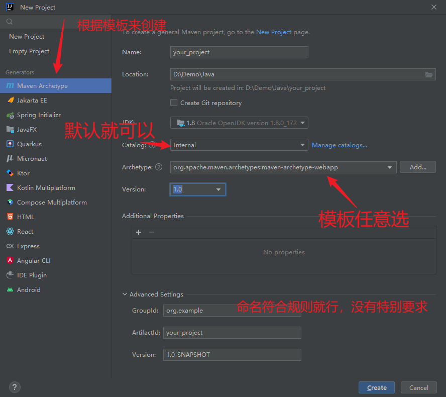
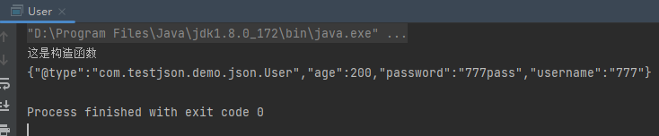
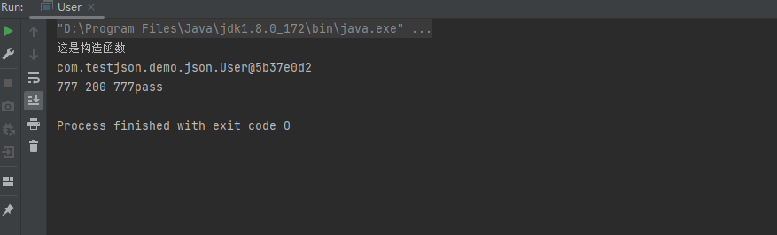

# fastjson基本使用

## 导入fastjson各个版本

项目地址在这里：https://github.com/alibaba/fastjson

这里两种导入方式，一种是下载jar包，然后导入（不详细说啦，应该都清楚）只是这个jar包需要自行找，思路：GitHub中大佬们做复现漏洞的时候会将整个项目发布上去，可以去项目中找找。

另一种是创建maven项目，从新建的maven项目的配置文件中导入。2022版idea创建maven项目，这里因为我也刚开始学，所以自己记录下这个创建项目的过程



如果是第一次创建，等待配置大概需要6-8分钟，看网速哈。

然后说主要的导入方式，在pom.xml（项目配置文件）

```bash
<dependency>
      <groupId>com.alibaba</groupId>
      <artifactId>fastjson</artifactId>
      <version>1.2.24</version>
</dependency>
```

## fastjson使用方式

新建一个User类

```java
package com.testjson.demo.json;

import com.alibaba.fastjson.JSON;
import com.alibaba.fastjson.serializer.SerializerFeature;

public class User {
    private String username;
    private int age;
    private String password;

    public User(){
        System.out.println("这是构造函数");
    }
    public String getUsername(){
        return username;
    }

    public void setUsername(String username) {
        this.username = username;
    }

    public int getAge() {
        return age;
    }

    public void setAge(int age) {
        this.age = age;
    }

    public String getPassword() {
        return password;
    }

    public void setPassword(String password) {
        this.password = password;
    }

    public static void main(String[] args) {
        User user = new User();
        user.setUsername("777");
        user.setAge(200);
        user.setPassword("777pass");
        System.out.println(JSON.toJSONString(user, SerializerFeature.WriteClassName));
    }
}
```



可以看出来fastjson的`SerializerFeature.WriteClassName`是`toJSONString`设置的一个属性值

然后就是fastjson的序列化结果带了个标志，`{"@type":"xxxx"}`

反序列化

```java
package com.testjson.demo.json;

import com.alibaba.fastjson.JSON;
import com.alibaba.fastjson.parser.Feature;
import com.alibaba.fastjson.serializer.SerializerFeature;

import java.io.FilterOutputStream;

public class User {
    private String username;
    private int age;
    private String password;

    public User(){
        System.out.println("这是构造函数");
    }

    public void setUsername(String username) {
        this.username = username;
    }

    public int getAge() {
        return age;
    }

    public String getPassword() {
        return password;
    }

    public static void main(String[] args) {
        User aUser = JSON.parseObject("{\"@type\":\"com.testjson.demo.json.User\",\"age\":200,\"password\":\"777pass\",\"username\":\"777\"}", User.class, Feature.SupportNonPublicField);
        System.out.println(aUser);
        System.out.println(aUser.getUsername() + " " + aUser.getAge() + " " + aUser.getPassword());
    }
}
```



反序列化方法用到了`parseObject`

`JSON.toJSONString(User)`的功能为将类转换为json字符串，并且在转换的同时调用了get方法这是fastjson反序列中一个重要的点