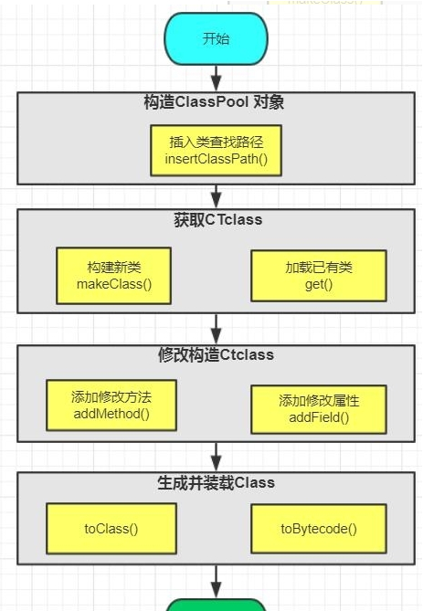
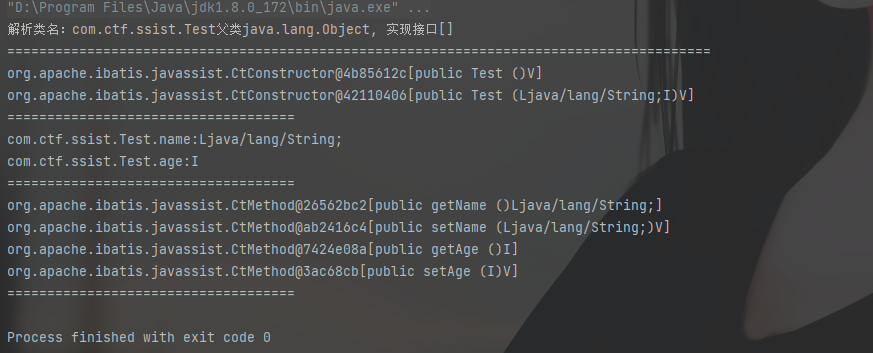
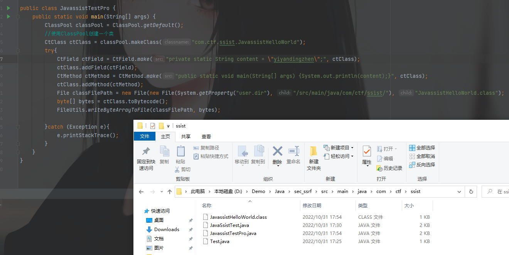

# javassist原理与使用

Javassist是可以动态编辑Java字节码的类库。它可以在Java程序运行时定义一个新的类，并加载到JVM中；还可以在JVM加载时修改一个类文件。Javassist使用户不必关心字节码相关的规范也是可以编辑类文件的。



## Javassist API

| 类            | 描述                                                         |
| ------------- | ------------------------------------------------------------ |
| ClassPool     | ClassPool是一个存储CtClass的容器，如果调用`get`方法会搜索并创建一个表示该类的CtClass对象 |
| CtClass       | CtClass表示的是从ClassPool获取的类对象，可对该类就行读写编辑等操作 |
| CtMethod      | 可读写的类方法对象                                           |
| CtConstructor | 可读写的类构造方法对象                                       |
| CtField       | 可读写的类成员变量对象                                       |

代码示例

```java
package com.ctf.ssist;

import org.apache.ibatis.javassist.*;

import java.util.Arrays;

public class JavaSsistTest {
    public static void main(String[] args) throws Exception {
        //创建ClassPool对象
        ClassPool classPool = ClassPool.getDefault();
        try{
            CtClass ctClass = classPool.get("com.ctf.ssist.Test");
            System.out.println("解析类名："+ ctClass.getName()+"父类"+ ctClass.getSuperclass().getName()+", 实现接口"+ Arrays.toString(ctClass.getInterfaces()));
            System.out.println("================================================================");
            //获取所有的构造方法
            CtConstructor[] ctConstructor = ctClass.getDeclaredConstructors();
            for (CtConstructor constructor : ctConstructor) {
                System.out.println(constructor);
            }
            System.out.println("====================================");
            //获取所有的成员变量
            CtField[] ctFields = ctClass.getDeclaredFields();
            for (CtField ctField : ctFields) {
                System.out.println(ctField);
            }
            System.out.println("====================================");
            //获取所有的成员方法
            CtMethod[] ctMethods = ctClass.getDeclaredMethods();
            for (CtMethod ctMethod : ctMethods) {
                System.out.println(ctMethod);
            }
            System.out.println("====================================");

        } catch (NotFoundException e){
            e.printStackTrace();
        }
    }
}
```

运行结果



个人感觉这个类似于Java的反射

## 使用:动态创建Java类的二进制文件

```java
package com.ctf.ssist;

import org.apache.commons.io.FileUtils;
import org.apache.ibatis.javassist.ClassPool;
import org.apache.ibatis.javassist.CtClass;
import org.apache.ibatis.javassist.CtField;
import org.apache.ibatis.javassist.CtMethod;

import java.io.File;

public class JavassistTestPro {
    public static void main(String[] args) {
        ClassPool classPool = ClassPool.getDefault();
        //使用ClassPool创建一个类
        CtClass ctClass = classPool.makeClass("com.ctf.ssist.JavassistHelloWorld");
        try{
            CtField ctField = CtField.make("private static String content = \"yiyandingzhen\";", ctClass);
            ctClass.addField(ctField);
            CtMethod ctMethod = CtMethod.make("public static void main(String[] args) {System.out.println(content);}", ctClass);
            ctClass.addMethod(ctMethod);
            File classFilePath = new File(new File(System.getProperty("user.dir"), "/src/main/java/com/ctf/ssist/"), "JavassistHelloWorld.class");
            byte[] bytes = ctClass.toBytecode();
            FileUtils.writeByteArrayToFile(classFilePath, bytes);

        }catch (Exception e){
            e.printStackTrace();
        }
    }
}
```

结果

