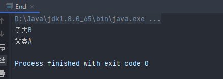
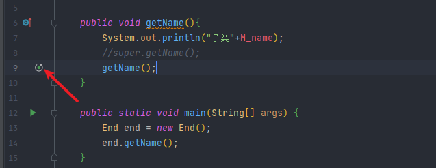

# super()的使用

在Java中，经常遇到`super()`这个方法，那么这个方法平时都会利用到什么地方，起什么作用；这里做下记录

差不多是直接复制过来的这篇文章，写的很详细。不需要再总结了。https://blog.csdn.net/yongbutingxide/article/details/82669054

## 利用方法一

子类重写父类的方法，但是方法的调用规则是：子类优先。所以如果想要在子类重写了父类方法的时候调用父类方法，就需要使用到super

```java
package test;

public class SuperStart {
    private String N_name = "A";
    public void getName(){
        System.out.println("父类"+N_name);
    }

    public static void main(String[] args) {
    }
}
package test;

public class End extends SuperStart{
    private String M_name = "B";

    public void getName(){
        System.out.println("子类"+M_name);
        super.getName();
    }

    public static void main(String[] args) {
        End end = new End();
        end.getName();
    }
}
```



如果不使用super的话



会显示，这个图标，运行也会重复调用End类的`getName()`

## 利用方法二

`SuperStart`类同上

```java
package test;

public class End extends SuperStart{
    private String N_name = "B";

    public void getName(){
        System.out.println("子类"+N_name);
        //super.getName();
        System.out.println("父类"+super.N_name);
    }

    public static void main(String[] args) {
        End end = new End();
        end.getName();
    }
}
```

在子类中，有个变量和父类中一样，想要调用父类中的变量，就需要使用到super关键字

## 利用方法三

编译器会自动在子类构造函数的第一句加上`super();` 来调用父类的无参构造器；此时可以省略不写。如果想写上的话必须在子类构造函数的第一句，可以通过super来调用父类其他重载的构造方法，只要相应的把参数传过去就好。

super的作用主要在下面三种情况下：

1、调用父类被子类重写的方法；

2、调用父类被子类重定义的字段（被隐藏的成员变量）；

3、调用父类的构造方法；

其他情况，由于子类自动继承了父类相应属性方法，关键字super可以不显示写出来。

## 利用方法四

```java
class Person { 
    public static void prt(String s) { 
       System.out.println(s); 
    } 
   
    Person() { 
       prt("父类·无参数构造方法： "+"A Person."); 
    }//构造方法(1) 
    
    Person(String name) { 
       prt("父类·含一个参数的构造方法： "+"A person's name is " + name); 
    }//构造方法(2) 
} 
    
public class Chinese extends Person { 
    Chinese() { 
       super(); // 调用父类构造方法（1） 
       prt("子类·调用父类"无参数构造方法"： "+"A chinese coder."); 
    } 
    
    Chinese(String name) { 
       super(name);// 调用父类具有相同形参的构造方法（2） 
       prt("子类·调用父类"含一个参数的构造方法"： "+"his name is " + name); 
    } 
    
    Chinese(String name, int age) { 
       this(name);// 调用具有相同形参的构造方法（3） 
       prt("子类：调用子类具有相同形参的构造方法：his age is " + age); 
    } 
    
    public static void main(String[] args) { 
       Chinese cn = new Chinese(); 
       cn = new Chinese("codersai"); 
       cn = new Chinese("codersai", 18); 
    } 
}
```

如果子类调用父类中的无参构造方法，则使用super();

如果子类调用父类中的有参构造方法，则使用super(参数);