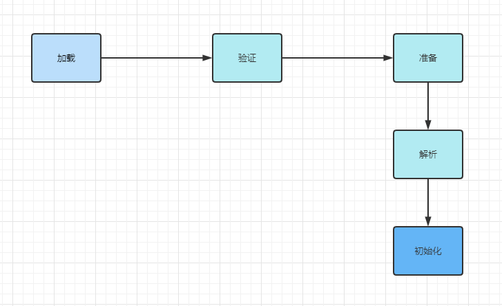
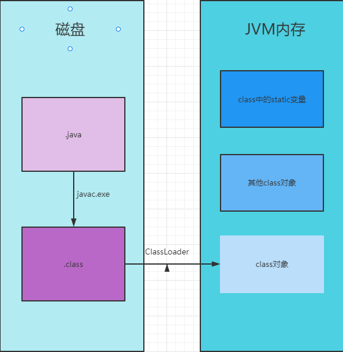
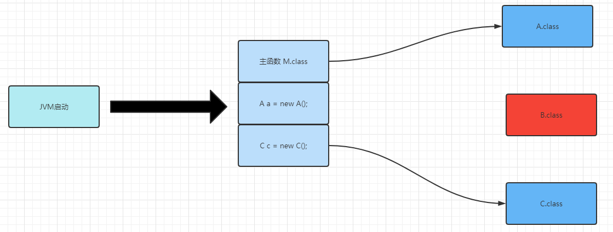
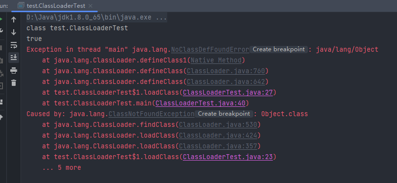
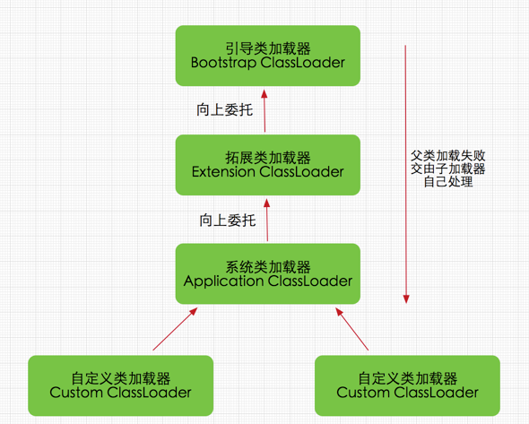

# 双亲委派机制

## 类加载器

每个编写的"`.java`"拓展名类文件都存储着需要执行的程序逻辑，这些"`.java`"文件经过Java编译器编译成拓展名为"`.class`"的文件，"`.class`"文件中保存着Java代码经转换后的虚拟机指令，当需要使用某个类时，虚拟机将会加载它的"`.class`"文件，并创建对应的class对象，将`class`文件加载到虚拟机的内存，这个过程称为类加载。



**加载**：类加载过程的一个阶段：通过一个类的完全限定查找此类字节码文件，并利用字节码文件创建一个Class对象

**验证**：目的在于确保Class文件的字节流中包含信息符合当前虚拟机要求，不会危害虚拟机自身安全。主要包括四种验证，文件格式验证，元数据验证，字节码验证，符号引用验证。

**准备**：为类变量(即static修饰的字段变量)分配内存并且设置该类变量的初始值即0(如static int i=5;这里只将i初始化为0，至于5的值将在初始化时赋值)，这里不包含用final修饰的static，因为final在编译的时候就会分配了，注意这里不会为实例变量分配初始化，类变量会分配在方法区中，而实例变量是会随着对象一起分配到Java堆中。

**解析**：主要将常量池中的符号引用替换为直接引用的过程。符号引用就是一组符号来描述目标，可以是任何字面量，而直接引用就是直接指向目标的指针、相对偏移量或一个间接定位到目标的句柄。有类或接口的解析，字段解析，类方法解析，接口方法解析(这里涉及到字节码变量的引用，如需更详细了解，可参考《深入Java虚拟机》)。

**初始化**：类加载最后阶段，若该类具有超类，则对其进行初始化，执行静态初始化器和静态初始化成员变量(如前面只初始化了默认值的static变量将会在这个阶段赋值，成员变量也将被初始化)。

大量文字不想看，简单一点解释就是：

我们编写的Java程序是`.java`文件，然后我们利用`javac.exe`将`.java`转换为`.class`类型的字节码文件，但是执行的时候需要将`.class`文件加载到JVM内存中才能使用。



ClassLoader作用：

基本上所有的类加载器都是 java.lang.ClassLoader类的一个实例。

- 它是用来加载 Class 的。它负责将 Class 的字节码形式转换成内存形式的 Class 对象。
- 除此之外，ClassLoader还负责加载 Java 应用所需的资源，如图像文件和配置文件等。

instanceof是Java中的二元运算符，左边是对象，右边是类；当对象是右边类或子类所创建对象时，返回true;否则，返回false

java类加载使用动态类加载机制， 程序在启动的时候，并不会一次性加载程序所要用的所有class文件，而是根据程序的需要，通过Java的类加载机（ClassLoader）来动态加载某个class文件到内存当中的，从而只有class文件被载入到了内存之后，才能被其它class所引用。JVM运行过程中，首先会加载初始类，然后再从初始类链接触发它相关的类的加载。



类的生成方式一共有三种：启动类加载器，用户自定义类加载器，JVM生成的数组对象。

### 启动类加载器

启动类加载器主要加载的是JVM自身需要的类，这个类加载使用C++语言实现的，是虚拟机自身的一部分，它负责将 <JAVA_HOME>/lib路径下的核心类库或-Xbootclasspath参数指定的路径下的jar包加载到内存中，注意必由于虚拟机是按照文件名识别加载jar包的，如rt.jar，如果文件名不被虚拟机识别，即使把jar包丢到lib目录下也是没有作用的(出于安全考虑，Bootstrap启动类加载器只加载包名为java、javax、sun等开头的类)。

### 用户自定义加载类

java库中的平台类加载器和应用程序类加载器等

用户自己写的类加载器，比如通过网络加载类等机制

用户自定义类加载器以ClassLoader为基类，重写其中的findClass，使findClass可以从用户指定的位置读取字节码.class文件。

```java
package test;

import java.io.IOException;
import java.io.InputStream;

/**
 * 类加载器在类相等判断中的影响
 *
 * instanceof关键字
 *
 */

public class ClassLoaderTest {
    public static void main(String[] args) throws Exception {
        // 自定义类加载器
        ClassLoader myLoader = new ClassLoader() {
            @Override
            public Class<?> loadClass(String name) throws ClassNotFoundException {
                try {
                    String fileName = name.substring(name.lastIndexOf(".") + 1) + ".class";
                    InputStream is = getClass().getResourceAsStream(fileName);
                    if (is == null) {
                        return super.loadClass(fileName);
                    }
                    byte[] b = new byte[is.available()];
                    is.read(b);
                    return defineClass(name, b, 0, b.length);
                } catch (IOException e) {
                    throw new ClassNotFoundException();
                }
            }
        };

        // 使用ClassLoaderTest的类加载器加载本类
        Object obj1 = ClassLoaderTest.class.getClassLoader().loadClass("test.ClassLoaderTest").newInstance();
        System.out.println(obj1.getClass());
        System.out.println(obj1 instanceof test.ClassLoaderTest);

        // 使用自定义类加载器加载本类
        Object obj2 = myLoader.loadClass("test.ClassLoaderTest").newInstance();
        System.out.println(obj2.getClass());
        System.out.println(obj2 instanceof test.ClassLoaderTest);
    }
}
```

运行结果



如果是

## 双亲委派模型

双亲委派的具体过程如下：

1. 当一个类加载器接收到类加载任务时，先查缓存里有没有，如果没有，将任务委托给它的父加载器去执行。
2. 父加载器也做同样的事情，一层一层往上委托，直到最顶层的启动类加载器为止。
3. 如果启动类加载器没有找到所需加载的类，便将此加载任务退回给下一级类加载器去执行，而下一级的类加载器也做同样的事情。
4. 如果最底层类加载器仍然没有找到所需要的class文件，则抛出异常。



理解：双亲委派机制原理

> 如果一个类加载器收到了类加载请求，它并不会自己先去加载，而是把这个请求委托给父类的加载器去执行，如果父类加载器还存在其父类加载器，则进一步向上委托，依次递归，请求最终将到达顶层的启动类加载器
>
> 如果父类加载器可以完成类加载任务，就成功返回，倘若父类加载器无法完成此加载任务，子加载器才会尝试自己去加载，这就是双亲委派模式
>
> 即每个儿子都很懒，每次有活就丢给父亲去干，直到父亲说这件事我也干不了时，儿子自己想办法去完成