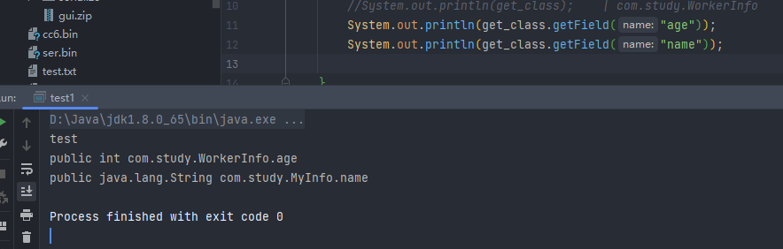
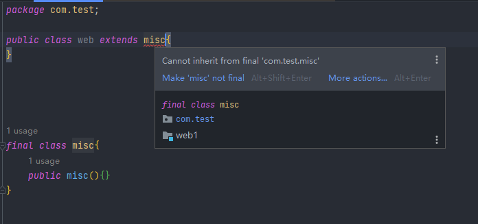

关于反射

> getFields()：获得某个类的所有的公共（public）的字段，包括父类中的字段。



顺便记一下：

`@Override`这个标签

1. 可以当作注释用，没什么特别的

2. 可以告诉读你代码的人，这是对它父类方法的重写，其实很多代码规范没有为什么，规范就是规范，代码的可读性还是很重要的。

3. 编译器可以给你验证`@Override`下面的方法名称是否是你父类中所有的，如果没有就会报错。

比如当你想要在子类中重写父类的一个方法，但是你把名字打错了，当你写了@Override编译器会提示你，你写的这个方法父类中没有；但是如果你没有写@Override编译器就会觉得这个是你子类中写的新的方法，并不会报错，到时候你debug还是很麻烦的一件事。

摘自【https://blog.csdn.net/upc1607020107/article/details/81274398】感觉这个博主说的就很好了，就直接摘抄过来了

反射的其他两种

```java
String str = "test";
System.out.println(str.getClass());
//静态方法
Class class_name = Class.forName("java.lang.String");
```

`getDeclaredField()`：获得某个类的所有声明的字段，即包括public、private和proteced，但是不包括父类的申明字段。

Class类提供了以下几个方法来获取Method

- `Method getMethod(name, Class...)`：获取某个public的Method（包括父类）
- `Method getDeclaredMethod(name, Class...)`：获取当前类的某个Method（不包括父类）
- `Method[] getMethods()`：获取所有public的Method（包括父类）
- `Method[] getDeclaredMethods()`：获取当前类的所有Method（不包括父类）

需要执行的话，就需要将方法名传入invoke()方法。有以下两种方式

```java
System.out.println(substring.invoke(test));
//调用带参数的方法，需要传参
System.out.println(substring.invoke(test,"admin"));
```

执行命令的方法

```java
Class.forName("java.lang.Runtime").getMethod("exec", String.class).invoke(Class.forName("java.lang.Runtime").getMethod("getRuntime").invoke(Class.forName("java.lang.Runtime")),"calc");
```

关于Final 修饰符，它可以用来修饰类，方法，变量

1. 修饰类：当一个类使用final修饰时，表明这个类不能被继承。



1. 修饰方法，表明这个方法被锁定，任何继承这个类之后都不能修改这个方法的含义。
2. 修饰变量，这个使用的是最多的，也是了解final修饰符的主要原因之一，主要记住一点就是使用final修饰的变量，再初始化之后就不能被修改。

```
Class.forName(className)` 相当于` Class.forName(className, true, currentLoader
```

 第⼆个参数表示是否初始化，在`forName` 的时候，构造函数并不会执⾏，而是执⾏类初始化。他会执行`static{}`静态块里面的内容  

```java
package com.test;

import java.io.IOException;

public class web {
    public static void main(String[] args) throws Exception {
        Class.forName("com.test.Calc");

    }
}

class Calc{
    static {
        try {
            Runtime.getRuntime().exec("calc");
        } catch (IOException e) {
            e.printStackTrace();
        }
    }
}
```