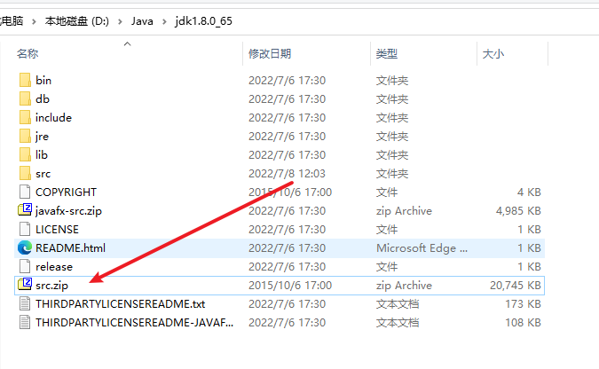
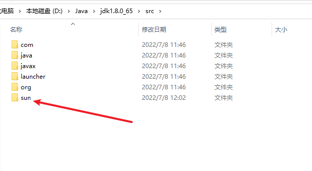
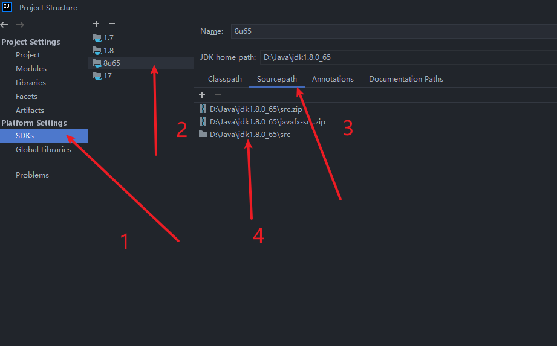
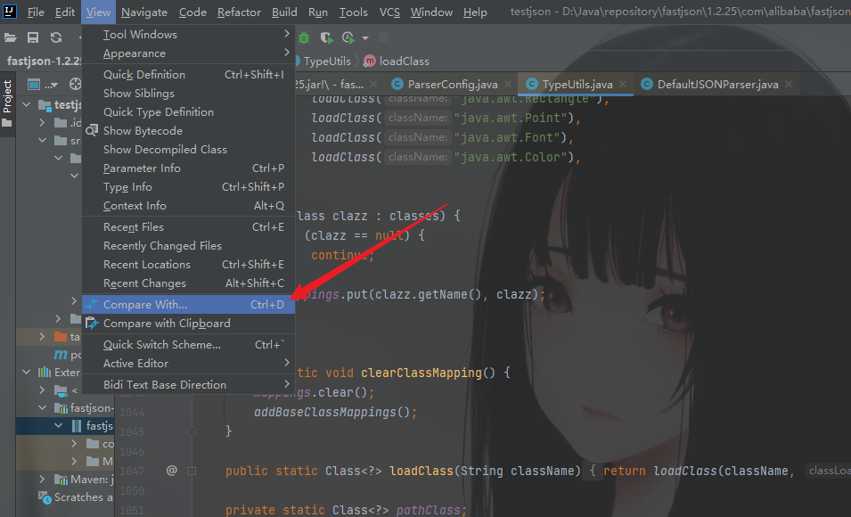
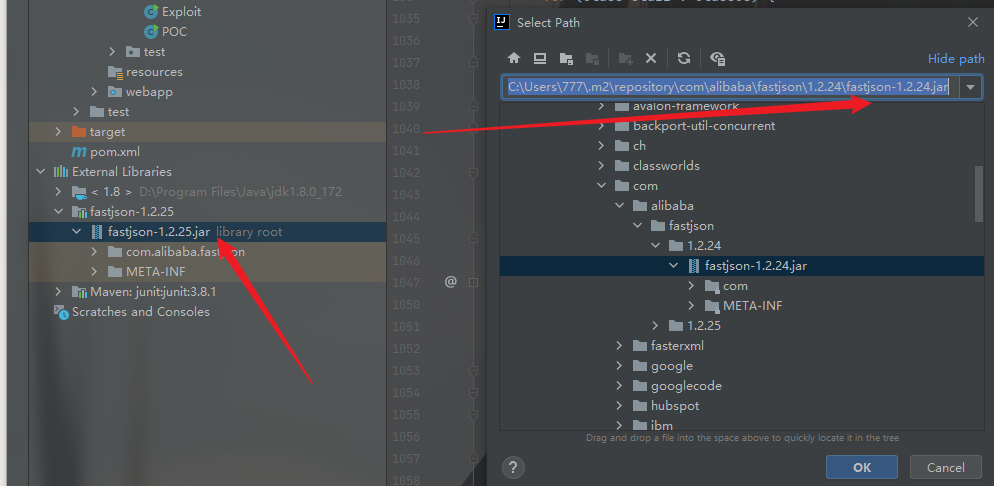
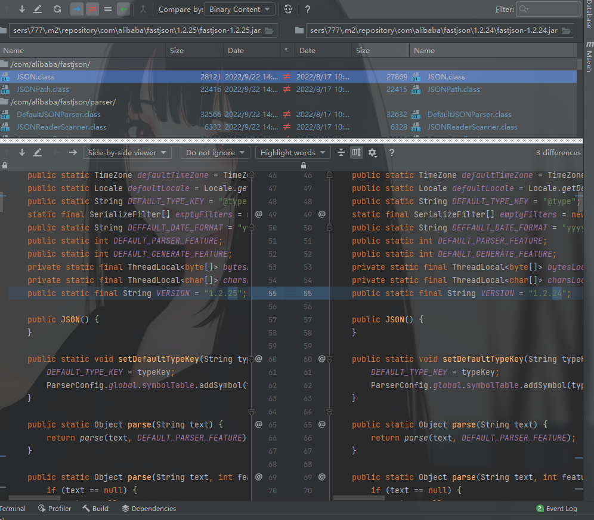

## **学习过程中遇到的tips**

### 部分class文件无法查看源码

在openjdk中下载对应的更新包。

比如：jdk-8u65版本，下载了https://hg.openjdk.java.net/jdk8u/jdk8u/jdk/rev/af660750b2f4
下载后，操作就是将压缩包中的-->   src\share\classes文件夹下的sun文件夹整个复制一份到jdk的src中

先解压jdk自带的src压缩包，然后将sun文件夹粘贴到src文件夹中

然后就可以回到IDEA中进行设置了

Ctrl+Alt+Shift+S 

选择SDKs，然后点击对应的jdk，选择Sourcepath，把src文件夹加入其中，最后apply即可。

然后就结束了。可以看到那些class的源码了。

## IDEA中compare两个不同版本的jar包

当然也可以单独对比两个文件。方法一样

首先随便选中一个jar包（鼠标点击一下即可）

View——>Compare With ...

然后选择你需要对比的另一个版本的包，这里以fastjson为例

然后点击ok，这里就会出现可视化界面来让我们很清晰的看到两个包的对比。

一般使用这个，这个是diff的图标，可以看出两边哪些文件做了修改。

那两个箭头也很简单，就是看有没有新增和删除的文件