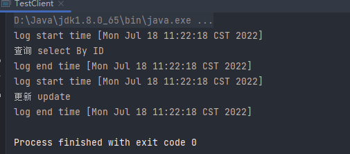
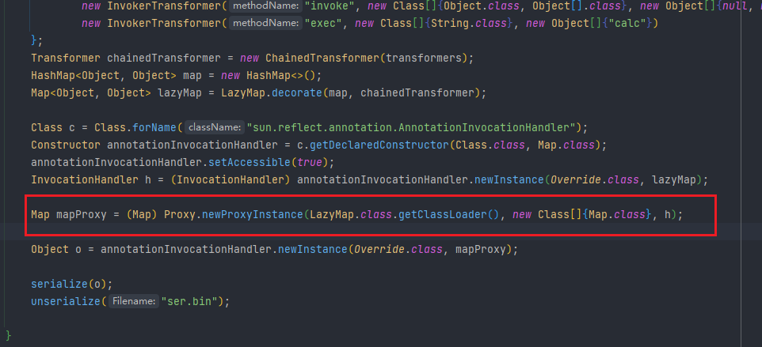

# 静态代理和动态代理

1. 所谓静态也就是在程序运行前就已经存在代理类的字节码文件，代理类和真实主题角色的关系在运行前就确定了。
2. 而动态代理的源码是在程序运行期间由JVM根据反射等机制动态的生成，所以在运行前并不存在代理类的字节码文件

## 静态代理

静态代理实例

1. 定义一个接口类

```java
package com.PrOXY;

public interface UserService {
    public void select();
    public void update();
}
```

1. 然后写一个实现接口的类

```java
package com.PrOXY;

public class UserServiceImpl implements UserService {
    public void select() {
        System.out.println("查询 select By ID");
    }

    public void update() {
        System.out.println("更新 update");
    }
}
```

1. 静态代理类

```java
package com.PrOXY;

import java.util.Date;

public class UserServiceProxy implements UserService{
    private UserService target;

    public UserServiceProxy(UserService target){
        this.target = target;
    }

    @Override
    public void select() {
        before();
        target.select();
        after();
    }

    @Override
    public void update() {
        before();
        target.update();
        after();
    }
    public void before(){
        System.out.println(String.format("log start time [%s] ", new Date()));
    }

    public void after(){
        System.out.println(String.format("log end time [%s]", new Date()));
    }
}
```

1. 实现客户端的类

```java
package com.PrOXY;

public class TestClient {
    public static void main(String[] args) {
        UserService userServiceImpl = new UserServiceImpl();
        UserService proxy = new UserServiceProxy(userServiceImpl);
        proxy.select();
        proxy.update();
    }
}
```

其中代理类中`private UserService target`先声明了被代理的对象，后面调用的时候，没有直接对原始的类进行修改。

缺点：

1、 当需要代理多个类的时候，由于代理对象要实现与目标对象一致的接口，有两种方式：

- 只维护一个代理类，由这个代理类实现多个接口，但是这样就导致**代理类过于庞大**
- 新建多个代理类，每个目标对象对应一个代理类，但是这样会**产生过多的代理类**

2、 当接口需要增加、删除、修改方法的时候，目标对象与代理类都要同时修改，**不易维护**。



如此来说，动态代理就是动态生成代理类

## 动态代理

动态代理的两种方式，一种是通过接口实现JDK动态代理。另一种是通过继承类的方式实现CGLIB代理。

### JDK动态代理

JDK动态代理主要是涉及两个类，其中在前面的CC链分析的时候已经看到过动态代理的利用，只是当时没有提，这里详细记录下动态代理在使用是，自动调用invoke()方法的原理吧。

关于JDK代理，一定要明白它是基于接口实现的

1. 调用代理逻辑的额执行器InvocatuionHandler（不是代理类）

再分两种情况，一种是存在委托者(被代理类)对象，需要执行real something

```java
package com.PrOXY;

import java.lang.reflect.InvocationHandler;
import java.lang.reflect.Method;

public class MyInvoactionHandler implements InvocationHandler {
    private Object m0re;	//委托者对象
    public MyInvoactionHandler(Object m0re){
        this.m0re = m0re;
    }

    @Override	//重写invoke方法
    public Object invoke(Object proxy, Method method, Object[] args) throws Throwable {
        before();
        //执行real something
        Object result = method.invoke(m0re, args);
        after();
        return result;
    }
    public void before(){
        System.out.println("before");
    }
    public void after(){
        System.out.println("after");
    }
}
```

其中`method.invoke(m0re, args);`解释为：通过invoke方法来执行，m0re的method方法，传入的参数为：args，这是反射的应用。

另一种是没有委托者对象，不需要执行real something

了解一下，不看具体内容。

1. 获取代理对象——Proxy.newProxyInstance(.......)

这个使用在CC链的第一条链子中有使用



这边主要就是使用动态代理主动调用invoke()方法来形成链子，导致命令执行。具体就不写了。

一般使用这个比较多。