# FastJson各版本补丁绕过分析

## 1.2.25~1.2.41

关于1.2.25的修复改动

1. `autotype`默认为`false`
2. 增加 `checkAutoType` 方法，在该方法中进行黑名单校验，同时增加白名单机制

绕过方法：使用`L;`进行绕过

在maven中将`fastjson`的版本改为`1.2.25`再去执行原来的POC就会发现已经无法执行了。报错是不支持`autoType`


先看看在1.2.25版本中修复的一些点，可以使用idea中的compare来diff一下1.2.24和1.2.25版本的变化

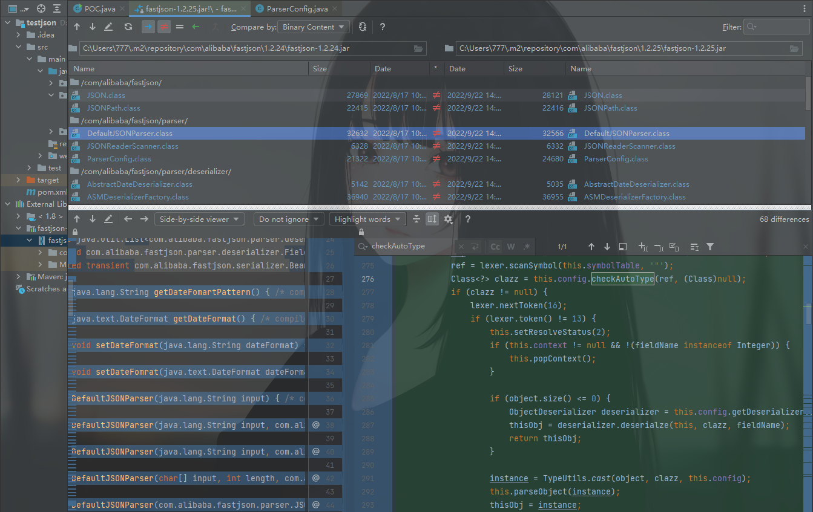

这个方法会记录汇总在学习中的小tips当中。

在1.2.25中更新增加了一个`checkAutoType`方法来检测，下面开始调试，跟进

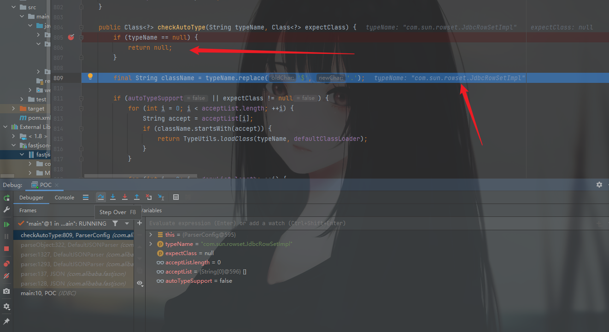

这里是先进行了一个判断，只要不为空，即可继续进行，随后给`className`赋值，做了下替换`TypeName`的值，如果存在`$`则替换为`.`

继续到这里会发现，都是两个条件都为false，直接跳到后面

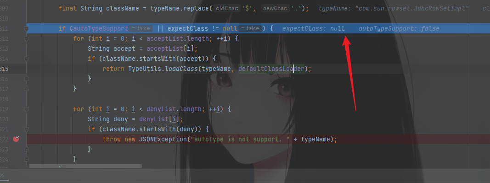

这里未开启`autoType`即为`true`，所以进入循环进行黑名单判断

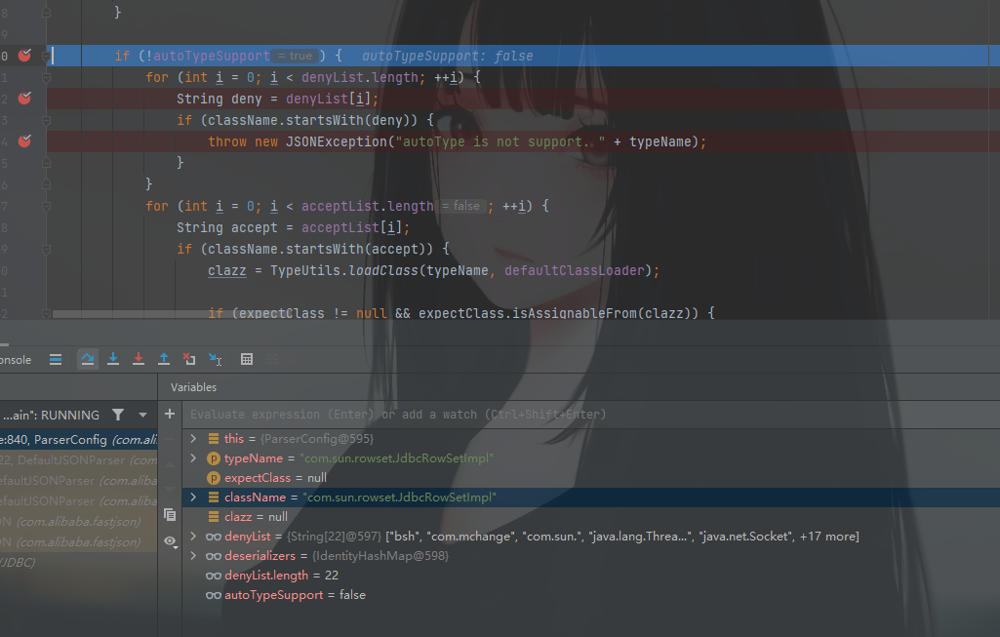

这边可以看到，`com.sum.`是在黑名单中的，所以这里直接抛出异常，不支持这个`com.sun.rowset.JdbcRowSetImpl`


后面这部分虽然没有走，但是可以看出来是白名单，如果传入的`className`的值不是在黑名单中的，那就将它添加到白名单中。符合前面所有条件后再去`loadClass`

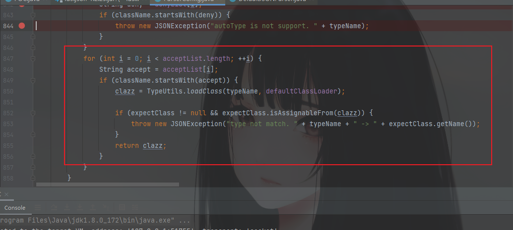

这个是更新的补丁做的修复。下面看绕过的分析

开启`autotype`在POC中添加下面的代码

```java
ParserConfig.getGlobalInstance().setAutoTypeSupport(true);
```

现在的POC，我打算一步一步来，先看开启autotype后是走到哪里

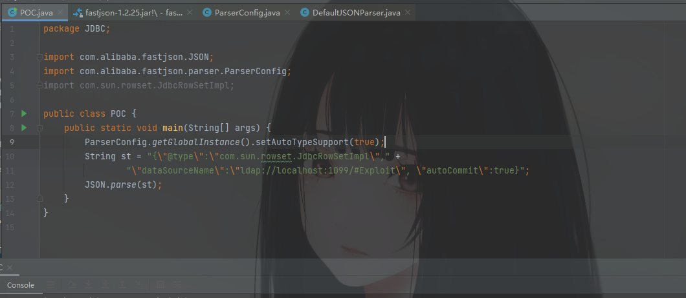

调试一下

这是我下的断点（随便下的，看哪里顺眼就往哪下）

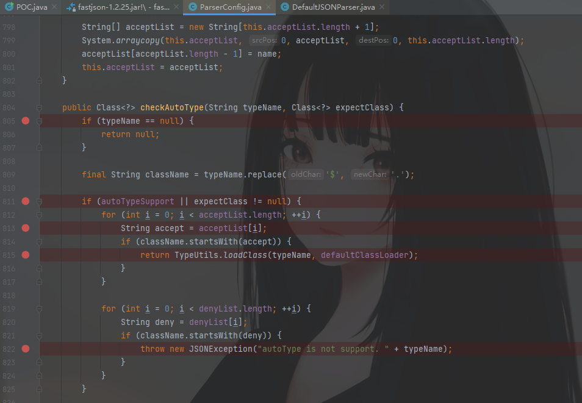

基本可以看懂逻辑了。还是跟踪一下看看


直接来到这里，已经开启`autotype`就直接走这里了，但是由于白名单是空的，所以来判断黑名单了，再次被匹配到，直接抛出异常。

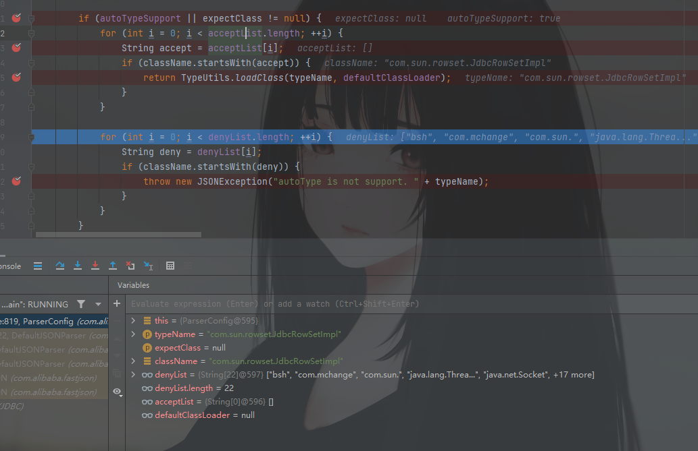

再次修改POC，这次将类的写法换成`Lcom.sun.rowset.JdbcRowSetImpl;`

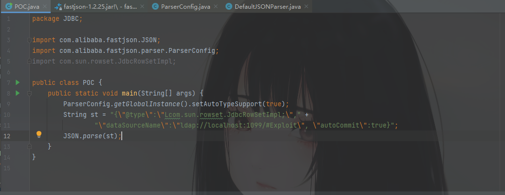

再次调试，这次前面重复的就不跟了，直接到`Lcom.sun.rowset.JdbcRowSetImpl;`不匹配黑名单后面


这里依旧是进入判断，继续执行，跟进`TypeUtils.loadClass`中

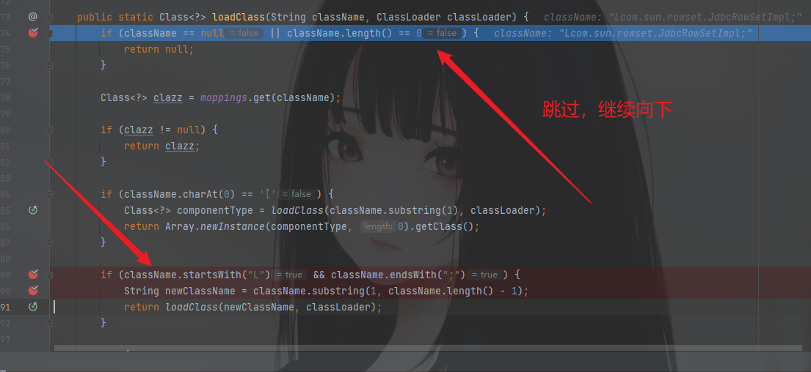

可以发现这里有一个非常契合我们POC中的payload的点

```java
if (className.startsWith("L") && className.endsWith(";")) {
            String newClassName = className.substring(1, className.length() - 1);
            return loadClass(newClassName, classLoader);
        }
```

`className`是以`L`开头，以`;`结尾那么将它使用`substring`方法截取一下，真有趣，不知道是不是为了这个漏洞专门写的方法哈哈哈

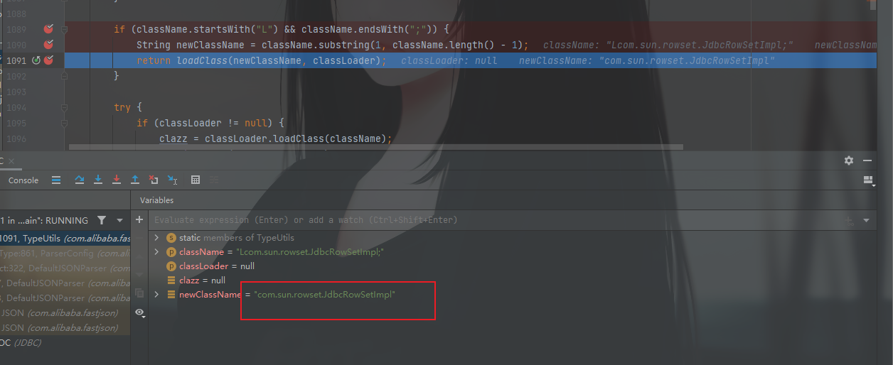

又重新得到了`com.sun.rowset.JdbcRowSetImpl`再去`loadClass`，就可以愉快的进行后面的步骤了