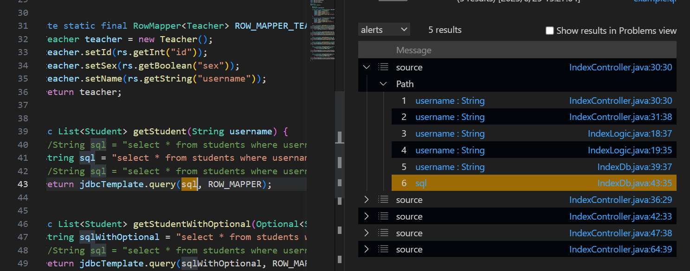
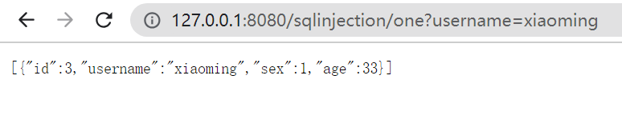
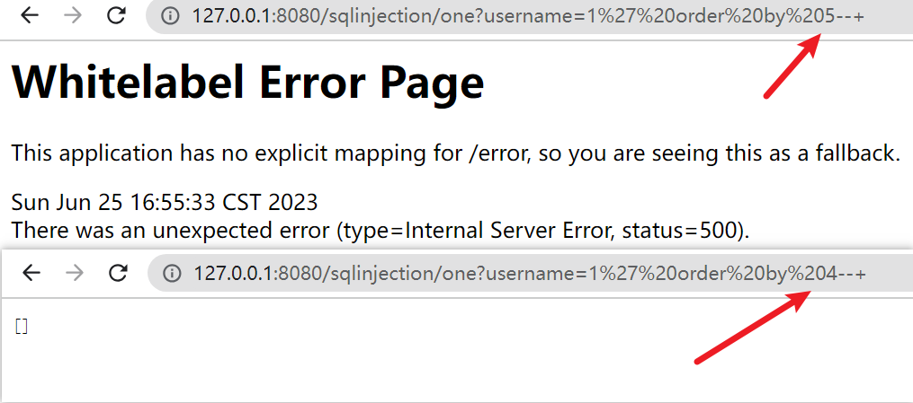
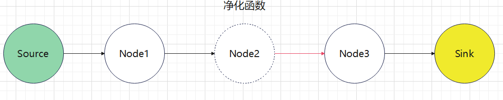
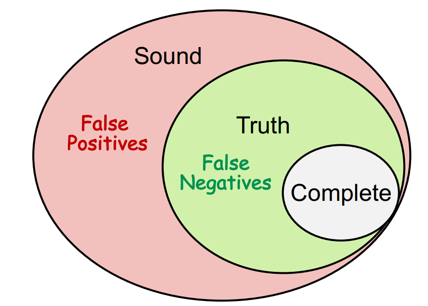
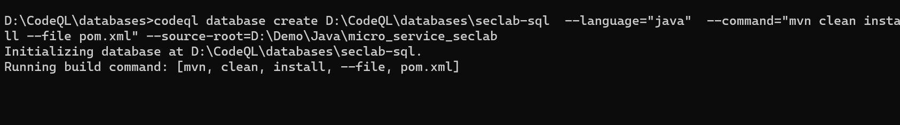
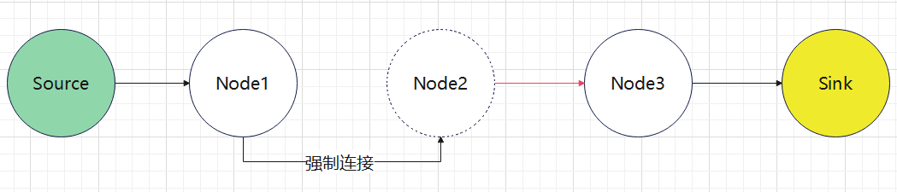

# CodeQL分析SpringBoot项目

### 0x00 创建数据库

项目地址：[https://github.com/l4yn3/micro_service_seclab](https://github.com/l4yn3/micro_service_seclab)
导入IDEA中进行构建，创建数据库，更改数据库密码测试链接，最后导入数据库文件。
创建ql数据库
```bash
codeql database create D:\CodeQL\databases\seclab  --language="java"  --command="mvn clean install --file pom.xml" --source-root=D:\Demo\Java\micro_service_seclab
```
### 0x01 SQL注入的规则
首先是SQL注入的部分，在该漏洞靶场中存在着不止一种SQL注入漏洞，同时也有一些迷惑性的路由接口。
```java
/**
 * @id java/example/vuldemo
 * @name m0re
 * @description Sql-Injection
 * @kind path-problem
 * @problem.severity warning
 */
import java
import semmle.code.java.dataflow.FlowSources
import semmle.code.java.security.QueryInjection
import DataFlow::PathGraph

class SqlConfig extends TaintTracking::Configuration
{
    SqlConfig(){this = "SqlInjectionConfig"}
    override predicate isSource(DataFlow::Node source) {
        source instanceof RemoteFlowSource
    }
    override predicate isSink(DataFlow::Node sink) {
        exists(Method method,MethodAccess call | method.hasName("query") and
        call.getMethod()=method and
        sink.asExpr()=call.getArgument(0))
    }
}

from SqlConfig config, DataFlow::PathNode source, DataFlow::PathNode sink
where config.hasFlowPath(source, sink)
select source.getNode(),source,sink,"source"
```
可以数据跟踪的结果已经输出，验证一下

使用order by先看下，四列，存在注入的。

然后注意下结果只有五个，虽然其中一个结果中包含两条，但对于该靶场来收，还是有漏报的，当然也有误报。接下来需要去解决这两个问题。

### 0x02 误报解决
在结果中对漏洞进行验证发现，有个点定位到source时，发现它的参数类型是List<Long>，这个类型的参数，与一般不太可能存在注入。
> 参数类型为 `List<Long>`,意味着传递给函数或方法的一个列表，其中每个元素都是 Long 类型。在这种情况下，不太可能存在注入漏洞，因为 `List<Long>`本身不是一个可注入的参数类型。

CodeQL用来消除误报的方法是使用`净化/清洗`函数。如下图，意味将其切断，阻断数据流。无法流通自然不会被记录到结果中。

关于`净化/清洗`函数：`isSanitizer` codeql自带的清洗函数

```java
override predicate isSanitizer(DataFlow::Node node) {
node.getType() instanceof PrimitiveType or
node.getType() instanceof BoxedType or
node.getType() instanceof NumberType
}
```
node节点的类型匹配基础类型，数字类型和泛型数字类型(比如List)，需要做的是在node节点匹配到这些类型时，阻断数据流，也就是跟踪不到query时，自然也就不会产生此类误报。
```java
override predicate isSanitizer(DataFlow::Node node) {
    node.getType() instanceof PrimitiveType or
    node.getType() instanceof BoxedType or
    node.getType() instanceof NumberType or
    exists(ParameterizedType pt| node.getType()=pt and
    pt.getTypeArgument(0) instanceof NumberType)
}
```
结果就是误报被消除了


### 0x03 漏报解决
误报和漏报对漏洞扫描的结果来说都是很正常的，但是对于漏洞来说，抱着Sound的思想，就是能误报，不能漏报。所以势必要解决这个漏报的问题。
`注意：`在文章——[https://www.freebuf.com/articles/web/283795.html](https://www.freebuf.com/articles/web/283795.html)漏报解决中，原作者说的是现有规则无法处理Optional这种类型，说的是Optional的使用没有在CodeQL的语法库里。所以username没有流转到`username.get()`导致无法检测出SQL注入，但是这次尝试发现已经可以流转，并且可以检测出这个注入漏洞。于是在思考原因是什么。所以返回思考如果没有检测出来这个SQL注入，那么实际情况应该是怎么去看是否有漏报。以下是我的反推思路。
还有几种SQL注入没被检测到，所以还需要再次更新规则，来匹配这些没被匹配到的路由。
在所有的结果中，发现一个问题就是，在`IndexDB.java`中存放的是SQL语句的执行调用代码，
而在最后的结果中，没有一条链子在最后调用到这段代码

```java
public List<Student> getStudentWithOptional(Optional<String> username) {
    String sqlWithOptional = "select * from students where username like '%" + username.get() + "%'";
    //String sql = "select * from students where username like ?";
    return jdbcTemplate.query(sqlWithOptional, ROW_MAPPER);
}
```
怎么判断是在哪里断掉的，看到代码这边的注释，下面这条SQL语句几乎和上面这条一样，只是变量名和传参不一样。将代码修改成这样的
```java
public List<Student> getStudentWithOptional(Optional<String> username) {
    //String sqlWithOptional = "select * from students where username like '%" + username.get() + "%'";
    String sqlWithOptional = "select * from students where username like ?";
    return jdbcTemplate.query(sqlWithOptional, ROW_MAPPER);
}
```
重新生成database数据库，再次使用上述规则去检测SQL注入
结果中可以发现，已经可以匹配到。正常按照原文中作者的流程应该是这样。可是这里已经可以匹配到，那么就说明在CodeQL的不断更新中，已经将Optional的使用，加入到了CodeQL的规则库中了。所以这里无需强链接`username-->username.get()`了。
不过强行链接的思路和方法还是值得学习。
`isAdditionalTaintStep()`方法的两个参数，让node1强行流转至node2

```java
override predicate isAdditionalTaintStep(DataFlow::Node node1, DataFlow::Node node2) {}
```
在此之前先找出`username`和`username.get()` 
```java
predicate isTaintedString(Expr expSrc, Expr expDest) {
    exists(Method method, MethodAccess call, MethodAccess call1 | 
    expSrc=call1.getArgument(0) and
    expDest=call and call.getMethod()=method and method.hasName("get") and method.getDeclaringType().toString()="Optional<String>" and call1.getArgument(0).getType().toString()="Optinal<String>")
}
```
随后在class中调用它，重写`isAdditionalTaintStep()`谓词
```java
override predicate isAdditionalTaintStep(DataFlow::Node node1, DataFlow::Node node2) {
        isTaintedString(node1.asExpr(), node2.asExpr())
    }
```
### 0x04 Lombok影响
Lombox是一个Java类库，起因注解编程，方便开发。可是这种注解开发的模式，CodeQL无法识别，导致Lombox机制出现的SQL注入漏洞，因为无法被检测出来。
解决办法：[issues](https://github.com/github/codeql/issues/4984#:~:text=Unfortunately%20Lombok%20does%20not%20work%20with%20the%20CodeQL,the%20source%20files%20before%20running%20CodeQL%20as%20follows%3A)
只是这个办法的实际处理是
> lombok文件是不完整的Java文件。lombok注解处理器与Javac编译器挂钩，在运行中重写Javac的语法树，使其完整。

> 去掉代码里的lombok注解，并还原setter和getter方法的java代码，从而使CodeQL的Flow流能够顺利走下去

mark一下，不知道后续官方会不会将此进行完善
目前还没有...

### 0x05 FastJson的检测规则
Fastjson反序列化时，利用JSON字符串中的`aututype`字段来表明指定反序列化的目标恶意类。同时在反序列化时，会自动调用恶意对象的构造方法，`getter/setter`，最后在调用JNDI注入的lookup函数上汇聚。
此时需要理清楚两个点，也就是source和sink，定义好污点输入，污点汇聚。
如何定义这两个点
> getter的规则：
> 1. 以get开头
> 2. 没有函数参数
> 3. 是我们的code database中的函数
> 4. 为public方法
> 5. 函数名长度要大于3
> 
setter的规则：
> 1. 以set开头
> 2. 函数参数为一个
> 3. 是我们code database中的函数
> 4. 为public方法
> 5. 函数名长度大于3
> 6. 返回值为void

这里以一个setter的规则为例
```java
class FastJsonSetMethod extends Method{
    FastJsonSetMethod(){
        this.getName().indexOf("set")=0 and	//set前截取字符为0，也就是说set开头
        this.getName().length()>3 and	//长度>3
        this.isPublic() and		//是public方法
        this.fromSource() and	//是code database中的
        exists(VoidType vt |vt=this.getReturnType()) and	//返回值为void类型
        this.getNumberOfParameters()=1	//该函数的参数只有一个，如果是get则不规定
    }
}
```
然后是污点汇聚的位置，也就是lookup函数。单纯找这个还是比较常用的一个方式
```java
class FastJsonJndiMethod extends Method{
    FastJsonJndiMethod(){
        this.getDeclaringType().getASupertype*().hasQualifiedName("javax.naming", "Context") and
        this.hasName("lookup")
    }
}
```
mark，卡住，暂时先跳过

---

问题解决，继续整理
因为这个愚蠢的问题，去问了GitHub的技术人员，经过几天的沟通（语言不通确实有些难搞）
[https://github.com/github/securitylab/discussions/769](https://github.com/github/securitylab/discussions/769)
最后是因为codeql不能分析闭源依赖包的源码，我是知道这一点的，只是遇到问题的时候没有考虑到，同时也是一个机会吧，我去学习了这个工具的用法。不然要在收藏夹吃灰了。
[https://www.yuque.com/m0re/demosec/kp17nflcz1kaasry](https://www.yuque.com/m0re/demosec/kp17nflcz1kaasry)
如何用codeql来挖利用链，将fastjson的源码下载下来生成database，去寻找可以利用的方法，每一个都去找，找调用关系，连接起来就可以成为一条链子。只不过这个过程有点繁琐，这大概就是劝退我的一点。
### 0x06 参考文章
[https://www.freebuf.com/articles/web/283795.html](https://www.freebuf.com/articles/web/283795.html)
[https://xz.aliyun.com/t/7482](https://xz.aliyun.com/t/7482)
[https://xz.aliyun.com/t/7789](https://xz.aliyun.com/t/7789)

https://sumsec.me/2022/CodeQL%E4%B8%8EShiro550%E7%A2%B0%E6%92%9E.html

https://github.com/pen4uin/awesome-java-security/blob/main/blog/posts/22-09-25-for-shiro550-find-gadget-via-codeql/index.md
