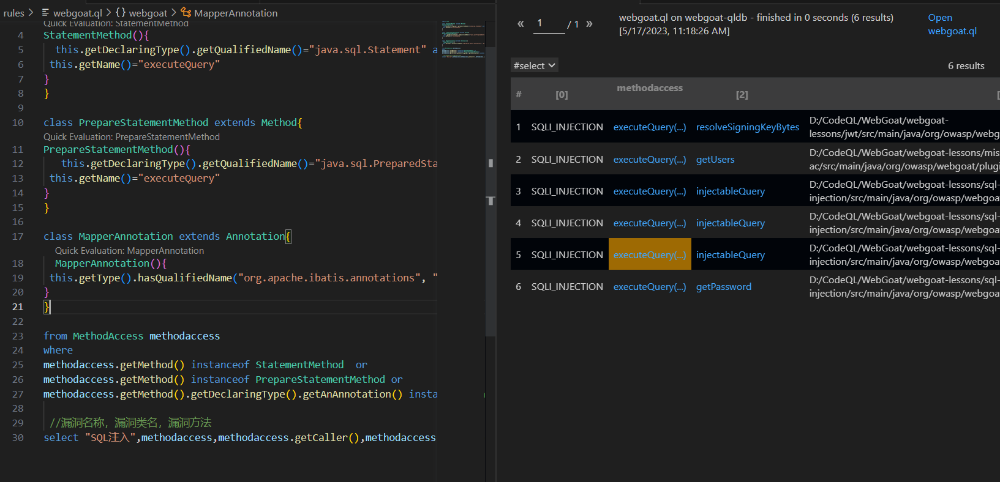
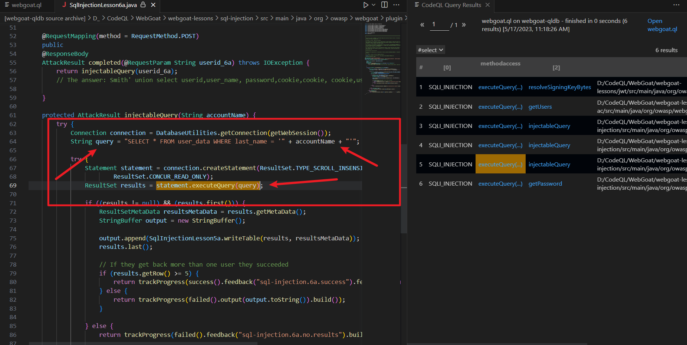

## 无框架

首先贴一下检测SQL注入的一个简单的规则来看。

```graphql
import java.util.regex.*;

rule sql_injection {
    meta {
        description = "检测 SQL 注入攻击"
        severity = "high"
    }
    // 检查所有的 SQL 查询语句
    select t from SqlStatement t where exists(
        // 检查输入中是否包含 SQL 关键字
        select 1 from DataFlow::PathNode input where input.asExpr().toString().matches("(?i).*\\b(SELECT|INSERT|UPDATE|DELETE|FROM|WHERE|GROUP BY|ORDER BY|HAVING|LIMIT)\\b.*") and
        // 检查查询中是否包含未经过滤或转义的输入
        exists(DataFlow::PathNode query where query.asExpr().toString().matches("(?i).*\\b" + input.asExpr().toString() + "\\b.*"))
    ) and
    // 检查错误消息是否包含数据库结构信息或敏感数据
    exists(DataFlow::PathNode error where error.asExpr().toString().matches("(?i).*\\b(database|user|password|table|column|index|constraint)\\b.*"))
}
```

import 导入的是正则表达式的包，因为后面会用到正则去匹配关键字。

rule是关键字，这里是一个规则，而在这里规则里面的关键字meta则是表明是CodeQL的一个元数据块，通过定义规则的元数据信息，可以帮助用户更好地理解该规则的用途和严重程度，同时也可以帮助工具自动化地处理规则。自定义的元数据块规则一般还会在定义作者的名字或者其他标志等。`description` 和 `severity` 属性是元数据信息，可以根据实际需要自定义，比如修改规则描述或更改漏洞的严重程度评级。

查询语句是规则的核心部分，用于检测 SQL 注入漏洞。通常情况下，查询语句具有一定的固定格式，可以在不同的代码库中使用，只需要根据实际情况进行一些适当的修改。例如，对于 SQL 注入漏洞的检测，查询语句可能需要对 SQL 语句中的参数进行分析，检查是否存在潜在的注入漏洞。这些查询语句通常是固定的，需要根据实际情况进行调整和优化，以达到更好的检测效果。

然后SqlStatement是CodeQL中的一个类，这个类代表代码中所有的SQL查询语句，也就是可以直接将携带有SQL语句的代码罗列出来，然后加上控制条件，也就是where后面的内容，这里利用了正则表达式，筛选过程过于繁琐，因为它需要去匹配关键字，而且很多情况可能没有漏洞，误报率会很高。当然使用规则时需要针对代码的情况进行更改规则。这里只是一个例子，需要有针对性的去找危险方法，比如这里是在所有的sql语句中查找包含sql关键词的语句。

在这个例子中，`select t from SqlStatement t where exists` 表示检索 `SqlStatement`表中的所有数据，并使用 `exists` 子查询来检查是否存在满足条件的数据行。`t` 是一个变量名，用于代表查询结果中的每一行数据。这个查询语句的意思是，如果存在一个 `DataFlow::PathNode` 节点，代表一个代码中的输入，且输入中包含 `SQL` 关键字，同时在查询语句中存在未经过滤或转义的输入，则认为存在 `SQL` 注入漏洞。

## MyBatis框架

规则

```graphql
import java

class StatementMethod  extends Method{
StatementMethod(){
  this.getDeclaringType().getQualifiedName()="java.sql.Statement" and
 this.getName()="executeQuery" 
}
}

class PrepareStatementMethod extends Method{
PrepareStatementMethod(){
   this.getDeclaringType().getQualifiedName()="java.sql.PreparedStatement" and
 this.getName()="executeQuery" 
}
}

class MapperAnnotation extends Annotation{
  MapperAnnotation(){
 this.getType().hasQualifiedName("org.apache.ibatis.annotations", "Mapper")
}
}

from MethodAccess methodaccess
where 
methodaccess.getMethod() instanceof StatementMethod  or
methodaccess.getMethod() instanceof PrepareStatementMethod or
methodaccess.getMethod().getDeclaringType().getAnAnnotation() instanceof MapperAnnotation

 //漏洞名称，漏洞类名，漏洞方法
select "SQLI_INJECTION",methodaccess,methodaccess.getCaller(),methodaccess.getFile().getAbsolutePath()
```

`getDeclaringType() `方法返回方法的声明类型。

`getQualifiedName() `方法返回类型的全限定名，即包含包名和类名的完整名称。

首先，定义了一个名为 `StatementMethod` 的类，它继承了 `Method `类。`StatementMethod` 类的构造函数中使用了两个过滤条件：`getDeclaringType().getQualifiedName()="java.sql.Statement"` 和 `getName()="executeQuery"`。这两个条件分别表示该方法的声明类型为 `java.sql.Statement`，方法名为 `executeQuery`。同样地，还定义了一个名为 `PrepareStatementMethod` 的类，该类继承了 `Method `类，并且在构造函数中也使用了上述两个过滤条件，但声明类型为 `java.sql.PreparedStatement`。

接着，定义了一个名为 `MapperAnnotation` 的类，它继承了 `Annotation` 类。`MapperAnnotation` 类的构造函数中使用了一个过滤条件：`getType().hasQualifiedName("org.apache.ibatis.annotations", "Mapper")`，表示该注解的类型为 `org.apache.ibatis.annotations.Mapper`。

`this.getName()="executeQuery"` 检查了当前方法的名称是否为 `executeQuery`。

`hasQualifiedName("org.apache.ibatis.annotations", "Mapper")`方法用于检查注解类型是否为指定的全限定名，其中 `"org.apache.ibatis.annotations"` 是包名，`"Mapper"`是类名。

利用webgoat生成一个ql数据库，来运行这个规则

下面是结果，可以得出的几个结果，这就已经是符合条件的SQL注入



然后细看一个，非常精准的定位到executeQuery方法。而且对应的路径也是SQL注入关卡的位置。

