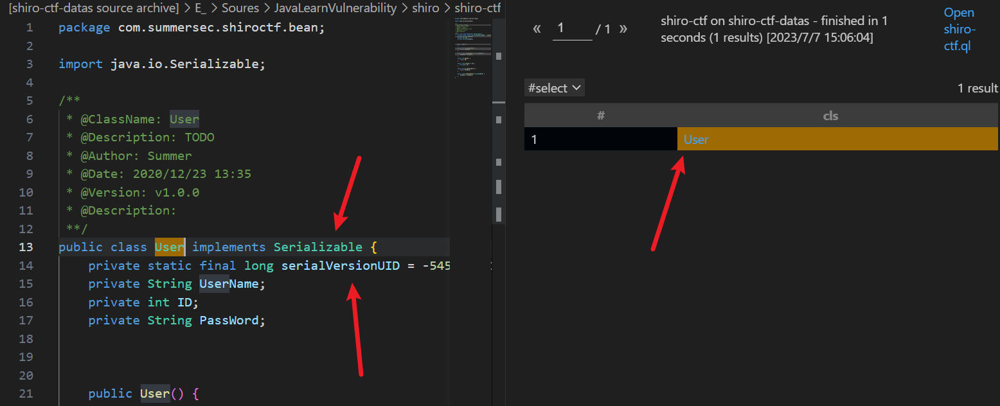
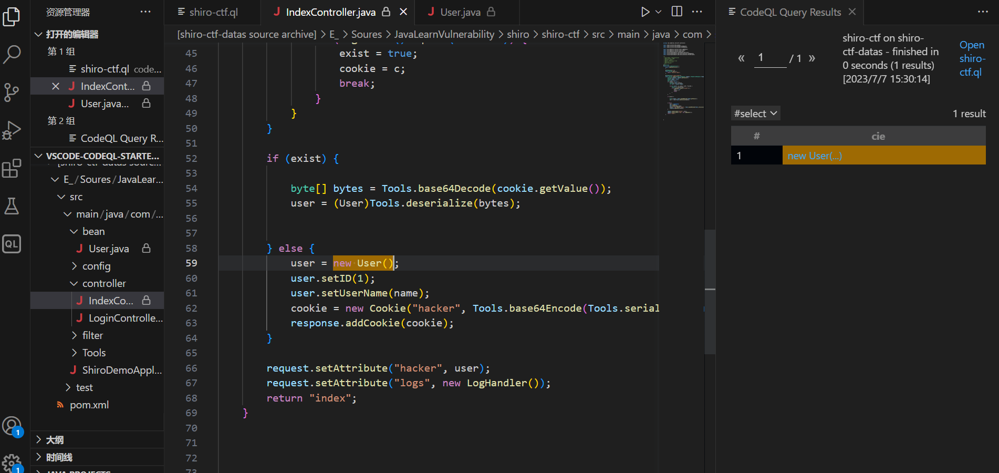
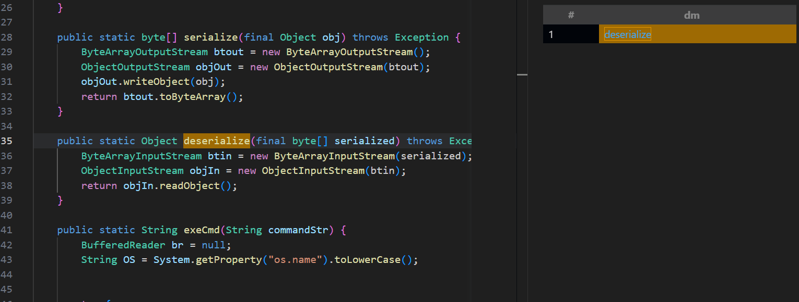
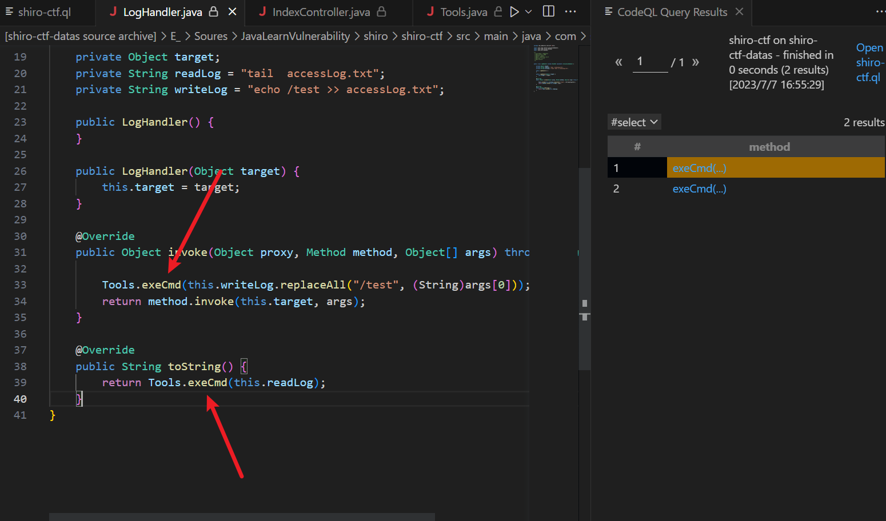
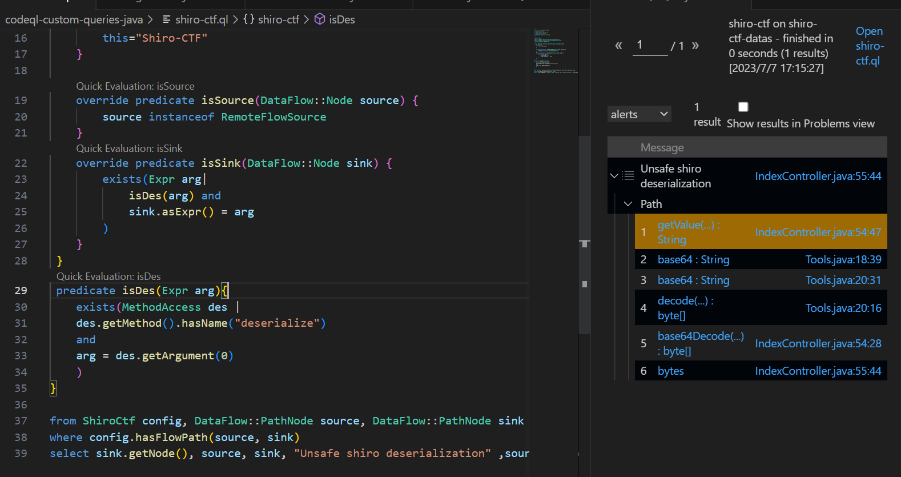
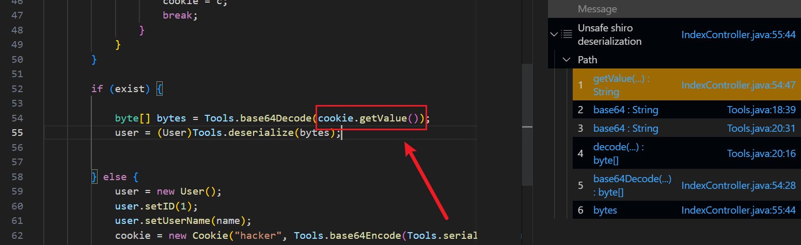
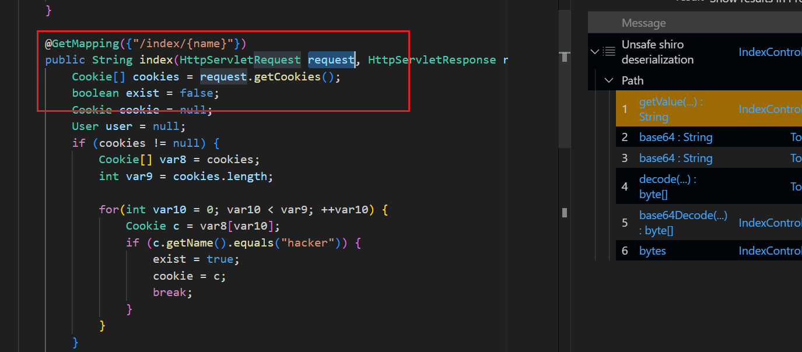
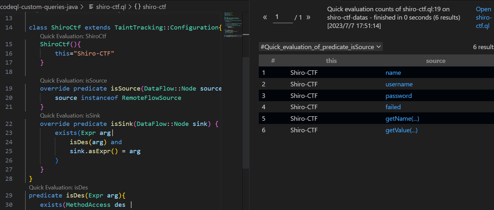

# [Java]CodeQL with Shiro-CTF

## 前言

> 学习一下SummerSec师傅的项目：[https://github.com/SummerSec/learning-codeql](https://github.com/SummerSec/learning-codeql)
>
> 结合项目中的database，前置：需要了解一下shiro反序列化漏洞的利用链。
>
> 本文是学习的第一篇——[CodeQL分析Shiro利用链](https://github.com/SummerSec/learning-codeql/blob/4bc9bd4fe8f94a2b70e4d05d5e95565b0b9492bb/codeql-java-vul/shiro-ctf/shiro-ctf.md)

## 寻找重点：source & sink

SummerSec师傅的文章中提到，在寻找反序列化漏洞的时候需要先找入口，而入口肯定是可以实现反序列化功能的，那么就说明这个入口类，一定实现了`Serializable`接口，而且会存在`serialVersionUID`字段，所以现在需要找的就是一个接口需要实现反序列化接口就行。

```java
/**
 * @id java/example/vuldemo
 * @name shiro-ctf
 * @description Shiro-vul
 * @kind path-problem
 * @problem.severity warning
 */

import java

from Class cls
/*条件选择，需要判断是否实现了反序列化接口，还要筛选是否是来自项目源码中的，去除JDK中自带的反序列化接口类的干扰*/
where cls.getASupertype() instanceof TypeSerializable and
        cls.fromSource()

select cls
```

结果成功查询出来，找到一个实现了反序列化接口的Class


这只是一个接口类，并不是一个实现类，所以需要找到哪里将User实例化了。

```java
/**
 * @id java/example/vuldemo
 * @name shiro-ctf
 * @description Shiro-vul
 * @kind path-problem
 * @problem.severity warning
 */

import java

class FindUser extends RefType{
    FindUser(){this.hasQualifiedName("com.summersec.shiroctf.bean", "User")}
}

from ClassInstanceExpr cie
where cie.getType() instanceof FindUser
select cie
```

查询结果如下：



在`IndexController.java`中的59行，对User类进行了实例化。

```java
@GetMapping({"/index/{name}"})
    public String index(HttpServletRequest request, HttpServletResponse response, @PathVariable String name) throws Exception {
        Cookie[] cookies = request.getCookies();
        boolean exist = false;
        Cookie cookie = null;
        User user = null;
        if (cookies != null) {
            Cookie[] var8 = cookies;
            int var9 = cookies.length;

            for(int var10 = 0; var10 < var9; ++var10) {
                Cookie c = var8[var10];
                if (c.getName().equals("hacker")) {
                    exist = true;
                    cookie = c;
                    break;
                }
            }
        }

        if (exist) {

            byte[] bytes = Tools.base64Decode(cookie.getValue());
            user = (User)Tools.deserialize(bytes);


        } else {
            user = new User();
            user.setID(1);
            user.setUserName(name);
            cookie = new Cookie("hacker", Tools.base64Encode(Tools.serialize(user)));
            response.addCookie(cookie);
        }

        request.setAttribute("hacker", user);
        request.setAttribute("logs", new LogHandler());
        return "index";
    }
```

关键代码中，如果`cookies`是`null`，那么不执行下面的逻辑判断的操作。如果不为`null`，而且满足`c.getName().equals("hacker")`就可以执行到`cookie.getValue()`，进而执行反序列化的操作。如果没有满足`c.getName().equals("hacker")`条件，那么就会执行序列化的操作。

Tools类中的`base64Encode()`和`serialize()`以及`deserialize`都是Tools中比较关键的方法。接下来就是需要去看Tools的源码是怎么写的这几个方法。

```java
// serialize()
public static byte[] serialize(final Object obj) throws Exception {
        ByteArrayOutputStream btout = new ByteArrayOutputStream();
        ObjectOutputStream objOut = new ObjectOutputStream(btout);
        objOut.writeObject(obj);
        return btout.toByteArray();
    }
// Base64Encode(byte[] xxxx)
public static String base64Encode(byte[] bytes) {
        Base64.Encoder encoder = Base64.getEncoder();
        return encoder.encodeToString(bytes);
    }
// exeCmd() 执行系统命令
// deserialize()
public static Object deserialize(final byte[] serialized) throws Exception {
        ByteArrayInputStream btin = new ByteArrayInputStream(serialized);
        ObjectInputStream objIn = new ObjectInputStream(btin);
        return objIn.readObject();
    }
```

比如反序列化的方法可以这么来找

```java
class Deserialize extends RefType{
    Deserialize(){
        this.hasQualifiedName("com.summersec.shiroctf.Tools", "Tools")
    }
}

class DeserializeMethod extends Method{
    DeserializeMethod(){
        this.getDeclaringType() instanceof Deserialize
        and this.hasName("deserialize")
    }
}

from DeserializeMethod dm
select dm
```



然后找到exeCmd，这个可以执行命令的点，可以放一下，待会重新计划规则来找链子

```java
from MethodAccess method
where method.getMethod().hasName("exeCmd")
select method
```

可以发现在`LogHandler.java`两处方法调用了`exeCmd()`



## 寻找利用链

完整规则

```java
/**
 * @id java/example/vuldemo
 * @name shiro-ctf
 * @description Shiro-vul
 * @kind path-problem
 * @problem.severity warning
 */

 import java
 import semmle.code.java.dataflow.FlowSources
 import semmle.code.java.security.QueryInjection
 import DataFlow::PathGraph

 class ShiroCtf extends TaintTracking::Configuration{
    ShiroCtf(){
        this="Shiro-CTF"
    }

    override predicate isSource(DataFlow::Node source) {
        source instanceof RemoteFlowSource
    }
    override predicate isSink(DataFlow::Node sink) {
        exists(Expr arg|
            isDes(arg) and
            sink.asExpr() = arg
        )
    }
 }
 predicate isDes(Expr arg){
    exists(MethodAccess des |
    des.getMethod().hasName("deserialize") 
    and
    arg = des.getArgument(0)
    )
}

from ShiroCtf config, DataFlow::PathNode source, DataFlow::PathNode sink
where config.hasFlowPath(source, sink)
select sink.getNode(), source, sink, "Unsafe shiro deserialization" ,source.getNode(), "this user input"
```

执行结果



source是这里，这里是SummerSec师傅在GitHub Securitylab discussions提出的问题之一，想要让source的点从request开始显示



实际上师傅的意思也就是在这里



规则中`isSource`使用了`RemoteFlowSource`，其实这个已经包含了大多数情况中的用户输入。

直接在`isSource`点击`"Quick Evaluation"`，就可以看到所有的用户输入内容。



这里本想截图的，可是窗口太小了，无法放下，就直接把这部分代码贴过来吧。

```java
@GetMapping({"/index/{name}"})
    public String index(HttpServletRequest request, HttpServletResponse response, @PathVariable String name) 
```

这里的`name`才是真正的用户输入，而不是`request`，所以想要直接获取到`request--cookies`这个阶段的数据流应该是不行了。因为使用了`RemoteFlowSource`不会把`request`当作一个用户输入的。

SummerSec师傅最后也得到了答案，也就是需要增加一个谓词`isAdditionTaintStep`来连接这个中断的数据流。

不过确实，没什么必要，只不过是为了更好看而已。codeql可以直接判断`getValue()`为用户输入。

最后说一下exeCmd的这个利用方式，这个好像不太行的，因为执行命令中间涉及到了第三方包，在一开始创建数据库的时候是没有加载进来的。所以codeql无法跟踪到其中的一些调用关系。

```java
*              Gadget：
 *                  Tools.base64Decode()
 *                      Tools.deserialize()
 *                          ObjectInputStream.readObject()
 *                              BadAttributeValueExpException.readObject()
 *                                  LogHandler.toSting()
 *                                      Tools.exeCmd()
```

我没去debug，这个链子是直接拉取SummerSec师傅的。从中可以看出，污点在经过这两个节点的时候已经超出了项目源码的范畴。`ObjectInputStream`、`BadAttributeValueExpException`

所以是无法这样来分析这条链子的。这样的链子要去挖掘的话，是需要将第三方包进行反编译并生成ql数据库的，再去寻找。有些繁琐，本人技术有限，同时也有点懒，不想去找。