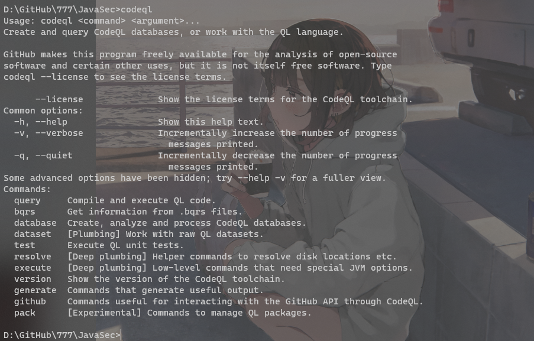
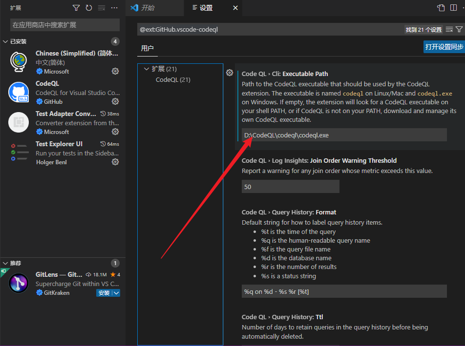
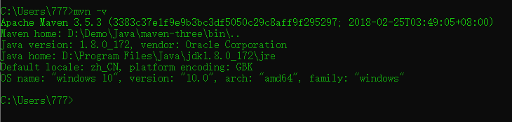
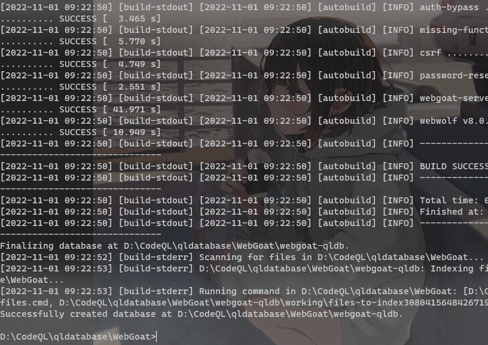
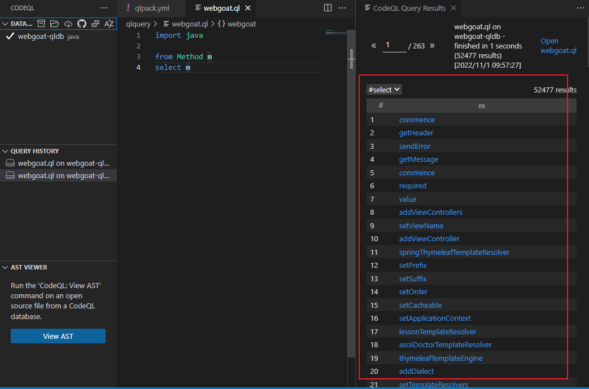

## CodeQL安装

Windows10

下载：https://github.com/github/codeql-cli-binaries/releases

将codeql可执行文件加入环境变量中。然后再下载标准库：https://github.com/github/codeql

验证



去Visual Studio Code中安装插件

在插件库中直接搜索codeql，就可以看到第一个GitHub官方认证的。点击安装就可以了，安装失败检查下代理是否关闭。

然后设置，填入codeql可执行文件的位置



## 简单测试

1. 下载webgoatv8.0.0作为测试

```java
git clone --branch v8.0.0 https://github.com/WebGoat/WebGoat.git
```

1. 创建CodeQL数据库

配置好maven环境变量，在使用之前可先检查一遍



```powershell
codeql database create webgoat-qldb -l java
```



成功创建数据库，过程可能有点慢

1. 创建QL包

创建一个文件夹（QL Pack），用来存放后续编写的CodeQL脚本，在文件夹中创建qlpack.yml和任意一个ql后缀的脚本文件。

1. 配置这两个文件

```java
name: example-query
version: 0.0.0
libraryPathDependencies: codeql-java
```

第一行表示这个QL包的名称为example-query，必选，如果你在VSCode中同时打开多个QL包时，要保证这个name的值唯一不重复；而且需要保证name值不出现大写字母，否则会报错。

第二行表示这个QL包的版本号，必选；

第三行表示这个QL包的依赖，必选，codeql-java表示需要Java语言的QL标准库依赖

1. VSCode工作区增加CodeQL标准库

将标准库加入工作区是为了CodeQL的解释器可以访问得到标准库。

1. 添加CodeQL数据库

选择上面生成的webgoat-qldb文件夹。

1. 查询测试

```java
import java

from Method m
select m
```

右键单击，选择`CodeQL: Run Query`执行该查询，获取该qldb中定义的所有的方法。



直接点击对应的条目，可以跳到对应文件中。