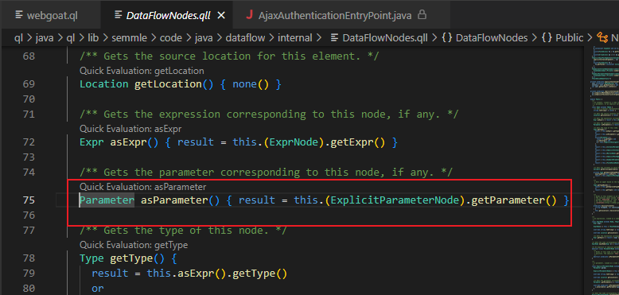
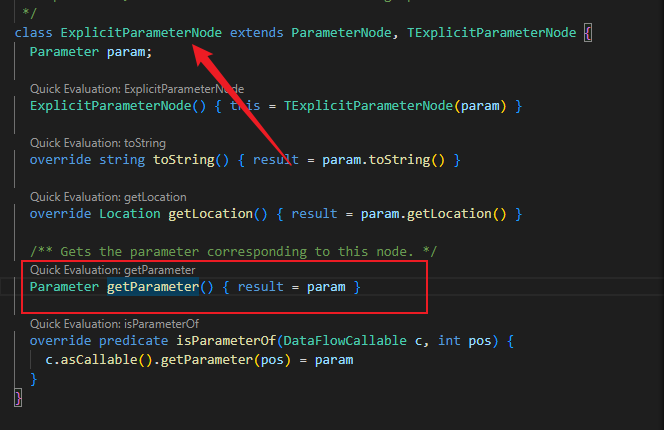
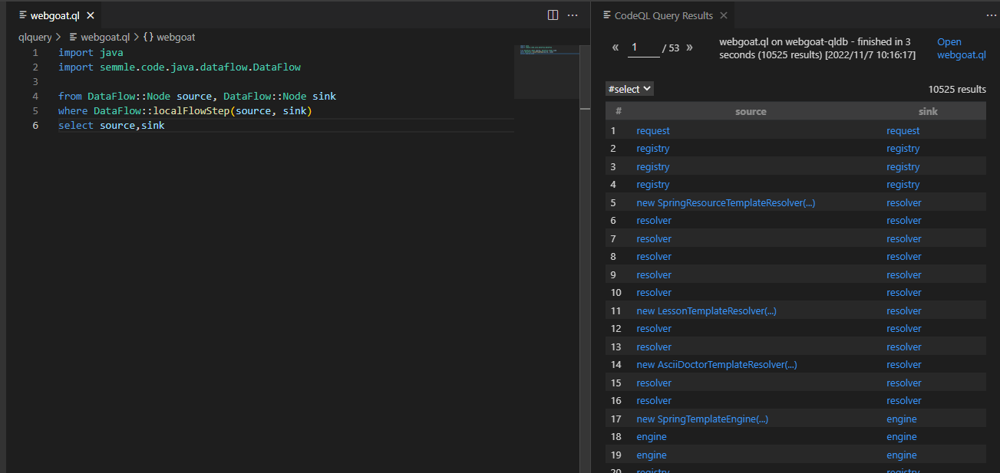
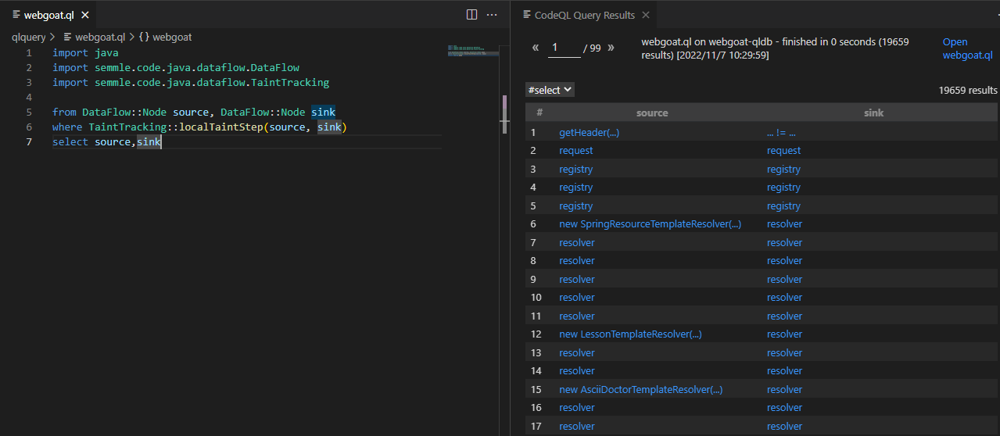
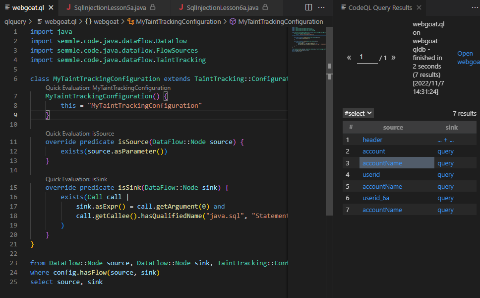

## 本地数据流

本地数据流是对方法内的数据流进行分析，由于数据只在方法内流转，所以分析起来比较快，准确度也比较高。

CodeQL中使用DataFlow模块来实现本地数据流库，在这个库中，定义了Node类表示数据流图中的节点，节点又分为参数节点和表达式节点。分别使用`asExpr`和`asParameter`在数据流节点和（表达式和参数）进行映射。

```java
import java
import semmle.code.java.dataflow.DataFlow

from DataFlow::Node node
select node.asParameter()
```

`asParameter()`可以跟进到对应模块中查看源代码是通过了`this.(ExplicitParameterNode).getParameter()`获取参数。



继续跟进`ExplicitParameterNode`，也可以找到对应的调用。



`localFlowStep(Node nodeFrom, Node nodeTo)`中保存了所有从nodeFrom到nodeTo节点的本地数据流，可以使用`+`或者`*`, 或者`localFlow(Node node1, Node node2)`进行递归调用。

```java
import java
import semmle.code.java.dataflow.DataFlow

from DataFlow::Node source, DataFlow::Node sink
where DataFlow::localFlowStep(source, sink)
select source,sink
```

这是粗略的将qldatabase中的基本所有的输入输出给列出来了。也就是数据流。



## 本地污点跟踪

本地污点跟踪通过包括非保留值的流程步骤来扩展本地数据流，举个例子

```java
String temp = x;
String y = temp+"abc";
String z = x+y;
System.out.println(z);
```

这样如果x是被污染的字符串，那么y和z都被污染，也都会被跟踪。

本地污染跟踪库位于`TaintTracking`模块中. 和本地数据流一样, `localTaintStep(DataFlow::Node nodeFrom，DataFlow::Node nodeTo)`保存了所有从`nodeFrom`节点到`nodeTo`节点的污点流。可以使用`+`或者`*`, 或者`localTaint(DataFlow::Node src, DataFlow::Node sink)`进行递归调。

```java
import java
import semmle.code.java.dataflow.DataFlow
import semmle.code.java.dataflow.TaintTracking

from DataFlow::Node source, DataFlow::Node sink
where TaintTracking::localTaintStep(source, sink)
select source,sink
```



## 全局数据流

全局数据流是可以跟踪整个程序的数据流，比本地数据流的范围要大。但是范围广也就意味着精确度不高，分析时也需要消耗更多的时间。

全局数据流使用的扩展库是`DataFlow::Configuration`

使用模板

```java
import semmle.code.java.dataflow.DataFlow

class MyDataFlowConfiguration extends DataFlow::Configuration {
  MyDataFlowConfiguration() { this = "MyDataFlowConfiguration" }

  override predicate isSource(DataFlow::Node source) {
    ...
  }

  override predicate isSink(DataFlow::Node sink) {
    ...
  }
}
```

这些谓词在配置中定义：

`isSource`-定义数据可能来源

`isSink`-定义数据可能流向的位置

`isBarrier`—可选，限制数据流

`isAdditionalFlowStep`—可选，添加额外的数据流步骤

特征谓词`MyDataFlowConfiguration()`定义了配置的名称，因此`"MyDataFlowConfiguration"`应该是个唯一的名称，例如类的名称。

使用谓词`hasFlow(DataFlow::Node source, DataFlow::Node sink)`执行数据流分析：

全局污点跟踪使用的库`TaintTracking::Configuration`

## 全局污点跟踪

使用全局污点跟踪需要继承`TaintTracking::Configuration`

```java
import semmle.code.java.dataflow.TaintTracking

class MyTaintTrackingConfiguration extends TaintTracking::Configuration {
  MyTaintTrackingConfiguration() { this = "MyTaintTrackingConfiguration" }

  override predicate isSource(DataFlow::Node source) {
    ...
  }

  override predicate isSink(DataFlow::Node sink) {
    ...
  }
}
```

定义的谓词

`isSource`—定义数据流来源

`isSink`—定义数据流的终点

`isSanitizer`—限制数据流

`isAdditionalTaintStep`—限制数据流的步数

### webgoat中的SQL注入ql

```java
import java
import semmle.code.java.dataflow.DataFlow
import semmle.code.java.dataflow.FlowSources
import semmle.code.java.dataflow.TaintTracking

class MyTaintTrackingConfiguration extends TaintTracking::Configuration {
    MyTaintTrackingConfiguration() {
        this = "MyTaintTrackingConfiguration"
    }

    override predicate isSource(DataFlow::Node source) {
        exists(source.asParameter())
    }

    override predicate isSink(DataFlow::Node sink) {
        exists(Call call |
            sink.asExpr() = call.getArgument(0) and
            call.getCallee().hasQualifiedName("java.sql", "Statement", "executeQuery")
        )
    }
}

from DataFlow::Node source, DataFlow::Node sink, TaintTracking::Configuration config
where config.hasFlow(source, sink)
select source, sink
```

很明显的例子，重写`isSource()`定义参数来源

重写`isSink()`确定数据流的重点是sql注入常出现的地方。



关于Call，call.getArgument(int n)表示调用的第几个参数，n控制这个参数的位置，比如上面例子中的

```java
getArgument(0)//表示第一个参数
```

结合使用

```java
exists(Call call |
            sink.asExpr() = call.getArgument(0) and
            call.getCallee().hasQualifiedName("java.sql", "Statement", "executeQuery")
        )
```

污点汇集到java.sql中的Statement执行的executeQuery()方法的第一个参数。（因为他只有一个参数）