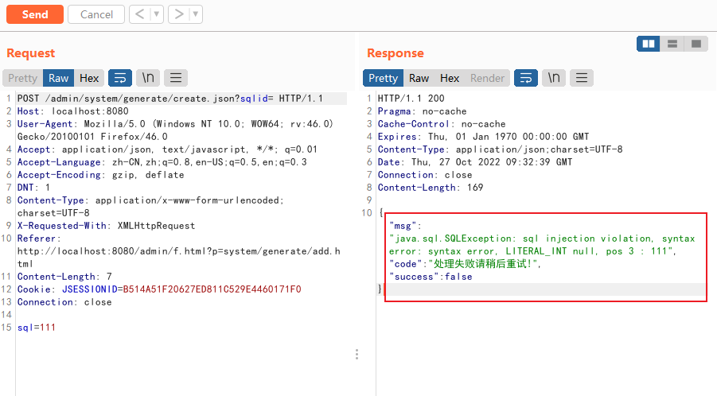
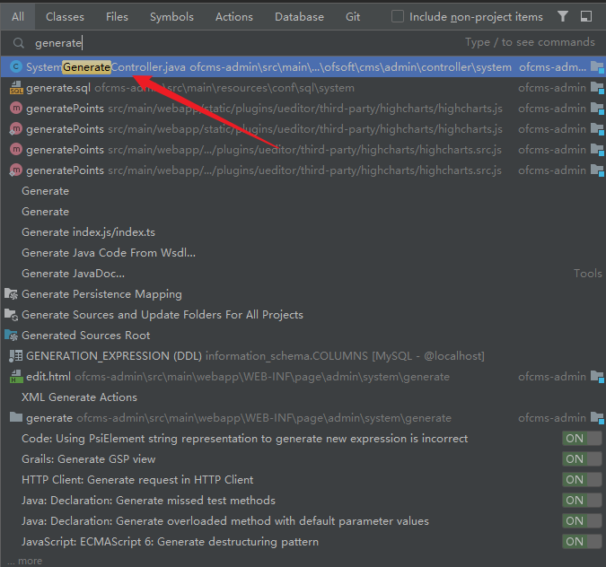
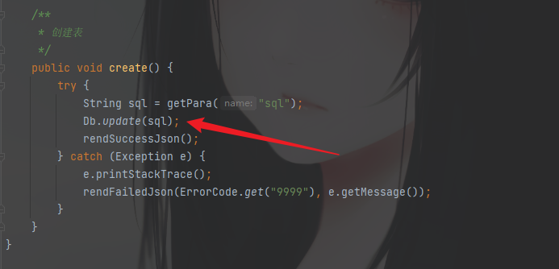
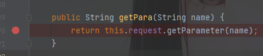
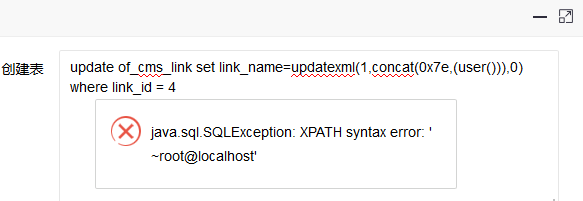

## 引言

代码审计：从OWASP Top 10学习如何发现漏洞，并针对漏洞的几种修复方法做分析
在Java中，常见的操作SQL的方式主要有三种

1. java.sql.Statement
2. java.sql.PrepareStatment
3. 使用第三方ORM框架，MyBatis或者Hibernate

## SQL注入产生的方式

### JDBC拼接造成的SQL注入
JDBC执行SQL语句有两种方法，分别是`PrepareStatement` 和 `Statement`，在代码的中直接将用户输入的内容进行拼接去数据库中执行。这两种方法不一样的地方就是PrepareStatement可以对SQL语句进行预编译，在一定程度上可以增加代码的安全性。先看下直接拼接造成的SQL注入的漏洞代码
```java
public UserInfo UserInfoFoundDao(String id){

        Connection conn = null;
        PreparedStatement ps = null;
        ResultSet rs = null;
        UserInfo userinfo = null;
        try{
            Class.forName("com.mysql.cj.jdbc.Driver");
            conn = DriverManager.getConnection("jdbc:mysql://localhost:3306/sec_sql?useUnicode=true&characterEncoding=UTF-8&useSSL=false&serverTimezone=UTC","root","123456");
            String sql = "select * from userinfo where id = " + id;
            ps = conn.prepareStatement(sql);
            rs = ps.executeQuery();

            while(rs.next()){

                userinfo = new UserInfo();
                userinfo.setId(rs.getString("id"));
                userinfo.setName(rs.getString("name"));
                userinfo.setAge(rs.getInt("age"));
                userinfo.setContent(rs.getString("content"));
                userinfo.setAddress(rs.getString("address"));

            }
            //其他操作

        return userinfo;
    }
```
这种是属于那种直接在源码中搜索关键词就可以找到的点，具体分析是否存在SQL注入
但是在实际代码开发中，由于这种方式是直接将SQL语句写在代码块中，不方便维护，所以基本上很少这么来操作。记几个关键词
```java
String query
executeQuery
execute
executeUpdate
createStatement
order by    
group by 
("Select
```
### MyBatis框架使用不当造成SQL注入
MyBatis 是一款优秀的持久层框架，它支持自定义 SQL、存储过程以及高级映射。MyBatis 免除了几乎所有的 JDBC 代码以及设置参数和获取结果集的工作。MyBatis 可以通过简单的 XML 或注解来配置和映射原始类型、接口和 Java POJO（Plain Old Java Objects，普通老式 Java 对象）为数据库中的记录。
关于MyBatis框架：[https://blog.csdn.net/m0_64372028/article/details/125128311](https://blog.csdn.net/m0_64372028/article/details/125128311)
看一遍大概明白MyBatis框架是通过将JDBC连接数据库还有一些SQL语句的操作放在了配置文件当中。
MyBatis向SQL语句中传值也是利用拼接方法来实现的，它提供了两种方式，分别是`#{}`和`${}`
`#{value}`在预处理时，会把参数部分用一个占位符 ? 替代，其中 value 表示接受输入参数的名称。能有效解决 SQL 注入问题
`${}`表示使用拼接字符串，将接受到参数的内容不加任何修饰符拼接在 SQL 中，使用`${}`拼接 sql，将引起 SQL 注入问题。
查询数据库 sample 表 user 中的记录，我们故意使用特殊符号，看能否引起 SQL 注入

```xml
<select id="findUserByName" parameterType="java.lang.String" resultType="cn.itcast.mybatis.po.User">
  <!-- 拼接 MySQL,引起 SQL 注入 -->
  SELECT * FROM user WHERE username LIKE '%${value}%'
</select>

```
注意在配置文件中编写 SQL 语句时，后边不需要加分号。
### Hibernate 框架
Hibernate 框架是 Java 持久化 API（JPA）规范的一种实现方式。Hibernate 将 Java类映射到数据库表中，从 Java 数据类型映射到 SQL 数据类型。Hibernate 是目前主流的 Java 数据库持久化框架，采用 Hibernate 查询语言（HQL）注入。
HQL查询并不直接发送给数据库，而是由hibernate引擎对查询进行解析并解释，然后将其转换为SQL
一般存在注入的位置：`session.createQuery`
```java
Query query=session.createQuery("from User user where user.name=? and user:userage=? "); 
		query.setString(0,username); 
		query.setInteger(1,age);
```
## 案例分析

1. OFCMS_V1.1.3 后台SQL注入漏洞

登录后台：代码生成——增加——输入内容——新增
抓包查看

然后就去找到源代码中处理此逻辑的接口`system/generate`

可以看到对应的控制器

```java
@Action(path = "/system/generate", viewPath = "system/generate/")
```
对应的Spring注释
然后可以看到

可以看到用户输入是从getPara()传进来的，跟进

实际上是调用的`getParameter()`方法
再回看用户输入之后的处理操作，一直追踪到最后

```java
int update(Config config, Connection conn, String sql, Object... paras) throws SQLException {
        PreparedStatement pst = conn.prepareStatement(sql);
        config.dialect.fillStatement(pst, paras);
        int result = pst.executeUpdate();
        DbKit.close(pst);
        return result;
    }
```
发现sql是存在预编译的，但是由于这个sql语句没有?做占位符，而是直接整条语句传输的，所以这里的预编译也就起不到效果了。
执行payload就可以


