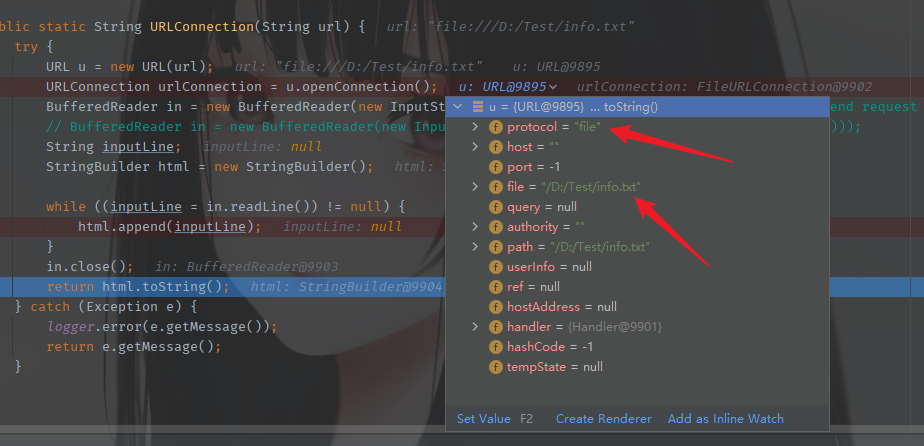
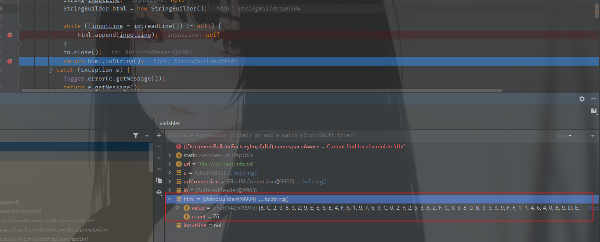
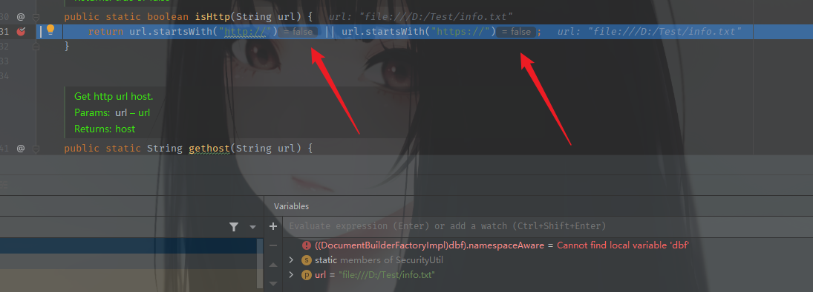
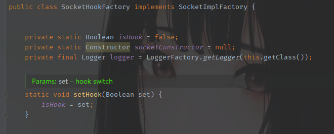
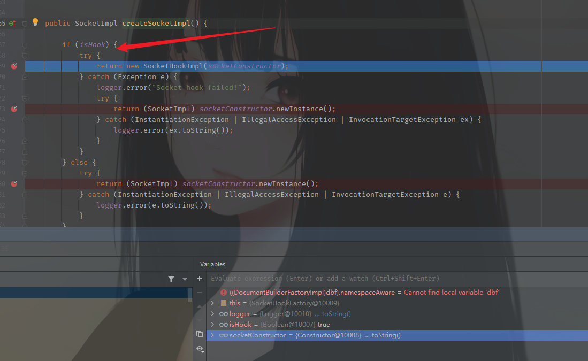
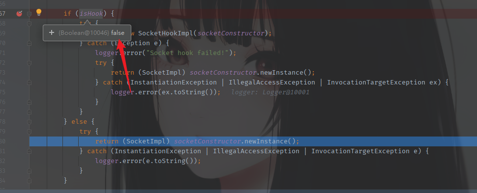
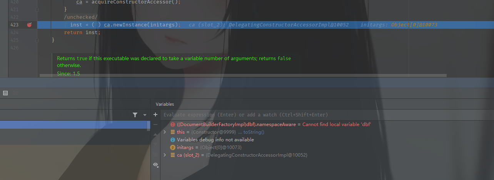
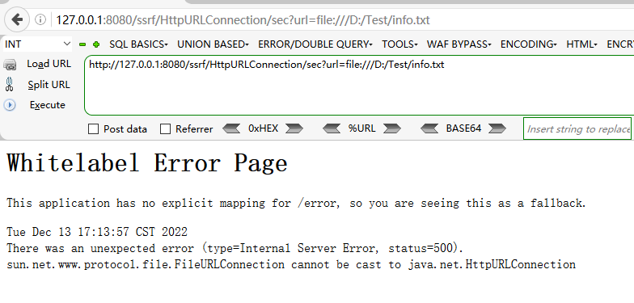
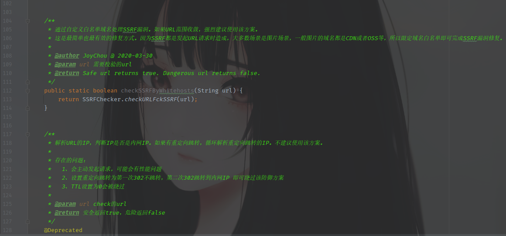
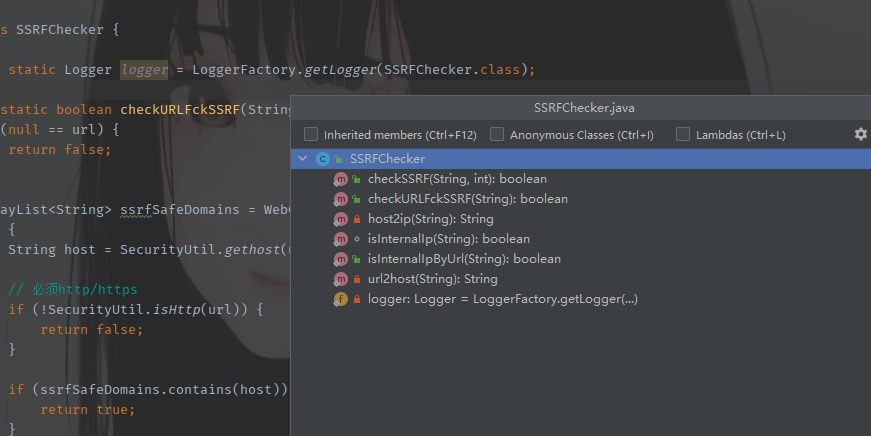

Java中SSRF可以使用到的伪协议

```java
file ftp mailto http https jar netdoc
```

### URLConnection

漏洞代码

```java
public static String URLConnection(String url) {
        try {
            URL u = new URL(url);
            URLConnection urlConnection = u.openConnection();
            BufferedReader in = new BufferedReader(new InputStreamReader(urlConnection.getInputStream())); //send request
            String inputLine;
            StringBuilder html = new StringBuilder();

            while ((inputLine = in.readLine()) != null) {
                html.append(inputLine);
            }
            in.close();
            return html.toString();
        } catch (Exception e) {
            logger.error(e.getMessage());
            return e.getMessage();
        }
    }
```

传入url进入调试

实例化一个URL对象，使用URLConnection建立连接，因为这里没有对Url的协议进行限制，所以基本上所有的伪协议都支持。



继续进行，已经确定是file协议，然后路径也有了，这里是读取内容，`getInputStream`获取字节流，然后`InputStreamReader()`将字节流转化成字符流，`BufferedReader()`将字符流以缓存形式输出的方式来快速获取网络数据流。

随后循环读取每一行数据，加入到html变量中，最后输出



逻辑简单，下面看如何修复的，或者是说怎么进行过滤

首先对协议进行了一个过滤

```java
public static boolean isHttp(String url) {
        return url.startsWith("http://") || url.startsWith("https://");
    }
```

这里起码是可以防止文件读取的



继续看后面，其实现在只能使用http协议或者是https协议了，为什么后面还需要继续，先看代码

```java
try {
    SecurityUtil.startSSRFHook();
    return HttpUtils.URLConnection(url);
} catch (SSRFException | IOException e) {
    return e.getMessage();
} finally {
    SecurityUtil.stopSSRFHook();
```

开启了SSRFHook，这个是什么作用？其实跟到最底层，发现他是一个布尔类型的变量标志而已



在startSSRFHook中默认传入的是true，因为在不进行设置的时候，代码中的isHook写死的是false

具体用这个来干什么，继续向下看

设置好之后就进行`HttpUtils.URLConnection(url);`

由于是http协议，所以调用HttpURLConnection类去创建socket。就会调用createSocketImpl方法，具体调用栈如下

```java
createSocketImpl:69, SocketHookFactory (org.joychou.security.ssrf)
setImpl:498, Socket (java.net)
<init>:84, Socket (java.net)
createSocket:197, NetworkClient (sun.net)
doConnect:162, NetworkClient (sun.net)
openServer:463, HttpClient (sun.net.www.http)
openServer:558, HttpClient (sun.net.www.http)
<init>:242, HttpClient (sun.net.www.http)
New:339, HttpClient (sun.net.www.http)
New:357, HttpClient (sun.net.www.http)
getNewHttpClient:1220, HttpURLConnection (sun.net.www.protocol.http)
plainConnect0:1156, HttpURLConnection (sun.net.www.protocol.http)
plainConnect:1050, HttpURLConnection (sun.net.www.protocol.http)
connect:984, HttpURLConnection (sun.net.www.protocol.http)
getInputStream0:1564, HttpURLConnection (sun.net.www.protocol.http)
getInputStream:1492, HttpURLConnection (sun.net.www.protocol.http)
URLConnection:96, HttpUtils (org.joychou.util)
URLConnectionSec:58, SSRF (org.joychou.controller)
```

具体看这个方法的逻辑



这里用到了前面说的`isHook`，需要进入这里的判断逻辑，相反如果进不去，那么将设置isHook的去掉，再跟一下，到同样的位置



对于http协议来说，加不加无所谓，最后都会走到这一步，调一下就会发现最终是一模一样。其实hook的真实作用是开启检查，像IP黑名单这样的检查。在配置文件中都有写。这个分析放到后面。



将两步结合成一步的过滤方式就是直接调用`HttpURLContection`这样就只能使用http或者https协议，使用其他协议直接返回状态码500



然后再来分析检查url的部分，也就是开启`isHook`后会执行的一些操作。



以及在SSRFChecker类中的一些过滤



### Request

两种请求方式的`execute()`为污点汇聚处，属于Request类的SSRF

```java
public static String request(String url) {
        try {
            //return Request.Post(url).execute().returnContent().toString();
            return Request.Get(url).execute().returnContent().toString();
        } catch (Exception e) {
            return e.getMessage();
        }
    }
```

### httpClient

1. 污点汇聚：`client.execute()`

```java
public static String httpClient(String url) {

        StringBuilder result = new StringBuilder();

        try {

            CloseableHttpClient client = HttpClients.createDefault();
            HttpGet httpGet = new HttpGet(url);
            // set redirect enable false
            // httpGet.setConfig(RequestConfig.custom().setRedirectsEnabled(false).build());
            HttpResponse httpResponse = client.execute(httpGet); // send request
            BufferedReader rd = new BufferedReader(new InputStreamReader(httpResponse.getEntity().getContent()));

            String line;
            while ((line = rd.readLine()) != null) {
                result.append(line);
            }

            return result.toString();

        } catch (Exception e) {
            return e.getMessage();
        }
    }
```

1. 污点汇聚`client.executeMethod()`

```java
public static String commonHttpClient(String url) {

        HttpClient client = new HttpClient();
        GetMethod method = new GetMethod(url);

        try {
            client.executeMethod(method); // send request
            byte[] resBody = method.getResponseBody();
            return new String(resBody);

        } catch (IOException e) {
            return "Error: " + e.getMessage();
        } finally {
            // Release the connection.
            method.releaseConnection();
        }
    }
```

### ImageIO

污点汇聚函数：`ImageIO.read()`

```java
public static void imageIO(String url) {
        try {
            URL u = new URL(url);
            ImageIO.read(u); // send request
        } catch (IOException e) {
            logger.error(e.getMessage());
        }

    }
```

### openStream

污点汇聚：`URL.openStream()`

```java
public void openStream(@RequestParam String url, HttpServletResponse response) throws IOException {
        InputStream inputStream = null;
        OutputStream outputStream = null;
        try {
            String downLoadImgFileName = WebUtils.getNameWithoutExtension(url) + "." + WebUtils.getFileExtension(url);
            // download
            response.setHeader("content-disposition", "attachment;fileName=" + downLoadImgFileName);

            URL u = new URL(url);
            int length;
            byte[] bytes = new byte[1024];
            inputStream = u.openStream(); // send request
            outputStream = response.getOutputStream();
            while ((length = inputStream.read(bytes)) > 0) {
                outputStream.write(bytes, 0, length);
            }

        } catch (Exception e) {
            logger.error(e.toString());
        } finally {
            if (inputStream != null) {
                inputStream.close();
            }
            if (outputStream != null) {
                outputStream.close();
            }
        }
    }
```

### okhttp

污点汇聚：`execute()`

```java
public static String okhttp(String url) throws IOException {
        OkHttpClient client = new OkHttpClient();
        // client.setFollowRedirects(false);
        com.squareup.okhttp.Request ok_http = new com.squareup.okhttp.Request.Builder().url(url).build();
        return client.newCall(ok_http).execute().body().string();
    }
```

### Jsoup

```java
public static String Jsoup(String url) {
    try {
    Document doc = Jsoup.connect(url)
        //.followRedirects(false)
        .timeout(3000)
        .cookie("name", "joychou") // request cookies
        .execute().parse();
    return doc.outerHtml();
} catch (IOException e) {
    return e.getMessage();
}
}
```

### IOUtils

```java
public static void IOUtils(String url) {
        try {
            IOUtils.toByteArray(URI.create(url));
        } catch (IOException e) {
            logger.error(e.getMessage());
        }
    }
```

### HttpAsyncClients

```java
public static String HttpAsyncClients(String url) {
        CloseableHttpAsyncClient httpclient = HttpAsyncClients.createDefault();
        try {
            httpclient.start();
            final HttpGet request = new HttpGet(url);
            Future<HttpResponse> future = httpclient.execute(request, null);
            HttpResponse response = future.get(6000, TimeUnit.MILLISECONDS);
            return EntityUtils.toString(response.getEntity());
        } catch (Exception e) {
            return e.getMessage();
        } finally {
            try {
                httpclient.close();
            } catch (Exception e) {
                logger.error(e.getMessage());
            }
        }
    }
```

### 总结

最常见的污点汇聚的方法

```java
HttpURLConnection. getInputStream
URLConnection. getInputStream
Request.Get. execute
Request.Post. execute
URL.openStream
ImageIO.read
OkHttpClient.newCall.execute
HttpClients.execute
HttpClient.execute
Jsoup.execute
...
```

在审计此类漏洞时，需要着重关注这些方法。