全局搜索用户输入与输出，查看整个过程中有无过滤。
查看从得到这个输入开始，到存入数据库或者返回结果过程中，这个输入的内容有没有经过其他的方法，而使其改变。
## 案例一
依旧是OFCMS，在新闻中心，任一点进一条新闻，下方有评论的功能
任意输入，抓包查看
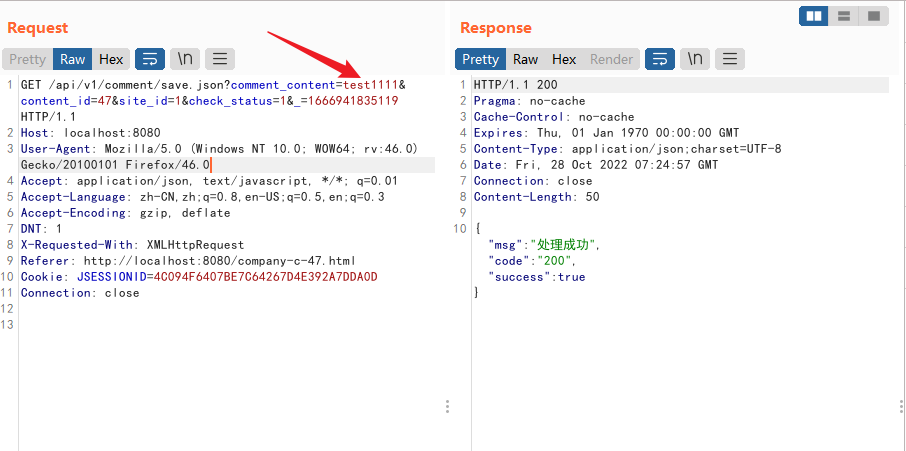
直接在源码中全局搜索comment，注意评论的接口是`/api/v1/comment`然后就可以去找下对应的控制器了
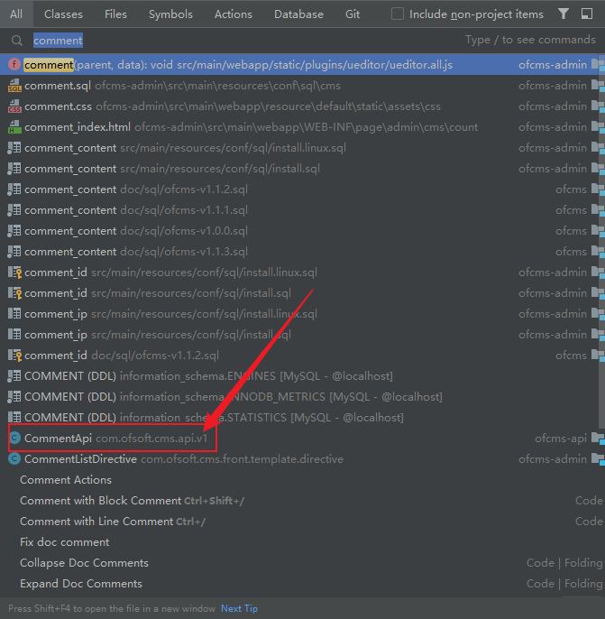
找到的在CommentApi中只有一个方法，那就是一个save方法，显然就是这个方法来实现保存评论的功能了。

```java
@Action(path = "/comment")
public class CommentApi extends ApiBase {
    /**
     * 获取内容信息
     */
    @ApiMapping(method = RequestMethod.GET)
    @ParamsCheck(
            {@ParamsCheckType(name = "comment_content"), @ParamsCheckType(name = "content_id"),
                    @ParamsCheckType(name = "site_id")})
    public void save() {
        try {
            Map params = getParamsMap();
            params.put("comment_ip", IpKit.getRealIp(getRequest()));
            Db.update(Db.getSqlPara("cms.comment.save", params));
            rendSuccessJson();
        } catch (Exception e) {
            e.printStackTrace();
            rendFailedJson();
        }
    }

}
```
还可以看出`@ParamsCheck`是作为注释编程实现的对comment_content以及一些其他参数的规则。可以带你进去查看一下，可以看到没有一些符号或者什么标签被过滤的，知识简单的检查评论规范合规而已。
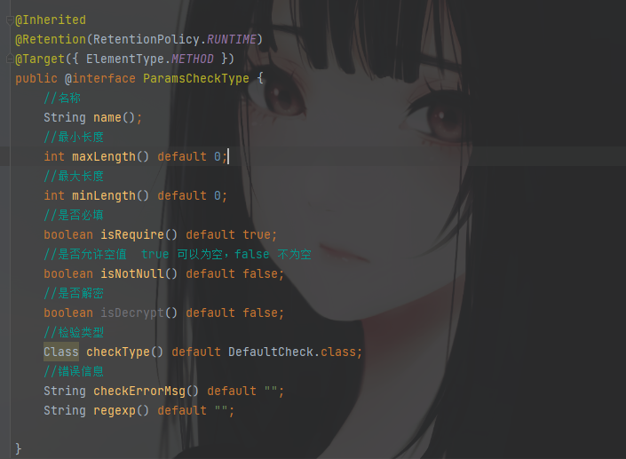
随后继续看save方法
`getParamsMap()`获取请求参数，然后对IP地址这个参数做了一步操作，随后就直接使用update写入数据库了。而没有做其他更多的操作和过滤。所以这里就是一个存储型XSS漏洞点，直接传XSSpayload就可以触发漏洞了。
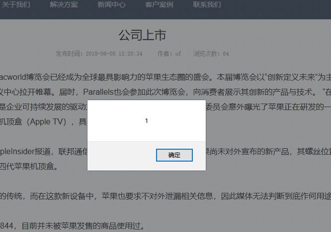

## 常见审计入口
### DOM类型XSS
| 输入点 | 输出点 |
| --- | --- |
| document.URL | eval |
| document.location | document.write |
| document.referer | document.InterHTML |
| document.form | document.OuterHTML |

### 反射型XSS
反射型 XSS 漏洞通过外部输入，然后直接在浏览器端触发。在白盒审计的过程中，我们需要寻找带有参数的输出方法，然后根据输出方法对输出内容回溯输入参数。
大致效果
```java
<% 
//部署在服务器端
//从请求中获得“name”参数
String name = request.getParameter("name"); 
//从请求中获得“学号”参数
String studentId = request.getParameter("sid"); 
out.println("name = "+name); 
out.println("studentId = "+studentId); 
%>
```
这份 JSP 代码会将变量 name 与 studentId 输出到前端，而这两个变量是从 HttpServletRequest 请求对象中取得的。由于这份代码并未对输入和输出数据进行过滤、扰乱以及编码方面的工作，因为无法对 XSS 漏洞进行防御。
### 存储型XSS
在挖掘存储型 XSS 漏洞时，要统一寻找“输入点”和“输出点”。由于“输入点”
和“输出点”可能不在同一个业务流中，在挖掘这类漏洞时，可以考虑通过以下方
法提高效率。
（1）黑白盒结合。
（2）通过功能、接口名、表名、字段名等角度做搜索。

## 案例二
该案例是根据JEESNS的一个历史漏洞（CVE-2018-19178）来进行分析的。
搭建环境参考：[点我传送](https://github.com/cn-panda/JavaCodeAudit/blob/master/%E3%80%9003%E3%80%91XSS%20%E6%BC%8F%E6%B4%9E%E5%8E%9F%E7%90%86%E4%B8%8E%E5%AE%9E%E9%99%85%E6%A1%88%E4%BE%8B%E4%BB%8B%E7%BB%8D/%E3%80%9003%E3%80%91XSS%20%E6%BC%8F%E6%B4%9E%E5%8E%9F%E7%90%86%E4%B8%8E%E5%AE%9E%E9%99%85%E6%A1%88%E4%BE%8B%E4%BB%8B%E7%BB%8D.md#0x04-%E5%AE%9E%E9%99%85%E6%A1%88%E4%BE%8Bcve-2018-19178%E5%88%86%E6%9E%90)，搭建完毕后，先登录一下，后面分析代码也会提到。
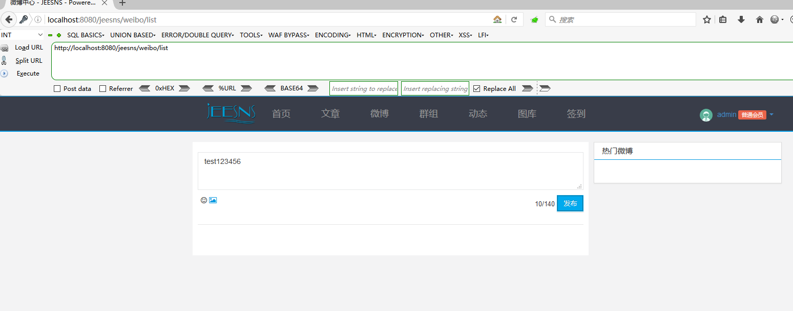
然后可以找下weibo留言板的位置，随意插入一段话。抓包查看数据包，可以看到接口是在weibo/publish，传参关键字为content，都是可以搜索此位置。
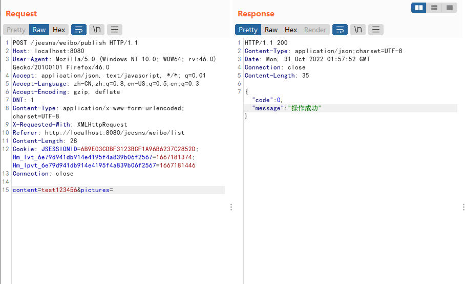
然后搜索下publish，可以看到存在于`WeiboController`中
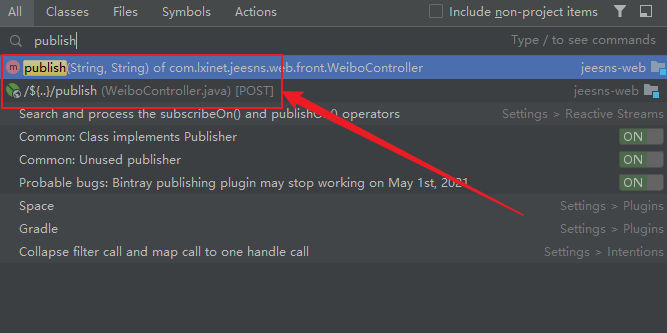
跟进去可发现，content和pictures两个参数，看下面的逻辑，跟进到`WeiboService.save`中

```java
    @RequestMapping(value = "/publish",method = RequestMethod.POST)
    @ResponseBody
    @Before(UserLoginInterceptor.class)
    public ResultModel publish(String content, String pictures){
        Member loginMember = MemberUtil.getLoginMember(request);
        return new ResultModel(weiboService.save(request, loginMember,content, pictures));
    }
```
跟进到了一个接口中
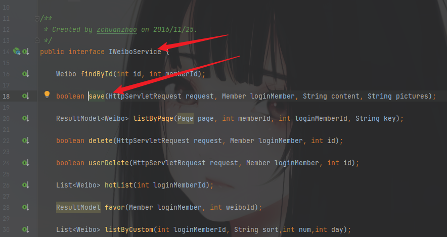
看到了save这个方法，查看详细的需要进一步跟进接口文件承接的类
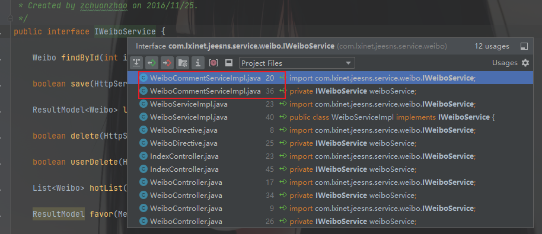
看到了save的逻辑，发现content关键字只是做了长度的判断就直接实例化了WeiboContent对象就进行处理了。

```java
    @Override
    public boolean save(Member loginMember, String content, Integer weiboId, Integer weiboCommentId) {
        Weibo weibo = weiboService.findById(weiboId,loginMember.getId());
        ValidUtill.checkIsNull(weibo, Messages.WEIBO_NOT_EXISTS);
        ValidUtill.checkIsNull(content, Messages.CONTENT_NOT_EMPTY);
        if(content.length() > 500){
            throw new ParamException("评论内容不能超过500");
        }
        WeiboComment weiboComment = new WeiboComment();
        weiboComment.setMemberId(loginMember.getId());
        weiboComment.setWeiboId(weiboId);
        weiboComment.setContent(content);
        weiboComment.setCommentId(weiboCommentId);
        int result = weiboCommentDao.save(weiboComment);
        if(result == 1){
            //@会员处理并发送系统消息
            messageService.atDeal(loginMember.getId(),content, AppTag.WEIBO, MessageType.WEIBO_COMMENT_REFER,weibo.getId());
            //回复微博发送系统信息
            messageService.diggDeal(loginMember.getId(), weibo.getMemberId(), content,AppTag.WEIBO, MessageType.WEIBO_REPLY, weibo.getId());
            if (weiboCommentId != null){
                WeiboComment replyWeiboComment = this.findById(weiboCommentId);
                if (replyWeiboComment != null){
                    //回复微博发送系统信息
                    messageService.diggDeal(loginMember.getId(), replyWeiboComment.getMemberId(), content, AppTag.WEIBO, MessageType.WEIBO_REPLY_REPLY, replyWeiboComment.getId());
                }
            }
            //微博评论奖励
            scoreDetailService.scoreBonus(loginMember.getId(), ScoreRuleConsts.COMMENT_WEIBO, weiboComment.getId());
        }
        return result == 1;
    }
```
那可以直接进行插入XSS语句吗？试一试......
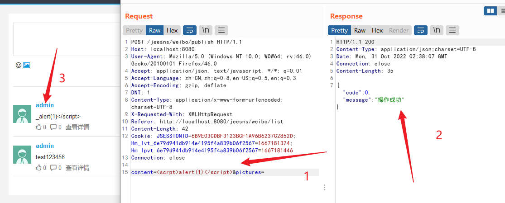
不可以，所以存在XSS过滤的操作。所以刚才那个逻辑分析算是错的。这也就是并非所有的逻辑都这样跟进的，现在开始分析原因。
回到原来发现的接口处，也就是看save参数中还存在一个request
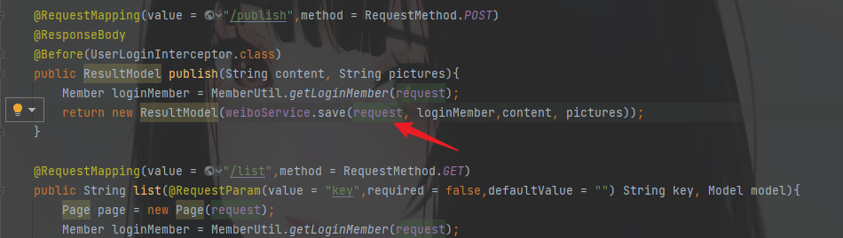
跟进到IWeiboService中还是存在的，
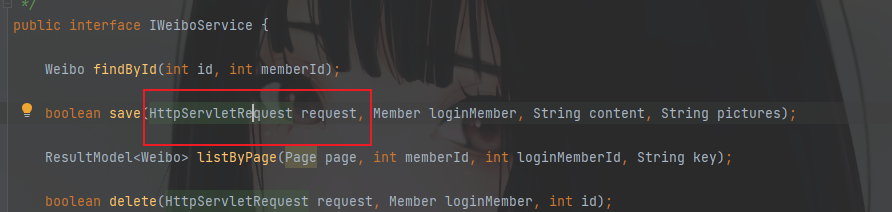
但是查看save的具体逻辑时，发现是没有这个参数的
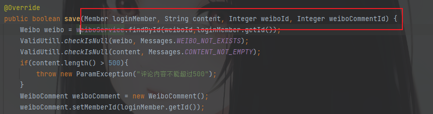
所以说问题可能就出在request上面，是输入的时候就会检查传入的参数了。
回到`IWeiboService`中，查看`HttpServletRequest`是什么样的逻辑
非常明显的`XssHttpServletRequestWrapper`
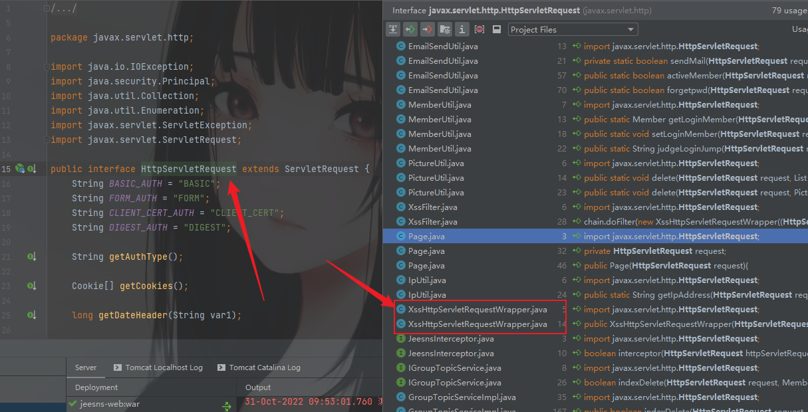
跟进查看，clearXSS()方法，可以看到过滤还是蛮多的，作者写的时候肯定是考虑了安全风险的。
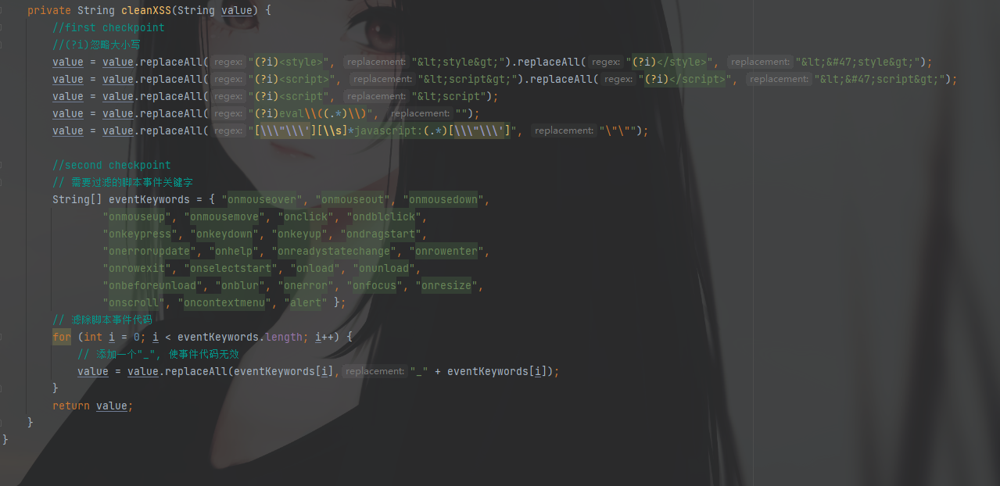
看看过滤的逻辑
首先`<style></style>``<script></script>``<script`尖括号转换为`&lt;``eval`替换为`空`，`javascript`关键词也替换为空
然后是黑名单

```java
{ "onmouseover", "onmouseout", "onmousedown",
                "onmouseup", "onmousemove", "onclick", "ondblclick",
                "onkeypress", "onkeydown", "onkeyup", "ondragstart",
                "onerrorupdate", "onhelp", "onreadystatechange", "onrowenter",
                "onrowexit", "onselectstart", "onload", "onunload",
                "onbeforeunload", "onblur", "onerror", "onfocus", "onresize",
                "onscroll", "oncontextmenu", "alert" }
```
使用了一个for循环去匹配黑名单中的关键词，成功匹配在关键词前加下划线(`_`)
然后再返回value值
可以成功绕过的标太多了。这里举一个例子
```java
<object data="data:text/html;base64,PHNjcmlwdD5hbGVydCgidGVzdCIpOzwvc2NyaXB0Pg==">
<svg/onLoad=confirm(1)>

```
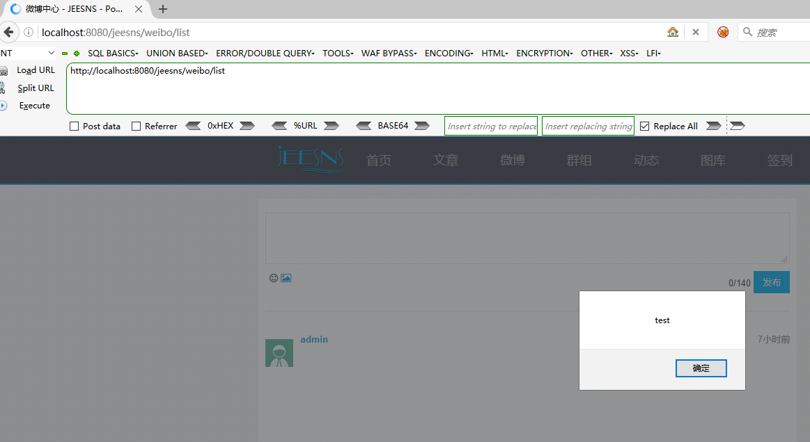
## 修复方案

1. 全局过滤器

也就是上面这种方式，只不过需要过滤的更多
```java
//XssHttpServletRequestWrapper实现

public class XssHttpServletRequestWrapper extends HttpServletRequestWrapper {

    public XssHttpServletRequestWrapper(HttpServletRequest request) {
        super(request);
    }

    @SuppressWarnings("rawtypes")
    public Map<String,String[]> getParameterMap(){
        Map<String,String[]> request_map = super.getParameterMap();
        Iterator iterator = request_map.entrySet().iterator();
        while(iterator.hasNext()){
            Map.Entry me = (Map.Entry)iterator.next();
            String[] values = (String[])me.getValue();
            for(int i = 0 ; i < values.length ; i++){
                values[i] = xssClean(values[i]);
            }
        }
        
        return request_map;
    }
     public String[] getParameterValues(String paramString)
      {
        String[] arrayOfString1 = super.getParameterValues(paramString);
        if (arrayOfString1 == null)
          return null;
        int i = arrayOfString1.length;
        String[] arrayOfString2 = new String[i];
        for (int j = 0; j < i; j++){
            arrayOfString2[j] = xssClean(arrayOfString1[j]);
        }
        return arrayOfString2;
      }

      public String getParameter(String paramString)
      {
        String str = super.getParameter(paramString);
        if (str == null)
          return null;
        return xssClean(str);
      }

      public String getHeader(String paramString)
      {
        String str = super.getHeader(paramString);
        if (str == null)
          return null;
        str = str.replaceAll("\r|\n", "");
        return xssClean(str);
      }
      
      
      private String xssClean(String value) {
        //ClassLoaderUtils.getResourceAsStream("classpath:antisamy-slashdot.xml", XssHttpServletRequestWrapper.class)
        if (value != null) {
            // NOTE: It's highly recommended to use the ESAPI library and
            // uncomment the following line to
            // avoid encoded attacks.
            // value = encoder.canonicalize(value);
            value = value.replaceAll("\0", "");
            
            // Avoid anything between script tags
            Pattern scriptPattern = Pattern.compile("<script>(.*?)</script>",
                    Pattern.CASE_INSENSITIVE);
            value = scriptPattern.matcher(value).replaceAll("");

            // Avoid anything in a src='...' type of expression
            scriptPattern = Pattern.compile("src[\r\n]*=[\r\n]*\\\'(.*?)\\\'",
                    Pattern.CASE_INSENSITIVE | Pattern.MULTILINE
                            | Pattern.DOTALL);
            value = scriptPattern.matcher(value).replaceAll("");
            // Avoid anything in a href='...' type of expression
            scriptPattern = Pattern.compile("href[\r\n]*=[\r\n]*\\\"(.*?)\\\"",
                                Pattern.CASE_INSENSITIVE | Pattern.MULTILINE
                                        | Pattern.DOTALL);
            value = scriptPattern.matcher(value).replaceAll("");
            

            // Remove any lonesome </script> tag
            scriptPattern = Pattern.compile("</script>",
                    Pattern.CASE_INSENSITIVE);
            value = scriptPattern.matcher(value).replaceAll("");

            // Remove any lonesome <script ...> tag
            scriptPattern = Pattern.compile("<script(.*?)>",
                    Pattern.CASE_INSENSITIVE | Pattern.MULTILINE
                            | Pattern.DOTALL);
            value = scriptPattern.matcher(value).replaceAll("");

            // Avoid eval(...) expressions
            scriptPattern = Pattern.compile("eval\\((.*?)\\)",
                    Pattern.CASE_INSENSITIVE | Pattern.MULTILINE
                            | Pattern.DOTALL);
            value = scriptPattern.matcher(value).replaceAll("");

            // Avoid expression(...) expressions
            scriptPattern = Pattern.compile("expression\\((.*?)\\)",
                    Pattern.CASE_INSENSITIVE | Pattern.MULTILINE
                            | Pattern.DOTALL);
            value = scriptPattern.matcher(value).replaceAll("");

            // Avoid javascript:... expressions
            scriptPattern = Pattern.compile("javascript:",
                    Pattern.CASE_INSENSITIVE);
            value = scriptPattern.matcher(value).replaceAll("");

            // Avoid vbscript:... expressions
            scriptPattern = Pattern.compile("vbscript:",
                    Pattern.CASE_INSENSITIVE);
            value = scriptPattern.matcher(value).replaceAll("");

            // Avoid onload= expressions
            scriptPattern = Pattern.compile("onload(.*?)=",
                    Pattern.CASE_INSENSITIVE | Pattern.MULTILINE
                            | Pattern.DOTALL);
            value = scriptPattern.matcher(value).replaceAll("");
        }  
          return value; 
          }
}
```

2. xssProject

[https://github.com/kennylee26/xssprotect](https://github.com/kennylee26/xssprotect)
项目中需要引入 `xssProtect-0.1.jar`、`antlr-3.0.1.jar`、`antlr-runtime-3.0.1.jar` 等3个 jar 包
使用
```java
protectedAgainstXSS（String html）{StringReader reader = new StringReader（html）; StringWriter writer = new StringWriter（）;
  try {
      // 从“ html”变量解析传入的字符串
      HTMLParser.process( reader, writer, new XSSFilter(), true );

      // 返回经过解析和处理的字符串
      return writer.toString();
  } catch (HandlingException e) {
  }
}
```

3. commons.lang包

在这个包中有个StringUtils 类，该类主要提供对字符串的操作，对null是安全的，主要提供了字符串查找、替换、分割、去空白、去掉非法字符等等操作。存在三个函数可以供我们过滤使用。
使用参考：[https://commons.apache.org/proper/commons-lang/javadocs/api-2.6/org/apache/commons/lang/StringEscapeUtils.html](https://commons.apache.org/proper/commons-lang/javadocs/api-2.6/org/apache/commons/lang/StringEscapeUtils.html)

